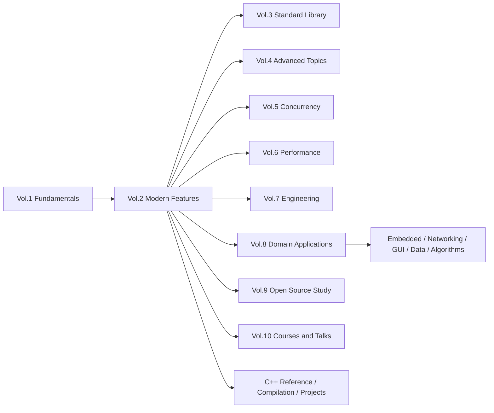
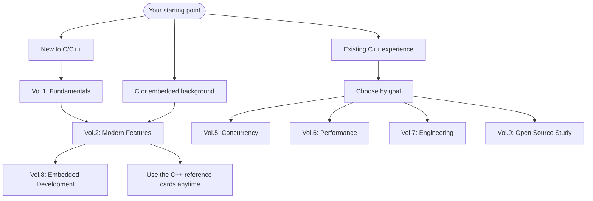

# Tutorial_AwesomeModernCPP

[中文](README.md) | English

> A practice-oriented modern C++ learning project: from C/C++ fundamentals and modern language features to concurrency, performance, engineering, embedded practice, and open-source code study.

<p align="center">
  <a href="https://awesome-embedded-learning-studio.github.io/Tutorial_AwesomeModernCPP/en/">
    
  </a>
</p>


---

## What This Project Is

`Tutorial_AwesomeModernCPP` is a continuously updated modern C++ learning project. It is not a collection of disconnected syntax notes: it connects language fundamentals, the standard library, modern features, engineering practice, and domain applications into one learning path, with compilable CMake examples for key concepts.

It is designed for:

- Learners building a systematic C/C++ foundation without relying on fragmented notes.
- C or embedded developers who want to use modern C++ in real engineering work.
- C++ developers who want to strengthen concurrency, performance, build systems, debugging, and source-code reading skills.

## Highlights

- **10-volume curriculum**: fundamentals, modern features, standard library, advanced topics, concurrency, performance, engineering, domains, open-source study, and lecture notes.
- **Compilable examples**: code samples are organized as CMake projects and validated in CI, not only shown as isolated snippets.
- **Embedded direction**: STM32F1 practice projects, resource constraints, peripheral abstraction, cross-compilation, and linker scripts.
- **Engineered docs site**: built with VitePress, with search, navigation, dark mode, local preview, and GitHub Pages deployment.
- **Bilingual content and reference cards**: Chinese-first content now has full English translation coverage, plus a C++98 to C++23 feature reference index.
- **Community articles hub**: Supports community draft submissions, editorial review and inclusion, and subsequent integration into the main content, lowering the barrier for article contributions.

## Start Here

The fastest path is to read the online docs:

- [Online documentation](https://awesome-embedded-learning-studio.github.io/Tutorial_AwesomeModernCPP/en/)
- [C++ feature reference cards](https://awesome-embedded-learning-studio.github.io/Tutorial_AwesomeModernCPP/en/cpp-reference/)
- [Embedded development track](https://awesome-embedded-learning-studio.github.io/Tutorial_AwesomeModernCPP/en/vol8-domains/embedded/)
- [Community articles](https://awesome-embedded-learning-studio.github.io/Tutorial_AwesomeModernCPP/en/community/)

Run the docs site locally:

```bash
git clone https://github.com/Awesome-Embedded-Learning-Studio/Tutorial_AwesomeModernCPP.git
cd Tutorial_AwesomeModernCPP

pnpm install
pnpm dev
# Visit http://localhost:5173/Tutorial_AwesomeModernCPP/
```

Production build and preview:

```bash
BUILD_CONCURRENCY=8 pnpm build
pnpm preview
# Visit http://localhost:4173/Tutorial_AwesomeModernCPP/
```

## Content Map



> 📋 For volume content and progress see the [project roadmap](todo/000-project-roadmap.md); for release history see [changelogs/](changelogs/).

## Learning Paths



## Local Development and Checks

<details>
<summary>Common commands</summary>

| Command / Script | Purpose |
|------------------|---------|
| `pnpm dev` | Start the VitePress dev server with hot reload |
| `pnpm build` | Production build with per-volume parallel build and search-index merge |
| `pnpm build:single` | Run the regular single VitePress build |
| `pnpm check:links` | Check internal Markdown and component links |
| `pnpm preview` | Preview the production build |
| `pnpm hooks:install` / `scripts/setup_precommit.sh` | Install pre-commit checks |
| `pnpm coverage` | Show English translation coverage |
| `pnpm coverage:update` | Update the English coverage badge in `README.md` |
| `.venv/bin/python scripts/validate_frontmatter.py` | Validate article frontmatter |
| `.venv/bin/python scripts/check_quality.py documents/` | Run content quality checks |
| `.venv/bin/python scripts/build_examples.py --host` | Build host-side CMake examples |
| `.venv/bin/python scripts/build_examples.py --stm32` | Build STM32 example projects |

</details>

<details>
<summary>Project structure, releases, and branches</summary>

**Project Structure**

- `documents/` — 10 tutorial volumes (bilingual), plus community / cpp-reference / compilation / projects
- `code/` — code examples, STM32F1 projects, and reusable templates
- `site/` — VitePress configuration, theme, and plugins
- `scripts/` — build, check, coverage, and content tooling
- `todo/`, `changelogs/` — content roadmap and release history

> See [CLAUDE.md](CLAUDE.md) for full directory and architecture notes; the sidebar maps the site.

**Version History**

See [changelogs/](changelogs/) for full release history.

**Branch Overview**

| Branch | Purpose | Status |
|--------|---------|--------|
| `main` | Primary development branch | Active |
| `archive/legacy_20260415` | Pre-restructuring archive | Read-only |
| `gh-pages` | Auto-deployed documentation site | Auto-generated |

</details>

## Contributing

Contributions are welcome: documentation fixes, example improvements, new chapters, translation review, issue reports, content suggestions, or submissions to [Community Articles](https://awesome-embedded-learning-studio.github.io/Tutorial_AwesomeModernCPP/en/community/). Please read [CONTRIBUTING.md](./CONTRIBUTING.md) first.

Quick workflow: Fork --> feature branch --> commit --> push --> pull request

If you have questions, feel free to open an issue at [GitHub Issues](https://github.com/Awesome-Embedded-Learning-Studio/Tutorial_AwesomeModernCPP/issues).

## Contributors

Thanks to everyone who has contributed to this project! See [CONTRIBUTORS.md](./CONTRIBUTORS.md) for details.

> Contributions are not limited to code. UI design, illustrations, issue reports, and content suggestions all count. See [CONTRIBUTING.md](./CONTRIBUTING.md).

## Acknowledgements

This project references the following excellent resources:

- [modern-cpp-tutorial](https://github.com/changkun/modern-cpp-tutorial)
- [CPlusPlusThings](https://github.com/Light-City/CPlusPlusThings)
- [CppCon](https://www.youtube.com/user/CppCon)
- [C++ Reference](https://en.cppreference.com/)

## License & Contact

- **License**: [MIT License](./LICENSE)
- **Issues**: [Submit an issue](https://github.com/Awesome-Embedded-Learning-Studio/Tutorial_AwesomeModernCPP/issues)
- **Email**: <725610365@qq.com>
- **Organization**: [Awesome-Embedded-Learning-Studio](https://github.com/Awesome-Embedded-Learning-Studio)
