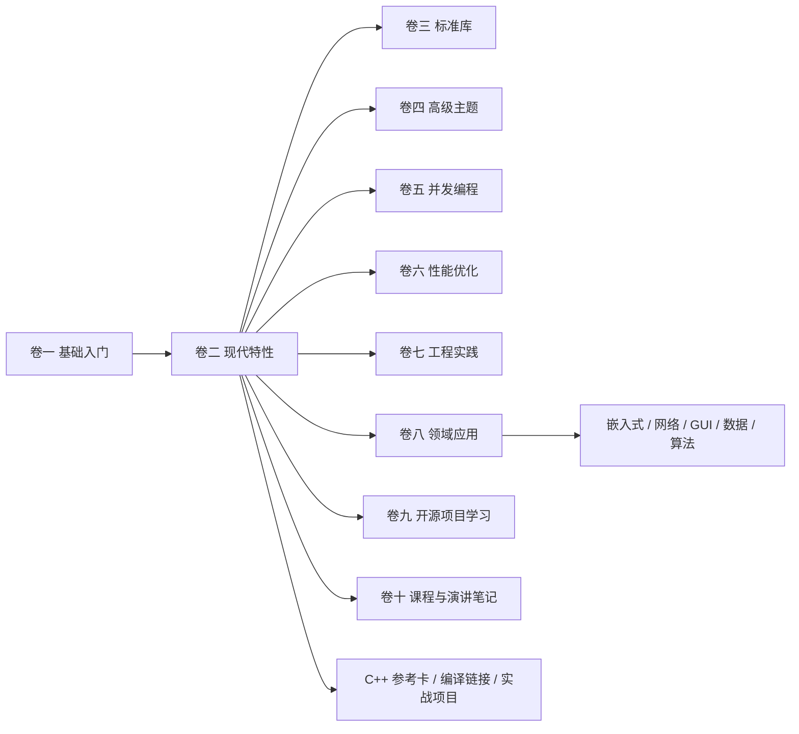
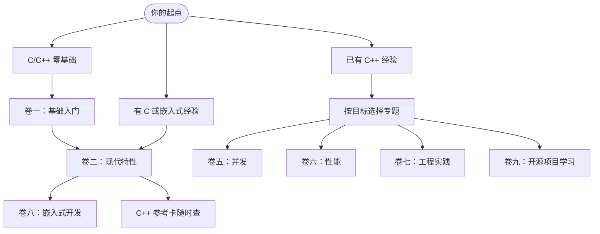

# Tutorial_AwesomeModernCPP

[English](README.en.md) | 中文

> 一套面向工程实践的现代 C++ 系统教程：从 C/C++ 基础、现代语言特性，到并发、性能、工程化、嵌入式实战与开源项目研读。

<p align="center">
  <a href="https://awesome-embedded-learning-studio.github.io/Tutorial_AwesomeModernCPP/">
    
  </a>
</p>


---

<!-- COVERAGE_START -->
 430/433 docs translated
<!-- COVERAGE_END -->

## 这是什么项目

`Tutorial_AwesomeModernCPP` 是一个持续更新的现代 C++ 学习项目。它不是零散的语法速查，而是把语言基础、标准库、现代特性、工程实践和领域应用放在同一条学习路径里，并为关键概念配套可编译的 CMake 示例。

适合这些读者：

- 正在系统学习 C/C++，希望少走碎片化资料弯路。
- 有 C 或嵌入式经验，想把现代 C++ 用到真实工程里。
- 已经会写 C++，但希望补齐并发、性能、构建、调试、源码研读等工程能力。

## 特色亮点

- **10 卷体系**：基础、现代特性、标准库、高级主题、并发、性能、工程、领域应用、开源项目、课程笔记逐层展开。
- **可编译示例**：示例代码以 CMake 工程组织，可在 CI 中构建验证，不只是文章里的孤立片段。
- **嵌入式方向**：包含 STM32F1 实战工程、资源约束、外设抽象、交叉编译与链接脚本等内容。
- **工程化文档站**：基于 VitePress，支持搜索、导航、暗色模式、本地预览与 GitHub Pages 自动部署。
- **双语与参考卡**：中文主线内容已完成英文翻译覆盖，并提供 C++98 到 C++23 特性参考索引。
- **社区文章入口**：支持社区来稿初刊、审阅收录和后续主线整合，降低文章投稿门槛。

## 马上开始

最快的方式是直接阅读在线文档：

- [在线文档站](https://awesome-embedded-learning-studio.github.io/Tutorial_AwesomeModernCPP/)
- [C++ 特性参考卡](https://awesome-embedded-learning-studio.github.io/Tutorial_AwesomeModernCPP/cpp-reference/)
- [嵌入式开发专题](https://awesome-embedded-learning-studio.github.io/Tutorial_AwesomeModernCPP/vol8-domains/embedded/)
- [社区文章](https://awesome-embedded-learning-studio.github.io/Tutorial_AwesomeModernCPP/community/)

本地预览文档站：

```bash
git clone https://github.com/Awesome-Embedded-Learning-Studio/Tutorial_AwesomeModernCPP.git
cd Tutorial_AwesomeModernCPP

pnpm install
pnpm dev
# 访问 http://localhost:5173/Tutorial_AwesomeModernCPP/
```

生产构建与预览：

```bash
BUILD_CONCURRENCY=8 pnpm build
pnpm preview
# 访问 http://localhost:4173/Tutorial_AwesomeModernCPP/
```

## 内容地图



> 📋 各卷内容与进度见 [项目总路线图](todo/000-project-roadmap.md)，版本变更见 [changelogs/](changelogs/)。

## 学习路径



## 本地开发与质量检查

<details>
<summary>常用命令</summary>

| 命令 / 脚本 | 功能 |
|-------------|------|
| `pnpm dev` | 启动 VitePress 开发服务器，支持热更新 |
| `pnpm build` | 生产构建，按分卷并行构建并合并搜索索引 |
| `pnpm build:single` | 使用 VitePress 单体构建 |
| `pnpm check:links` | 检查 Markdown 与组件内部链接有效性 |
| `pnpm preview` | 预览生产构建结果 |
| `pnpm hooks:install` / `scripts/setup_precommit.sh` | 安装 pre-commit 提交前检查 |
| `pnpm coverage` | 查看英文翻译覆盖率 |
| `pnpm coverage:update` | 更新 `README.md` 中的英文翻译覆盖率徽章 |
| `.venv/bin/python scripts/validate_frontmatter.py` | 验证文章 frontmatter |
| `.venv/bin/python scripts/check_quality.py documents/` | 内容质量检查 |
| `.venv/bin/python scripts/build_examples.py --host` | 编译主机侧 CMake 示例 |
| `.venv/bin/python scripts/build_examples.py --stm32` | 编译 STM32 示例工程 |

</details>

<details>
<summary>项目结构、版本与分支</summary>

**项目结构**

- `documents/` — 10 卷教程内容（中英双语），含 community / cpp-reference / compilation / projects 等区
- `code/` — 示例代码、STM32F1 工程与可复用模板
- `site/` — VitePress 站点配置、主题与插件
- `scripts/` — 构建、检查、覆盖率与内容工具
- `todo/`、`changelogs/` — 内容路线图与版本变更记录

> 完整目录与架构说明见 [CLAUDE.md](CLAUDE.md)，站点导航见侧边栏。

**版本历史**

完整变更记录见 [changelogs/](changelogs/)。

**分支说明**

| 分支 | 用途 | 状态 |
|------|------|------|
| `main` | 主开发分支 | Active |
| `archive/legacy_20260415` | 重构前存档 | Read-only |
| `gh-pages` | 自动部署的文档站 | Auto-generated |

</details>

## 贡献

欢迎修正文档、改进示例、补充章节、校对翻译、提交问题、提出内容建议，或向 [社区文章](https://awesome-embedded-learning-studio.github.io/Tutorial_AwesomeModernCPP/community/) 投稿。请先阅读 [CONTRIBUTING.md](./CONTRIBUTING.md)。

快速流程：Fork --> 特性分支 --> 提交 --> Push --> Pull Request

如有问题，欢迎在 [GitHub Issues](https://github.com/Awesome-Embedded-Learning-Studio/Tutorial_AwesomeModernCPP/issues) 中提交。

## 贡献者

感谢所有为本项目做出贡献的人！详见 [CONTRIBUTORS.md](./CONTRIBUTORS.md)。

> 贡献方式不限于代码，包括界面设计、插画、问题反馈、内容建议等。详见 [CONTRIBUTING.md](./CONTRIBUTING.md)。

## 致谢

本项目参考了以下优秀资源：

- [modern-cpp-tutorial](https://github.com/changkun/modern-cpp-tutorial)
- [CPlusPlusThings](https://github.com/Light-City/CPlusPlusThings)
- [CppCon](https://www.youtube.com/user/CppCon)
- [C++ Reference](https://en.cppreference.com/)

## 许可证与联系方式

- **许可证**：[MIT License](./LICENSE)
- **Issues**：[提交问题](https://github.com/Awesome-Embedded-Learning-Studio/Tutorial_AwesomeModernCPP/issues)
- **Email**：<725610365@qq.com>
- **组织**：[Awesome-Embedded-Learning-Studio](https://github.com/Awesome-Embedded-Learning-Studio)
