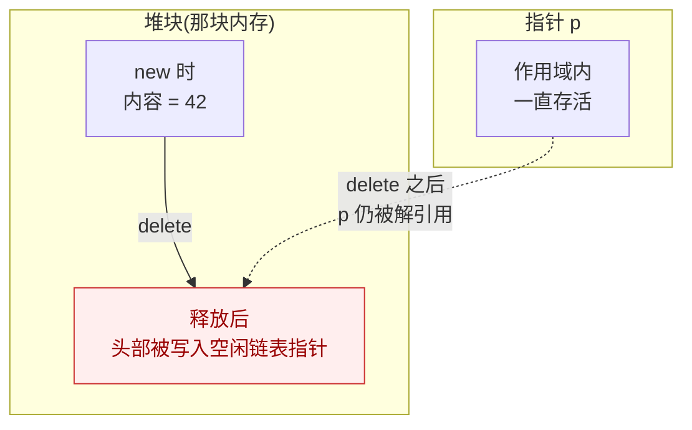
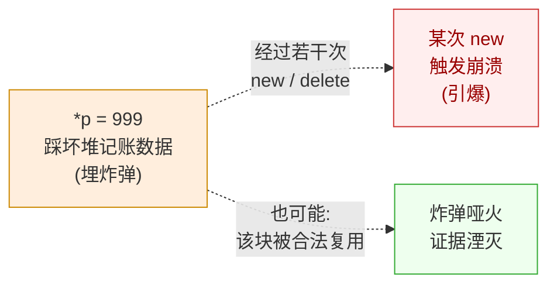

# 你的C++程序又双崩溃了！悬垂的指针之噶了你还用

您的程序跑了好几个月,相安无事。某天加了行看似无关的代码,它突然崩了——崩在一次 `new`、一次 `delete`,甚至一个日志输出上(笔者是真的真的见过。。。当时查一个 C++ 写的软件的 Crash 查得头大),堆栈里全是无辜的路人甲。甚至有一次差点没绷住——“他*的！怎么崩在打日志上去了？？？！！！我查个鬼！” 然后笔者求开发的元老到场,翻来覆去, 问的用户到底咋出现问到烦了，好不容易真的在离崩点十万八千里的地方,挖出一行早就被遗忘的 `*p`。

这就是 use-after-free——释放之后,还用着那块内存。它狡猾就狡猾在:**错误在这里,崩在那里。**（排查到半夜）

## 先把它造出来

咱们先看看,这个神秘的 UAF 到底长什么样。

```cpp
int* p = new int(42);
delete p;
printf("*p = %d\n", *p);   // ← 释放之后,还来读
*p = 999;                   // ← 还往里写
```

哈?就这,你们搞 C++ 的就这水平?这不一眼顶真吗?UAF 看起来也很好避免嘛!在发表这个高见之前(笔者已经写得血压高了，因为真见过这么嘲讽咱们写C和C++的),咱们先跑一遍完整的复现代码——下面这份在配套代码 `code/volumn_codes/crash-lab/02-use-after-free/crash.cpp`,先看它在笔者这台 Linux(GCC 16.1.1)上跑出来是什么样:

```text
Before free: *p = 42, p = 0x58532a73f020
After free:  memory released
After free:  *p = -2060277953  <-- UAF! reading freed memory
After free:  wrote 999 to freed memory <-- heap corruption!
New alloc:   *q = 0, q = 0x58532a73f020 (may overlap with freed p)
exit code: 0
```

停一下。`*p` 读回来的不是 42,是 `-2060277953` 这个莫名其妙的数;咱们不但读了,还往里写了 999——按注释的说法这叫"堆损坏";而最扎心的是,**程序正常退出,exit code 0,啥事没有**。读也读了,写也写了,还活着。

同一份代码,笔者在 Windows / MSVC 上跑,结局不一样:读到了 `2043551952`,写完 999 之后程序直接倒地——`exit code: -1073741819(0xC0000005 = STATUS_ACCESS_VOLATION)`。一份代码,一个平台躺着一个平台站着,这不是玄学,这正是 UAF 的本性,咱们往下看。

## delete 之后,那块内存去哪了

要弄明白这事,得先搞清楚 `delete` 到底干了什么,否则还是在打转。

下意识里,`delete` 像是把那块内存"还回去"了——其实没有。`delete` 干的就一件事:告诉堆管理器"这块我不用了,你记一笔,回头有新的分配请求,可以拿去重复利用"。至于那块内存里头原来装的 42?没人管。堆管理器可能顺手往里塞点自己的东西,也可能暂时懒得动。这取决于你使用的编译器和编译配置，Debug还是Release配置可以见分晓，优化力度也能干扰，神奇吧。

上面那个 `-2060277953`,多半就是它塞进去的记账数据。口说无凭,咱们用 GDB 在读之前下一个断点,直接扒开这块内存看字节(完整命令:`gdb -batch -ex 'break crash.cpp:26' -ex run -ex 'print *p' -ex 'x/4xb p' ./crash`):

```text
Breakpoint 1, main () at crash.cpp:26
$1 = (int *) 0x55555556b020
$2 = 1431655787
0x55555556b020: 0x6b 0x55 0x55 0x55
```

`p` 指向 `0x55555556b020`,这是 Linux 进程堆区的典型地址。而这块内存的前四个字节——小端序读出来是 `0x5555556b`——恰好又是一个堆区地址的模样。这不是巧合:glibc 的堆管理器把 `delete` 掉的小块内存挂进了一条"空闲链表"(tcache),链表要存"下一个空闲块在哪",存哪?就存在这块内存自己的头部。咱们读到的"垃圾值",其实是堆管理器留下的一个**指针**。



一句话:**内存死了,指针还活着,还傻乎乎指过去。**顺带说明,两次运行读到的值不一样(`-2060277953` 对 `1431655787`),因为地址随机化(ASLR)每次把堆放在不同位置——值不同,但"读到的是链表指针残影"这个关系,每次都稳定。

## 它凭什么不崩

更坑的来了:Linux 这边,读也读了、写也写了,凭什么 exit 0?

因为堆管理器释放内存后,通常不会立刻把那块虚拟地址还给操作系统(那代价不小,万一您待会儿又来要呢)。页面还老老实实映在那儿,您拿悬垂指针一戳,照样戳得到东西——只是戳到的是啥,全凭时机:

- 刚 `delete` 完就读:大概率还能读到 42(有的实现会先留着)或链表指针,堆还没干别的。
- 隔几个操作再读:基本是垃圾,内存可能已被复用。
- 往里写(像上面 `*p = 999`):踩坏的是堆管理器的记账数据。

而踩坏记账数据的后果,不立刻发作。要等下次 `new` / `delete` 走到那段逻辑,程序才突然崩给您看——也可能像这次一样,`new int(0)` 恰好把这块内存拿了回去(`q` 和 `p` 是同一个地址 `0x58532a73f020`,输出里看得清清楚楚),记账数据被合法覆盖,炸弹哑火,证据湮灭:



读,常常没事;写,才埋下定时炸弹;而炸弹引爆的地点,跟您埋炸弹的地点,根本不是同一处——也可能根本不引爆。这就是 UAF 最让人抓狂的地方:它连"崩溃"都不保证给您。

## 把它逼出来

既然它这么会藏,怎么把它逼出来?两样法宝。

第一样,AddressSanitizer(ASAN)。编译时加上 `-fsanitize=address`,再跑一次,这是 Linux 那次的真实报告(截去了和本案无关的系统帧):

```text
==15945==ERROR: AddressSanitizer: heap-use-after-free on address 0x74e4009e0010
READ of size 4 at 0x74e4009e0010 thread T0
    #0 0x55aad1518346 in main crash.cpp:26      ← 在这行读的

0x74e4009e0010 is located 0 bytes inside of 4-byte region [0x74e4009e0010,0x74e4009e0014)
freed by thread T0 here:
    #0 ... in operator delete(void*, unsigned long)
    #1 0x55aad1518300 in main crash.cpp:17      ← 在这行释放的
previously allocated by thread T0 here:
    #0 ... in operator new(unsigned long)
    #1 0x55aad151823c in main crash.cpp:13      ← 在这行分配的
```

这份报告,把 UAF 的作案链条一次交代清楚:13 行分配、17 行释放、26 行还在用——**分配、释放、滥用,三点定位,一目了然。**而且管它炸弹哑不哑火,ASAN 在第一次读的那行就当场按住。

ASAN 怎么做到的?简单说,它在每块分配出来的内存周围埋了红区(中毒的影子内存),`delete` 之后还会把整块标记为"已释放"。一旦有指针悬垂着来访问这些禁区,当场抓获。代价是程序慢两倍左右、内存多占点——换来的是把"薛定谔式不崩"变成"必定当场报错"。日常测试开着它,值。工具的家族谱系(它和 Valgrind、TSan 什么时候用哪个)在[卷六·ASAN 家族](/vol6-performance/ch00-performance-mindset/03-asan-family-and-memory-safety)那篇里有系统讲解,这里不重复展开。

第二样,GDB。它在这案里已经出场过一次了(扒字节看链表指针)。没开 ASAN、只能抓尸体的时候,靠它告诉您"死在哪一行";但 UAF 的麻烦恰恰在于,死的那行常常不是错的那行,真正释放内存的那行,得您顺着线索自己往回找。所以对付 UAF,ASAN 永远是首选,GDB 是兜底。

## 治本:让指针和内存同生共死

查得到,还得治得了。UAF 的病根就一句话:**指针活得比它指向的内存还长。**那治疗思路也就一句话:让二者同生共死。

最省心的法子,是把这块内存交给一个会自己管生死的管家——智能指针:

```cpp
// unique_ptr:一块内存,一个主人
auto p = std::make_unique<int>(42);
std::cout << *p;   // 安全
// 离开作用域,p 自动 delete;而且 p 本身也没了,想悬垂都没机会
```

`unique_ptr` 最妙的地方在于:内存释放的那一刻,指向它的那个指针自己也走到了生命尽头——您根本无从悬垂。从根上,就把 UAF 的路堵死了。

要是多个地方共享同一块内存呢?上 `shared_ptr`,靠引用计数说话:

```cpp
auto p = std::make_shared<int>(42);
{
    auto copy = p;     // 引用计数:2
}                       // copy 离开,计数回到 1,内存还在
std::cout << *p;        // 安全
```

最后一个持有者松手,内存才真正释放。

当然,最朴素的道理别忘: **能用栈,就别上堆。** 我的理解是——快进快出，范围明确。一个函数内的 `int val = 42;`,编译器管生管灭,压根不存在"释放之后还指向它"这回事。智能指针实际上就是这样的。这套思想就派生出了RAII来，那是前面卷的话题了。我们这里不聊~。

配套代码里还备了一份修好的 `fixed.cpp`(`code/volumn_codes/crash-lab/02-use-after-free/`),编译运行对照着看,不再悬垂之后程序是什么样子。
