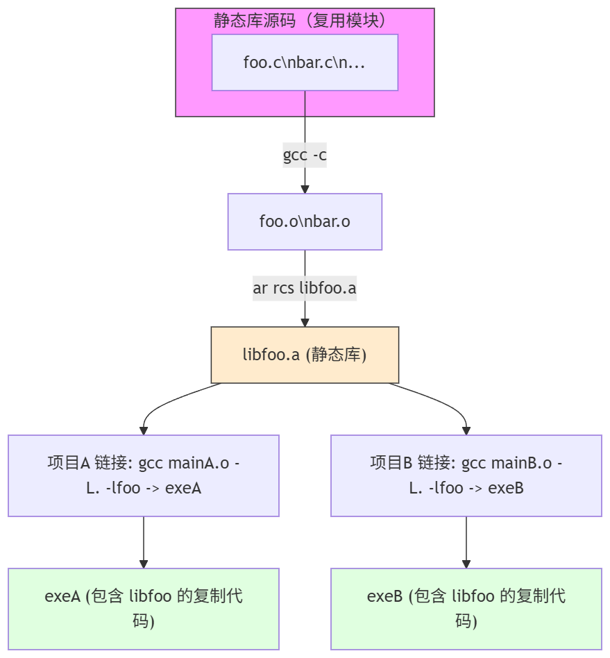
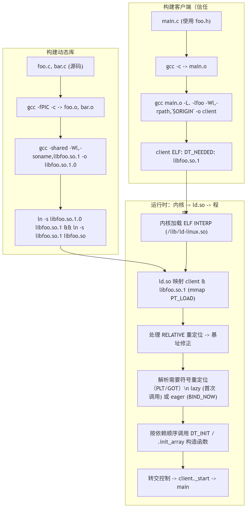

# Deep Dive into C/C++ Compilation and Linking · Part 2: An Introduction to Static and Dynamic Libraries

## What the Reuse Concept Is, and What It Has to Do with Compilation and Linking

Reuse is everywhere, and we believe nobody would disagree with that. The reuse we're discussing is simply putting code to use again. You can already catch a little glimpse of this at work in C++:

```cpp
template<typename AddType>
auto add(const AddType& a, const AddType& b){
    return a + b; // an addition with no tricks whatsoever
}

std::string
trim_self(const std::string& waited_trim){ // returns the copy of the trimmed string
    size_t i = 0; // left index
 while (i < str.size() && isspace((unsigned char)str[i]))
  i++;
    size_t j = str.size(); // right index
    while (j > 0 && isspace((unsigned char)str[j - 1]))
  j--;
 return str.substr(i, j);
}

int main()
{
    int res = add(1, 2); // deduced as int
    float res2 = add(1.0f, 2.0f); // deduced as floats
}

```

For instance, the template code and the function code above mean we don't have to copy code all over again every time we call an addition or a whitespace squeeze on a string. So looked at this way, code reuse was already around long ago, back in the era when C reigned supreme. Still, we'd say code reuse at this level doesn't count as very advanced—because this kind of reuse is source-distribution reuse. In other words, to use a code masterpiece of our own from the past, or someone else's, we have to scramble to dig out their source files, make sure every dependency is present, and then add them to our own project for compiling. we trust you've spotted the problem—in many cases we simply cannot get the source code at all. (Trade secrets—you know the drill.) In that situation, we naturally start thinking about code reuse at a lower level: distribution at the binary level. That is what static and dynamic libraries are for, and it's also the prerequisite for the several reuse mechanisms at the machine-code distribution level that the upcoming parts are specifically devoted to.

## So What Exactly Is a Static Library

A static library is probably far simpler than you think. We know that after the compiler finishes preprocessing and compiling a source file, we get a relocatable file. Previously, these relocatable files would be taken directly and combined into an executable; now we can take a different angle: these general-purpose relocatable files can perfectly well be collected into a library of their own, so that next time we go looking for a symbol we simply link against that library—and just like that, we've hidden the source code away and can distribute at the binary level. But there is one problem—how do we use it? We always need usable symbols to tell us the exact entry point. It's like knowing the library has a function that can squeeze the whitespace out of a string: if we don't know what it's called, we can't use it. So it's obvious. Having just these binary files is nowhere near enough; one more condition must be met, namely—exported header files for us to program against.

The two figures below give a pretty good illustration of what a static library does.



But there is a new problem here. In effect, the libfoo code is completely identical, and yet two copies of it exist. Sometimes we don't want this kind of hard copy. If libfoo is on the small side, fine—disk capacity is relatively cheap these days, and we can even call the redundancy an advantage. But more often, when libfoo receives a fairly important security update and we want every piece of software to reload it on its next launch, static libraries look helpless. All they did was shift distribution from the more difficult source distribution over to binary distribution; they don't solve the more important load-when-use problem in the slightest. So it doesn't look elegant. Which is why, in practice, static libraries aren't used all that widely (we rarely use them ourselves).

## Dynamic Libraries

So the problem is that we made a deep copy of all the binary code rather than a shallow copy at the reference level. If we allow some of the symbols in the executable code to be determined via lazy loading (which requires that we have a loader able to dynamically load these things and modify the addresses of those undefined symbols into the addresses of the genuinely shared symbols), a natural thought follows—since we've already gone as far as the library level, let's be thorough and simply turn this code into purely shareable code. When it needs to be available, we load it, and afterwards every executable program that needs this library can steadily use this shared code segment directly, instead of clumsily copying its own. This saves us a tremendous amount of memory space. This sharing character is also why we can say a dynamic library is likewise a shared library (shared code is necessarily loaded dynamically so that the shared symbols' addresses can be modified again, so in this sense "shared library" and "dynamic library" are perfectly interchangeable—nobody deliberately distinguishes them today).

Of course, dynamic libraries have deeper characteristics—for example, so that any executable program needing this library can smoothly load the symbols inside it, we compile all of it the -fPIC way (Position Independent Code), and the loader can then perform relocation very conveniently.

## Overview: So How Do Dynamic Libraries Actually Pull This Off

### Building a Dynamic Library (from Source to `libfoo.so` / the Versioned `libfoo.so.1.0`)

Goal: produce a `.so` that can be dynamically loaded by clients and shared by multiple processes, while keeping ABI management explicit (through SONAME/versioning).

It is in fact almost identical to building an executable, except that the startup header is not added. Beyond that, we still need to guarantee a few most basic key points:

- **Position-independent code (PIC) is mandatory**: `-fPIC` (or `-fpic`) is used to generate code that can run at any address (function memory accesses use relative addresses or go through the GOT). Not using PIC causes the linker/runtime to produce relocation conflicts or non-relocatable sections.
- **Use `-shared` to generate the shared object**: the linker marks the type as a dynamic library (ELF type = DYN).
- **Set the SONAME**: the linker option `-Wl,-soname,libfoo.so.1` indicates the ABI name (the client records the SONAME in DT_NEEDED). The actual file is usually `libfoo.so.1.0`, with symlinks provided: `libfoo.so.1 -> libfoo.so.1.0`, and `libfoo.so -> libfoo.so.1` (convenient for `-lfoo` during development)
- **Control exported symbols (visibility / version script)**: global symbols are exported by default; you can use GCC `-fvisibility=hidden` + `__attribute__((visibility("default")))` to mark out the interfaces to export, or use a linker version script to control the symbol table, reducing API pollution and lowering the risk of symbol conflicts.
- **Optional: symbol versioning**: used to support different versions of symbols within the same SONAME, easing compatibility management (requires a linker version script).

### Building the Client Executable (Based on "Trusting the Library's ABI/SONAME")

Here "trusting" means the client believes, at build time, that the dynamic library's ABI/interface (header files, SONAME, symbol semantics) will not break its expectations. The relationship between the build stage and runtime, and the ELF fields that get generated, are absolutely critical.

#### What Happens at Link Time (Building the Client)

- The client uses the header file declarations (`foo.h`) and links the corresponding shared library with `-lfoo` (or the library's development symlink `libfoo.so`).
- The linker will:
  1. Merge the client's own code with the object files into an executable (ELF type = EXEC, or DYN for a position-independent executable).
  2. **Verify**: attempt to resolve undefined references (in the dynamic-linking case, the linker will usually satisfy these references using the dynamic symbol table of the shared libraries specified; if a reference cannot be found, it reports an undefined reference error).
  3. **Copy no library code**: unlike static linking, the linker does not copy the `.o` code into the executable; instead it records the dependency into `DT_NEEDED` (what gets recorded is the library's SONAME) and generates the necessary relocations/PLT placeholders.
- Result: the executable contains dynamic-section entries such as `DT_NEEDED: libfoo.so.1`, but it does not contain the library's implementation code.

### Runtime Loading and Symbol Resolution (What the Dynamic Linker / Loader Concretely Does)

This is the most complex and most critical part — at runtime, `ld.so` (or the loader of the platform in question) assembles everything into a runnable process address space and resolves the symbol references. Below is a detailed walkthrough, step by step and mechanism by mechanism.

#### Startup Phase — From the Kernel to the Dynamic Linker

1. **The kernel loads the executable**: the kernel reads the ELF header -> if the `INTERP` segment exists in the ELF (the vast majority of dynamic executables have one, with a value like `/lib64/ld-linux-x86-64.so.2`), the kernel first maps the dynamic linker into the process address space, then maps the executable's PT_LOAD segments too, but does not directly run the executable's `_start`.
2. **The dynamic linker (ld.so) starts executing**: it is responsible for parsing `DT_NEEDED`, finding the actual library files, recursively loading dependencies and performing relocations, running initialization (constructors), and finally handing control to the executable's entry point (`_start` -> `main`).

#### Mapping (mmap) the Library Files

- The loader reads the ELF Program Headers (PT_LOAD) of each dependency `.so`, mapping the executable segment (text) as executable-and-read-only and the data segment as read-write, and so on; it also handles page alignment and segment protections (mmap + mprotect).
- Each library is generally mapped only once (multiple processes can share the same physical pages, as long as the pages are read-only/shared).

#### Relocations

Relocations come in a variety of types, which fall into two important conceptual categories:

- **Relocations that require no symbol lookup** (e.g. the RELATIVE type): these can be adjusted directly against the base address (for position-independent code, at runtime the library base is added to the relative offset); they are usually processed in bulk during the startup phase, which is fast.
- **Relocations that require a symbol lookup** (e.g. R_X86_64_JUMP_SLOT / R_*_GLOB_DAT and the like): these require searching for the corresponding defining location by symbol name (possibly in the executable or in another library).

#### Symbol Lookup Order (the Default ELF Search Rules, in Broad Strokes)

For resolving a particular symbol (say, the function `foo`), the loader's lookup order is usually:

1. The executable's global symbol table (the executable overrides).
2. Walk each loaded library's dynamic symbol table in DT_NEEDED list order, looking for the first matching global/weak symbol (note: the actual rules are affected by the ELF version, runtime flags, RTLD_LOCAL/RTLD_GLOBAL, symbol visibility, and so on).
3. If symbol versioning is present, the version tags must be matched.
4. If loading with `dlopen` and `RTLD_GLOBAL`, the symbols of these libraries may take part in the resolution of subsequent libraries; with `RTLD_LOCAL` they do not join other later resolutions.

> Important: **symbols in the executable take precedence** over those in shared libraries (this is the so-called symbol interposition), so an executable can "override" functions from a library (this is also the foundation on which `LD_PRELOAD` can swap out function implementations).



The figure above lays the concrete flow out clearly.

## Some Comparisons

We've put together a comparison table here for reference:

| Aspect | Static Library | Dynamic Library (Shared / .so/.dll/.dylib) |
| ------ | -------------- | ------------------------------------------- |
| Nature of the binary file | `.a` / `.lib`: several `.o` object files packaged together, an archive form; at link time the object code is copied into the executable. | `.so` / `.dll` / `.dylib`: a shared object that can be loaded at runtime, usually position-independent code (PIC), carrying SONAME/version information. |
| Integration into the executable (linking and running) | Resolved at link time, with the needed object code copied into the executable (static binding); at runtime the executable no longer depends on the library file. | `DT_NEEDED` (or the equivalent) recorded at link time; at runtime the dynamic linker maps it and relocates/resolves symbols in the process address space (dynamic binding, with live replacement/loading). |
| Effect on executable size | The executable grows in size (it contains actual copies of the library code), and multiple executables repeatedly include the same code. | The executable stays small (only the dependency is recorded); multiple processes share the same copy of the library's read-only/shared pages; at runtime, extra memory is used for the mapping and the GOT/PLT. |
| Portability | Simple deployment: the executable is usually self-contained (easier to port within the same architecture and ABI), though still affected by the system/kernel/CRT. | Deployment depends on the runtime environment: appropriate shared library versions, a loader, and search paths are required (rpath/LD_LIBRARY_PATH/ldconfig); cross-distribution/platform compatibility is more sensitive. |
| Ease of integration | Simple link configuration (plain `-l` / -L, or merging the .o files), with no runtime loading to worry about; but a version upgrade means recompiling every client. | More complex building and deploying (needs `-fPIC`, SONAME, rpath, symbol visibility, version scripts, etc.); but it supports runtime replacement, plugins, and dlopen, and an upgrade can replace just the library file. |
| Ease of processing/converting the binary | Packaging/inspecting/merging is fairly intuitive (`ar`, `nm`, `objdump`); reverse replacement / replacing local symbols is harder (relinking required). | Generating and controlling exported symbols is more complex (symbol versioning, visibility), and the runtime relocation & symbol resolution machinery is complicated; but runtime `dlopen/dlsym` offers flexible extensibility. |
| Whether it suits development work | Suits: small tools, embedded/single-file distribution, scenarios with no runtime dependencies; convenient for offline/restricted-environment deployment. | Suits: large projects, modular design, plugin systems, scenarios needing hot updates or reduced duplicate memory/disk usage; good for team collaboration and independent library releases. |
| Other points worth mentioning | - Security/bug fixes require rebuilding and republishing every executable. - Copyright/licenses (e.g. the GPL) may bring stricter obligations under static linking. - Runtime performance (calls) usually carries no PLT cost. | - The library can be fixed/replaced on its own (quick patching). - There is a runtime hijacking risk (LD_PRELOAD, RPATH injection) and first-call latency (lazy binding). - Demands more of platform ABI/SONAME management and the deployment process. |

## A Modern CMake Perspective

All those `-fPIC`, `-shared`, `-Wl,-soname`, `-fvisibility=hidden` flags really did have to be pieced together one at a time in the era of hand-typed command lines. In modern projects this whole set has basically been taken over by CMake; when we write CMakeLists we rarely write these flags out raw anymore.

`add_library(foo SHARED ${FOO_SOURCES})` directly produces the `.so`—CMake adds `-fPIC` to SHARED targets by default, sparing us the hand-copying; `add_library(foo STATIC ...)` automatically calls `ar` to pack the `.a`, which amounts to scripting the archiving workflow from the previous section. On the client side, a single line of `target_link_libraries(myapp PRIVATE foo)` takes over all of `-lfoo`/`-L<dir>`, and CMake also automatically strings together the library's interface include directories and its transitive dependencies.

`-fvisibility=hidden` is set in CMake via `set_target_properties(foo PROPERTIES CXX_VISIBILITY_PRESET hidden)`, paired with `VISIBILITY_INLINES_HIDDEN ON`; the effect is that only the symbols you explicitly marked `visibility("default")` are exported—the "reduce API pollution and symbol conflicts" advice from the previous section, landed as properties.

As for the runtime `LD_LIBRARY_PATH` dirty work, CMake takes it over with `CMAKE_INSTALL_RPATH` and `$ORIGIN`: when installing into a non-standard directory, set `INSTALL_RPATH "$ORIGIN/../lib"`, and the executable carries its own rpath—the loader simply follows it, with no need for the user to export environment variables. ABI management such as SONAME/versioning is comparatively thin; it's usually combined with `set_target_properties(... VERSION 1.0 SOVERSION 1)` to generate `libfoo.so.1.0` + a symlink, with CMake building the symlink for you. In one sentence: these low-level mechanisms haven't disappeared; the build system has simply sealed them behind declarative target properties.

# Reference

It basically all comes from this book: *Advanced C and C++ Compiling*
