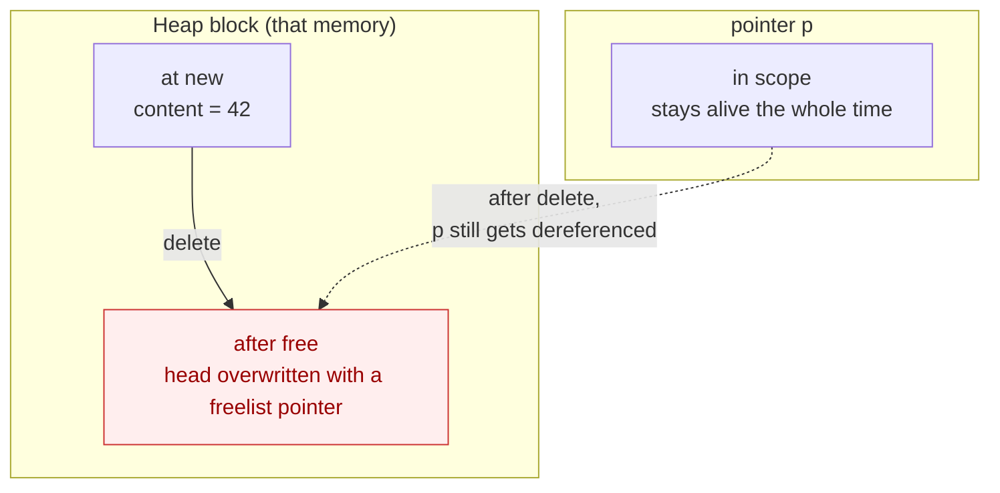
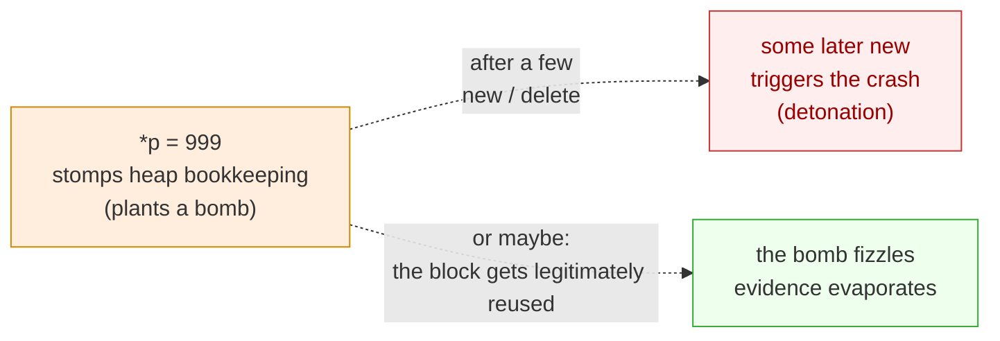

# Use-After-Free: The Pointer Outlives the Memory

Your program ran fine for months. Then one day a seemingly unrelated line of code lands, and it suddenly crashes—on a `new`, a `delete`, or even a log statement (I have really, truly seen this... I was once hunting a crash in a C++ app until my head spun), and the stack trace is full of innocent bystanders. One time I nearly lost it—"How the hell did it crash in the LOGGING code?!! What am I even supposed to investigate?!" So we called in the veterans; they went back and forth, grilled the user about how to reproduce it until everyone was sick of it, and finally, in a spot a hundred thousand miles from the crash, dug out one long-forgotten line: `*p`.

That is use-after-free—the memory is released, and you keep using it anyway. Its evil is concentrated in one property: **the error lives here, the crash happens there.**

## First, Let's Build One

Let's see what this mysterious UAF actually looks like.

```cpp
int* p = new int(42);
delete p;
printf("*p = %d\n", *p);   // ← freed, and we still read it
*p = 999;                  // ← and we write to it
```

Huh? That's it? This is what C++ people deal with? Isn't this obvious at a glance? UAF looks trivially avoidable! Before you publish that hot take (my blood pressure is already up writing this, because I have genuinely seen people mock C and C++ developers like this), let's run the full reproducer—the one at `code/volumn_codes/crash-lab/02-use-after-free/crash.cpp` in the companion code—and see what it does on my Linux box (GCC 16.1.1):

```text
Before free: *p = 42, p = 0x58532a73f020
After free:  memory released
After free:  *p = -2060277953  <-- UAF! reading freed memory
After free:  wrote 999 to freed memory <-- heap corruption!
New alloc:   *q = 0, q = 0x58532a73f020 (may overlap with freed p)
exit code: 0
```

Hold on. `*p` didn't read back 42; it read `-2060277953`, a number out of nowhere. We didn't just read—we wrote 999 into it, which the comment calls "heap corruption". And the most infuriating part: **the program exits normally. Exit code 0. Nothing happened.** Read, write, still alive.

The same code on Windows / MSVC ends differently: the read returns `2043551952`, and right after writing 999 the program drops dead—`exit code: -1073741819(0xC0000005 = STATUS_ACCESS_VIOLATION)`. One codebase, one platform on its back and one standing. That's not mysticism; it's UAF's true nature. Let's dig in.

## After `delete`, Where Does That Memory Go

To make sense of this, you first need to know what `delete` actually does—otherwise we're just going in circles.

Intuitively, `delete` "gives the memory back". It doesn't. `delete` does exactly one thing: it tells the heap manager "I'm done with this block, write it down in your ledger, and feel free to hand it out again on the next allocation request". And the 42 that was sitting in that memory? Nobody's business. The heap manager may stuff some of its own bookkeeping in there, or may not bother yet. Which one happens depends on your compiler and build configuration—Debug versus Release makes the difference visible, and optimization levels meddle too. Magical, right.

That `-2060277953` above is most likely bookkeeping it stuffed in. Claims need proof, so let's set a breakpoint in GDB right before the read and crack the memory open, byte by byte (full command: `gdb -batch -ex 'break crash.cpp:26' -ex run -ex 'print *p' -ex 'x/4xb p' ./crash`):

```text
Breakpoint 1, main () at crash.cpp:26
$1 = (int *) 0x55555556b020
$2 = 1431655787
0x55555556b020: 0x6b 0x55 0x55 0x55
```

`p` points to `0x55555556b020`, a typical Linux heap address. And the first four bytes of that block—read little-endian, that's `0x5555556b`—look exactly like another heap address. Not a coincidence: glibc's heap manager hangs small `delete`d blocks on a "free list" (tcache), and the list has to store "where the next free block is". Where? In the head of the block itself. The "garbage value" we read is actually a **pointer** the heap manager left behind.



In one sentence: **the memory is dead, the pointer is alive, and it's still faithfully pointing at the corpse.** As a side note, the two runs read different values (`-2060277953` versus `1431655787`) because ASLR relocates the heap every run—the value differs, but the relationship "what you read is the ghost of a freelist pointer" holds every single time.

## Why Doesn't It Crash

Here comes the nastier part: on Linux we read, we wrote, so why exit 0?

Because after freeing, the heap manager usually doesn't immediately return those virtual addresses to the OS (that's not cheap—and what if you come asking again in a moment?). The pages stay dutifully mapped. Poke them through a dangling pointer and you'll still poke something—what exactly you hit depends on timing:

- Read immediately after `delete`: most likely still 42 (some implementations leave it for a while), or a freelist pointer; the heap hasn't done anything else yet.
- Read a few operations later: almost certainly garbage; the memory may already be reused.
- Write into it (like our `*p = 999`): you're stomping on the heap manager's bookkeeping.

And stomped bookkeeping doesn't blow up immediately. It waits until the next `new` / `delete` walks through that logic—then the program suddenly dies in front of you. Or, like in our run, `new int(0)` happens to claim this exact block back (`q` and `p` are the same address `0x58532a73f020`, plain as day in the output), the bookkeeping gets legitimately overwritten, the bomb fizzles, and the evidence evaporates:



Reading is usually harmless; writing plants the time bomb; and the spot where the bomb goes off is nowhere near the spot where you planted it—or it may never go off at all. That's what makes UAF so maddening: it doesn't even guarantee you a crash.

## Forcing It Into the Open

If it hides this well, how do you flush it out? Two trusted weapons.

The first is AddressSanitizer (ASan). Compile with `-fsanitize=address` and run again; this is the real report from that Linux run (frames unrelated to this case trimmed):

```text
==15945==ERROR: AddressSanitizer: heap-use-after-free on address 0x74e4009e0010
READ of size 4 at 0x74e4009e0010 thread T0
    #0 0x55aad1518346 in main crash.cpp:26      ← the read happens here

0x74e4009e0010 is located 0 bytes inside of 4-byte region [0x74e4009e0010,0x74e4009e0014)
freed by thread T0 here:
    #0 ... in operator delete(void*, unsigned long)
    #1 0x55aad1518300 in main crash.cpp:17      ← freed here
previously allocated by thread T0 here:
    #0 ... in operator new(unsigned long)
    #1 0x55aad151823c in main crash.cpp:13      ← allocated here
```

One report lays out the entire crime chain: allocated at line 13, freed at line 17, still in use at line 26—**allocation, release, abuse: three points pinned, all visible at once.** And it couldn't care less whether the bomb fizzled; ASan grabs it at the very first read.

How does ASan pull that off? In short: it plants poisoned redzones (poisoned shadow memory) around every allocated block, and after `delete` marks the whole block as "freed". The moment a dangling pointer wanders into the forbidden zone, it's caught red-handed. The cost is roughly 2× slowdown and some extra memory—in exchange for turning "Schrödinger's maybe-crash" into "guaranteed immediate error". Keeping it on during daily testing is worth it. For the tool family tree (when to use it versus Valgrind or TSan), see [the ASan family write-up in Vol.6](/en/vol6-performance/ch00-performance-mindset/03-asan-family-and-memory-safety); no need to repeat it here.

The second is GDB. It already showed up once in this case (cracking the bytes open to see the freelist pointer). When ASan isn't available and all you can grab is the corpse, GDB tells you "which line died"—but UAF's cruelty is precisely that the line that died is rarely the line that sinned. The line that freed the memory, you have to walk back and find yourself. So against UAF, ASan is always the first choice, GDB the fallback.

## The Real Fix: Let Pointer and Memory Live and Die Together

Finding it is one thing; curing it is another. UAF's root cause is one sentence: **the pointer outlives the memory it points to.** So the cure is also one sentence: make the two live and die together.

The most effortless way is to hand the memory to a butler that manages its own life and death—a smart pointer:

```cpp
// unique_ptr: one block of memory, one owner
auto p = std::make_unique<int>(42);
std::cout << *p;   // safe
// At end of scope, p deletes automatically; and p itself is gone too,
// so there is no chance to dangle in the first place
```

The beautiful part of `unique_ptr`: the moment the memory is released, the pointer pointing at it reaches the end of its own life—you physically cannot dangle. UAF's path is blocked at the root.

What if several places share the same memory? Bring in `shared_ptr` and let reference counting do the talking:

```cpp
auto p = std::make_shared<int>(42);
{
    auto copy = p;     // reference count: 2
}                       // copy is gone, count back to 1, memory still alive
std::cout << *p;        // safe
```

Only when the last holder lets go is the memory truly released.

And don't forget the most plain-and-simple truth of all: **if the stack will do, don't use the heap.** For a function-local `int val = 42;`, the compiler manages birth and death; "pointing at it after release" simply cannot exist. Smart pointers are really this idea, systematized—that's RAII, a topic from an earlier volume, so we won't revisit it here.

The companion code includes a fixed `fixed.cpp` (`code/volumn_codes/crash-lab/02-use-after-free/`); compile and run it to see what the program looks like when nothing dangles.
