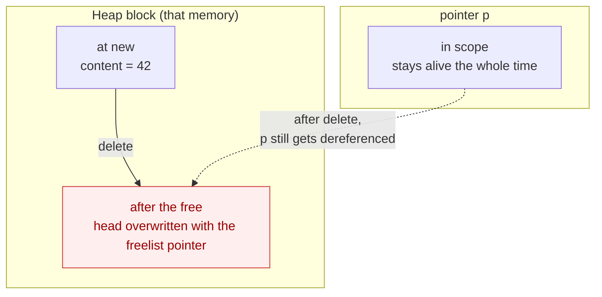
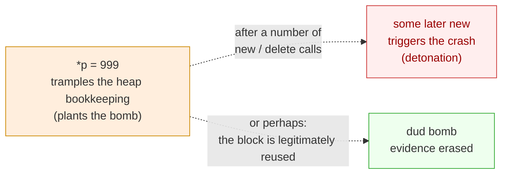

# Your C++ Program Crashed Again (and Again)! The Dangling Pointer Had Already Croaked, and You Went Right on Using It

Your program ran fine for months without incident. Then one day a seemingly unrelated line of code lands, and it suddenly crashes — on a `new`, on a `delete`, even on a log statement (I have really, truly seen this... at the time I was hunting a crash in a C++ application and it was doing my head in), and the stack trace is full of innocent bystanders. Once I very nearly lost it — "What the h***? How did it crash in the log printer???!!! What on earth am I supposed to investigate?!" So I begged the veterans of the development team to come over; we went back and forth, asking the user how it happened until everyone was sick of the question, and finally, in a spot a hundred thousand miles from the crash site, we dug up one long-forgotten `*p`.

This is use-after-free — the memory has been freed, and you keep using it anyway. Its cunning lies in exactly one property: **the error is here, the crash is there.** (Traced until the middle of the night)

## First, Let's Build One

Let's first take a look at what this mysterious UAF actually looks like.

```cpp
int* p = new int(42);
delete p;
printf("*p = %d\n", *p);   // ← freed, and we still read it
*p = 999;                   // ← and we write into it, too
```

Huh? That's it? Is this the best you C++ folks can do? Isn't this obvious at a glance? UAF looks pretty easy to avoid, doesn't it! Before you publish that hot take (my blood pressure is already rising as I write this, because I have genuinely seen people mock us C and C++ programmers like this), let's run the complete reproducer first — the one below lives in the companion code at `code/volumn_codes/crash-lab/02-use-after-free/crash.cpp`. First, here is what it produced on my Linux machine (GCC 16.1.1):

```text
Before free: *p = 42, p = 0x58532a73f020
After free:  memory released
After free:  *p = -2060277953  <-- UAF! reading freed memory
After free:  wrote 999 to freed memory <-- heap corruption!
New alloc:   *q = 0, q = 0x58532a73f020 (may overlap with freed p)
exit code: 0
```

Hold on a second. The value read back through `*p` is not 42 but the baffling `-2060277953`; not only did we read it, we also wrote 999 into it — per the comment, this is called "heap corruption"; and the most gutting part: **the program exits normally, exit code 0, nothing happened.** We read it, we wrote it, and it is still alive.

The same code, run on Windows / MSVC, meets a different end: the read returns `2043551952`, and after writing 999 the program drops dead on the spot — `exit code: -1073741819(0xC0000005 = STATUS_ACCESS_VIOLATION)`. One codebase: one platform lies flat while the other stays on its feet. That is not black magic — it is precisely UAF's nature, and we'll see why below.

## Where Did That Memory Go After `delete`

To make sense of this, we first need to be clear about what `delete` actually did — otherwise we'll just keep spinning in circles.

Intuitively, `delete` feels like it "gave the memory back" — it didn't. `delete` does exactly one thing: it tells the heap manager "I'm done with this block; note it down, and when a new allocation request comes in later, feel free to reuse it." As for the 42 that this memory used to hold? Nobody's business. The heap manager may casually stuff some of its own things in there, or it may not bother for now. Which one happens depends on the compiler you use and your build configuration — Debug versus Release makes the difference plainly visible, and the optimization level can meddle too. Magical, isn't it?

That `-2060277953` above is, most likely, the bookkeeping data it stuffed in. Claims need proof, so let's set a breakpoint in GDB right before the read and pry this block of memory open, byte by byte (full command: `gdb -batch -ex 'break crash.cpp:26' -ex run -ex 'print *p' -ex 'x/4xb p' ./crash`):

```text
Breakpoint 1, main () at crash.cpp:26
$1 = (int *) 0x55555556b020
$2 = 1431655787
0x55555556b020: 0x6b 0x55 0x55 0x55
```

`p` points to `0x55555556b020`, a typical address in a Linux process's heap region. And the first four bytes of this block — read little-endian, that's `0x5555556b` — happen to look exactly like another heap address. This is no coincidence: glibc's heap manager hangs small blocks killed by `delete` onto a "freelist" (the tcache), and the list has to record "where the next free block is". Store it where? In the head of the block itself. The "garbage value" we read is in fact a **pointer** left behind by the heap manager.


```mermaid
graph TB
  subgraph Mem["Heap block (that memory)"]
    direction LR
    M1["at new<br/>content = 42"] -->|delete| M2["after the free<br/>head overwritten with the freelist pointer"]
  end
  subgraph Ptr["pointer p"]
    P1["in scope<br/>stays alive the whole time"]
  end
  P1 -. "after delete,<br/>p still gets dereferenced" .-> M2
  style M2 fill:#fee,stroke:#c33,color:#900
```

In one sentence: **the memory is dead, the pointer is alive, and it keeps foolishly pointing at the corpse.** As a side note, the two runs read different values (`-2060277953` versus `1431655787`), because address-space layout randomization (ASLR) places the heap at a different location every run — the values differ, but the relationship "what you read is the ghost of a freelist pointer" holds steady every single time.

## How It Gets Away Without Crashing

Here comes the nastier part: on Linux we did the read and did the write — so on what grounds does it exit 0?

Because after the heap manager frees memory, it usually does not immediately hand that virtual address range back to the operating system (that costs quite a bit — what if you come asking for it again in a minute?). The pages are still dutifully mapped; when you poke at them with a dangling pointer, you still hit something — what exactly you hit depends entirely on timing:

- Read right after `delete`: chances are you still read 42 (some implementations leave it in place for a while) or the freelist pointer — the heap hasn't done anything else yet.
- Read after a few more operations: mostly garbage; the memory may already have been reused.
- Write into it (like `*p = 999` above): what you trample is the heap manager's bookkeeping data.

And the consequences of trampling bookkeeping data do not strike at once. The program waits until some later `new` / `delete` walks through that logic, and only then does it suddenly blow up in front of you — or, as happened in this run, `new int(0)` happens to claim this very block back (`q` and `p` are the same address, `0x58532a73f020`, plainly visible in the output), the bookkeeping data gets legitimately overwritten, the bomb turns out a dud, and the evidence evaporates:


```mermaid
graph LR
  A["*p = 999<br/>tramples the heap bookkeeping<br/>(plants the bomb)"] -. after a number of<br/>new / delete calls .-> B["some later new<br/>triggers the crash<br/>(detonation)"]
  A -. or perhaps:<br/>the block is legitimately reused .-> C["dud bomb<br/>evidence erased"]
  style A fill:#fed,stroke:#c80
  style B fill:#fee,stroke:#c33,color:#900
  style C fill:#efe,stroke:#3a3
```

Reading, often nothing happens; writing is what plants the time bomb; and the place where the bomb goes off is nowhere near the place where you planted it — or it may never go off at all. That is the most maddening thing about UAF: it won't even guarantee you a crash.

## Smoking It Out

Since it hides this well, how do we force it into the open? Two trusted tools.

The first is AddressSanitizer (ASAN). Compile with `-fsanitize=address` added, then run it again; here is the genuine report from that Linux run (system frames unrelated to this case trimmed away):

```text
==15945==ERROR: AddressSanitizer: heap-use-after-free on address 0x74e4009e0010
READ of size 4 at 0x74e4009e0010 thread T0
    #0 0x55aad1518346 in main crash.cpp:26      ← the read happens on this line

0x74e4009e0010 is located 0 bytes inside of 4-byte region [0x74e4009e0010,0x74e4009e0014)
freed by thread T0 here:
    #0 ... in operator delete(void*, unsigned long)
    #1 0x55aad1518300 in main crash.cpp:17      ← freed on this line
previously allocated by thread T0 here:
    #0 ... in operator new(unsigned long)
    #1 0x55aad151823c in main crash.cpp:13      ← allocated on this line
```

This report lays out the whole crime chain of the UAF in one pass: allocated at line 13, freed at line 17, still in use at line 26 — **allocation, release, abuse: three pinned points, clear at a glance.** And it could not care less whether the bomb is a dud; ASAN grabs it on the spot, right at the line of the first read.

How does ASAN pull that off? In short, it plants redzones (poisoned shadow memory) around every allocated block, and after `delete` it marks the entire block as "freed". The moment a dangling pointer comes wandering into this forbidden territory, it is caught red-handed. The cost is roughly a twofold slowdown and some extra memory — in exchange for turning "Schrödinger's maybe-crash" into "a guaranteed error on the spot". Keeping it on during everyday testing is worth it. The tool family tree (when to use it versus Valgrind or TSan) gets a systematic treatment in [the Vol. 6 article on the ASan family](/vol6-performance/ch00-performance-mindset/03-asan-family-and-memory-safety); we won't repeat it here.

The second is GDB. It has already appeared once in this case (prying the bytes open to look at the freelist pointer). When ASAN wasn't on and all you can catch is the corpse, GDB is what tells you "which line it died on"; but the trouble with UAF is precisely that the line it dies on is often not the line that is wrong — the line that actually freed the memory is something you have to trace back to yourself, following the clues. So against UAF, ASAN is always the first choice, and GDB is the fallback.

## The Real Cure: Let Pointer and Memory Live and Die Together

Finding it is not enough; we also have to cure it. The root disease of UAF fits in one sentence: **the pointer lives longer than the memory it points to.** So the treatment also fits in one sentence: make the two live and die together.

The most effortless way is to hand this memory over to a steward that manages its own life and death — a smart pointer:

```cpp
// unique_ptr: one block of memory, one owner
auto p = std::make_unique<int>(42);
std::cout << *p;   // safe
// leaving the scope, p deletes automatically; and p itself is gone too, so there is no chance to dangle
```

The most beautiful part of `unique_ptr`: the moment the memory is released, the pointer that pointed to it also reaches the end of its own life — you have no opportunity to dangle at all. It seals off the road to UAF at the root.

What if several places share the same memory? Bring in `shared_ptr`, and let reference counting do the talking:

```cpp
auto p = std::make_shared<int>(42);
{
    auto copy = p;     // reference count: 2
}                       // copy is gone, count back to 1, memory still alive
std::cout << *p;        // safe
```

Only when the last holder lets go is the memory truly released.

Of course, don't forget the plainest piece of wisdom: **if the stack will do, don't go to the heap.** The way I understand it — fast in, fast out, with a clearly bounded extent. For an `int val = 42;` inside a function, the compiler manages birth and death; "still pointing at it after release" simply cannot happen. Smart pointers are, in effect, exactly this. This line of thinking is what gave rise to RAII, which is a topic for the earlier volumes. We won't chat about it here.

The companion code also ships a fixed `fixed.cpp` (`code/volumn_codes/crash-lab/02-use-after-free/`); compile and run it side by side, to see what the program looks like once nothing dangles.
