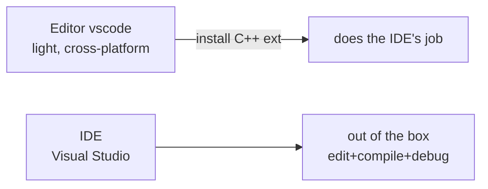

# What's an Editor, What's a Compiler—Two Things to Nail Down Before You Write a Line of Code

You want to learn C++, but hold off on typing code for a minute. Two things need to be clear first: what software you write code in, and how the code you write turns into a program that actually runs. It sounds like stating the obvious, but if these two stay fuzzy, everything that comes after—installing the tools, figuring out error messages—gets muddy along with them. So let's get them straight.

## Code Is Just Plain Text

Let's look at what the simplest C++ code looks like:

```cpp
#include <iostream>

int main() {
    std::cout << "你好，C++！" << std::endl;
    return 0;
}
```

You save this as a file with a `.cpp` extension, say `main.cpp`. If you're curious, double-click it in Windows Notepad (or right-click, "Open with," and pick Notepad), and you'll see the exact same content. Plain and simple, a `.cpp` file is just plain text—a bunch of English characters and a few symbols, no different in nature from the words you'd type in Notepad.

But if you actually tried writing code in Notepad, a few things would drive you up the wall. You mistype `int` as `itn` and Notepad says nothing—you only find out when the code won't run. Keywords like `int`, `return`, `include` are all black, just like ordinary words, so your eyes skim past without catching what matters. Long names like `std::cout` have to be typed out letter by letter every single time; Notepad gives you zero help.

That's why nobody writes code in Notepad. Writing code takes a special kind of software, and that software is called an **editor**.

## An Editor and an IDE Aren't the Same Thing




An editor is software built for writing code. It beats Notepad in a few ways. First, syntax highlighting—keywords get colored, `int` in blue, strings in green, and the structure jumps out at you. Second, autocomplete—you type `std::co`, a little box pops up suggesting `cout`, hit Tab and it fills in. Third, errors get flagged red—a typo like `itn` gets a red underline on the spot, no waiting for a compile.

There are plenty of editors out there, but this tutorial sticks with **vscode** (full name Visual Studio Code, made by Microsoft). The reasons are practical: it's free, it runs on Windows/Linux/Mac, it has the most extensions, and the moment you search for help online you'll find more tutorials than you can read. If you're already using something else, installing vscode to follow along won't cost you anything.

Then there's a category of software called an **IDE** (Integrated Development Environment), which is easy to confuse with an editor. An IDE bundles "write code, compile, debug, run" all into one package, ready to use out of the box, no assembling pieces yourself. Microsoft's Visual Studio (note: not the same thing as vscode, the names look alike but they're different products) is an IDE, and it's a popular way to write C++ on Windows. CLion is another one, from JetBrains, and it costs money.

Strictly speaking, vscode is an editor—fresh out of the install it only does highlighting and autocomplete, and compiling is something you have to figure out yourself. But its magic is in **extensions** (think of them as plugins)—once you install the C++-related extensions, the editor can do most of what an IDE does. That's exactly how we'll use it later on. So don't let the line "vscode is an editor, not an IDE" scare you; in practice the difference isn't as big as the wording makes it sound.

::: details Click to see: So which do you pick, an editor or an IDE?

- Editors (like vscode): light, flexible, cross-platform, but you need extensions to make them complete.
- IDEs (like Visual Studio): heavy, ready to use out of the box, strong debugger, but tied to a platform (VS is mainly a Windows story).
- If you're a beginner and genuinely unsure, just pick vscode—this tutorial is built around it, and following the install once is the least hassle.
:::

## The Compiler: Translating Code Into a Program

Here's the thing you need to understand: the `.cpp` you write is for humans to read. The computer can't actually run it.

A computer only runs programs it recognizes—on Windows, that's `.exe` files. The software you double-click to open every day, your browser, your chat app, they're all `.exe`. A `.cpp` is a pile of English characters; an `.exe` is the computer's native language. The two sides don't speak the same tongue. So there has to be a translation step in the middle, turning `.cpp` into `.exe`.

The software that does this translation is called a **compiler**, and the act of translating is called **compiling**.

There are a few common C++ compilers:

- **MSVC**: Microsoft's own, comes bundled with Visual Studio, smooth for writing C++ on Windows.
- **GCC**: Open source from the GNU project, used a lot on Linux. On Windows you usually install it through a package called **MinGW**.
- **Clang**: Another open-source compiler. Its error messages are friendlier than GCC's, which spares newcomers a headache.

All three can compile standard C++ code. The differences are mostly in error-message style, performance, and some edge-case behavior. This tutorial goes the MinGW (that is, GCC) route on Windows, because it's free, lightweight, and plays nicely with vscode. The MSVC route means installing all of Visual Studio, which is big, and the bar is higher for a complete beginner. Once you're comfortable, you can switch any time.

::: details Click to see: How to check from the command line whether your computer has a compiler
Open Windows' "Command Prompt" (search `cmd` in the Start menu), type the following, and hit Enter:

```bash
g++ --version
```

If a version line pops up (something like `g++ (x86_64-posix-seh-rev0, Built by MinGW-W64 project) 13.2.0`), then MinGW's GCC is already installed. If it says something like "'g++' is not recognized as an internal or external command," it's not installed—and the next article is where we install it.

The MSVC command is `cl`, and Clang's is `clang++`. Same idea.
:::

## Writing C++ Takes Two Things

Stitch the previous two sections together and it's clear. Writing C++ needs two things:

One is an **editor**, where you type code, edit code, and read error messages. We use vscode.

The other is a **compiler**, where you feed the `.cpp` you just typed and it spits out a runnable `.exe`. On Windows we use the GCC that MinGW provides.

In the next article we'll install vscode and a compiler, and along the way pick up a build tool called CMake—because once your code grows, a compiler alone isn't enough, and CMake helps you organize a bunch of `.cpp` files and compile them together.
