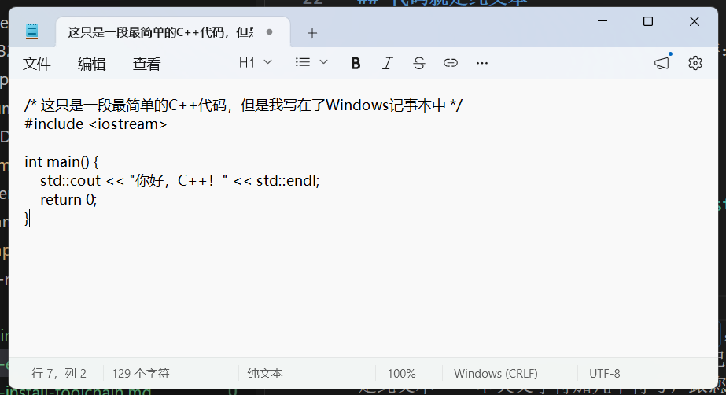
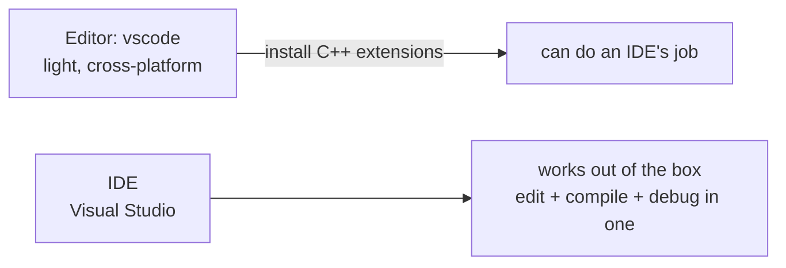
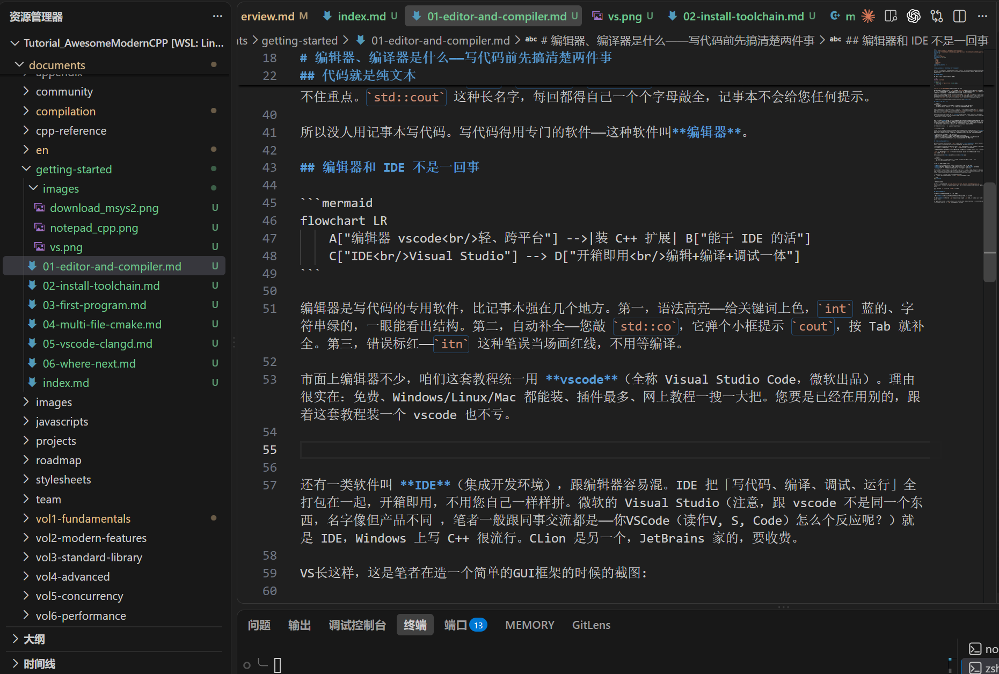
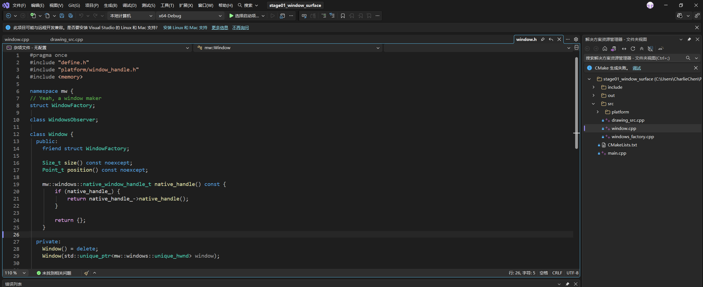
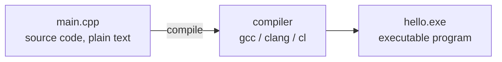

# What's an Editor, What's a Compiler — Two Things to Nail Down Before You Write Code

You're planning to learn C++, but hold off on typing code for a moment. Two things need nailing down first — which software you write code in, and how the code you write becomes a program that runs. Sounds like stating the obvious, but if these two stay fuzzy, everything after them — installing software, tracking down errors — descends into confusion right along with them. This article gets both of these most basic questions thoroughly sorted.

## Code Is Just Plain Text

Let's first look at what the simplest piece of C++ code looks like:

```cpp
#include <iostream>

int main() {
    std::cout << "你好，C++！" << std::endl;
    return 0;
}
```



You save this code into a file with the `.cpp` extension — `main.cpp`, say. If you're curious, open it with Windows' built-in Notepad (double-click it, or right-click, choose "Open with", and pick Notepad) and you'll see exactly the same content. To put it plainly, a `.cpp` file is plain text at heart — a string of English characters plus a few symbols, not fundamentally different from a few words you'd type into Notepad.

But if you actually tried writing code in Notepad, you'd run into a few maddening things. Type `int` as `itn` and Notepad won't make a sound — you only find out when the code won't run. Keywords like `int`, `return`, `include` are all black, just like ordinary words, so your eyes can scan forever without catching what matters. Long names like `std::cout` have to be typed out letter by letter, every single time — Notepad gives you no hints whatsoever.

That's why nobody writes code in Notepad. Writing code takes dedicated software — and that software is called an **editor**.

## An Editor and an IDE Are Not the Same Thing


```mermaid
flowchart LR
    A["Editor: vscode<br/>light, cross-platform"] -->|install C++ extensions| B["can do an IDE's job"]
    C["IDE<br/>Visual Studio"] --> D["works out of the box<br/>edit + compile + debug in one"]
```

An editor is dedicated software for writing code, and it beats Notepad in several places. First, syntax highlighting — keywords get colored, `int` blue, strings green, so the structure jumps out at a glance. Second, autocomplete — you type `std::co`, a little box pops up suggesting `cout`, hit Tab and it fills it in. Third, errors flagged red — a slip like `itn` gets a red underline on the spot, no waiting for a compile.

There's no shortage of editors on the market, but this tutorial standardizes on **vscode** (full name Visual Studio Code, made by Microsoft). The reasons are thoroughly practical: it's free, it installs on Windows/Linux/Mac, it has the most plugins, and one search turns up tutorials by the handful. If you're already using something else, installing a vscode to follow along costs you nothing.

> Heh, a screenshot of yours truly writing this very tutorial's Markdown


There's another category of software called an **IDE** (Integrated Development Environment), which is easy to confuse with an editor. An IDE bundles "write code, compile, debug, run" all into one package, ready out of the box — you don't have to assemble the pieces yourself. Microsoft's Visual Studio (note: not the same thing as vscode — the names look alike but the products are different; when I talk with colleagues I just say VSCode, pronounced "V, S, Code" — how about you?) is an IDE, and it's a popular way to write C++ on Windows. CLion is another one, from the JetBrains family, and it costs money.

VS looks like this — a screenshot from when the author was building a simple GUI framework:



Strictly speaking, vscode is an editor: freshly installed it only highlights and autocompletes, and compiling is something you have to work out yourself. But its charm lies in "**extensions**" (an extension is, roughly, a plugin) — once you install the C++-related extensions, the editor can do most of an IDE's job. That's exactly how we'll be using it later. So don't be scared off by the line "vscode is an editor, not an IDE" — in practice the difference isn't as big as the wording suggests.

::: details Click to see: editor or IDE — which one should you actually pick

- Editors (the vscode kind): light, flexible, cross-platform, but they need extensions to be complete.
- IDEs (the Visual Studio kind): heavy, work out of the box, strong debuggers, but tied to a platform (VS is primarily a Windows affair).
- If you're a beginner who genuinely can't decide, just go with vscode — this tutorial runs on vscode anyway, and following the install once is the least hassle.
:::

## Compilers: Translating Code Into Programs

At this point something crucial needs to be said out loud: the `.cpp` you write is for humans to read — **the computer actually can't run it.** I'm going to hammer this point home more than once! A computer has only ever known 0s and 1s; it truly cannot make sense of that big pile of human-oriented stuff you wrote!

A computer only runs programs it recognizes — on Windows, that's `.exe` files. The software you double-click open every day — your browser, QQ, Tencent Video, and so on — is all `.exe`, that is, binary programs; those are what the computer understands.

> I can hear someone getting ready to flex — "I'm a Linux user! I don't buy your .exe business." All right then — ELF is, at heart, also a binary program.

A `.cpp` is a pile of English characters; an `.exe` is the computer's mother tongue — the two sides don't share a language. So there has to be a translation step in between, translating the `.cpp` into an `.exe`.

The tool that does this translating is called a **compiler**, and the act of translating is called "**compiling**".


```mermaid
flowchart LR
    A["main.cpp<br/>source code, plain text"] -->|compile| B["compiler<br/>gcc / clang / cl"]
    B --> C["hello.exe<br/>executable program"]
```

The common C++ compilers come down to a few families:

- **MSVC**: Microsoft's own; it ships inside Visual Studio and makes writing C++ on Windows smooth sailing.
- **GCC**: open source from the GNU project, used a lot on Linux; on Windows it's usually installed through a package called **MinGW**.
- **Clang**: another open-source compiler; its error messages are friendlier than GCC's, so newcomers' heads hurt less.

All three can compile standard C++ code; the differences are mainly in error-message style, performance, and some corner-case behavior. This tutorial takes the MinGW (that is, GCC) route on Windows, because it's free, lightweight, and pairs smoothly with vscode. The MSVC route means installing all of Visual Studio — a big chunk of software — which sets the bar a bit high for a complete beginner. Once you're comfortable, you can switch whenever you like.

::: details Click to see: how to check from the command line whether your computer has a compiler
Open Windows' "Command Prompt" (search `cmd` in the Start menu), type the line below, and hit Enter:

```bash
g++ --version
```

And what counts as "not installed"?

If a version number bounces back (something like `g++ (x86_64-posix-seh-rev0, Built by MinGW-W64 project) XX.Y.Z`), MinGW's GCC is already installed. If it tells you something like "'g++' is not recognized as an internal or external command" (on a Chinese-language Windows that message shows up in Chinese), then it's not installed — and installing it is exactly what the next article does.

MSVC's command is `cl`, and Clang's is `clang++` — same idea.
:::

## Writing C++ Takes Two Things

Stitch the previous two sections together and it's clear: writing C++ can't happen without two things.

One is an **editor**, where you type code, edit code, and read error hints. We use vscode.

The other is a **compiler**: you feed it the `.cpp` you just typed, and it spits out a runnable `.exe`. On Windows we use the GCC that MinGW provides.

In the next article we'll install vscode and a compiler, and while we're at it, a build tool called CMake — because once your code multiplies, a compiler alone stops being enough, and CMake helps us organize a whole pile of `.cpp` files to compile together.
