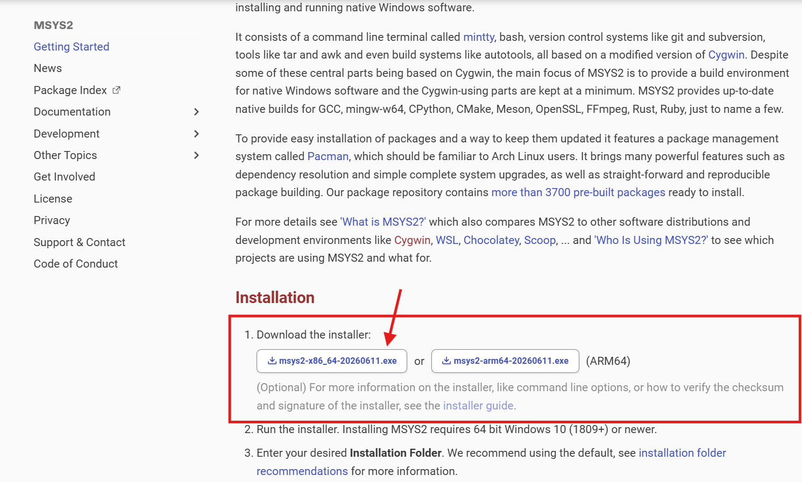
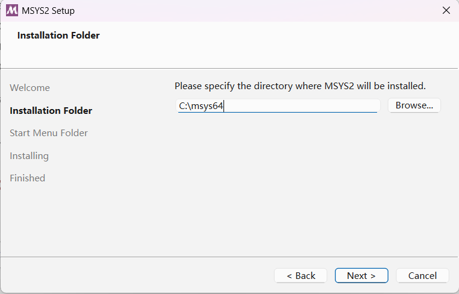
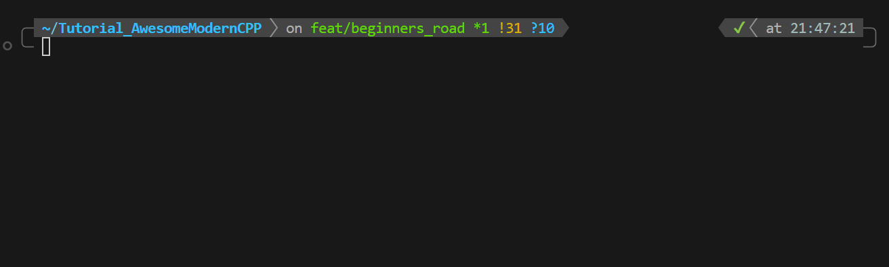
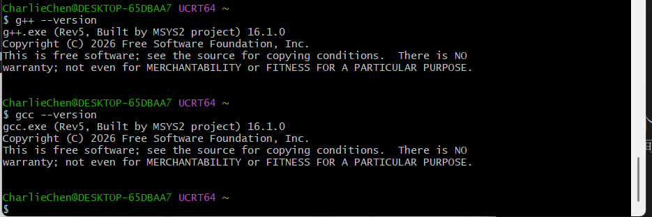

# Install the Three Things You Need to Write C++

## Opening

Last article we settled on two things to install: an editor (vscode) and a compiler. There's actually a third thing to add — a build tool named CMake.

First, let's be clear about what CMake is for. As we write more C++, a project won't stay at just one .cpp file — it might be five, six, a dozen of them, sorted into different folders. At that point, compiling them one by one by typing commands by hand would drive anyone mad. CMake exists to manage that for us: you write one configuration file telling it "here are the files in this project, and here's the program to produce", and it takes care of the rest. As for actually using it — that's next article's business; for now we just install it.

This article is pure hand-holding, with a screenshot slot at every step. Once the three things are installed, we can write our first runnable program in the next article.

## The Windows Route (Recommended)

If your system is Windows 10 or Windows 11, follow this section. Three steps, in order.

### Step 1: Install vscode

vscode is a free editor made by Microsoft, and it's where we'll be typing our code from now on.

Open your browser and head to <https://code.visualstudio.com>.

Right in the middle of the page there's a big blue button that says "Download for Windows". Click it. If your browser doesn't start downloading automatically, it will take you to a download-picker page — choose the "Windows" entry and you'll get a `.exe` installer.

Once it's downloaded, double-click `VSCodeUserSetup-x64-x.x.x.exe`. The installer looks like any ordinary piece of software — keep clicking Next. The screen to watch out for is this one:

Tick all of these (especially "Add to PATH" — that one is a must, or trouble follows later):

- On the "Select Additional Tasks" screen, tick "Add 'Open with Code' action to Windows Explorer file context menu"
- Tick "Add 'Open with Code' action to Windows Explorer directory context menu"
- Tick "Register Code as an editor for supported file types"
- Tick "Add to PATH" (**the most important one**)

The remaining options (desktop shortcut or not, some of the extra right-click menu entries) are yours to pick. I ticked them myself anyway, because on some days I'm too lazy to open CMD or PowerShell to get things done.

::: details Click to see: what if you forgot to tick "Add to PATH" during installation
Don't panic. The easy way out is to manually add vscode's own install directory to the system PATH — but the even easier way is: uninstall and reinstall, and remember to tick it this time. A reinstall is a two-minute job, which beats fiddling with PATH. One friendly heads-up, though: once you work in computing, editing PATH is such elementary common knowledge that colleagues won't even bother mentioning it. As you learn computing, it's best to get comfortable tinkering right now.
:::

Once it's installed, press the Win key on your keyboard (the one with the Windows logo) — the vscode icon should show up in the Start menu.

Open it; if you see a welcome page, it's installed.

### Step 2: Install the Compiler (the MinGW-w64 Route)

The compiler is the program that translates the .cpp you write into an .exe. Several C++ compilers work on Windows; here we take the MinGW-w64 route — at heart it's the famous GCC compiler from Linux, ported to Windows.

Why this one? Two reasons. First, it's the same thing as the Linux environments this tutorial uses later on — the command-line habits carry over exactly, so one round of learning works everywhere. Second, if you later head toward embedded (this tutorial covers that too), GCC is the mainstream there, and getting familiar with it early does no harm.

Microsoft has its own compiler called MSVC (the Visual Studio suite), which is also perfectly good. The differences between the two are parked in a collapsible box further down; here we won't expand on them — let's get MinGW installed first.

The most painless way to install MinGW is with a tool called MSYS2. MSYS2 is, at heart, a "package manager" — think of it as an app store, much like the one on your phone, except it installs command-line tools for programmers, and you operate it from the command line.

Open your browser and go to <https://www.msys2.org>.



On the page there's a download link pointing to an installer named something like `msys2-x86_64-xxxxxxxx.exe` (the filename carries a date, so a different date when you download is perfectly normal). Once it's down, double-click to run it.

First, remember to click Next; then it will ask you to pick a path:



The installer will ask you where to install. **We strongly suggest keeping the default path `C:\msys64`** — don't change it. Later we'll be adding things to the system PATH, and having the path hardcoded makes life easy. If you install somewhere else, every path after this has to change accordingly, and that's asking for mistakes.

Keep clicking Next until it finishes. Afterwards, the Start menu will have a few new icons starting with MSYS2.

::: warning Here is the trap beginners step into most
The Start menu has several MSYS2 entries: "MSYS2 MINGW64", "MSYS2 UCRT64", "MSYS2 CLANG64", "MSYS2", and so on.

**Open the "MSYS2 UCRT64" one specifically** — don't launch plain "MSYS2" (the most bare-bones entry of them all). The GCC we're installing is the UCRT64 build, and it only works properly inside the UCRT64 terminal. Open the wrong one, and after installing you'll find commands not being found.
:::

Once the UCRT64 terminal is open, you'll see a command-line window with purple text. Type this one line into it (watch that the capitalization, spaces, and hyphens are all exactly right), then press Enter:

```bash
pacman -S mingw-w64-ucrt-x86_64-gcc
```

GCC itself only compiles C++ source into object files; CMake also needs a build program to execute the rules it generates. We'll use Ninja later, so install that too; and if you'd like to use Makefiles, you can install MinGW's `mingw32-make` along with it:

```bash
pacman -S mingw-w64-ucrt-x86_64-ninja mingw-w64-ucrt-x86_64-make
```

Here, `mingw32-make` is the program name — not `make`. Ninja and Make are both build programs, while CMake is the tool that generates build rules and calls them; the next article shows how they cooperate in practice. Package names can be checked at [MSYS2's Ninja package](https://packages.msys2.org/packages/mingw-w64-ucrt-x86_64-ninja) and [the MinGW Make package](https://packages.msys2.org/packages/mingw-w64-ucrt-x86_64-make).

::: details Click to see: what output you might get

I have genuinely run into someone asking what that dollar sign below means. I thought for a second and — uh — just treat it as a leading prompt the computer's shell gives you: when you see it, plus the cursor blinking after it, the machine is quietly awaiting your input.

But it isn't always like that — mine, for instance, is customized, and it looks like this~



```bash
CharlieChen@DESKTOP-65DBAA7 UCRT64 ~
$ echo "Hello!" # Just testing that it works; this is a bash command — a must-know if you ever learn Linux
Hello!

CharlieChen@DESKTOP-65DBAA7 UCRT64 ~
$ pacman  -S mingw-w64-uart-x86_64-gcc
error: target not found: mingw-w64-uart-x86_64-gcc
# The author's finger slipped on the line above: typed uart (a serial port) instead of ucrt (the Windows 10 C runtime)
# When you see "target not found", first suspect a typo in the package name — this is what pacman says when no package has that name

CharlieChen@DESKTOP-65DBAA7 UCRT64 ~
$ pacman -S mingw-w64-ucrt-x86_64-gcc
resolving dependencies...
looking for conflicting packages...

Packages (17) mingw-w64-ucrt-x86_64-binutils-2.46-4
              mingw-w64-ucrt-x86_64-crt-14.0.0.r92.g818fa6510-1
              mingw-w64-ucrt-x86_64-gcc-libs-16.1.0-5  mingw-w64-ucrt-x86_64-gettext-runtime-1.0-1
              mingw-w64-ucrt-x86_64-gmp-6.3.0-2
              mingw-w64-ucrt-x86_64-headers-14.0.0.r92.g818fa6510-1
              mingw-w64-ucrt-x86_64-isl-0.27-1  mingw-w64-ucrt-x86_64-libiconv-1.19-1
              mingw-w64-ucrt-x86_64-libwinpthread-14.0.0.r92.g818fa6510-1
              mingw-w64-ucrt-x86_64-mpc-1.4.1-1  mingw-w64-ucrt-x86_64-mpfr-4.2.2-3
              mingw-w64-ucrt-x86_64-tzdata-2026b-1
              mingw-w64-ucrt-x86_64-windows-default-manifest-6.4-4
              mingw-w64-ucrt-x86_64-winpthreads-14.0.0.r92.g818fa6510-1
              mingw-w64-ucrt-x86_64-zlib-1.3.2-2  mingw-w64-ucrt-x86_64-zstd-1.5.7-2
              mingw-w64-ucrt-x86_64-gcc-16.1.0-5

Total Download Size:    68.98 MiB
Total Installed Size:  490.23 MiB

:: Proceed with installation? [Y/n]
# This means it's asking you to type a y — do you want to download? The answer is yes
# Type y and press Enter; step away for a bit and the install will be done when you're back
```

Now we can give it a try!



:::

`pacman` is the command you use to operate the MSYS2 "app store"; `-S` means "install (sync)", and the long string after it is the name of the package to install.

The first time you install something, pacman will ask whether to proceed and whether the packages to download are the right ones — just type `Y` and press Enter to confirm. It'll download a few dozen megabytes, so give it a moment.

With the install done, we need to make the Windows system recognize this newly installed compiler — that is, tell the system's PATH variable where it lives. What's PATH? Think of it as the system's "frequently used address book": for any address (a folder path) written in it, the system can find the programs inside directly, without you spelling out the full path every time.

Press the Win key, search for "environment variables", and click "Edit the system environment variables".

In the window that pops up, there's an "Environment Variables" button at the bottom right — click it. In the "System variables" list below, find the row named `Path` (note: `Path`, not `PATHEXT`) and double-click it.

In the list that appears, click "New" and enter this line (if you kept MSYS2's default install path, this is it):

```text
C:\msys64\ucrt64\bin
```

Click "OK" through all the windows to close them and save.

Now let's verify it worked. **This step needs a brand-new command-line window** — you just changed PATH, and old windows don't refresh it automatically; a fresh one is mandatory.

Press Win+R, type `cmd`, hit Enter, and a Command Prompt opens (the black-background one). Type:

```bash
g++ --version
```

If you see output like the following (your exact version number may be newer), it worked:

```text
➜  g++ --version
g++.exe (Rev5, Built by MSYS2 project) 16.1.0
Copyright (C) 2026 Free Software Foundation, Inc.
This is free software; see the source for copying conditions.  There is NO
warranty; not even for MERCHANTABILITY or FITNESS FOR A PARTICULAR PURPOSE.
```

If you see an error like "'g++' is not recognized as an internal or external command", PATH isn't set right. Go back and check three things: whether the path was entered as `C:\msys64\ucrt64\bin` (lots of people drop the middle `\ucrt64\` part), whether it's spelled correctly, and whether you opened a new cmd window.

### Step 3: Install CMake

The last one. Open your browser and go to <https://cmake.org/download>.

The page lists installers for several platforms. Under the Windows section, find `Windows x64 Installer` and download the `.msi` file (named something like `cmake-x.y.z-windows-x86_64.msi`).

Double-click the `.msi` to run it. Keep clicking Next through the installer, but slow down at this screen:

It will ask whether CMake should be added to the system PATH. **Pick the second option, "Add CMake to the system PATH for all users"** (add it to the system PATH for every user). The first option defaults to not adding it, and the third adds it only for the current user — the middle one is the least hassle, so that's our pick.

Continue with Next until it finishes installing.

Let's verify. **Again, open a brand-new cmd window** (the old one's PATH is stale). Type:

```bash
cmake --version
```

Seeing a version number printed means we're set:

```text
➜  cmake --version
cmake version 4.4.1

CMake suite maintained and supported by Kitware (kitware.com/cmake).
```

::: details Click to see: installing CMake from the command line works too
If you prefer the command line, you can also install it in the MSYS2 UCRT64 terminal with `pacman -S mingw-w64-ucrt-x86_64-cmake`. CMake installed that way lives under `C:\msys64\ucrt64\bin`, right next to the GCC you just installed, so you don't need to touch PATH separately. Pick one of the two install methods — don't do both.
:::

## Install the C++ Extensions for vscode

The three main pieces of software are in place; the last job is to install two "extensions" for vscode. An extension is, roughly, a vscode plugin — it bolts extra features onto the editor.

Open vscode. In the column of icons along the far left of the window, find the one made of four little squares (hovering the mouse over it shows "Extensions") and click it. Or just press the shortcut `Ctrl+Shift+X`.

In the search box at the top, search for these two names one at a time, find the matching extension, and click "Install" to install it:

The first is C/C++. It's the official Microsoft extension, providing code completion, jump-to-definition, error hints, and the like. We won't touch its settings until article 5, but installing it now costs nothing.

The second is CMake Tools. Also official Microsoft, it exists to make vscode and CMake cooperate. We'll use it in the very next article when we write our first program.

Once both are installed, the blue status bar at the very bottom of the vscode window grows a few CMake-related buttons (showing the current build type, a build button, and so on). Seeing those means the extensions are live.

::: details Click to see: how to install on Linux (the Ubuntu/Debian family)
That wraps up the Windows mainline. If you have a Linux machine at hand, the whole set installs with a single command line — far less fuss than Windows. That's exactly why I like working in WSL or on my own Linux laptop. It doesn't slow me down one bit!

Open a terminal and type this line (it installs the compiler, CMake, and the debugger all in one go):

```bash
sudo apt update && sudo apt install -y build-essential cmake ninja-build gdb
```

`build-essential` is the package that contains the GCC compiler; `cmake` is the build tool; `ninja-build` is a faster build backend (a common CMake pairing); and `gdb` is the debugger, which will come in handy when troubleshooting later. `sudo` means "run with administrator privileges" and will ask you for your password.

For vscode, grab the `.deb` installer from <https://code.visualstudio.com> and double-click to install (or from the command line, `sudo apt install ./code_*.deb`).

Verification works the same as on Windows:

```bash
g++ --version
cmake --version
```

Seeing version numbers means you're done. The C/C++ and CMake Tools extensions still need to be installed inside vscode — that part doesn't depend on the OS.
:::

::: details Click to see: MSVC vs. MinGW — where they really differ, and how to choose
Windows C++ compilers come down to two main camps: Microsoft's own MSVC (the Visual Studio suite), and the MinGW route we're taking here (the Windows port of GCC).

In short: both let you write and compile Windows programs, and for day-to-day learning the difference is small. A few points are worth noting, though.

Different debuggers. MSVC pairs with Microsoft's own debugger; MinGW pairs with GDB. This tutorial uses GDB a lot later on — the embedded track uses GDB too, so the habits line up.

Different C++ standard pace. MSVC moves a bit faster on some new features, GCC on others; each leads somewhere. For the beginner stage it makes no difference.

Different sizes. A full Visual Studio install runs to a dozen-odd GB (the author's work eats tens of GB, because it spans several versions of VS); MinGW plus MSYS2 fits in one or two GB. We're just starting out, so the lightweight install saves trouble.

Different command-line habits. MSVC leans toward the native Windows way (the cl.exe compiler, linker configuration completely unlike Linux), while MinGW matches GCC on Linux/macOS. The commands and CMake configuration later in this tutorial all assume GCC, so MinGW is the smoothest path.

If you later move into Windows desktop application development and need Windows-exclusive APIs (Direct3D, say), it won't be too late to install Visual Studio and MSVC then. The detailed comparison and the how-to for switching live in the dedicated Windows environment setup article in vol1/ch00.
:::

The three things are installed: the vscode editor, the MinGW compiler, and the CMake build tool — plus the two C++ extensions in vscode. In the next article we'll write our first C++ program inside vscode, get it genuinely running, and watch how that line of `Hello, World!` turns from code into text on the screen.

::: details Click to see: want a more detailed environment setup reference

- [A Super-Detailed VSCode Installation Tutorial (Windows)](https://zhuanlan.zhihu.com/p/678737903) — every step of downloading and installing VSCode, with pictures; check against this if you get stuck installing vscode
- [MSYS2+VSCode: A Near-Linux C/C++ Programming Environment on Windows](https://zhuanlan.zhihu.com/p/1982834714722194966) — a fuller setup than this article (all the way to clangd, lldb debugging, zsh beautification); read this one if you want to configure everything in a single pass
:::
