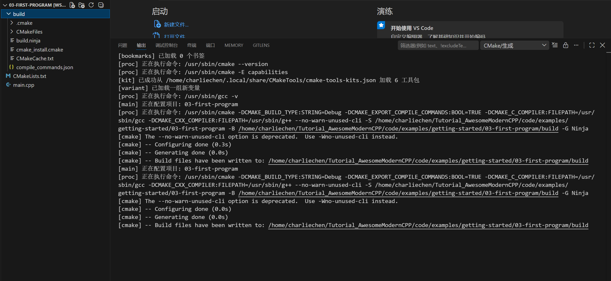
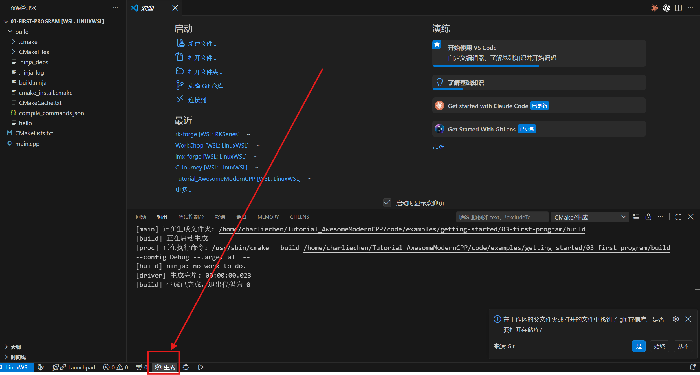

# Your First C++ Program — Get Hello Running in vscode

## Opening

Environment all set up, right? (If not, go back to Part 2 — vscode, MinGW, CMake, and those two extensions all have to be installed.) In this article we get to do something with a touch of ceremony: write your first C++ program with your own hands, actually run it, and make it spit out `Hello, C++!` on the screen.

The whole thing is button clicks inside vscode — you won't type a single command (the command-line way of doing all this sits in a collapsible box at the end; open it if you're curious). Along the way you'll walk a complete mini-project loop: create a folder, write code, write the CMake configuration, configure, build, run. Sounds like a lot of steps, but each one is a single click. Follow along once and you'll have the routine down.

## Step 1: Create a project folder

First, find a place to keep the code you write. Don't dump files straight onto the desktop or the root of the C drive — give it two days and it'll be pure chaos. Let's set up a dedicated folder, one per project.

On the desktop (or wherever is handy for you, something like `D:\code\`), right-click and create a new folder, and name it `hello`. Short name, all lowercase, no spaces — those three rules will serve every name you ever pick in code, so build the habit now.

Once the folder is there, open vscode. Click the menu `File → Open Folder`, select the `hello` folder you just made in the dialog that pops up, and click "Select Folder".

After it opens, an Explorer panel appears on the left side of vscode, titled `hello`, with nothing underneath — because the folder is empty. That's exactly right: we're going to fill it from scratch.

::: tip The "Open Folder" step is not a pointless extra
vscode isn't like Notepad — it works in terms of projects. You have to tell it "I'm working inside the hello folder from here on", and only then does it wire extensions, CMake, debugging, and the rest up to that folder. You can drag a `.cpp` file into vscode and edit it, sure, but the whole CMake pipeline further down the road won't work. So every time you start a new project, step one is always "Open Folder".
:::

## Step 2: Create main.cpp

To the right of the `hello` title in the Explorer panel on the left, there's a row of small icons. Hover the mouse over them: the first one, which looks like a blank sheet of paper with a plus sign on it, is "New File" (hovering shows the tooltip `New File`). Click it.

After the click, a small input box appears in the panel asking for a file name. Type `main.cpp` and press Enter.

Why `main`, and why the `.cpp` extension? `main` is the conventional name — the entry point of a C++ program (where the program starts running) lives in this file, everyone names it that way, and it keeps you from stumbling when talking to other people. `.cpp` is the standard extension for C++ source files; the moment a compiler sees `.cpp`, it knows to compile the file as C++.

Once you press Enter, the main editing area opens `main.cpp` (empty, of course), and a `main.cpp` entry shows up in the Explorer on the left as well.

## Step 3: Paste in the code

Copy the following code in full and paste it into `main.cpp`:

```cpp
#include <iostream>

int main() {
    std::cout << "Hello, C++!\n";
    return 0;
}
```

Once it's pasted, the code in the editor turns colorful — keywords like `int`, `return`, and `#include` get one color, and strings like `"Hello, C++!\n"` get another. This is called syntax highlighting; the previous article mentioned it — this is precisely the editor's job.

A few quick words on what this code does. You don't need to memorize any of it right now; just get on nodding terms with it.

The first line, `#include <iostream>`, pulls in the input/output toolkit that ships with C++. Unpack the name `iostream` and you get input output stream — and that's exactly what it manages: "reading things from the keyboard" and "writing text to the screen".

The `int main()` in the middle is the program's entry point. When a C++ program runs, execution always starts from the first line of the `main` function — no exceptions. Inside the curly braces `{}` is what the program actually does.

`std::cout << "Hello, C++!\n";` writes text to the screen. You can read `std::cout` as the codename of the "screen" object, and `<<` as the arrow that "feeds stuff in", delivering the text on its right to the screen to be shown. `\n` is a newline character; after the output, it moves the cursor to the next line.

`return 0;` tells the operating system "this program finished normally, nothing went wrong". 0 means normal, non-zero means something's wrong — this convention will come in handy later; for now, just know that 0 is good.

## Step 4: You also need a CMakeLists.txt

With the code written, you might think: "Can't I just click that triangle Run button and be done with it?"

Nope. This step trips up a lot of beginners, so let me explain why up front.

The Run button built into vscode (or pressing `F5`) doesn't know which compiler you want to use, which files to compile, or what the resulting program should be named — it knows nothing. Hand it a bare `main.cpp` and it just stares back, lost. We need to write a separate "instruction manual" that tells it all of these things. The file this manual goes in is called `CMakeLists.txt`, and it's CMake that reads it.

(Some will ask: didn't Part 1 say the compiler can just compile directly? Right — invoking `g++ main.cpp` directly on the command line does produce a binary. But vscode's graphical button workflow goes down the CMake track, and since we're clicking buttons in vscode, we follow CMake's rules. CMake can also manage multi-file projects, as we'll see in Part 4.)

Next to `main.cpp`, using the same "New File" icon from Step 2, create another file, named `CMakeLists.txt` (watch the capitalization: `C` and `M` uppercase, the `L` of `Lists` uppercase, everything else lowercase, extension `.txt`). CMake dictates this name to the letter — one letter off and it won't recognize the file.

Paste the following in:

```cmake
cmake_minimum_required(VERSION 3.20)
project(hello LANGUAGES CXX)

set(CMAKE_CXX_STANDARD 17)
set(CMAKE_CXX_STANDARD_REQUIRED ON)

add_executable(hello main.cpp)
```

What do these five lines mean? Here's the line-by-line translation:

Line one, `cmake_minimum_required(VERSION 3.20)`, says "the CMake version running this project must be at least 3.20". 3.20 is a fairly old floor, and the overwhelming majority of machines satisfy it. CMake uses this line to check whether your installed CMake is new enough.

Line two, `project(hello LANGUAGES CXX)`, says this project is named `hello` and its language is C++ (`CXX` is CMake's code name for C++ — C is `C`, C++ is `CXX`).

Line four, `set(CMAKE_CXX_STANDARD 17)`, says "use the C++17 version of the standard". C++ has kept evolving these past years — C++11, 14, 17, 20, 23 all exist, and the newer ones add more features. 17 is a solid version that almost every project can at least use, so that's where we start.

Line five, `set(CMAKE_CXX_STANDARD_REQUIRED ON)`, says "the standard above is not a suggestion, it's a hard requirement". If the compiler doesn't support C++17, you get a straight-up error instead of a silent downgrade to an older standard — a downgrade you'd never know about, and later you'd be stepping into pits without a clue why.

The last line, `add_executable(hello main.cpp)`, is the most critical one. `add_executable` means "produce an executable program"; inside the parentheses, the first `hello` is the name of the program to generate, and the second `main.cpp` is the source file to compile. The line as a whole says: compile `main.cpp` into an executable program named `hello` (`hello.exe` on Windows).

> Note:
> Do not place CMake projects under a path containing Chinese characters, or you will run into all kinds of strange problems (some toolchains' path handling only supports ASCII).
> Also confirm that `mingw32-make` is installed; if the compiler isn't auto-selected (the status bar shows `No Kit Selected`), press `Ctrl+Shift+P` to open the command palette, type `CMake: Select a Kit`, press Enter, and pick one.

## Step 5: Pick a kit

Remember that extra chunk that appeared in vscode's bottom status bar after installing the two extensions in Part 2? Time to put it to use.

Click the spot in the status bar that reads `No Kit Selected`. Clicking it pops up a small list. Alternatively, press `Ctrl+Shift+P` to open the command palette, type `CMake: Select a Kit`, and press Enter — same effect.

The popup lists every compiler vscode found on your machine. You should see an entry like `GCC 16.1.0 x86_64-w64-mingw32` or `GCC x.x.x ucrt64` (the exact version number depends on which MinGW build you installed). Pick that GCC one.

Once selected, the status-bar text changes to something like `GCC 16.1.0`, showing which compiler is currently active.

"Kit" is the CMake Tools extension's term for this; you can think of it as a toolbox — it tells CMake Tools "compile with this compiler from now on". You only pick once; every time you open this project later, it remembers.

::: warning What if GCC isn't in the list
If GCC is nowhere in the list and you only see entries like `Visual Studio`, it means the MinGW step in Part 2 didn't go right — either it wasn't installed properly, or it was but PATH isn't set correctly, so CMake Tools can't find it. Go back and check Part 2, Step 2: focus on whether the path `C:\msys64\ucrt64\bin` was correctly added to the system PATH, and on whether you restarted vscode (PATH changes only take effect in vscode after a restart).

There's usually also an `[Unspecified]` line at the bottom of the list — it means "don't specify". Don't pick that one for now; we want GCC explicitly selected.
:::

With the kit chosen, here comes the good news: the moment Select a Kit finishes, configuration starts up automatically, nice and smooth:



What is the configure step doing? CMake reads your `CMakeLists.txt` and, following the instructions inside, generates a pile of "build files" (a `build` subfolder appears under the `hello` folder, and everything goes in there). This step has **not compiled your code yet** — it's CMake doing prep work: arranging which compiler to use, which files to compile, and what to generate. The actual compilation comes in the next step.

::: tip When configure needs a rerun
From now on, whenever you change `CMakeLists.txt` (say, adding a new source file), you have to rerun configure once for CMake to pick it up again. Changing only `.cpp` files needs no rerun — CMake notices those automatically.
:::

## Step 6: Build

With configuration done, click the Build button in the status bar. Or use `CMake: Build` in the command palette.



The output pane scrolls text again, but the content is different now — this is the compiler actually working. You'll see lines like `Building CXX object ... main.cpp.o` and `Linking CXX executable hello.exe`. The last line reports "Build finished" or a similar success message.

At this point, your `main.cpp` has truly been translated into `hello.exe`. It's sitting in the `hello\build\` folder. The next step is to get it running.

::: warning What if something errors out
The most common error is that the compiler can't be found, or the compiler path is wrong — go back to Step 5 and pick the kit again. Another common one is a typo in the `main.cpp` file name (typing `mian.cpp`, say), so CMake can't find the file. Error messages usually spell out which line is unhappy; just line them up and compare. After fixing it, click Build again.
:::

## Step 8: Run

There's a triangular play button on the status bar — that's Run. Careful not to hit the one next to it with the little bug icon: that's Debug, which drops you into debugging mode; we don't need it yet.

Click Run. A terminal panel pops up at the bottom of vscode (if it doesn't, press `` Ctrl+` `` to bring it up), and one line gets printed inside:

```text
Hello, C++!
```

And there it is — your first C++ program, actually running. That one line went from code to characters on the screen, through the full pipeline of "write code → configure → build → run". Every C++ program you write from now on follows this same routine.

## Step 9: Tweak it and run again

Getting it to run once doesn't count as being fluent yet. Let's change the code and run it again, until the loop feels smooth.

Go back to `main.cpp` and change the `Hello, C++!` line to something else you want to say — for example:

```cpp
#include <iostream>

int main() {
    std::cout << "我学会了写 C++！\n";
    return 0;
}
```

Save (`Ctrl+S`). Note that after saving, the little white dot next to the file name in the status bar disappears — that means the change has landed on disk.

Then just click Run in the status bar. CMake Tools automatically rebuilds first (it noticed the `.cpp` changed), then runs. This time the terminal prints:

```text
我学会了写 C++！
```

From now on, changing code is exactly this routine: edit, save, click Run. The configure and build steps in between, CMake Tools wires up for you automatically.

::: details Click to expand: how to do it from the command line
All those buttons you clicked are, underneath, just running a few commands. Let's run them by hand in the vscode terminal so you know what's behind the buttons.

Open the vscode terminal (menu Terminal → New Terminal, or the shortcut `` Ctrl+` ``). The first build is three commands:

```bash
cmake -B build
cmake --build build
.\build\hello.exe
```

The first, `cmake -B build`, is "configure" — it generates the build files under the `build` folder (`-B` specifies the output directory).

The second, `cmake --build build`, is "build" — it actually invokes the compiler and compiles `main.cpp` into `hello.exe`.

The third, `.\build\hello.exe`, is "run" — it simply executes that `.exe`.

After later code changes, you only need to rerun the last two (the second automatically recompiles only the changed files; once it finishes, run the third).

If you're on Linux (say you took the apt route from the collapsible box in Part 2), the run command differs slightly:

```bash
cmake -B build
cmake --build build
./build/hello
```

The differences are just two: on Linux, executables aren't forced to carry the `.exe` suffix (CMake generates `hello` instead of `hello.exe` by default), and when executing, the path separator is the forward slash `/` with a `./` prefix.
:::

Your first C++ program is up and running — you walked the whole path from code to that line on the screen. This pipeline (create the project, write code, write CMakeLists, configure, build, run) is one you'll use over and over; run it a few more times and it'll be second nature.

In the next article we grow the project — one `.cpp` is no longer enough to hold it: how to organize multiple files, and how to get them to cooperate.
