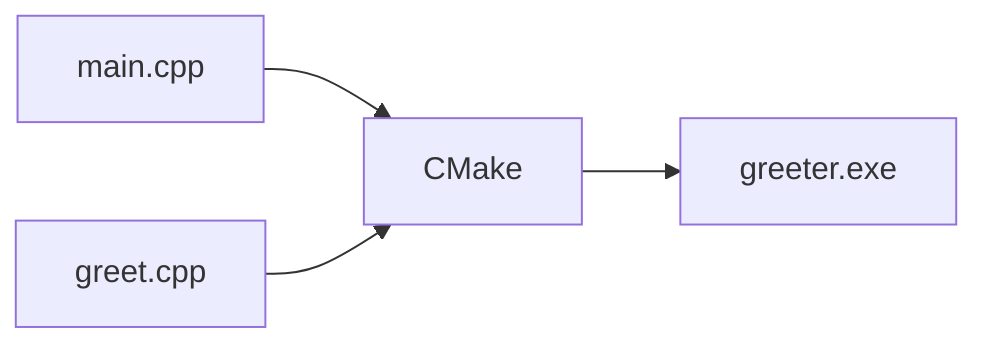

# The Project Grows — Multiple Files, and Why CMake Shows Up

## Opening

Last time we got the first C++ program running inside vscode, and the terminal dutifully printed `Hello, C++!`. But that whole project was just one `main.cpp` with every line of code crammed into a single file. Real projects are never that small. The moment you try to write something serious, the line count climbs, and keeping it all in one file turns into a mess even you can't read.

This time we'll grow the project from "one file" to "three files", and we'll put CMake to real use instead of just dropping its name like we did in part 3. Once a three-file project builds, you'll see exactly what CMake is buying you.

## Why split into files at all

Let's settle the question first: do we have to split files, or is it optional?

It's optional, but try stuffing everything into `main.cpp` and once you're past two or three hundred lines you'll feel the chaos. Hunting for a function means scrolling forever. You change one thing and worry about breaking another. Functions pile on top of each other until you can't see the shape of the code anymore. As the file grows, your blood pressure tends to climb first when debugging.

The common way to split is one file per "kind of feature". For this part we'll build the simplest possible "say hello" feature and put it in its own two files, `greet.cpp` and `greet.h`. `main.cpp` only handles the main flow. Each file minds its own job, and the borders stay clean.

::: details Click to open: what's the deal with .cpp and .h
In C++, one feature usually gets split into two files: a `.h` (header file) and a `.cpp` (implementation file).

The `.h` holds the "declaration". It tells the other files "I have this thing, and here's what it looks like". The `.cpp` holds the "definition", meaning how that thing actually does its work.

When another file wants to use this feature, it `#include`s that `.h`, basically grabbing the "promise note" so it knows what it's allowed to call. How the `.cpp` implements things? The caller doesn't care. The compiler wires it up at link time (we'll get to that below).

It looks fussy, but the payoff is real: change how a feature is implemented, and as long as the "promise note" (the `.h`) didn't change, the other files that call it don't need to be recompiled at all. Once you have a lot of files, the time saved adds up fast.
:::

## Here's what the three files look like

Let's make a new project folder called `greeter` (a little "say hello" program) and put three files inside. You can close the hello project from part 3 if you like, and start fresh in a clean directory.

Create three files with these names and contents. First, `greet.h`. This is the header file, and it declares what the `greet` function looks like:

```cpp
#pragma once
#include <string>

std::string greet(const std::string& name);
```

The `#pragma once` line is the header file's "don't include me twice" switch. It tells the compiler "count this file only once during the whole build. If somebody includes it a second time, skip it". Without this line, if two files both included `greet.h`, the compiler would copy its contents in twice and then throw a "duplicate definition" error at you.

The middle line, `#include <string>`, pulls in the standard library's string type. The `greet` function uses `std::string`, so we have to tell the compiler what that is first.

The last line is the function declaration: there's a function called `greet` that takes a `std::string` (named name) and returns a `std::string`. Note the semicolon at the end and the absence of curly braces. This is the "promise note". It says the function exists but says nothing about how it works.

Now `greet.cpp`. This file does the implementation:

```cpp
#include "greet.h"

std::string greet(const std::string& name) {
    return "Hello, " + name + "!";
}
```

The first line, `#include "greet.h"`, pulls in that promise note we just wrote. Note the double quotes `""` instead of angle brackets `<>`: double quotes mean "a header you wrote yourself in this project", angle brackets mean "a system or standard library header". It's a convention, don't mix them up.

Below that is the function definition: it concatenates `"Hello, "`, the name passed in, and `"!"` and returns the result. This is "making good on the promise", telling the compiler exactly how this function does its work. Now we get the curly braces, and inside them is the code that actually does the job.

Finally, edit `main.cpp` to call this function:

```cpp
#include <iostream>
#include "greet.h"

int main() {
    std::cout << greet("world") << "\n";
    return 0;
}
```

`main.cpp` also includes `greet.h`. It wants to use the `greet` function, so it has to grab the promise note first and learn what the function takes in and spits out. Then it calls `greet("world")` and hands the returned string to `std::cout` to print.

Here's a metaphor to help it stick. `greet.h` is a promise note ("there's a function called `greet`, it takes a name, it returns a sentence"). `greet.cpp` is the promise being kept (exactly how the string gets assembled). `main.cpp` is the person using it (grabs it and goes, doesn't care about the details). Three files, each with its own job.

## Hand-compiling gets old fast, enter CMake

The three files are ready. Now the question: how do we compile them into one `.exe`?

Back in the single-file project, the one line that mattered in our `CMakeLists.txt` was:

```cmake
add_executable(hello main.cpp)
```

This line means "produce an executable program called `hello`, with source file `main.cpp`". Now we have three files. Just list them all on this line:

```cmake
add_executable(greeter main.cpp greet.cpp)
```

That pulls `greet.cpp` in too. Changing this one line is enough, nothing else needs to move. The full `CMakeLists.txt` looks like this:

```cmake
cmake_minimum_required(VERSION 3.20)
project(greeter LANGUAGES CXX)

set(CMAKE_CXX_STANDARD 17)
set(CMAKE_CXX_STANDARD_REQUIRED ON)

add_executable(greeter main.cpp greet.cpp)
```

Save those four lines (plus one blank line) as `CMakeLists.txt`, in the project root, sitting next to the three `.cpp` and `.h` files.

Watch the file name capitalization: it's `CMakeLists.txt`, with capital C and capital L, ending in `.txt` not `.cmake`. CMake looks for that exact name by default. Get one letter wrong and it won't find it.

## Run it

Four files ready, let's run it. The flow is exactly the same as last time.

Step one, save all your files. In vscode hit `Ctrl+K` then `S` (or menu File → Save All) and save everything you changed. The trap every beginner falls into is editing a file, not saving it, and then watching the build compile the old contents and wondering why nothing changed.

Step two, configure. Click the "Configure" button in vscode's bottom status bar (or search `CMake: Configure` in the command palette). CMake will scan `CMakeLists.txt` and prepare the build files. If this step passes, a `build` folder shows up in your project directory.

Step three, build. Click "Build" in the status bar (or `CMake: Build`, shortcut `F7`). This is the actual compile. You'll see a stream of output in the terminal. When you spot `[100%]` and `greeter.exe`, it's done.

Step four, run. Click "Run" in the status bar (or `CMake: Run Without Debugging`, shortcut `Shift+F5`).

The terminal prints:

```text
Hello, world!
```

At this point the three-file project runs. `main.cpp` calls the `greet` function implemented in `greet.cpp`, the function assembles the string and returns it, and `main` prints it. The simplest possible multi-file collaboration.

## What CMake actually does for you




Let's stop and think. Without CMake, how would we turn these three files into an `.exe`? You'd have to type something like this on the command line (don't actually run it, this is just so you can see it):

```text
g++ main.cpp greet.cpp -o greeter
```

Three files, you can still about remember that. But say the project has ten or twenty `.cpp` files. That command becomes a long string of file names, and forgetting one means a link error. And every time you change one file, you'd have to rerun the whole command, recompiling the files you didn't even touch, wasting time for no reason.

The two headaches CMake takes off your plate are exactly these:

Which files to compile, and who depends on whom. As long as you list the file names on the `add_executable` line, CMake lines everything else up. `main.cpp` includes `greet.h`, so CMake figures out on its own that `main.cpp` depends on `greet.cpp`, and it wires them together at link time. You don't have to lift a finger.

Whether a change means rebuilding everything. CMake works out "you only changed `greet.cpp` this time, so only recompile that one, reuse the previously built versions of the others". Once the file count grows, this saves you a real chunk of time.

Adding files to the project later comes down to one move: append a file name to the end of the `add_executable` line. Say you add `farewell.cpp`. Change it to `add_executable(greeter main.cpp greet.cpp farewell.cpp)`, click Configure + Build again, and the new file is in. You never have to memorize a single compile command. CMake handles it all.

## What each line of CMakeLists means

Let's translate it line by line, so you have a mental model.

```cmake
cmake_minimum_required(VERSION 3.20)
```

States "the minimum CMake version this project needs is 3.20". CMake itself is old (it's been around since 2000), but a few of the things this tutorial uses need at least 3.20. Set the version too high and an old CMake will refuse to run and tell you straight up. Set it too low and you might be fine for half the build and then crash on some specific command. Setting a floor is the safe move.

```cmake
project(greeter LANGUAGES CXX)
```

States "this project is called `greeter`, and the language is C++". The `CXX` in `LANGUAGES CXX` is CMake's code name for C++ (C is `C`, C++ is `CXX`, because a plus sign isn't legal in a variable name). Once you declare the language, CMake goes off to find a matching compiler (in our case, the g++ we installed).

```cmake
set(CMAKE_CXX_STANDARD 17)
set(CMAKE_CXX_STANDARD_REQUIRED ON)
```

Read these two together. They control "which version of the C++ standard to use". `CMAKE_CXX_STANDARD 17` sets it to C++17. `CMAKE_CXX_STANDARD_REQUIRED ON` means "this standard is a hard requirement". If your compiler is too old and doesn't support C++17, the build fails outright instead of quietly dropping back to an older standard and compiling along (that quiet downgrade is the worst kind, the build passes but the behavior is off, and you only find out after debugging for ages).

```cmake
add_executable(greeter main.cpp greet.cpp)
```

This last line is the one that matters most. It tells CMake "produce an executable program called `greeter`, with source files `main.cpp` and `greet.cpp`". The executable name (`greeter`) and the file names (`main.cpp greet.cpp`) don't have to match. Call it `greeter` if you want, it's your call. The resulting `.exe` will be `greeter.exe`. The `.h` header doesn't belong on this line, it gets pulled into the `.cpp` files through `#include`, and CMake finds it on its own.

## How to do it from the command line

If you'd rather skip the mouse clicks, the command line works too. Open a terminal in the project root (the folder that holds `CMakeLists.txt`):

::: details Click to open: how to do it from the command line
First, open a terminal. On Windows, hit Win+R and type `cmd`. Or, the smoother way: in vscode go to menu Terminal → New Terminal, which opens one right in the project directory. Make sure it's the "MSYS2 UCRT64" terminal (the one we set up in part 2), not a plain cmd. The plain cmd can't find `cmake` or `g++`.

First command, configure (`-B build` means "put the build files in the `build` subdirectory", so the project root stays clean):

```bash
cmake -B build
```

Second command, build:

```bash
cmake --build build
```

After it finishes, the executable lives at `build/greeter.exe` (Windows) or `build/greeter` (Linux/macOS). Run it directly:

```bash
./build/greeter
```

The terminal still prints `Hello, world!`. Clicking buttons and typing commands run the same CMake underneath, the result is identical.

The first time you run `cmake -B build`, it asks which "generator" to use and detects your compiler, and prints a screenful of information. When you see `Generating done` at the end, configuration is done and you can move on to build.
:::

The three-file project runs, and CMake has taken over the annoying chores of "which files to compile, who depends on whom, whether a change needs a rebuild". From here on, no matter how big the project gets, you just keep adding names to the `add_executable` line.

But you may have already noticed an annoyance. In `main.cpp`, click on the `greet` function name wanting to jump to its definition and look at the implementation, and nothing happens. Sometimes `#include "greet.h"` in your code has a red squiggly line under it, even though it compiles fine and the line just won't go away. That's vscode still not knowing where `greet.h` lives or what the `greet` function looks like. We'll fix that in the next part and make the editor catch up.
