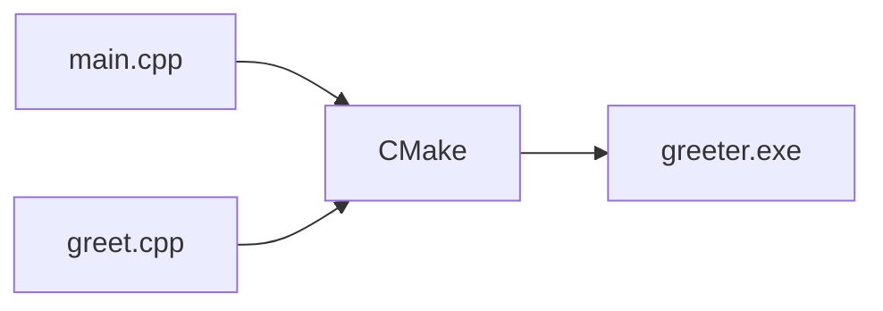

# The Project Grows — Multiple Files, and Why CMake Shows Up

## Opening

Last time we got your first C++ program running in vscode, and the terminal dutifully printed `Hello, C++!`. But that project was one single `main.cpp`, all the code squeezed into a single file. Real projects are never that small. Write anything half-serious and the line count piles up — keep stuffing everything into one file and the mess gets bad enough that even you can't stand to look at it.

This time we'll grow the project from one file to three, and put CMake — which last time got nothing more than a name-drop — to actual work. Once the three-file project builds and runs, you'll see exactly what CMake does for you.

## Why Split Into Files

First, let's settle why we even need to split files. Is it really not optional?

Not splitting works, but try cramming all your code into `main.cpp`: by two or three hundred lines you'll feel the chaos — finding one function means scrolling all over the screen, changing one spot makes you afraid of dragging another down with it, functions squash together into one undifferentiated blob, and your eyes can't pick out any structure. Once a file gets long, your blood pressure climbs before debugging even starts.

The common way to split is one file per kind of functionality. In this article we'll build the simplest possible "greeting" feature, give it two files of its own — `greet.cpp` and `greet.h` — and let `main.cpp` handle only the main flow. Everyone does their own job, in plain view.

::: details Click to see: what .cpp and .h are about
In C++, one feature is usually split across two files: a `.h` (a header file), and a `.cpp` (the implementation file).

The `.h` holds the "declarations", telling other files "I've got this thing here, and this is what it looks like". The `.cpp` holds the "definitions" — how exactly that thing does its work.

When another file wants to use the feature, it `#include`s that `.h` — the equivalent of picking up the "promise note" for a look, to see what it's allowed to call. As for how the `.cpp` implements things, the caller doesn't care one bit; at link time (we'll get to that below) the compiler wires it all up itself.

The machinery looks fussy, but the payoff is real: change how a feature is implemented, and as long as the promise note (the `.h`) hasn't changed, the other files calling it need no recompiling at all. Once the file count grows, the time saved is considerable.
:::

## What the Three Files Look Like

Make a new project folder called `greeter` (a little program that says hi), and put three files in it. You can close the hello project from article 3 and start fresh in a clean directory.

Create the three files with these names and contents. First, `greet.h` — this is the header file, declaring what the `greet` function looks like:

```cpp
#pragma once
#include <string>

std::string greet(const std::string& name);
```

The `#pragma once` line is the header's "no double-including" switch. It means "this file counts only once in the whole compile — anyone including it a second time gets skipped". Without that line, if two files both include `greet.h`, the compiler copies the contents twice and then throws a "duplicate definition" error at you.

The middle line, `#include <string>`, pulls in the standard library's string type. The `greet` function uses `std::string`, so the compiler has to be told what that is first.

The last line is the function declaration: there is a function called `greet` that takes in a `std::string` (the name) and returns a `std::string`. Note that it ends with a semicolon, no braces — this is the "promise note", saying only that the function exists, not how it works.

Next, `greet.cpp` — this file does the implementing:

```cpp
#include "greet.h"

std::string greet(const std::string& name) {
    return "Hello, " + name + "!";
}
```

The first line, `#include "greet.h"`, picks up that promise note we just wrote. Note the double quotes `""` instead of angle brackets `<>`: double quotes mean "a header you wrote yourself in this project", angle brackets mean "a system / standard library header". It's a convention — don't write them backwards.

Below is the function definition: it glues `"Hello, "`, the passed-in name, and `"!"` into one string and returns it. This is "making good on the promise", telling the compiler exactly how the function works. Now the braces appear, and inside them is the code that actually does the work.

Finally, edit `main.cpp` to call the function:

```cpp
#include <iostream>
#include "greet.h"

int main() {
    std::cout << greet("world") << "\n";
    return 0;
}
```

`main.cpp` includes `greet.h` too — it wants to use `greet`, so it first grabs the promise note and learns what the function takes in and spits out. Then it calls `greet("world")` and hands the returned string to `std::cout` to print.

One analogy to help it stick: `greet.h` is the promise note ("there is a function called `greet` that takes in a name and returns a sentence"), `greet.cpp` is the promise kept (how exactly the string gets glued together), and `main.cpp` is the one who just uses it (grabs it and goes, details be damned). Three files, each minding its own duty.

## Compiling by Hand Gets Old — Enter CMake

Three files, ready to go. Now the question: how do we compile them into one `.exe`?

Back in the single-file project, the key line in our `CMakeLists.txt` was just this:

```cmake
add_executable(hello main.cpp)
```

That line means "produce an executable called `hello`, with `main.cpp` as the source file". Now with three files, we only need to list all the sources on that line:

```cmake
add_executable(greeter main.cpp greet.cpp)
```

and `greet.cpp` is in. Changing this one line is enough; nothing else moves. The complete `CMakeLists.txt` looks like this:

```cmake
cmake_minimum_required(VERSION 3.20)
project(greeter LANGUAGES CXX)

set(CMAKE_CXX_STANDARD 17)
set(CMAKE_CXX_STANDARD_REQUIRED ON)

add_executable(greeter main.cpp greet.cpp)
```

Save these lines (plus a blank line) as `CMakeLists.txt`, in the project root, sitting alongside the three `.cpp` / `.h` files.

Mind the filename's capitalization: it is `CMakeLists.txt`, capital C and capital L, ending in `.txt`, not `.cmake`. CMake looks for exactly that name by default — get one letter wrong and it won't recognize the file.

## Getting It to Run

Four files in place, let's run it. The procedure is exactly the same as last time:

Step one, save all files. In vscode, press `Ctrl+K` then `S` (or menu File → Save All) and save every file you've touched. The trap beginners step on most is editing a file without saving, so the build still compiles the old contents — and then you question your sanity over "why didn't it take effect".

Step two, configure. Click the "Configure" button in vscode's bottom status bar (or search `CMake: Configure` in the command palette). CMake scans through `CMakeLists.txt` and prepares the build files. Once this step passes, a `build` folder pops up in the project directory.

Step three, build. Click "Build" in the status bar (or `CMake: Build`, shortcut `F7`). This is the actual compiling — you'll see a stream of output scroll by in the terminal. When the words `[100%]` and `greeter.exe` show up, the build is done.

Step four, run. Click "Run" in the status bar (or `CMake: Run Without Debugging`, shortcut `Shift+F5`).

The terminal will print:

```text
Hello, world!
```

At this point the three-file project runs. `main.cpp` called the `greet` function implemented in `greet.cpp`, the function glued the string together and returned it, and `main` printed it. Multi-file cooperation in its simplest form.

## What CMake Actually Does for You


```mermaid
flowchart LR
    A["main.cpp"] --> C["CMake"]
    B["greet.cpp"] --> C
    C --> D["greeter.exe"]
```

Let's pause and think: without CMake, how would these three files become an `.exe`? You'd have to type a command like this yourself on the command line (no need to actually type it — this is just to show you):

```text
g++ main.cpp greet.cpp -o greeter
```

With three files, that's still memorizable. But if the project has ten or twenty `.cpp` files, that command becomes a long list of filenames — leave one out and linking errors; change one file, and you have to rerun the whole command, recompiling every file you didn't touch and wasting the time.

CMake takes exactly these two headaches off our hands:

Which files get compiled, and who depends on whom — you just list the filenames clearly on the `add_executable` line, and CMake handles the queueing. `main.cpp` includes `greet.h`, and CMake works out by itself that `main.cpp` depends on `greet.cpp`, wiring them together automatically at link time. Nothing for you to manage.

Whether changing one file means rebuilding everything — CMake computes "only `greet.cpp` changed this time, so recompile just it, and reuse last build's output for the rest". As the file count grows, this saves a whole lot of time.

From here on, adding files to the project is one move: append a filename to the end of the `add_executable` line. Say you add a `farewell.cpp` — change it to `add_executable(greeter main.cpp greet.cpp farewell.cpp)`, click Configure + Build again, and the new file is in. You don't have to memorize a single compile command; CMake covers it all.

## What Each Line of CMakeLists Means

A line-by-line walkthrough, so you know where you stand:

```cmake
cmake_minimum_required(VERSION 3.20)
```

Declares "this project requires CMake 3.20 at minimum". CMake itself is quite old (it dates back to 2000), but a few of the idioms used in this tutorial series need at least 3.20. Set the version too high, and an older CMake that can't run it errors out and tells you directly; set it too low, and things may only blow up on some command halfway through. Drawing a baseline is the safest.

```cmake
project(greeter LANGUAGES CXX)
```

Declares "this project is called `greeter`, and the language used is C++". The `CXX` in `LANGUAGES CXX` is CMake's codename for C++ (C is `C`, C++ is `CXX`, because plus signs aren't legal in variable names). Only once a language is declared will CMake go looking for the matching compiler (the g++ we installed).

```cmake
set(CMAKE_CXX_STANDARD 17)
set(CMAKE_CXX_STANDARD_REQUIRED ON)
```

Read these two lines together; they govern "which version of the C++ standard to use". `CMAKE_CXX_STANDARD 17` sets C++17. `CMAKE_CXX_STANDARD_REQUIRED ON` means "this standard is a hard requirement" — if your installed compiler is too old to support C++17, you get an error right away, instead of a silent downgrade to some older standard that quietly keeps compiling (that "silent downgrade" is the nastiest trap: it builds, but behaves wrong, and you only find out after debugging forever).

```cmake
add_executable(greeter main.cpp greet.cpp)
```

The last line is the most crucial one: it tells CMake "produce an executable called `greeter`, with `main.cpp` and `greet.cpp` as the source files". The executable's name (`greeter`) and the filenames (`main.cpp greet.cpp`) don't have to match — if you feel like calling it `greeter`, call it `greeter`. The resulting `.exe` is `greeter.exe`. The `.h` header doesn't need to be listed here; it enters the `.cpp` files through `#include`, and CMake can find it on its own.

## Doing It from the Command Line

If clicking buttons isn't your thing, going all-command-line works too. Open a terminal in the project root (the level where `CMakeLists.txt` lives):

::: details Click to see: doing it from the command line
First, open a terminal. On Windows, press Win+R and type `cmd` — or the handier way: in vscode, menu Terminal → New Terminal opens one right in the project directory. Please make sure it is the "MSYS2 UCRT64" terminal (the one article 2 installed), not a plain cmd — plain cmd can't find `cmake` or `g++`.

First command, configure (`-B build` means "put the build files in the `build` subdirectory", keeping the project root from getting messy):

```bash
cmake -B build -S . -G Ninja
```

Second command, build:

```bash
cmake --build build -j
```

After the build, the executable lives at `build/greeter.exe` (Windows) or `build/greeter` (Linux/macOS). Run it directly:

```bash
./build/greeter
```

The terminal prints `Hello, world!` just the same. Clicking buttons or typing commands — it's the same CMake running underneath, same results.

`-G Ninja` selects the Ninja generator; CMake writes the build files Ninja needs into the `build` directory. `cmake --build build -j` then calls Ninja to carry out the build — you never have to type `ninja` yourself. If you switch to MinGW Makefiles instead, run `cmake -B build -S . -G "MinGW Makefiles"` in a Windows `cmd` where `mingw32-make` can be found; the two generators should not share the same `build` directory — when switching, delete the old directory and reconfigure. For more on generator requirements, see the [CMake official documentation](https://cmake.org/cmake/help/latest/manual/cmake-generators.7.html).

The first time you configure, CMake detects the compiler and shows the generator. When you see `Generating done` at the end, configuration succeeded and you can go on to build.
:::

The three-file project runs, and CMake has taken over the headaches of "which files to compile, who depends on whom, whether a change forces a rebuild". However much bigger the project gets later, growing it is just adding names to the `add_executable` line.

But you may have already spotted an annoyance: click the `greet` function name in `main.cpp`, wanting to jump to its definition and peek at the implementation — the jump doesn't happen; and the `#include "greet.h"` line sometimes wears a red squiggly that just won't go away, even though the build clearly passes. That's vscode still not knowing where `greet.h` is or what the `greet` function looks like — the next article fixes exactly that, and brings the editor up to speed too.


::: details Click to see: want a bit more CMake

- [runoob · CMake Tutorial](https://www.runoob.com/cmake/cmake-tutorial.html) — Don't turn your nose up at it just because of the "rookie" in its name; it is genuinely friendly to absolute beginners, and it explains clearly what CMake is and how CMakeLists are written
:::
