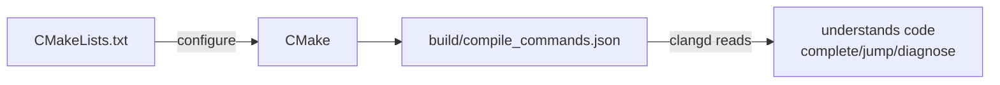

# Making vscode Understand Your Code: Install clangd, Watch the Red Lines Vanish

## Opening

In Part 4 we got the three-file project building, and that moment when the terminal printed `Hello, world!` probably felt pretty good. But once you start writing a few more lines in vscode, you'll most likely run into some annoying stuff.

The `#include <iostream>` line keeps drawing a red wavy underline, even though the build passes. You hold `Ctrl` and click on the `greet` function name, wanting to jump to its definition for a look, and the cursor just blinks and goes nowhere. You type `std::` and no completion list pops up, so you're stuck typing every letter by hand.

You didn't write anything wrong. The compiler (g++) says it's all fine. The problem is that vscode hasn't "understood" your project yet. It doesn't know where the `greet` function lives, doesn't know what can come after `std::`, so it can't help you. In this part we fix it in three steps and make the editor smart along with you.

## Why this happens

Let's clear one thing up first: vscode itself doesn't actually understand C++.

vscode is a general-purpose editor. It can write Python, write web pages, write JSON; anyone can plug things into it. Out of the box it carries no "understanding" of any single language. That has to come from extensions (you can think of them as plugins). Back in Part 2, when we set up the environment, you installed an extension called C/C++. That's the official one from Microsoft. Once it's in, vscode understands a little C++: it can highlight, complete, and debug.

The catch is that the C/C++ extension only "understands" so much. It has its own logic for analyzing C++ code, and the accuracy is just okay. On any project that's even slightly complex it tends to get things wrong, painting red lines on code that compiles fine, or jumping to the wrong place. You've probably already felt the sting of being "scolded for nothing."

The common practice in the C++ community nowadays is to swap in a stronger tool to handle the "make the editor understand the code" job. That tool is called clangd.

clangd comes from the LLVM project (an open-source compiler toolchain, the same kind of thing as GCC) and does exactly one job: make editors understand C++ code. Its analysis engine is the same one the Clang compiler uses, so it's a notch more accurate than the C/C++ extension, and its jump-to-definition, completion, and error reporting are all more reliable. In this part we swap it in.

## Three steps to fix it

Fixing this takes three steps. We'll go one at a time.

### Step 1: Make CMake generate a "translation cheat sheet"

clangd needs a file called `compile_commands.json` to understand your project. The name is long, don't bother memorizing it. Think of it as a "translation cheat sheet": it records, for every `.cpp` file in the project, which compiler is used, which C++ standard, and which headers get pulled in. With this cheat sheet in hand, clangd knows how to interpret each line of your code.

You don't write this file by hand. You just let CMake spit it out on the side. Open the `CMakeLists.txt` of the `greeter` project from Part 4, and add one line right below the `project` line:

```cmake
set(CMAKE_EXPORT_COMPILE_COMMANDS ON)
```

After the addition, the full `CMakeLists.txt` looks like this:

```cmake
cmake_minimum_required(VERSION 3.20)
project(greeter LANGUAGES CXX)

set(CMAKE_EXPORT_COMPILE_COMMANDS ON)

set(CMAKE_CXX_STANDARD 17)
set(CMAKE_CXX_STANDARD_REQUIRED ON)

add_executable(greeter main.cpp greet.cpp)
```

::: tip Plain-English translation
`CMAKE_EXPORT_COMPILE_COMMANDS ON` means "when you configure, also drop a compile_commands.json into the build directory on the side." This switch is off by default, so you have to turn it on yourself.
:::

Save `CMakeLists.txt`, then click "Configure" in vscode's bottom status bar (you need to reconfigure for it to regenerate). After configuring, the `build` folder of your project will contain a new `compile_commands.json` file. That's the cheat sheet clangd wants.

::: warning You need the CMake Tools extension to click the status bar
If your status bar has no Configure button, you missed the CMake Tools extension back in Part 2. Go install it, then reopen vscode. Running `CMake: Configure` from the command palette (`Ctrl+Shift+P`) triggers the same action.
:::

### Step 2: Install the clangd extension

The cheat sheet is ready. Now bring in the real "reader."

In vscode, click the extensions icon on the left activity bar (the one with four squares, shortcut `Ctrl+Shift+X`), and type `clangd` in the search box. You'll see an extension published by LLVM, named simply clangd. Click Install.

::: warning Before installing the extension, make sure you have the clangd program on your machine
The extension is just a "remote control." The thing that actually does the work is a program on your computer called `clangd` (sometimes `clangd.exe`). Installing only the extension without the program is like having a remote with no TV. Nothing turns on.

The fastest way to check whether the program is on your machine is to open a terminal and run `clangd --version`:

- If it prints a version string (like `clangd version 18.x.x`), you have it. Skip ahead to Step 3.
- If you get "is not recognized as an internal or external command" or "command not found", it isn't installed. Use the collapsible box below to install it.

Windows users take note: in Part 2 we installed the MSYS2 + g++ toolchain, and that doesn't include clangd. clangd ships with the LLVM bundle, so you have to install it separately.
:::

::: details Click to see: how to install the clangd program on each platform
There are two routes on Windows.

The first route continues from the MSYS2 setup in Part 2, and is the least hassle. Open the "MSYS2 UCRT64" terminal (the one from Part 2) and run:

```bash
pacman -S mingw-w64-ucrt-x86_64-clang-tools-extra
```

After it finishes, clangd lives in `C:\msys64\ucrt64\bin`, the same directory as the g++ from Part 2. The PATH is already set up, so you can use it right away.

The second route is to install the standalone LLVM bundle using winget (built into Windows 10 and later). Open PowerShell or cmd and run:

```bash
winget install LLVM.LLVM
```

After it finishes, LLVM's tools land in `C:\Program Files\LLVM\bin`. This path isn't on the system PATH by default, so either add it to PATH (so the terminal can find clangd from anywhere) or, once the vscode clangd extension is installed, manually point the extension's setting at the clangd.exe path. The extension usually finds it on its own; set it manually only if it can't.

Pick one of the two routes. If you use scoop or chocolatey, the commands are `scoop install llvm` and `choco install llvm` respectively.

On Linux (Debian/Ubuntu family), just use apt:

```bash
sudo apt install clangd
```

On Fedora it's `sudo dnf install clang-tools-extra`, and on Arch it's `sudo pacman -S clang`.

On macOS, use Homebrew:

```bash
brew install llvm
```

::: tip There's a gotcha on macOS
The `clang` that ships with macOS (from Xcode Command Line Tools) doesn't come with clangd. Just having the system clang isn't enough. You have to `brew install llvm` to get the full LLVM, then add `/opt/homebrew/opt/llvm/bin` (Apple Silicon) or `/usr/local/opt/llvm/bin` (Intel) to PATH, or the terminal still won't find clangd.
:::
:::

### Step 3: Turn off the C/C++ extension's code understanding

This is the easiest step to skip, and the most important.

Right now there are two extensions in vscode both trying to analyze your C++ code: the C/C++ extension from Part 2, and the clangd you just installed. With both working at once they'll fight each other. The completion list might pop up twice, jump-to-definition might land in two different places, and red lines get drawn all over. We split the labor: clangd handles "understanding the code" (completion, jump-to-definition, error reporting), and the C/C++ extension stays on debugging duty (we'll need it in Part 6; clangd doesn't do debugging).

What you need to do is turn off the C/C++ extension's code-understanding feature. Open the settings page: menu File → Preferences → Settings, or just `Ctrl+,`. In the search box type `C_Cpp: Intelli Sense Engine` (IntelliSense is the English name for "smart hints"), and change its value from the default `Default` to `disabled`.

If clicking through the settings page feels like a hassle, you can also edit the config file directly. Create a `.vscode` folder in the project root, put a `settings.json` inside it, with this content:

```json
{
    "C_Cpp.intelliSenseEngine": "disabled"
}
```

::: tip The two ways are equivalent
Editing the settings page changes vscode's global config (applies to all projects); writing `settings.json` changes this project's config (applies only to the current project). Either works for beginners. The advantage of `settings.json` is that it travels with the project. Open this project on another computer, and the setting is still there.
:::

After the change, you should see a `clangd` label in vscode's bottom-right status bar (before it might have said `C/C++` or `C/C++ IntelliSense`). That tells you clangd is now in charge of code understanding.

## See the magic

With the three steps done, reopen `main.cpp` (or just click somewhere in the editor to make it refresh). You'll most likely see all of these happen at once:

The red wavy underline on the `#include <iostream>` line is gone.

You hold `Ctrl` and click the `greet` function name, and the cursor zips over to the line where the function is defined in `greet.cpp`.

Inside `main` you type `std::`, and a completion list pops up showing things from the standard library like `cout`, `endl`, and `vector`.

Before, vscode couldn't read it. Now it can. The whole difference is one `compile_commands.json` plus one clangd.

## What just happened, really




Let's step back and walk through the whole story.

The clangd program is, at its core, an assistant that "reads code on behalf of the editor." To do its job it needs to know two things: which C++ standard your code uses (C++17? C++20?), and which headers each `.cpp` pulls in. Without those, it's working in the dark. It can't even recognize what `std::string` is, so naturally it just paints the code full of red lines.

These two pieces of information are exactly what the compiler already used once during the build. When CMake configured, it had already settled on C++17 and already knew that `main.cpp` includes `greet.h`. That `CMAKE_EXPORT_COMPILE_COMMANDS ON` line tells CMake to copy this compilation information down verbatim and write it out as a `compile_commands.json` file that clangd can read.

The first thing clangd does after starting up is search upward from the `.cpp` file you opened, looking for `compile_commands.json`. If it finds one, it reads it in. With this cheat sheet, it knows exactly how to interpret each file, so completion, jump-to-definition, and error reporting are all accurate. Without that file, or if the file is out of date (you changed `CMakeLists.txt` but didn't reconfigure), clangd gets confused and the red lines come back.

So from now on, when you hit "compiles fine but clangd paints red lines," your first reaction shouldn't be to doubt your code. Click Configure again and let CMake refresh the cheat sheet.

## Collapsible: what compile_commands.json looks like

You don't need to understand every field. Just skim it to get the idea. Open `build/compile_commands.json` and inside you'll find a JSON array, one entry per `.cpp` file:

```json
[
  {
    "directory": "D:/code/greeter/build",
    "command": "C:\\msys64\\mingw64\\bin\\c++.exe ... -std=gnu++17 ... D:/code/greeter/main.cpp",
    "file": "D:/code/greeter/main.cpp"
  },
  {
    "directory": "D:/code/greeter/build",
    "command": "... D:/code/greeter/greet.cpp",
    "file": "D:/code/greeter/greet.cpp"
  }
]
```

What the three fields mean:

`directory` is the directory the file was compiled in, usually your `build` folder. `command` is the full compile command, containing the compiler path, `-std=gnu++17` (the C++ standard used), and all the header search paths. clangd uses this to reconstruct the compiler's point of view. `file` is the source file this record corresponds to.

Once clangd reads it in, it's effectively "standing where the compiler stands" and re-reading your code, so what it can determine matches the compiler: anything that compiles won't get a red line.

## Collapsible: reconfiguring from the command line

::: details Click to see: how to do it from the command line
If you prefer typing commands, the configuration is the same as before. Open a terminal in the project root:

```bash
cmake -B build
```

CMake will re-read `CMakeLists.txt` (this time carrying that `EXPORT_COMPILE_COMMANDS` line) and refresh the contents of the `build` directory, including `compile_commands.json`.

If you'd rather not change `CMakeLists.txt`, you can also pass a temporary flag on the configure command to achieve the same effect:

```bash
cmake -B build -DCMAKE_EXPORT_COMPILE_COMMANDS=ON
```

The effect is the same as writing `set(CMAKE_EXPORT_COMPILE_COMMANDS ON)` in `CMakeLists.txt`. The difference is that the latter travels with the project (it still works on another computer), while the former only applies to this one configure run. In this tutorial we recommend writing it into `CMakeLists.txt` so it's done once and for all.
:::

## clangd or the C/C++ extension

By now you might be wondering: so what's the C/C++ extension there for? Can I uninstall it?

The division of labor in this tutorial goes like this: code understanding (highlighting, completion, jump-to-definition, error reporting) belongs to clangd, because it's more accurate; debugging (breakpoints, stepping, inspecting variables) belongs to the C/C++ extension, because that part is more mature, and Part 6 is dedicated to it. The two extensions split the work and each mind their own area, so they don't fight. That's why Step 3 only turned off the C/C++ extension's IntelliSense and didn't ask you to uninstall it.

::: tip Aligning with the older articles
In the old vol1 articles of this tutorial, we once recommended using the C/C++ extension for code understanding. clangd has matured over the past few years, and once its accuracy surpassed the C/C++ extension, the community broadly switched to clangd. Treat this article as the current one. That section in the old article is outdated.
:::

Up to this part, your vscode has had two skills: it can build (the CMake Tools from Part 3 and Part 4, in charge of turning `.cpp` into `.exe`), and it can understand code (the clangd from this part, in charge of completion, jump-to-definition, and error reporting). The two foundations for writing C++ smoothly are both laid.

From here you can head in several directions: if you want to know how to debug your code step by step when something goes wrong, the next part covers debugging; if you want to write a few more lines and see what C++ can actually do, you can start poking into the main volumes. The foundation is solid. Now you build on top.
