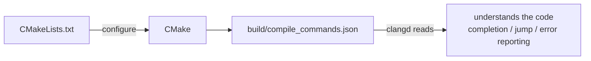

# Make vscode Understand Your Code — Install clangd, Watch the Red Squiggles Vanish

## Opening

In part 4 we got the three-file project building, and the moment the terminal printed `Hello, world!` probably felt pretty great. But write a few more lines in vscode and you'll most likely bump into a few annoyances:

The `#include <iostream>` line keeps getting a red wavy underline even though the build clearly passes; you hold `Ctrl` and click the `greet` function name, hoping to jump to its definition for a look, and the cursor just blinks and nothing happens; you type `std::` and no completion list pops up, so you're left typing every letter by hand.

You didn't write anything wrong — the compiler (g++) says everything's fine. It's that vscode hasn't yet "understood" your project. It doesn't know where the `greet` function lives, and it doesn't know what can follow `std::`, so it can't help. In this part we cure it in three steps and let the editor wise up along the way.

## Why This Happens

Let's get one thing straight first: vscode, the software itself, doesn't actually understand C++.

vscode is a general-purpose editor — it edits Python, web pages, JSON, and anyone can plug things into it. It ships with no built-in "understanding" of any language; that has to be patched in by extensions (you can think of them as plugins). Back in part 2, while setting up the environment, you installed an extension called C/C++ — the one officially from Microsoft. With it in place, vscode understands a little C++: it can highlight, complete, and debug.

The problem is, this C/C++ extension only "understands" so much. It has its own logic for analyzing C++ code, with mediocre accuracy — on any slightly complex project it keeps making wrong calls, painting red lines on code that compiles fine, or jumping to the wrong place. You may have already tasted the particular frustration of being scolded when you did nothing wrong.

The common practice in the C++ community nowadays is to swap in a stronger tool for the "make the editor understand the code" job. That tool is called clangd.

clangd comes from the LLVM project (an open-source compiler toolchain, the same kind of thing as GCC) and does exactly one job: making editors understand C++ code. Its analysis engine is the very one the Clang compiler uses, so its accuracy is a good notch above the C/C++ extension's, and its jump-to-definition, completion, and error reporting are all more dependable. In this part we swap it in.

## Three Steps to Fix It

Curing this ailment takes three steps. Let's go one at a time.

### Step 1: Have CMake generate a "translation manual"

clangd needs a file called `compile_commands.json` to understand your project. The name is long — don't bother memorizing it yet. At its core it's a "translation manual": it records, for every `.cpp` file in the project, which compiler is used, which C++ standard, and which headers get pulled in. Only with this manual in hand does clangd know how to interpret each line of your code — and hand you silky-smooth code hints.

You don't write this file by hand; just let CMake spit it out on the side. Open the `CMakeLists.txt` of the `greeter` project from part 4 and add one line below the `project` line:

```cmake
set(CMAKE_EXPORT_COMPILE_COMMANDS ON)
```

With that added, the complete `CMakeLists.txt` looks like this:

```cmake
cmake_minimum_required(VERSION 3.20)
project(greeter LANGUAGES CXX)

set(CMAKE_EXPORT_COMPILE_COMMANDS ON)

set(CMAKE_CXX_STANDARD 17)
set(CMAKE_CXX_STANDARD_REQUIRED ON)

add_executable(greeter main.cpp greet.cpp)
```

::: tip One-line plain-English translation
`CMAKE_EXPORT_COMPILE_COMMANDS ON` means "while configuring, also drop a compile_commands.json into the build directory on the side". The switch is off by default, so you have to turn it on yourself.
:::

Save `CMakeLists.txt`, then click "Configure" in vscode's bottom status bar (you must reconfigure for it to regenerate). Once configuring finishes, the project's `build` folder gains a new `compile_commands.json` file. That's the "manual" clangd wants.

::: warning You need the CMake Tools extension for the status-bar button
If your status bar has no Configure button, you missed the CMake Tools extension back in part 2. Go back and install it, then reopen vscode. Searching `CMake: Configure` in the command palette (`Ctrl+Shift+P`) triggers the same action.
:::

### Step 2: Install the clangd extension

The manual is ready — now bring on the actual "reader".

In vscode, click the extensions icon in the left activity bar (the one with four squares, shortcut `Ctrl+Shift+X`) and type `clangd` into the search box. You'll see an extension published by LLVM, named simply clangd. Click Install.

::: warning Before installing the extension, make sure the clangd program is on your machine
The extension is only a "remote control". The real work is done by a program on your computer called `clangd` (sometimes `clangd.exe`). Installing the extension without the program is like having a remote with no TV — nothing turns on.

The quickest way to tell whether your machine has the program is to open a terminal and run `clangd --version`:

- If it prints a version string (like `clangd version 18.x.x`), you have it — go straight to Step 3.
- If it says "is not recognized as an internal or external command" or "command not found", it isn't installed — install it following the collapsible box below.

A note for Windows users: in part 2 we installed the MSYS2 + g++ toolchain, which doesn't include clangd. clangd rides with the big LLVM bundle, so it has to be installed separately.
:::

::: details Click to expand: how to install the clangd program on each platform
There are two routes on Windows.

The first continues from the MSYS2 setup in part 2 and is the least hassle. Open the "MSYS2 UCRT64" terminal (the one from part 2) and run:

```bash
pacman -S mingw-w64-ucrt-x86_64-clang-tools-extra
```

Once it finishes, clangd lives under `C:\msys64\ucrt64\bin`, the same directory as the g++ you installed in part 2. PATH is already set up, so you can use it right away.

The second route is installing the standalone LLVM bundle with winget (bundled with Windows 10 and later). Open PowerShell or cmd and run:

```bash
winget install LLVM.LLVM
```

Afterwards, LLVM's tools land in `C:\Program Files\LLVM\bin`. That path is not on the system PATH by default, so either add it to PATH (so terminals can find clangd from anywhere), or, once the vscode clangd extension is installed in a moment, point the extension's settings at the clangd.exe path manually. The extension usually finds it on its own; point manually only if it can't.

Pick one of the two routes. If you use scoop or chocolatey, the commands are `scoop install llvm` and `choco install llvm` respectively.

On Linux (Debian/Ubuntu family), just use apt:

```bash
sudo apt install clangd
```

On Fedora it's `sudo dnf install clang-tools-extra`; on Arch, `sudo pacman -S clang`.

On macOS, use Homebrew:

```bash
brew install llvm
```

::: tip There's a gotcha on macOS
The `clang` that comes with macOS (from Xcode Command Line Tools) doesn't include clangd. The system clang alone isn't enough — you must `brew install llvm` to get the full LLVM, and then add `/opt/homebrew/opt/llvm/bin` (Apple Silicon) or `/usr/local/opt/llvm/bin` (Intel) to PATH, otherwise the terminal still can't find clangd.
:::
:::

### Step 3: Turn off the C/C++ extension's code understanding

This is the easiest step to overlook, and the most critical one.

Right now two extensions in vscode both want to analyze your C++ code: the C/C++ extension from part 2, and the clangd you just installed. Working at the same time, they fight: the completion list may pop up twice, jumps may land in different places, and red lines get drawn all over. We give them a division of labor: clangd takes "understanding the code" (completion, jumps, error reporting), while the C/C++ extension stays on debugging duty (part 6 will use it later — clangd doesn't handle debugging).

> One addendum from the author: the clangd extension nowadays checks this by itself — when it spots Microsoft's IntelliSense, it asks whether you'd like to disable it. Say yes.

What you need to do is turn off the C/C++ extension's code-understanding feature. Open the settings page: menu File → Preferences → Settings, or just `Ctrl+,`. In the search box type `C_Cpp: Intellisense Engine` (IntelliSense being Microsoft's name for its code-intelligence feature), and change the value from the default `Default` to `disabled`.

If clicking through the settings page feels like a chore, you can also edit the config file directly. Create a `.vscode` folder in the project root, put a `settings.json` inside it, with this content:

```json
{
    "C_Cpp.intelliSenseEngine": "disabled"
}
```

::: tip The two ways are equivalent
The settings page edits vscode's global configuration (effective for all projects); writing `settings.json` edits this project's configuration (effective only for the current project). Either is fine for a beginner. The advantage of `settings.json` is that it travels with the project: open the same project on another computer, and the setting is still there.
:::

After the change, you should see the word `clangd` in vscode's bottom-right status bar (it may previously have said `C/C++` or `C/C++ IntelliSense`) — that's your sign that clangd is now in charge of code understanding.

## Witness the Magic

With the three steps done, reopen `main.cpp` (or just click somewhere in the editor area to make it refresh). You'll most likely see all of these happen at once:

The red wavy underline on the `#include <iostream>` line is gone.

You hold `Ctrl` and click the `greet` function name, and whoosh — the cursor lands on the function's definition line inside `greet.cpp`.

Inside `main` you type `std::`, and a completion list pops up, listing standard library things like `cout`, `endl`, and `vector`.

Before, vscode couldn't read your code; now it can. The whole difference is one `compile_commands.json` plus one clangd.

## What Just Happened


```mermaid
flowchart LR
    A["CMakeLists.txt"] -->|configure| B["CMake"]
    B --> C["build/compile_commands.json"]
    C -->|clangd reads| D["understands the code<br/>completion / jump / error reporting"]
```

Let's step back and trace the whole story.

The clangd program is, in essence, an assistant that "reads code on behalf of the editor". It needs to know two things before it can work: which C++ standard your code uses (C++17? C++20?), and which headers each `.cpp` pulls in. Without those two, it's completely in the dark — it can't even recognize what `std::string` is, so naturally all it can do is paint the code full of red lines.

And those two pieces of information are exactly what the compiler already went through once while building: at configure time, CMake had already settled on C++17 and already knew that `main.cpp` includes `greet.h`. That `CMAKE_EXPORT_COMPILE_COMMANDS ON` line simply tells CMake to copy all this compile information down verbatim into a `compile_commands.json` file that clangd can read.

The first thing clangd does after starting is search upward from the `.cpp` file you opened for a `compile_commands.json`, and read it in if it finds one. With this manual, it knows precisely how to interpret every file, so completion, jumps, and error reporting are all accurate. Without the file — or with an out-of-date one (you changed `CMakeLists.txt` but didn't Configure again) — clangd gets confused and the red lines come back.

So from now on, when you hit "compiles fine, yet clangd paints red lines", your first reflex shouldn't be to doubt the code — it should be to click Configure again and let CMake refresh the manual.

## Collapsible: What compile_commands.json Looks Like

You don't need to understand every field — a skim to get the idea is enough. Open `build/compile_commands.json` and you'll find a JSON array, one entry per `.cpp` file. Bear in mind this is sample output, by the way — don't touch this file, and you shouldn't be editing it either!

```json
[
  {
    "directory": "D:/code/greeter/build",
    "command": "C:\\msys64\\mingw64\\bin\\c++.exe ... -std=gnu++17 ... D:/code/greeter/main.cpp",
    "file": "D:/code/greeter/main.cpp"
  },
  {
    "directory": "D:/code/greeter/build",
    "command": "... D:/code/greeter/greet.cpp",
    "file": "D:/code/greeter/greet.cpp"
  }
]
```

What the three fields mean:

`directory` is the directory the file was compiled from, usually your `build` folder. `command` is the full compile command, containing the compiler path, `-std=gnu++17` (the C++ standard in use), and all the header search paths — this is what clangd uses to reconstruct the compiler's point of view. `file` is the source file this record corresponds to.

Once clangd reads it in, it's as if it had "stood where the compiler stands" and re-read your code, so its verdicts line up with the compiler's: anything that compiles won't get a red line.

## Collapsible: Reconfigure from the Command Line

::: details Click to expand: doing it from the command line
If you're used to typing commands, configuring works the same as before — open a terminal in the project root:

```bash
cmake -B build
```

CMake re-reads `CMakeLists.txt` (this time carrying that `EXPORT_COMPILE_COMMANDS` line) and refreshes the contents of the `build` directory, `compile_commands.json` included.

If you'd rather not modify `CMakeLists.txt`, you can also pass a temporary flag on the configure command for the same effect:

```bash
cmake -B build -DCMAKE_EXPORT_COMPILE_COMMANDS=ON
```

The effect is the same as writing `set(CMAKE_EXPORT_COMPILE_COMMANDS ON)` in `CMakeLists.txt`; the only difference is that the latter travels with the project (it still works on another computer), while the former applies only to this one configure run. In this tutorial we recommend writing it into `CMakeLists.txt` — done once, good forever.
:::

## clangd or the C/C++ extension

At this point you may be wondering: what is the C/C++ extension even there for — can it be uninstalled?

The division of labor in this tutorial goes like this: code understanding (highlighting, completion, jumps, error reporting) belongs to clangd, because it's accurate; debugging (breakpoints, single-stepping, inspecting variables) belongs to the C/C++ extension, because that part is where it's mature — part 6 covers it in detail. Two extensions, each minding its own patch, no fighting (which is why Step 3 only turned off the C/C++ extension's IntelliSense instead of having you uninstall it).

::: tip Aligning with the older articles
In the old vol1 articles of this tutorial, we once recommended letting the C/C++ extension handle code understanding. clangd has matured over the past few years, and once its accuracy overtook the C/C++ extension's, the community largely switched to clangd. Treat this article as authoritative; that section of the old article is outdated.
:::

As of this part, your vscode has two skills: it can build (the CMake Tools from parts 3 and 4, in charge of turning `.cpp` into `.exe`), and it can understand code (the clangd from this part, in charge of completion, jumps, and error reporting). Both foundations for writing C++ smoothly are laid.

From here, several directions open up: to see how to debug your code step by step when it goes wrong, go read the next part, which covers debugging; to write a few more lines and see what C++ can actually do, you can start browsing the main volumes. The foundation is solid — now build on it.

::: details Click to expand: want to learn a bit more about clangd

- [Using the clangd extension in VS Code](https://www.cnblogs.com/newtonltr/p/18867195) — a detailed walkthrough of installing and configuring clangd (how LSP works + how to use compile_commands.json)
:::
