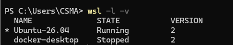
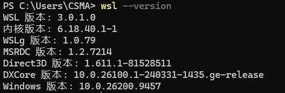
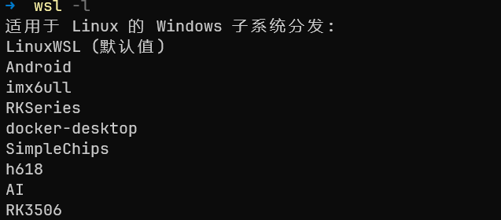
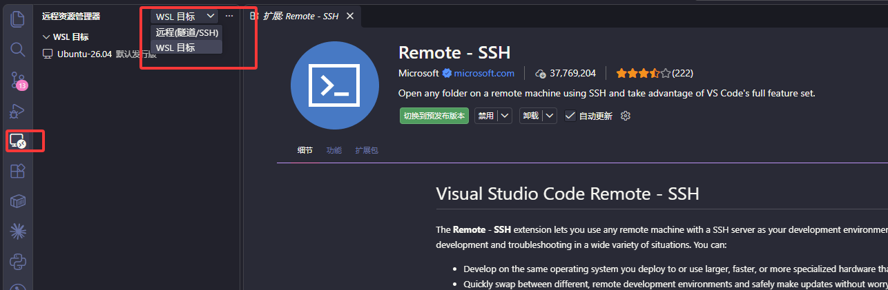

# Want Real Linux — WSL2 + VS Code Environment Setup

> Goals:
>
> - Avoid the tool conflicts that come from mixing Windows and Linux environments (node/npm, python, git and friends) and get a cleaner, more controllable development environment.
> - Switch WSL2 into Mirrored networking mode so it can use the Windows proxy (the "localhost proxy configuration detected, but not mirrored to WSL. WSL in NAT mode does not support localhost proxies" business).
> - Install and use WSL2 on Windows 11, get comfortable with common Linux commands, and do both local (WSL) and remote (SSH) development with VS Code.

# 1. Background: Why WSL?

Some of the old embedded hands might wonder, huh? What's WSL, why use it, why not a virtual machine — this or that question. So here are some notes from the author's own long grind with WSL, for everyone's reference.

WSL is short for Windows Subsystem for Linux. Microsoft's intent is simple: let you run real Linux inside Windows. For embedded development, scripting, build tools, and a lot of open-source tooling, a Linux environment is far friendlier — you don't have to fight a pile of environment-setup obstacles.

At this point someone will say, why not VMWare or VirtualBox (well, that one's basically dead)? The answer is that virtual machines cost you some performance, and the bigger hassle is that stable interoperability takes fiddling. The author remembers it well: one VMWare version bump and the old tricks stopped working; Ubuntu inside VMWare would crash all the time. The stability, frankly, made you sigh.

> Of course, if your work touches the GPU, forget VMWare and friends — those VMs basically can't see your graphics card.

WSL demotes dual-booting and traditional VMs from "must-have" to "fallback". On interoperability, modern WSL beats VMWare-style setups by a mile: from inside WSL's Linux we can reach Windows files directly. Say there's a PDF or a C source file on your D: drive — you can just

```shell
cat "/mnt/d/My Documents/report.pdf"
```

Remember to quote paths that contain spaces, otherwise the shell splits them at the spaces and each piece reports "No such file". Beyond that, zero configuration — it works out of the box, and you can even use the GPU directly.

> USB device access is the exception: you need the open-source usbipd project to fill the gap. Microsoft never brought it into official support, so there's not much to be done. If you need it, go read up on usbipd with your favorite search engine.

---

# 2. Preparation (What You Need)

WSL's nice, so how do you start? Well, to begin your wonderful WSL journey, these are the truly bare-minimum conditions:

- Windows 11 (latest version recommended).
- A user account with administrator rights (the install needs an elevated PowerShell).
- A stable network (the installer downloads files).
- Hardware virtualization in the BIOS (VT-x on Intel, AMD-V on AMD) turned on. Most machines ship with it on; on the odd old machine where `wsl --install` refuses to install, this switch being off is usually why.

---

# 3. Installing and Using WSL2 on Windows 11

**PS: Some outdated tutorials will have you enable Hyper-V first — the author checked, that's no longer needed; enabling "Virtual Machine Platform" is enough.** But WSL's installer pulls in the required features automatically, so don't worry. Just follow along below.

## 3.1 Installing WSL2

**Mind the administrator part**: start Windows PowerShell (right-click "Start" → `Windows Terminal (Admin)` or `PowerShell (Admin)`). In the admin PowerShell, type:

```powershell
wsl --install
```

This command enables the required Windows features (that includes "Virtual Machine Platform"), installs WSL2, and asks you to reboot.

**Shut WSL down** — in PowerShell, run:

```powershell
wsl --shutdown
```

At this point you still need to pick a distribution; there's no Linux distro for you yet, say an Ubuntu or an Arch Linux.

## 3.2 Installing a Distribution

Pick your distribution! Run this command — with the network in good shape (if it isn't, remember your proxy. Setting up a proxy is a risky tutorial, so we won't get into that here~)

```powershell
wsl --list --online
```


1. Choose the distribution to install; this article uses `Ubuntu-26.04` as the example

   ```powershell
   wsl.exe --install Ubuntu-26.04
   ```

2. **Shut WSL down**, in PowerShell:

   ```powershell
   wsl --shutdown
   ```

3. **Re-enter WSL**, just type:

   ```powershell
   wsl
   ```

Over. Enjoy.

## 3.3 Checking and Common Management Commands

WSL will keep us company every day from now on, so knowing a few WSL commands pays off. Installation and the plain off-switch are covered above; here are some other common commands. Run all of them in `PowerShell` or `Windows Terminal`.

### Check Installed Distributions

Start by listing the installed Linux distributions and checking their running state and WSL version:

```powershell
wsl -l -v
```


The `NAME`, `STATE`, and `VERSION` columns show the distribution name, running state, and WSL version. The `*` before a name marks the **default distribution**, which is the one entered by a plain `wsl` command.

### Set the Default Distribution

If several distributions are installed, make the one you use most often the default. For example, set `Ubuntu-26.04` as the default:

```powershell
wsl --set-default Ubuntu-26.04
```

After this, running `wsl` again enters `Ubuntu-26.04`.



> This changes which distribution the `wsl` command enters by default; it does not change the WSL version of any other distribution.

### Check the WSL Component Version

To view the versions of WSL itself, its kernel, and related components, run:

```powershell
wsl --version
```



`wsl --version` reports WSL component information; it cannot by itself tell you whether a particular distribution uses WSL 1 or WSL 2. Go back to `wsl -l -v` and check whether the target distribution's `VERSION` column is `2`.

```powershell
wsl -l -v
```


### Switch a Distribution to WSL2

If `wsl -l -v` shows that a distribution is still using WSL 1, switch it to WSL 2 manually:

```powershell
wsl --set-version Ubuntu-26.04 2
```

Replace `Ubuntu-26.04` with the name of the target distribution. A distribution freshly installed with `wsl --install` uses WSL 2 by default; of course, if your operating system is truly ancient — an early Windows 10 release, say — you'll want to watch out here.

### Temporarily Enter a Different Distribution

If you do not want to change the default distribution, add `-d` (`--distribution`) to `wsl` to enter a specific distribution temporarily:

```powershell
wsl -d Ubuntu-26.04
```

This enters `Ubuntu-26.04` without changing the default setting.

```powershell
wsl -d Ubuntu-24.04
```

This enters `Ubuntu-24.04`, again without affecting the default distribution.

### Stop a Specific Distribution

```powershell
wsl --terminate <distribution-name>
```



Say I need to shut down the running RK3506 — then

```powershell
wsl --terminate RK3506
```

This command safely stops the RK3506 distribution without disturbing the others. To shut down every running WSL instance at once, use the `wsl --shutdown` command introduced earlier.

# 4. Isolating the Windows PATH

Kids, WSL's interoperability is convenient, but it hides a big landmine: sometimes your shell goes and finds your Windows stuff — entries like these end up on the search path:

```bash
/mnt/c/Windows/System32
/mnt/c/Program Files/nodejs
```

They do get searched. Which means the nodejs or gcc you just installed may well resolve to the Windows copy — version mismatches, garbled config resolution, and the project just crashes. The classics:

- Node / npm / pnpm version chaos (Windows copy wins the lookup, you get a pile of baffling errors, and chasing them down may cost you a fair number of tokens :) )
- Python / pip environment pollution
- CLI tools behaving oddly (uncontrollable path precedence)
- DevOps tooling (Docker / Git / CI) doing unpredictable things

For engineering work (full-stack + CI/CD especially), **isolation is strongly recommended**.

## 4.1 Configure `/etc/wsl.conf`

The fix is to add this inside your distribution:

```shell
❯ cat /etc/wsl.conf
[interop]
# This is the line to add. Some will tell you to turn the whole thing off... uh... ever seen someone amputate the leg because it hurts? Same idea
appendWindowsPath = false
```

## 4.2 Restart WSL

This step **is mandatory**. WSL only re-reads the config at startup. In Windows PowerShell:

```powershell
wsl --shutdown
```

## 4.3 Verify

Reopen WSL:

```bash
echo $PATH
```

The expected result contains only Linux paths, for example:

```bash
/usr/local/sbin:/usr/local/bin:/usr/sbin:/usr/bin:/sbin:/bin
```

---

## 4.4 What Does This Change?

| Capability | Change |
| --- | --- |
| Calling Windows programs | ❌ Not directly available anymore (e.g. `explorer.exe` — if you must, give the full path, because the shell no longer searches those places by default; which is exactly what we wanted!) |
| Node / Python environments | ✅ Fully isolated |
| CLI behavior consistency | ✅ Clearly better |
| CI/CD consistency | ✅ Closer to a Linux server |

## 4.5 First Steps Inside Linux (in the Ubuntu Terminal)

Open the freshly installed Ubuntu app from the Start menu. After logging in, update the package index and upgrade first:

```bash
sudo apt update && sudo apt upgrade -y
```

PS: if Linux is new to you, play with these~

| Command | What it does | Notes |
| :--- | :--- | :--- |
| `pwd` | Print the current directory | print working directory; in WSL it usually shows `/home/you` right after opening |
| `ls -la` | List files in the current directory (including hidden ones) | `-l` gives details, `-a` includes entries starting with `.` |
| `cd ~` | Go to your home directory | `~` is `/home/you`; a bare `cd` does the same |
| `mkdir myproj` | Create a folder named `myproj` | make directory; add `-p` to create nested levels at once |
| `cd myproj` | Enter the `myproj` folder | `cd ..` goes up one level |
| `touch hello.c` | Create an empty `hello.c` | If the file exists it only updates the timestamp — content is untouched |
| `nano hello.c` | Open the file in the nano editor | Save: `Ctrl+O` → `Enter`; exit: `Ctrl+X` |
| `cat hello.c` | Print the whole file | Long files flood the screen; use `less hello.c` for those |

Install common tools (example: git, build toolchain, python):

```bash
sudo apt install git build-essential python3 python3-pip -y
```

> Tip: the Windows C: drive lives at /mnt/c inside WSL — C:\Users\you becomes /mnt/c/Users/you. For better performance, keep your code inside WSL's own home directory (~).

# 5. Setting the Global Network Mode to Mirrored

When you develop, you presumably keep a proxy on to reach GitHub, right? Simply put: **with proxy software running on Windows, it opens a local proxy port and all traffic goes through that port**, which is what makes the proxy work. In WSL2 you can point at that address and port by hand so that WSL2 uses the Windows proxy:

```shell
export http_proxy="http://<Windows_IP>:<proxy_port>"
export https_proxy="http://<Windows_IP>:<proxy_port>"
```

But WSL2 has since gained the Mirrored networking mode, with better network compatibility and a much simpler configuration story. If a proxy is running on the host, starting WSL2 now tells you:

> `wsl: A localhost proxy configuration was detected, but not mirrored to WSL. WSL in NAT mode does not support localhost proxies.`
> This article switches WSL2's network mode to Mirrored so that WSL2 can use the Windows proxy.

And Mirrored mode brings these advantages:

- Shared IP: the WSL2 instance and the Windows host use the same IP address
- Simpler networking: no more separate virtual network adapter to manage
- Better compatibility: clears up many of the connection problems with corporate networks, VPNs, and firewalls
- Seamless ports: local ports map automatically, no extra config

## 5.1 Configure `.wslconfig`

> Steps: close all WSL instances, open PowerShell (as administrator), and run:

```powershell
wsl --shutdown
```

Create or edit the .wslconfig file — in your Windows user directory (`%UserProfile%`, typically C:\Users\your-name) create or edit a file named .wslconfig with:

```ini
[wsl2]
networkingMode=mirrored
dnsTunneling=true
firewall=true
autoProxy=true

[experimental]
# Dynamic-ish config; the author isn't sure whether it misbehaves, enable with care~
autoMemoryReclaim=gradual
```

Now, if you're curious what these are, in brief:

```ini
[wsl2]
# Mirrored networking: WSL now sees the network the way your Windows does
networkingMode=mirrored
# DNS tunneling (fixes DNS under proxied networks)
dnsTunneling=true
# Share the Windows firewall settings — safety!
firewall=true
# Inherit the Windows proxy settings automatically
autoProxy=true
```

> Note: `.wslconfig` does not support "trailing comments" — comments must sit on their own line, as above. Worse, if the file's format is wrong, WSL won't complain; it silently ignores the config and starts as usual. The day a setting seems not to take effect, check first whether a comment trailed onto a line.

```ini
[experimental]
autoMemoryReclaim=gradual
```

One more note in passing: the default for `autoMemoryReclaim` is `dropCache` (reclaim immediately); `gradual` is the gentler slow reclaim. And `dnsTunneling`, `firewall`, `autoProxy` already default to on in recent WSL on Windows 11 22H2+ — the line that actually does the work above is `networkingMode=mirrored`.

Restart WSL — just type wsl in PowerShell to bring Ubuntu back up. WSL now shares the network environment with the Windows host, proxy included.

# 6. Developing in WSL with VS Code (Recommended), and VS Code Remote SSH

When you need to connect to a remote dev board or server, this is what you want. The author recommends setting it up as a must!

## 6.1 Developing in WSL with VS Code (Recommended)

Install VS Code on Windows (grab the installer from the official site).
The link is right here: [Visual Studio Code](https://code.visualstudio.com/)
In VS Code, install the extensions: Remote - WSL / WSL (saves you from configuring ssh for WSL)


Method 1 (recommended): In a WSL terminal, enter your project directory and run:

```bash
cd ~/myproj
code .
```



`code .` launches the Windows version of VS Code and connects it to the current WSL distribution through the Remote - WSL extension. The VS Code interface runs on Windows, while the workspace, integrated terminal, extensions, and debugging processes run in WSL. This means you only need to install compilers, debuggers, and other development tools in WSL. The first time you open the project, VS Code may automatically install VS Code Server.

Method 2: If you are currently using Windows PowerShell, run `wsl` first to enter WSL, then run the commands above:

```powershell
wsl
```

This approach requires very little additional configuration and provides an experience close to native Linux.

## 6.2 VS Code Remote SSH (for Dev Boards and Servers)

Later, when you need to reach a remote Linux box at school, work, or home (a Raspberry Pi, a dev board, a server), use VS Code's Remote - SSH extension. The basic steps:

Install VS Code on Windows and the Remote - SSH extension.
Generate an SSH key (works in both Windows PowerShell and WSL):

```powershell
ssh-keygen -t ed25519 -C "your_email@example.com"

# Press Enter to accept the default path (~/.ssh/id_ed25519 and id_ed25519.pub)
```

Copy the public key (~/.ssh/id_ed25519.pub) to the remote host's ~/.ssh/authorized_keys (the remote host must accept SSH logins). You can use ssh-copy-id (available under WSL) or copy by hand:

```bash
# Under WSL:
ssh-copy-id user@remote-host

# Or manually copy the public key into ~/.ssh/authorized_keys on the remote side
```

Configure the host in VS Code's Remote-SSH panel (or via the command Remote-SSH: Connect to Host...), and once connected you can edit, run, and debug remote files as if they were local.

# Appendix A: References

## A.1 Official Microsoft Documentation

| Topic | Link |
| --- | --- |
| Installing WSL | [Install WSL](https://learn.microsoft.com/en-us/windows/wsl/install) |
| WSL basic commands | [Basic commands](https://learn.microsoft.com/en-us/windows/wsl/basic-commands) |
| WSL configuration (`.wslconfig` / `wsl.conf`) | [Configure WSL](https://learn.microsoft.com/en-us/windows/wsl/wsl-config) |
| WSL networking | [Configure WSL networking](https://learn.microsoft.com/en-us/windows/wsl/networking) |

## A.2 Third-Party Supplementary Material (Chinese)

| Topic | Link |
| --- | --- |
| Installing WSL | [WSL install tutorial (CSDN)](https://blog.csdn.net/TeleostNaCl/article/details/149058218) |
| WSL config (`.wslconfig` / `wsl.conf`, incl. `networkingMode=mirrored`) | [WSL config and mirrored networking (CSDN)](https://blog.csdn.net/charlie114514191/article/details/156223591) |
| WSL networking and mirrored mode | [WSL networking and mirrored mode](https://jishuzhan.net/article/2042105169136123905) |

---

> Original draft written and contributed by [xiaoshuaijie](https://github.com/xiaoshuaijie) (PR #276). Only necessary technical fixes and image localization were made on intake; the wording stays his.

<ArticleContributors />
