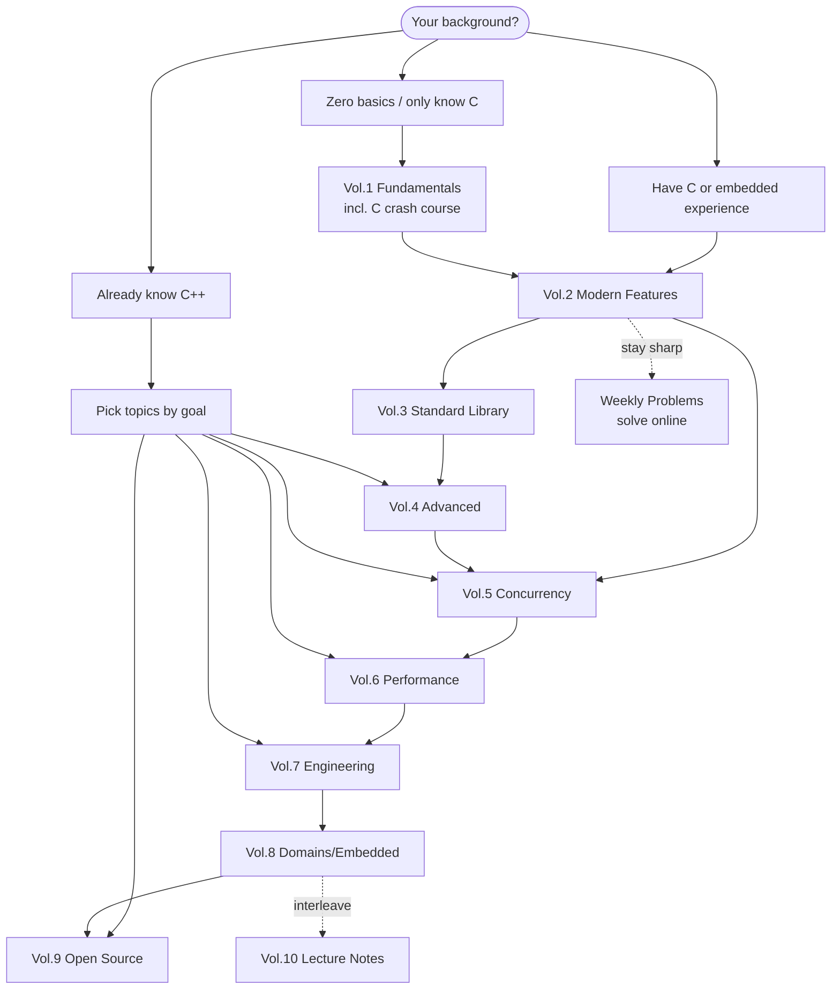

# Learning Roadmap

This tutorial set is a systematic modern C++ learning resource — **ten volumes that take you from first principles all the way to embedded practice**. This roadmap answers exactly three questions: how to learn it, where to start, and what each volume teaches.

Whether you're starting from zero, coming from a C / embedded background, or already writing C++ and looking to round out your engineering skills, the sections below first help you pick a starting point by background, then walk through the volumes one by one.

> This page is the **learning roadmap** (how readers learn). The project's own development progress and planning is a separate matter — see [Content Maturity and Project Roadmap](#content-maturity-and-project-roadmap) at the end of this page.

## How to Use This Roadmap

The whole tutorial is organized along one progressive spine:

```text
Fundamentals → Modern Features → Standard Library → Advanced → Concurrency → Performance → Engineering → Domain Practice
```

A few things to settle up front:

- **This is not a syntax cheat sheet.** Every key concept comes with a compilable CMake example — one you can run, modify, and verify.
- **Volumes depend on each other.** Later volumes assume you've internalized the core of the earlier ones, and **Vol.1 → Vol.2 is the most critical watershed** — once you're through Vol.2, you've truly entered "modern C++".
- **You can skip around.** Readers with relevant background don't need to start from page one of Vol.1 — just pick a starting point via the "three paths" below.
- **Companion resources are one lookup away.** [C++ feature reference cards](/cpp-reference/) (dual-view quick lookup by standard version + feature category), [hands-on projects](/projects/), [lecture notes](/vol10-open-lecture-notes/).

## Three Learning Paths (Pick a Starting Point by Background)



**Path A · Zero basics / only know C** — start at [Vol.1](/vol1-fundamentals/) (includes a complete C crash course). Walking the main line volume by volume is the most solid route — and the longest. Skip strategy: if you already have programming experience, move quickly through the C crash course and sink your teeth into value categories, OOP, and template basics.

**Path B · Have C or embedded experience** — your syntax foundation is enough; go straight into [Vol.2](/vol2-modern-features/) to pick up "modern C++ style", then plunge into [Vol.8 embedded](/vol8-domains/) for real practice. Fill in concurrency (Vol.5), performance (Vol.6), and engineering (Vol.7) as needed.

**Path C · Already know C++** — go straight to the topic that matches your goal: for concurrency/async read [Vol.5](/vol5-concurrency/), for performance read [Vol.6](/vol6-performance/), for engineering read [Vol.7](/vol7-engineering/), to read large codebases go to [Vol.9](/vol9-open-source-project-learn/), to chase the frontier read [Vol.4](/vol4-advanced/).

## Volume-by-Volume Breakdown

### Vol.1 · Fundamentals

- **Role**: build a complete C++ knowledge system from zero — the foundation and starting point of the whole tutorial; comes with a complete C crash course (including embedded-relevant advanced C).
- **Key topics**: environment setup · the type system & value categories · control flow & functions · pointers & references · arrays & strings · classes & object orientation · operator overloading · inheritance & polymorphism · first steps with templates · exception handling · a first look at the STL · memory model basics; the C crash course covers the essence of pointers, structs & alignment, C pitfalls, and embedded C patterns.
- **Level · Prerequisites**: beginner → intermediate / none.
- **Suggested pacing**: read it all if you're starting from zero; if you have a foundation, skip the C crash course and focus on value categories, OOP, and template basics — these determine how smoothly everything after goes. This volume is being rewritten (quick start → full-stack introduction); chapters may shift slightly, but the core topics are stable.

### Vol.2 · Modern Features

- **Role**: systematically master the core C++11/14/17 features — the critical watershed between "can write C++" and "can write modern C++".
- **Key topics**: move semantics & rvalue references · smart pointers & RAII · `constexpr` compile-time computation · lambdas & functional style · type safety (`enum class`/`variant`/`optional`) · structured bindings · `auto`/`decltype` · attributes · `string_view` · `filesystem` · modern error handling (`optional`/`expected`) · user-defined literals.
- **Level · Prerequisites**: intermediate / Vol.1.
- **Suggested pacing**: the pivotal turning-point volume — read it carefully; it determines how smoothly every later volume goes.

### Vol.3 · Standard Library in Depth

- **Role**: implementation details of STL containers and strings, plus performance and the memory-level machinery underneath.
- **Key topics**: `vector` three-pointer representation / growth / iterator invalidation · `string` memory model & small-string optimization · `char8_t` & UTF-8 · `array` · `span` · object size & trivial types · custom allocators.
- **Level · Prerequisites**: intermediate / Vol.1, Vol.2.
- **Suggested pacing**: short but deep — read it carefully on demand, and come back to it when you do performance-sensitive or embedded work. The volume is now complete; the `vector`/`string`/`char8_t` articles are the most solid and make good entry points.

### Vol.4 · Advanced Topics

- **Role**: C++20/23 frontier features and metaprogramming techniques — a rite of passage for anyone writing libraries or high-performance generic code.
- **Key topics**: coroutines (basics + scheduler implementation) · Ranges (views + pipeline practice) · three-way comparison `<=>` · empty base optimization · C++ Modules (MSVC) · designated initializers.
- **Level · Prerequisites**: advanced / Vol.2, Vol.3.
- **Suggested pacing**: read the three blocks — coroutines, Ranges, three-way comparison — first; the template-fundamentals, concepts-system, and reflection blocks are currently blank — planned, to be filled in as the need arises.

### Vol.5 · Concurrency

- **Role**: from thread primitives to coroutine-based async — build complete concurrency judgment: correct before performant, locks before lock-free, synchronous before task-based.
- **Key topics**: thread lifecycle & RAII · mutexes & synchronization primitives (incl. `latch`/`barrier`/`semaphore`) · `atomic` & the six memory orders · lock-free data structures (SPSC/MPMC queues) · `future` & thread pools · coroutines & event loops (the Echo server) · Actor/Channel.
- **Level · Prerequisites**: intermediate-advanced / Vol.1–Vol.4.
- **Suggested pacing**: the heaviest-investment, most hands-on volume in the whole tutorial, with Lab 0–5 + a Capstone (Mini Concurrent Runtime). We strongly recommend doing the Labs by hand — don't just read. Right now Lab 0/1 have complete scaffolding code you can pick up directly, while Lab 2–5 and the Capstone have only handbook text for the moment — scaffolding still to come.

### Vol.6 · Performance

- **Role**: core C++ performance technology — compiler optimization, code-size evaluation, SIMD, and more.
- **Key topics**: inlining & compiler optimization (debunking the "`inline` = performance switch" myth) · performance & code-size evaluation · AVX/AVX2.
- **Level · Prerequisites**: intermediate-advanced / Vol.5.
- **Suggested pacing**: content is expanding; first build up intuition for the cache hierarchy and SIMD, then go deeper topic by topic.

### Vol.7 · Engineering Practice

- **Role**: landing C++ software engineering — builds, cross-compilation, linking, debugging, platform development.
- **Key topics**: CMake & cross-compilation · compiler options · linkers & linker scripts · WSL development · how MSVC debugging works · C++ Modules (VS2026) · file I/O (a file-copier project).
- **Level · Prerequisites**: intermediate / we recommend reading "Compilation & Linking in Depth" first.
- **Suggested pacing**: study it alongside [Compilation & Linking](/compilation/), picking chapters to match your current engineering stack.

### Compilation & Linking in Depth

- **Role**: the low-level mechanics of C/C++ compilation, linking, static/dynamic libraries, and symbol visibility — the foundation of engineering practice.
- **Key topics**: compilation & linking overview · reuse & the concept of libraries · static libraries · dynamic libraries (design principles / symbol visibility / runtime loading / library search logic / making a dynamic library executable).
- **Level · Prerequisites**: intermediate / C++ basics.
- **Suggested pacing**: treat it as the prerequisite to Vol.7 — a must-read before embedded / cross-compilation work. The topics are all in place, but it's still an early import of blog posts, waiting to be rewritten and polished in the project's voice.

### Vol.8 · Domain Applications

- **Role**: modern C++ in real practice across vertical domains — **the main line is embedded**.
- **Key topics**: STM32 (**STM32F1 only, e.g. Blue Pill; no F4 yet**) environment setup · three end-to-end flows — LED / buttons / UART (refactored from the C way all the way to C++23 template wrappers) · zero-overhead abstraction · type-safe register access · embedded patterns such as circular buffers / object pools / intrusive containers · interrupt safety; plus a C++ deep dive (the pointer-semantics series). Sub-domains such as networking / GUI / data storage / algorithms are still in planning.
- **Level · Prerequisites**: intermediate / Vol.1–Vol.7.
- **Suggested pacing**: embedded is the most complete domain line right now — progress peripheral by peripheral; if you have an STM32F1 board on hand, follow along hands-on.

### Vol.9 · Open Source Projects

- **Role**: take industrial-grade open-source projects apart and learn real-world C++ design and implementation.
- **Key topics**: currently focused on Chromium's `OnceCallback` callback component — from motivation, API design, and the core skeleton to `bind_once`, with interleaved deep dives into prerequisites like C++23 `deducing this` and `move_only_function`. More projects are planned.
- **Level · Prerequisites**: intermediate-advanced / Vol.1–Vol.7 (especially Vol.4 and Vol.5).
- **Suggested pacing**: this line is source-reading oriented — we suggest mastering Vol.4's advanced features before coming to read industrial implementations.

### Vol.10 · Courses & Talks

- **Role**: reading notes and secondary creations from talks at CppCon and other technical conferences.
- **Key topics**: currently four CppCon 2025 talks — Bjarne Stroustrup's *Concept-based Generic Programming*, Matt Godbolt's *Some Assembly Required* (reading assembly / Compiler Explorer), Mike Shah's *Back to Basics: Ranges*, and Ben Saks's *Back to Basics: Move Semantics*.
- **Level · Prerequisites**: intermediate / Vol.1–Vol.5.
- **Suggested pacing**: use it to go deeper — after finishing the matching volume, read the related talk notes to reinforce understanding, interleaved with the main line.

### Weekly Problems

- **Role**: an online problem-solving column — one pack of problems a week, written in the browser and judged in the browser, turning what you've read into muscle memory.
- **Key topics**: a mix of formats — implementation problems (functional / procedural style, compiled online and judged case by case), guess-the-output, concept multiple-choice, bug hunts, and thinking questions; the judging environment is gcc / C++23.
- **Level · Prerequisites**: marked per problem, ★☆☆–★★★ / you can start once you're into Vol.1, with difficulty rising alongside the volumes.
- **Suggested pacing**: slot it into the main line as "homework" — after each block you finish, do a pack of problems to stay sharp; progress is stored locally in the browser, so there's no need to rush.

## Pacing & Advice

- **Time expectations**: walking the entire main line from zero is a long-term project — don't expect a shortcut. Set milestones by volume and type out each volume's examples by hand.
- **Recommended order**: following the dependencies Vol.1 → Vol.2 → Vol.3 → Vol.4 → Vol.5 → Vol.6 → Vol.7 → Vol.8 strictly is the safest; with background, cut in via the "three paths".
- **Skip strategy**: in Vol.1 you can skip the C crash course; Vol.3 and Vol.6 are short or still expanding — read on demand; Vol.9 currently focuses on a single project, so wait until you've built up enough background; slot Vol.10 in after the corresponding volumes as review.
- **Tie it together with practice**: after each block, go to [hands-on projects](/projects/) and find a matching project to practice on (coroutine server, concurrent runtime, embedded, and so on), kneading scattered knowledge into complete capability.
- **Stay sharp with problems**: [Weekly Problems](/weekly-problems/) — a pack a week, judged online; you can start right after Vol.1, slotted into the main line as homework.

## Companion Resources

- [C++ feature reference cards](/cpp-reference/): quick lookup from C++98 → C++23, organized as two views — by standard version and by feature category — with each card annotated for embedded applicability.
- [Hands-On Projects: Putting It All Together](/projects/): a project index page that strings together the hands-on work scattered across the volumes (the coroutine Echo server, Mini Concurrent Runtime, the Chromium OnceCallback study, and more); also in planning: a hand-written STL, a mini HTTP server, a mini GUI, and a mini embedded OS.
- [Community articles](/community/): community submissions and reviewed collections — your contributions are welcome too.
- [Vol.10 lecture notes](/vol10-open-lecture-notes/): secondary creations built on top-tier talks like CppCon — for going deeper.
- [Weekly Problems](/weekly-problems/): the online problem-solving column — a pack a week, written and judged right in the browser; problem contributions welcome.

## Content Maturity and Project Roadmap

The current state of each volume, so you can judge which parts are the most solid (qualitative judgments only — we won't quibble over exact article counts):

- ✓ **Mature and stable**: Vol.2 Modern Features, Vol.3 Standard Library, Vol.5 Concurrency.
- ✦ **In progress**: Vol.1 Fundamentals (being rewritten as a full-stack introduction), Vol.7 Engineering, Vol.8 Domains (embedded main line complete), Vol.9 Open Source, Vol.10 lecture notes.
- ◇ **Expanding / being rewritten**: Compilation & Linking in Depth (blog imports awaiting rewrite), Vol.4 Advanced (three blank blocks — templates / concepts / reflection), Vol.6 Performance (expanding).

To see **the project's own development plans** (what gets built, release cadence, TODO priorities), that's a separate document:

- 📋 [Project development roadmap (`community/dev/`)](/community/dev/) — maintenance cadence, release governance, site evolution.
- 📦 [Changelogs (`changelogs/`)](https://github.com/Awesome-Embedded-Learning-Studio/Tutorial_AwesomeModernCPP/tree/main/changelogs) — what changed in each released version.

> In short: the **learning roadmap** (this page) answers "how should I learn"; the **project roadmap** answers "what is this project doing".
