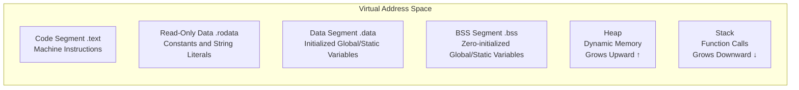

# Dynamic Memory Management

All the programs we have written so far have had variable sizes determined at compile time. However, the real world doesn't work that way—we don't know how many characters a user will input beforehand, we don't know how many records will be collected before running, and data packets sent by a client might be different every time. The common point of these scenarios is: **before the program runs, you cannot determine how much memory is needed.**

C's solution to this problem is dynamic memory management—requesting a block of memory of a specified size from the system while the program is running, and returning it when finished. This set of APIs looks like it only has four functions: `malloc`, `calloc`, `realloc`, `free`, which takes ten minutes to learn. But using them correctly is one thing; keeping them from crashing is another—memory leaks, dangling pointers, double frees, out-of-bounds writes—each one can crash your program inexplicably.

> **Learning Objectives**
>
> After completing this chapter, you will be able to:
>
> - [ ] Draw a program memory layout diagram and explain the responsibilities of the text/rodata/data/bss/heap/stack sections.
> - [ ] Correctly use `malloc`/`calloc`/`realloc`/`free` and handle errors.
> - [ ] Identify and avoid five common memory errors.
> - [ ] Use Valgrind and AddressSanitizer to detect memory issues.
> - [ ] Understand how RAII and smart pointers solve the pain points of manual C management.

## Environment Setup

We will conduct all subsequent experiments in this environment:

- Platform: Linux x86_64 (WSL2 is also acceptable)
- Compiler: GCC 13+ or Clang 17+
- Compiler flags: `-g -O0 -Wall -Wextra`

## Step 1 — Figure out what a program looks like in memory

When an executable file is loaded into memory by the loader to start running, the operating system allocates a virtual address space for it. This space is divided into several functionally distinct areas:



The **Code Segment** (.text) stores compiled machine instructions and is usually read-only. The **Read-Only Data Segment** (.rodata) stores `const` global variables and string literals. The **Initialized Data Segment** (.data) stores global and `static` variables that have non-zero initial values at definition. The **BSS Segment** (.bss) stores global and `static` variables that are uninitialized or initialized to zero—the key difference is that the **BSS** does not take up space in the executable file, only recording "need N bytes zeroed". The **Heap** is where dynamic memory allocation happens; memory requested by `malloc` comes from here. The **Stack** is used for function calls, storing local variables and return addresses.

## Step 2 — Master malloc/calloc/realloc/free

Stack management is completely automatic—stack frames are allocated when a function is called and automatically reclaimed when it returns. It is extremely fast (moving one register), but has size limitations (8MB default on Linux), and the memory is only valid during the current function's execution.

Heap management is handed over to the programmer. It is flexible but must be managed manually—if you forget to free, it leaks; if you free twice, it crashes. In actual projects, the following scenarios require the heap: data size cannot be determined at compile time, data lifetime spans function calls, or data size is too large for the stack.

## malloc — Give me a block of memory

```cpp
// malloc prototype
void* malloc(size_t size);
```

`malloc` accepts the number of bytes to allocate and returns a `void*` pointer. A basic example:

```cpp
// Allocate memory for an integer
int* p = (int*)malloc(sizeof(int));
if (p == NULL) {
    // Handle allocation failure
    fprintf(stderr, "Memory allocation failed\n");
    return 1;
}
*p = 42; // Use the memory
free(p); // Release the memory
```

Key points: Write `malloc(sizeof(*p))` instead of `malloc(sizeof(int))`, so the allocation size changes automatically when the pointer type changes. **Checking for NULL immediately after every malloc is an iron rule.** Memory allocated by `malloc` is **uninitialized**—you read garbage values.

## calloc — Allocate and zero out

```cpp
// calloc prototype
void* calloc(size_t nmemb, size_t size);
```

`calloc` allocates memory and **zeros it out completely**. Use it when you need zero-initialized structures or arrays—it's safer. `calloc` can also detect parameter multiplication overflow, providing an extra layer of protection compared to `malloc`.

## realloc — Expand capacity (might move house)

```cpp
// realloc prototype
void* realloc(void* ptr, size_t size);
```

`realloc` is used to adjust the size of allocated memory. It expands in place or finds new space and moves.

⚠️ **The Classic Pitfall**: `realloc` can return `NULL` (out of memory), but the original pointer remains valid. If you write directly `ptr = realloc(ptr, new_size)`, once it returns `NULL`, the original `ptr` is lost—memory leak. The correct way:

```cpp
// Correct usage of realloc
int* new_ptr = (int*)realloc(ptr, new_size);
if (new_ptr == NULL) {
    // Handle failure, original ptr is still valid
    free(ptr); // Optional: clean up if expansion is critical
} else {
    ptr = new_ptr; // Update pointer only on success
}
```

## free — Return what you borrow

```cpp
// free prototype
void free(void* ptr);
```

`free` has more caveats than it appears: you can only free pointers returned by allocation functions; after freeing, the pointer becomes a dangling pointer; **setting to NULL after free is a good habit**—subsequent misuse will cause an immediate segmentation fault, which is ten thousand times easier to debug than use-after-free.

```cpp
free(ptr);
ptr = NULL; // Prevent dangling pointer
```

## Step 3 — Know the five common memory errors

### 1. Memory Leak

Allocating but forgetting to free. More insidious scenarios include not releasing old memory before reassigning a pointer ("overwrite leak"), or forgetting to free in error handling branches.

### 2. Dangling Pointer / Use After Free

A pointer pointing to freed memory is continued to be used. This error doesn't necessarily crash immediately—that block of memory might not have been allocated to someone else yet, the data "looks" valid, but it is completely unreliable.

### 3. Double Free

Calling `free` twice on the same block of memory. The heap manager's internal data structures are corrupted, which may cause an immediate crash or strike much later.

### 4. Buffer Overflow

Writing outside the allocated memory area, corrupting metadata of adjacent memory blocks or other data. Off-by-one errors are a typical cause.

### 5. Uninitialized Read

The content of memory allocated by `malloc` is uncertain. Reading without assigning values reads garbage values.

## Debugging Tools

### Valgrind

The most classic memory debugging tool on Linux, capable of detecting leaks, illegal reads/writes, uninitialized reads, and double frees. No need to recompile, just add `valgrind` before the program:

```text
valgrind --leak-check=full ./your_program
```

### AddressSanitizer (ASan)

A compiler-intrinsic memory error detection tool with much lower performance overhead than Valgrind:

```bash
# Compile with ASan
gcc -g -O0 -fsanitize=address -fno-omit-frame-pointer your_program.c -o your_program
```

It is recommended to always enable ASan during development and testing phases.

## C++ Transition — How RAII ends the nightmare of manual management

### Core Idea of RAII

Bind the lifecycle of a resource to the lifecycle of an object. The constructor acquires the resource, and the destructor releases it. When the object leaves scope, the destructor is guaranteed to be called (even if exceptions occur), and the resource is guaranteed to be released correctly.

### The Three Musketeers of Smart Pointers

`std::unique_ptr` — Exclusive ownership, non-copyable but movable. Automatically releases when leaving scope. Recommended to create with `std::make_unique`.

`std::shared_ptr` — Shared ownership + reference counting. Releases memory when the last `shared_ptr` is destroyed. Recommended to create with `std::make_shared`.

`std::weak_ptr` — Does not increase reference count, used to break circular references between `shared_ptr`s.

### Standard Library Containers

`std::vector` replaces manual `malloc` dynamic arrays, `std::string` replaces manual `malloc` string buffers. In modern C++, you almost never need to use `malloc`/`free` directly, let alone `new`/`delete`.

## Summary

We started with memory layout, clarified the roles of the stack and heap, dissected the semantics and traps of the four dynamic memory functions one by one, summarized the five most common memory errors, and finally compared C++'s RAII and smart pointers. Dynamic memory management is one of the most error-prone areas in C, but once you master the correct methodology and tools, most errors can be avoided.

## Exercises

### Exercise 1: Fixed-Size Memory Pool Allocator

Implement a simple fixed-size memory pool that slices fixed-size blocks from a large chunk of memory, supporting allocation and reclamation.

```cpp
// TODO: Implement allocate() and deallocate()
void* allocate(size_t size);
void deallocate(void* ptr);
```

Hint: Use a linked list to manage free blocks—the first few bytes of each free block store a pointer to the next free block.

### Exercise 2: malloc/free Wrapper with Statistics

Implement a wrapper layer for `malloc` and `free` that tracks all allocation and deallocation operations, printing a statistical report when the program exits.

```cpp
// TODO: Implement tracked_malloc() and tracked_free()
void* tracked_malloc(size_t size);
void tracked_free(void* ptr);
```

Hint: Use an array or linked list to record information for each allocation. `atexit` can register an exit hook.
