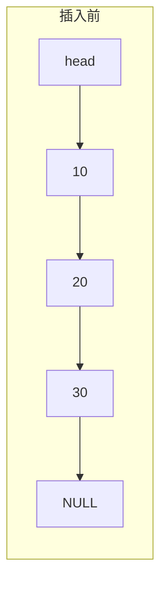
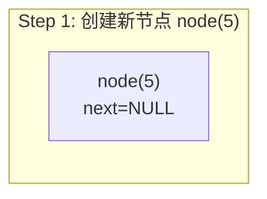
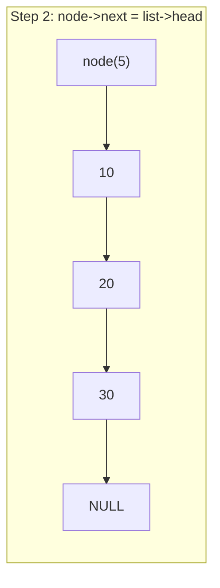
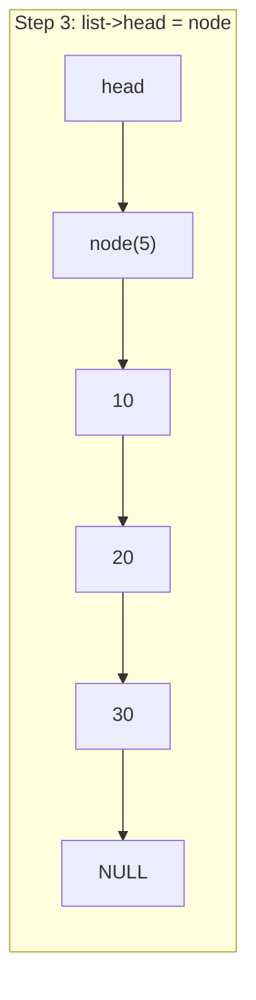

# Implementing a Singly Linked List from Scratch — A Practical Guide to Pointers and Memory

Up to this point, we have already tinkered with dynamic arrays. In that chapter, we used `malloc` and `realloc` to manage a contiguous block of memory, experiencing the thrill of "manual transmission" memory management. However, contiguous memory has an inherent limitation—when inserting or deleting elements in the middle, you must shift all subsequent data, resulting in an O(n) time complexity. For scenarios involving frequent insertions and deletions, this is clearly not elegant enough.

The linked list is a classic data structure born to solve this problem. You can imagine it as a train—each car not only carries cargo (data) but is also connected to the next car by a coupler (pointer). We only need to know where the locomotive (head) is to follow the couplers car-by-car to reach any other car. Unlike an array's neatly arranged "lockers," train cars don't need to be on the same track—each car can be parked anywhere, as long as the couplers are connected. This is the core trade-off of a linked list: it sacrifices memory contiguity and random access capabilities for O(1) insertions and deletions (assuming you have already found the position).

To be honest, linked lists are the first hurdle many encounter when learning data structures—not because the concept itself is difficult, but because the various edge cases in pointer operations are extremely error-prone. Null pointers, dangling pointers, broken chains, memory leaks... each one can keep you debugging until midnight. Python and Java programmers rarely need to hand-roll linked lists; the standard library provides `list` or `LinkedList` directly, and garbage collection manages memory safely for you. But C has none of that—no standard linked list container, no garbage collection, no generics. You must rely on pointers and `malloc` to build it yourself. This is actually a perfect training ground, because only by writing every single pointer operation yourself can you truly understand what kind of trouble tools like C++'s `std::forward_list` and `std::unique_ptr` are saving you from.

So, in this chapter, we won't do anything fancy. We will steadily build a classic singly linked list from scratch, covering core operations like node design, insertion, deletion, searching, traversal, and sentinel nodes, while leveling up our practical skills with pointers and memory management.

> **Learning Objectives**
>
> After completing this chapter, you will be able to:
>
> - [ ] Understand singly linked list node structure design and the memory model.
> - [ ] Implement insertion and deletion at the head, tail, and specific positions.
> - [ ] Master the sentinel node (dummy head) technique.
> - [ ] Handle various edge cases in linked list operations.
> - [ ] Understand linked list memory ownership and release strategies.
> - [ ] Understand the design trade-offs of C++ standard library linked list containers.

## Environment Description

All code in this article was written and tested in the following environment:

```text
平台：Linux (x86_64)，WSL2
编译器：GCC 13+，编译选项 -Wall -Wextra -std=c17
构建工具：CMake 3.20+
调试工具：GDB + Valgrind（用于内存泄漏检测）
```

The code style follows the project conventions: functions in `snake_case`, types in `PascalCase`, constants in `kPascalCase`, 4-space indentation, and left-aligned pointers like `int* p`. We recommend always enabling the `-Wall -Wextra` compiler flags—compiler warnings are often the first to help you catch null pointer dereferences and dangling pointer issues in linked list code.

## Step One — Figure Out the Node Design

Well begun is half done. Let's start by designing the most basic building block of a linked list—the node. Each node needs to store two things: a data field and a pointer field. The data field holds the actual value, while the pointer field stores the address of the next node. You can think of it like a train—each car has both a cargo hold for carrying goods (the data field) and a coupler for connecting to the next car (the pointer field).

```c
#include <stdio.h>
#include <stdlib.h>
#include <stdbool.h>

/// @brief 单链表节点
typedef struct ListNode {
    int data;                // 数据域
    struct ListNode* next;   // 指针域：指向下一个节点
} ListNode;
```

Here is a detail worth noting: inside `struct ListNode* next`, we must write the full `struct ListNode`; we cannot just write `ListNode*`. The reason is that when the `typedef` hasn't taken effect yet, the name `ListNode` doesn't exist yet, so the compiler doesn't recognize it. Self-referential structures are awkward like this, but you'll get used to it.

> ⚠️ **Warning**
> Writing `ListNode* next` instead of `struct ListNode* next` in a self-referencing structure will cause a compilation error. This is because the `typedef` alias doesn't take effect until the entire declaration is finished, so inside the structure, the compiler only recognizes the full `struct ListNode` syntax. Almost every beginner trips over this pitfall once.

Nodes alone aren't enough; we also need a "list" type to manage the metadata for the entire chain. The simplest approach is to maintain just a head pointer:

```c
typedef struct {
    ListNode* head;    // 指向链表第一个节点
    int size;          // 链表长度，方便 O(1) 查询
} LinkedList;
```

Placing `size` inside the struct is a practical approach. While we could traverse the list to count the nodes, that is an O(n) operation. Maintaining a `size` field makes retrieving the length O(1), at the cost of updating an integer during additions and deletions. This is a very favorable trade-off.

## Step 2 — Construct the list and safely tear it down

Managing the lifecycle of a data structure is always the first step. Think of it this way: a linked list is like building with blocks—we start with a base plate (the `LinkedList` struct), then stack the blocks (`ListNode` nodes) one by one. When dismantling it, we must remove the blocks one by one, and finally put away the base plate. The order matters; otherwise, the whole structure comes crashing down.

Let's implement the creation first:

```c
/// @brief 创建一个空链表
LinkedList* linked_list_create(void) {
    LinkedList* list = (LinkedList*)malloc(sizeof(LinkedList));
    if (list == NULL) {
        return NULL;
    }
    list->head = NULL;
    list->size = 0;
    return list;
}
```

When creating the list, we initialize `head` to `NULL` and `size` to 0, resulting in an empty linked list. We must not skip checking the return value of `malloc`. While we often cut corners and omit this in learning examples, handling memory allocation failures is a mandatory error path in production projects.

Next, we have a small helper function for creating individual nodes, which will be used by the subsequent insertion operations:

```c
/// @brief 创建一个新节点
/// @param data 节点数据
/// @return 新节点指针，失败返回 NULL
static ListNode* list_node_create(int data) {
    ListNode* node = (ListNode*)malloc(sizeof(ListNode));
    if (node == NULL) {
        return NULL;
    }
    node->data = data;
    node->next = NULL;
    return node;
}
```

We use `static` because this function is for internal use only and is not exposed to external callers. This is a good encapsulation practice—it reduces namespace pollution and signals to the reader that "this is an internal implementation detail."

Destroying a linked list is a common source of errors. We need to traverse the nodes one by one, free them, and finally free the linked list structure itself. The problem is that if we directly `free` the current node, we lose the address of the next node, breaking the chain. Therefore, we need a temporary pointer to "save first, delete later":

```c
/// @brief 销毁链表，释放所有内存
void linked_list_destroy(LinkedList* list) {
    if (list == NULL) {
        return;
    }

    ListNode* current = list->head;
    while (current != NULL) {
        ListNode* next = current->next;  // 先保存下一个节点的地址
        free(current);                    // 再释放当前节点
        current = next;                   // 移动到下一个
    }

    free(list);  // 最后释放链表结构体本身
}
```

This "save-then-delete" traversal pattern is crucial—it is one of the most fundamental patterns in linked list operations. We will use the exact same logic later when deleting individual nodes; the only difference is whether we are releasing a single node or the entire list.

> ⚠️ **Warning**
> If we call `free(current)` before reading `current->next` while destroying a list, we create a Use-After-Free bug—accessing memory after it has been reclaimed. Valgrind will catch this immediately, but without it, the code might "accidentally" work (because the memory hasn't been overwritten yet), only to crash randomly after running for hours on an embedded device. So, we must remember this order: save, delete, then move.

## Step 3 — Inserting a Node at the Head

The simplest and most efficient insertion operation for a linked list is head insertion—placing the new node at the very front and pointing `head` to it. This operation is always O(1) and requires no traversal. Using a train analogy, this is like hooking a new car in front of the locomotive and then moving the "head" marker to the new car.

```c
/// @brief 在链表头部插入元素
/// @return 成功返回 true，内存不足返回 false
bool linked_list_push_front(LinkedList* list, int data) {
    if (list == NULL) {
        return false;
    }

    ListNode* node = list_node_create(data);
    if (node == NULL) {
        return false;
    }

    node->next = list->head;  // 新节点指向原来的第一个节点
    list->head = node;        // head 指向新节点
    list->size++;
    return true;
}
```

Let's visualize this process. Assuming the linked list is originally `10 -> 20 -> 30`, we now want to insert `5` at the head:









We only modify two pointers without traversing the list, so the complexity is O(1). Note that the order of these two steps cannot be reversed—if we set `list->head = node` first, we lose the address of the original first node, breaking the list. This order is the golden rule for head operations: **connect first, break later**—attach the new node to the chain first, then update the `head` pointer.

## Step 4 — Appending a Node at the Tail

Appending at the tail involves one extra step compared to head insertion—we need to locate the last node first. If the list is empty, appending at the tail is identical to inserting at the head.

```c
/// @brief 在链表尾部插入元素
bool linked_list_push_back(LinkedList* list, int data) {
    if (list == NULL) {
        return false;
    }

    ListNode* node = list_node_create(data);
    if (node == NULL) {
        return false;
    }

    if (list->head == NULL) {
        // 空链表：新节点就是第一个节点
        list->head = node;
    } else {
        // 非空链表：找到最后一个节点
        ListNode* tail = list->head;
        while (tail->next != NULL) {
            tail = tail->next;
        }
        tail->next = node;
    }

    list->size++;
    return true;
}
```

> ⚠️ **Warning**
> When traversing to find the tail, the termination condition must be `tail->next != NULL` rather than `tail != NULL`. If you use the latter, `tail` becomes `NULL` when the loop ends—you lose the reference to the last node and cannot attach the new node. Executing `tail->next = node` results in a null pointer dereference and a segmentation fault. This is a very frequent bug in linked list code.

The time complexity of tail insertion is O(n) because we must traverse to the end. If you perform tail insertions frequently, you can maintain a `tail` pointer just like we maintain `size`, making tail insertion O(1). However, maintaining an additional `tail` pointer adds significant complexity to edge cases (such as updating it when deleting the tail node), so we will not introduce it here. This will be resolved naturally later when we implement doubly linked lists.

## Step 5 — Inserting a Node at a Specific Position

Head and tail insertion are not enough; often, we need to insert an element at a specific position. We define the following conventions: `index` 0 means insert at the head, `index` equal to `size` means insert at the tail, and an `index` greater than `size` is considered an illegal operation.

```c
/// @brief 在指定位置插入元素
/// @param index 插入位置（0-based）
bool linked_list_insert_at(LinkedList* list, int index, int data) {
    if (list == NULL || index < 0 || index > list->size) {
        return false;
    }

    if (index == 0) {
        return linked_list_push_front(list, data);
    }

    // 找到 index-1 位置的节点（前驱节点）
    ListNode* prev = list->head;
    for (int i = 0; i < index - 1; i++) {
        prev = prev->next;
    }

    ListNode* node = list_node_create(data);
    if (node == NULL) {
        return false;
    }

    node->next = prev->next;  // 新节点指向原来 index 位置的节点
    prev->next = node;        // 前驱节点指向新节点
    list->size++;
    return true;
}
```

The core of insertion at a specific location is finding the **predecessor node**—the node at position `index - 1`. Once found, we squeeze the new node between the predecessor and its successor: first, point the new node's `next` to the predecessor's `next`, and then point the predecessor's `next` to the new node. Just like insertion at the head, the order of these two steps cannot be reversed, otherwise, we lose the rest of the list. Here, we stick to that iron rule—**connect first, disconnect later**.

## Step Six — Deleting Nodes Safely

Deletion is the mirror operation of insertion, but it is more error-prone because we must not only modify pointers but also free the memory of the deleted node. As mentioned earlier, "save before delete" is the basic pattern for linked list operations, and we will apply it repeatedly here.

### Deleting from the Head

```c
/// @brief 删除链表头部元素
/// @return 成功返回 true
bool linked_list_pop_front(LinkedList* list) {
    if (list == NULL || list->head == NULL) {
        return false;
    }

    ListNode* old_head = list->head;  // 先保存要删除的节点
    list->head = old_head->next;      // head 指向第二个节点
    free(old_head);                   // 释放原来的头节点
    list->size--;
    return true;
}
```

This follows the "save before delete" pattern—we must save `old_head` first. Otherwise, once we modify `head`, we can no longer `free` the original head node. If we reversed the order to `free(list->head)` first and then `list->head = list->head->next`, the second step would read `list->head->next`, resulting in a Use-After-Free.

### Deletion by Value

Deleting by value is one of the trickiest linked list operations because we must handle several edge cases: an empty list, the target node being the head, or the target node not existing...

```c
/// @brief 删除第一个值为 target 的节点
/// @return 找到并删除返回 true，未找到返回 false
bool linked_list_remove(LinkedList* list, int target) {
    if (list == NULL || list->head == NULL) {
        return false;
    }

    // 特殊情况：要删除的是头节点
    if (list->head->data == target) {
        return linked_list_pop_front(list);
    }

    // 一般情况：找到目标节点的前驱
    ListNode* prev = list->head;
    while (prev->next != NULL && prev->next->data != target) {
        prev = prev->next;
    }

    if (prev->next == NULL) {
        // 遍历完了也没找到
        return false;
    }

    // prev->next 就是要删除的节点
    ListNode* to_delete = prev->next;
    prev->next = to_delete->next;  // 前驱跳过被删节点
    free(to_delete);               // 释放被删节点
    list->size--;
    return true;
}
```

Here is a critical design decision—we maintain the **predecessor node** `prev` during traversal, rather than the current node `current`. Since a singly linked list only moves forward, if we stand on the node to be deleted, we cannot go back to modify the predecessor's `next` pointer. Therefore, we must always operate from the predecessor's position, inspecting and manipulating the target node via `prev->next`. This pattern appears repeatedly in linked list operations, so we recommend understanding it thoroughly—in the section on sentinel nodes, we will see an elegant solution that eliminates the "head node special case."

### Deleting at a Specific Position

```c
/// @brief 删除指定位置的节点
bool linked_list_remove_at(LinkedList* list, int index) {
    if (list == NULL || index < 0 || index >= list->size) {
        return false;
    }

    if (index == 0) {
        return linked_list_pop_front(list);
    }

    // 找到 index-1 位置的节点（前驱）
    ListNode* prev = list->head;
    for (int i = 0; i < index - 1; i++) {
        prev = prev->next;
    }

    ListNode* to_delete = prev->next;
    prev->next = to_delete->next;
    free(to_delete);
    list->size--;
    return true;
}
```

Just like insertion at a specified position, the core logic is to locate the predecessor node and then bypass the node being deleted.

## Step 7 — Search and Traversal, Let's Run and See the Results

Searching and traversal are the most basic read-only operations for linked lists, and they serve as the means for us to verify that all previous insertions and deletions were implemented correctly.

```c
/// @brief 查找值为 target 的第一个节点的位置
/// @return 找到返回索引（0-based），未找到返回 -1
int linked_list_find(const LinkedList* list, int target) {
    if (list == NULL) {
        return -1;
    }

    ListNode* current = list->head;
    int index = 0;
    while (current != NULL) {
        if (current->data == target) {
            return index;
        }
        current = current->next;
        index++;
    }
    return -1;
}
```

```c
/// @brief 打印链表内容
void linked_list_print(const LinkedList* list) {
    if (list == NULL) {
        printf("[NULL list]\n");
        return;
    }

    printf("[");
    ListNode* current = list->head;
    while (current != NULL) {
        printf("%d", current->data);
        if (current->next != NULL) {
            printf(" -> ");
        }
        current = current->next;
    }
    printf("] (size=%d)\n", list->size);
}
```

```c
/// @brief 获取链表长度
int linked_list_size(const LinkedList* list) {
    return (list != NULL) ? list->size : 0;
}
```

At this point, we have implemented a fully functional singly linked list. Let's run it to verify the results:

```c
int main(void) {
    LinkedList* list = linked_list_create();

    linked_list_push_back(list, 10);
    linked_list_push_back(list, 20);
    linked_list_push_back(list, 30);
    linked_list_print(list);

    linked_list_push_front(list, 5);
    linked_list_print(list);

    linked_list_insert_at(list, 2, 15);
    linked_list_print(list);

    linked_list_remove(list, 15);
    linked_list_print(list);

    int pos = linked_list_find(list, 20);
    printf("Found 20 at index %d\n", pos);

    linked_list_destroy(list);
    return 0;
}
```

Compile and run:

```text
$ gcc -Wall -Wextra -std=c17 linked_list.c -o linked_list_test && ./linked_list_test
[10 -> 20 -> 30] (size=3)
[5 -> 10 -> 20 -> 30] (size=4)
[5 -> 10 -> 15 -> 20 -> 30] (size=5)
[5 -> 10 -> 20 -> 30] (size=4)
Found 20 at index 2
```

Let's check for memory leaks using Valgrind:

```text
$ valgrind --leak-check=full ./linked_list_test
==12345== HEAP SUMMARY:
==12345==     in use at exit: 0 bytes in 0 blocks
==12345==   total heap usage: 8 allocs, 8 frees, 1,248 bytes allocated
==12345==
==12345== All heap blocks were freed -- no leaks are possible
```

Excellent! We have eight `malloc` calls matching eight `free` calls, leaving the memory spotless. Memory issues in linked lists often don't cause immediate crashes; instead, they leak silently, only triggering an OOM (Out of Memory) failure after running for hours on an embedded device. Troubleshooting at that stage is painful, so do not skip this verification step.

## Step 8 — Eliminate Head Node Special Cases with a Sentinel Node

The linked list we implemented earlier has a somewhat inelegant aspect: operations involving the head node always require special handling. When inserting, if `index == 0`, we need special logic. When deleting, if the target is the head node, we also need special logic. These "head node special cases" not only bloat the code but are also easily missed during modifications.

The sentinel node (dummy head) is a classic technique for eliminating these special cases. The idea is to place a "dummy" node at the very front of the list that does not store valid data but simply occupies a position. You can think of it as an empty car attached to the front of a train—it carries no passengers, but it ensures that all "insert before a car" operations become a unified "insert after predecessor" operation. Consequently, all real data nodes have a predecessor node—even the first data node's predecessor is the sentinel node. All operations targeting the "predecessor" can be handled uniformly without any special cases.

```c
/// @brief 带哨兵节点的单链表
typedef struct {
    ListNode sentinel;   // 哨兵节点（直接嵌入，不是指针）
    int size;
} SentinelList;
```

Here, we embed the sentinel node directly into the structure instead of using a pointer to it. This approach saves one `malloc` call, and naturally binds the lifetime of the sentinel to that of the list structure. The `data` field of the sentinel node is meaningless; only the `next` field is useful.

```c
/// @brief 创建带哨兵节点的链表
SentinelList* sentinel_list_create(void) {
    SentinelList* list = (SentinelList*)malloc(sizeof(SentinelList));
    if (list == NULL) {
        return NULL;
    }
    list->sentinel.next = NULL;  // 哨兵的 next 指向第一个真实节点（空链表时为 NULL）
    list->size = 0;
    return list;
}
```

Now let's see how concise erase-by-value becomes with the sentinel version:

```c
/// @brief 按值删除（哨兵版本）
bool sentinel_list_remove(SentinelList* list, int target) {
    if (list == NULL) {
        return false;
    }

    // prev 从哨兵开始，不需要特判头节点
    ListNode* prev = &list->sentinel;
    while (prev->next != NULL && prev->next->data != target) {
        prev = prev->next;
    }

    if (prev->next == NULL) {
        return false;
    }

    ListNode* to_delete = prev->next;
    prev->next = to_delete->next;
    free(to_delete);
    list->size--;
    return true;
}
```

Notice anything? There's no special case for `if (list->head->data == target)`, and no separate branch for head deletion—all scenarios follow a single unified logic. `prev` iterates starting from the sentinel, because the sentinel itself is a valid predecessor node. This demonstrates the power of a sentinel node—it uses a single node that doesn't store data to ensure consistent operational logic, eliminating all special cases for the head node. Many advanced variants of linked lists use sentinel nodes; for example, the Linux kernel's `list_head` is a classic implementation of a doubly circular linked list with a sentinel.

## Boundary Condition Checklist—Where Bugs Most Often Occur

The most bug-prone areas in linked list operations are boundary conditions. Let's summarize the scenarios we must cover:

**Empty list operations**—Deleting from or searching an empty list should safely return an error code without crashing. **Single-node list**—After deleting the only node, the list becomes empty, and `head` should become `NULL`. **Tail operations**—After deleting the last node, the predecessor's `next` should become `NULL`. **`NULL` parameter checks**—The first parameter of any public API might be `NULL`, so defensive checks are mandatory. **Index out of bounds**—An `index` that is negative or exceeds `size` should return an error.

When writing tests, make sure to cover these cases, especially empty lists and single-node lists. Many people only test on "normal length" linked lists, which causes them to crash as soon as they hit a boundary condition.

## Memory Ownership—Who Is Responsible for Releasing

When implementing data structures manually, memory ownership is a question that must be clearly thought out. In our implementation, the ownership relationship is clear: the `LinkedList` owns all `ListNode` objects—creator destroys. `linked_list_create` creates the list, and `linked_list_destroy` destroys the list and all nodes. Each node belongs to only one list, and there is no sharing.

This clear, single-ownership model makes memory management simple—we only need to free all nodes in `destroy`. However, if the `data` we store is also dynamically allocated (like a `char*` string), ownership becomes more complex. Is the list responsible for freeing the data, or is the caller? Generally, there are two strategies: one is where the list owns the data and releases it when destroyed; the other is where the list only stores pointers and ignores the data's lifetime, leaving management to the caller. The former is simple but inflexible, while the latter is flexible but prone to forgetting to release memory. In C, there is no universal answer; you need to think it through when designing the API and document it clearly.

## Transitioning to C++

Now that we understand the full details of implementing a singly linked list from scratch, let's see what the C++ standard library offers in this regard.

### `std::forward_list` and `std::list`

The C++ STL provides two linked list containers—`std::forward_list` and `std::list`. `std::forward_list` is a singly linked list introduced in C++11, corresponding to the classic singly linked list we implemented in this article. `std::list` is a doubly linked list, where each node stores an additional `prev` pointer.

An interesting design trade-off is that `std::forward_list` doesn't even have a `size()` member function. The C++ Standards Committee's reasoning is that if `size()` is provided, certain operations (like `splice`, which transfers nodes from one list to another) must maintain the consistency of `size`, which incurs additional overhead. Since the design goal of `forward_list` is "singly linked list with minimal overhead," they decided not to provide `size()` at all, letting those who need it maintain it themselves. This forms an interesting contrast with our approach of maintaining a `size` field—the standard library chose flexibility over convenience.

### Smart Pointers and Linked Lists

In C++, while implementing a linked list with raw pointers is feasible, smart pointers allow for a safer approach. The most natural way is to use `std::unique_ptr` to manage node ownership:

```cpp
#include <memory>

struct ListNode {
    int data;
    std::unique_ptr<ListNode> next;  // 独占下一个节点的所有权
};
```

The benefit of this approach is that the list's destruction becomes automatic. When the head node's `unique_ptr` is destroyed, it recursively destroys the next node, which in turn destroys the following one, continuing until the end of the list. We no longer need to write a manual `destroy` function. However, we must note a potential issue: for very long lists (e.g., tens of thousands of nodes), this recursive destruction might cause a stack overflow. In such cases, we still need to manually iterate and release memory.

Insertion and deletion operations in a `unique_ptr`-based list also involve subtle changes—we cannot simply assign pointers. Instead, we use `std::move` to transfer ownership:

```cpp
// 头部插入
void push_front(std::unique_ptr<ListNode>& head, int data) {
    auto new_node = std::make_unique<ListNode>();
    new_node->data = data;
    new_node->next = std::move(head);  // 转移所有权
    head = std::move(new_node);
}
```

Compared to the C version `node->next = list->head; list->head = node;`, the C++ version using `std::move` makes the ownership transfer explicit—every pointer transfer is clearly marked as a "move," rather than silently copying an address value. This is exactly how C++ move semantics manifest in pointer-intensive data structures like linked lists.

### Iterator Pattern

When we wrote linked list traversals earlier, we always used `ListNode* current = list->head; while (current != NULL) { ... current = current->next; }`. This traversal logic is tightly coupled to the specific linked list implementation—if we wanted to switch to a different container (like an array), we would have to rewrite all the traversal code.

The C++ iterator pattern abstracts the "traversal" operation. Whether it's a linked list, an array, or a tree, as long as it provides an iterator, we can traverse it using a unified `for (auto it = container.begin(); it != container.end(); ++it)`, or even a range-based for loop `for (auto& elem : container)`. The underlying implementation of an iterator is still pointer manipulation—for a linked list, `++it` is essentially `it = it->next`, and for an array, it's just pointer arithmetic. But the caller doesn't need to worry about these details.

Implementing iterators in pure C is quite troublesome—without operator overloading or templates, achieving generic programming requires function pointers or macros. However, once we understand the design intent behind C++ iterators, we can achieve a similar level of abstraction in C—by defining a traversal function that accepts a callback function pointer and invokes it for each element. This pattern is also used in the C standard library (such as the comparison function in `qsort` or the callback in `bsearch`).

## Summary

At this point, we have built a complete singly linked list from scratch. The node design used a self-referential struct; insertion and deletion revolved around "finding the predecessor node"; head operations required special handling of the head node; the sentinel node trick eliminated this special casing; and memory ownership followed the "who creates, destroys" single-ownership principle. These aren't just linked list facts—they are universal paradigms for all pointer-intensive data structures. Trees, graphs, and the chaining method in hash tables all rely on similar node and pointer operations under the hood.

### Key Takeaways

- A singly linked list node contains a data field and a pointer field, chained together via pointers.
- Head insertion/deletion is O(1); tail and middle operations require traversing to the target position.
- The core of deletion is maintaining the predecessor node to bypass the deleted node.
- "Store before delete" is the basic pattern for linked list memory release; reversing the order results in Use-After-Free.
- Sentinel nodes eliminate special handling for the head node, making code more concise and less error-prone.
- Memory ownership must be defined during design—whether managed by the list or the caller.
- Boundary conditions (empty list, single node, tail) are the focus of testing.
- `std::forward_list` corresponds to a singly linked list, and `std::list` corresponds to a doubly linked list.
- Smart pointers make linked list memory management safer, and `std::move` explicitly expresses ownership transfer.

## Exercises

### Exercise 1: Reverse Linked List

Implement a function to reverse a singly linked list in place. The space complexity must be O(1), and you cannot allocate new nodes.

```c
/// @brief 原地反转链表
/// @param list 链表指针
void linked_list_reverse(LinkedList* list);
```

**Hint:** Maintain three pointers—`prev`, `current`, and `next`, and reverse the `next` direction of each node one by one.

### Exercise 2: Merge Two Sorted Linked Lists

Given two linked lists sorted in ascending order, merge them into a new sorted linked list.

```c
/// @brief 合并两个升序链表
/// @param a 第一个有序链表
/// @param b 第二个有序链表
/// @return 合并后的新链表
LinkedList* linked_list_merge_sorted(const LinkedList* a, const LinkedList* b);
```

**Hint:** Iterate through both lists simultaneously. Each time, take the smaller node value and append it to the tail of the result list.

### Exercise 3: Detect List Cycle

Determine if a linked list contains a cycle (where a node's `next` pointer points to a node that has already appeared).

```c
/// @brief 检测链表是否有环
/// @return 有环返回 true
bool linked_list_has_cycle(const LinkedList* list);
```

**Hint:** The classic solution is Floyd's Tortoise and Hare algorithm—use two pointers, one moving one step at a time, and the other moving two steps. If a cycle exists, the fast pointer will eventually catch up to the slow pointer.

### Exercise 4: Full API with Sentinel

Re-implement the full linked list API (`push_front`, `push_back`, `insert_at`, `remove`, `find`) using a sentinel node, and observe which special-case checks are eliminated by the sentinel node.

## Resources

- [C struct - cppreference](https://en.cppreference.com/w/c/language/struct)
- [std::forward_list - cppreference](https://en.cppreference.com/w/cpp/container/forward_list)
- [std::list - cppreference](https://en.cppreference.com/w/cpp/container/list)
- [std::unique_ptr - cppreference](https://en.cppreference.com/w/cpp/memory/unique_ptr)
- [Floyd's cycle detection algorithm - Wikipedia](https://en.wikipedia.org/wiki/Cycle_detection#Floyd's_tortoise_and_hare)
