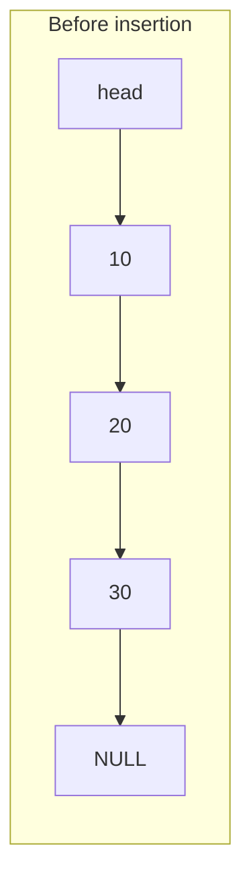
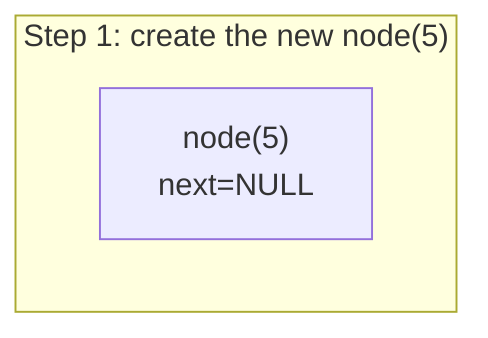
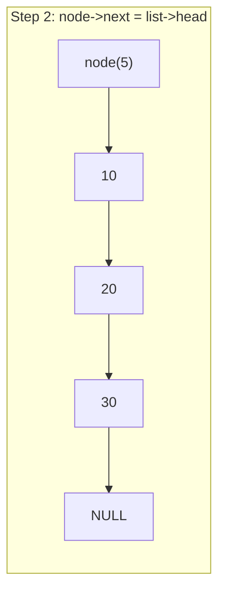
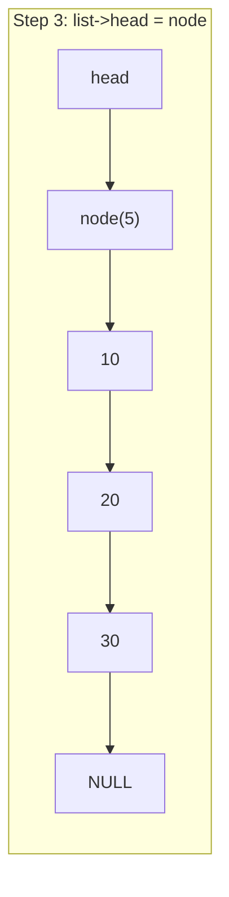

# Building a Singly Linked List from Scratch — A Practical Guide to Pointers and Memory

We have already tinkered with dynamic arrays: in that chapter we used `malloc` and `realloc` to manage a contiguous block of memory and got a taste of the joys of "manual transmission" memory management. But contiguous memory has a built-in limitation—when you insert or delete an element in the middle, you have to shift every piece of data after it, for a time complexity of O(n). For workloads with frequent insertions and deletions, that is clearly not elegant enough.

The linked list is the classic data structure invented to solve this problem. Picture a train: each car carries cargo (the data) and is coupled to the next car (the pointer). As long as we know where the head of the train is, we can follow the couplers car by car to reach any car. Unlike an array's neat row of "storage lockers", train cars don't have to sit on one shared track—each car can be parked anywhere, as long as the couplers connect. That is the linked list's core trade-off: it gives up memory contiguity and random access, and in exchange gets O(1) insertion and deletion (provided, of course, that you have already found the position).

Honestly, linked lists are the first real hurdle many people hit when learning data structures—not because the concept itself is hard, but because the edge cases in pointer manipulation are so easy to get wrong. Null pointers, dangling pointers, broken chains, memory leaks... each one can keep you debugging past midnight. Python and Java programmers basically never hand-roll a linked list: the standard library hands you `list` or `LinkedList` directly, and garbage collection keeps memory tidy for you. C gives you nothing—no standard linked-list container, no garbage collection, no generics; all you have are pointers and `malloc` to build it yourself. Which is exactly what makes this a great training exercise: only by writing every pointer operation of a linked list with your own hands will you truly understand what kind of trouble C++ tools like `std::forward_list` and `std::unique_ptr` are sparing you.

So this chapter won't do anything fancy. We will steadily build a classic singly linked list from scratch, walking through node design, insertion and deletion, search and traversal, and sentinel nodes—the full set of core operations—while leveling up our practical pointer and memory-management skills one more notch.

All code in this chapter was written and tested in the following environment:

```text
Platform: Linux (x86_64), WSL2
Compiler: GCC 13+, flags -Wall -Wextra -std=c17
Build tool: CMake 3.20+
Debugging tools: GDB + Valgrind (for memory leak detection)
```

Code style follows the project conventions: functions in `snake_case`, types in `PascalCase`, constants in `kPascalCase`, 4-space indentation, and pointer asterisks kept on the left as in `int* p`. Keep `-Wall -Wextra` enabled at all times—when it comes to null-pointer dereferences and dangling pointers in linked-list code, compiler warnings are often the first thing to catch them.

## Step 1 — Figuring Out the Node Design

Everything starts hard, so let's begin by designing the most basic building block of a linked list—the node. Each node stores two things: a data field and a pointer field. The data field holds the actual value; the pointer field holds the address of the next node. Back to the train analogy: every car has a cargo hold for freight (the data field) and a coupler linking it to the next car (the pointer field).

```c
#include <stdio.h>
#include <stdlib.h>
#include <stdbool.h>

/// @brief Singly linked list node
typedef struct ListNode {
    int data;                // data field
    struct ListNode* next;   // pointer field: points to the next node
} ListNode;
```

One detail deserves attention here: inside `struct ListNode* next` you must write the full `struct ListNode`, not just `ListNode*`. The reason is that the `typedef` has not taken effect yet—the name `ListNode` does not exist at that point, and the compiler doesn't know it. Self-referential structures are this awkward, but you get used to it.

Writing `ListNode* next` instead of `struct ListNode* next` inside the self-referential structure fails to compile outright—because the `typedef` alias only takes effect once the entire declaration ends, inside the structure body the compiler only recognizes the full form `struct ListNode`. Nearly every beginner steps on this landmine once.

Nodes alone aren't enough; we also need a "list" type to manage the metadata of the whole chain. The simplest approach is to keep just a head pointer:

```c
typedef struct {
    ListNode* head;    // points to the first node of the list
    int size;          // list length, for O(1) queries
} LinkedList;
```

Keeping `size` in the structure is a very practical move—sure, you could count nodes by traversal, but that is an O(n) operation. Maintaining a `size` field makes getting the length O(1), at the cost of one extra integer update per insertion or deletion. A real bargain.

## Step 2 — Building the List and Tearing It Down Safely

Lifecycle management of a data structure always comes first. By analogy: a linked list is like stacking building blocks—start with a base plate (the `LinkedList` structure), then stack blocks on it one at a time (the `ListNode`s). When tearing it down, take the blocks off one by one, and put the base plate away last. Get the order wrong and the whole tower comes clattering down.

First, creation:

```c
/// @brief Create an empty linked list
LinkedList* linked_list_create(void) {
    LinkedList* list = (LinkedList*)malloc(sizeof(LinkedList));
    if (list == NULL) {
        return NULL;
    }
    list->head = NULL;
    list->size = 0;
    return list;
}
```

At creation, set `head` to `NULL` and `size` to 0, and an empty linked list is born. Do not skip the `malloc` return-value check—learning code often lazily omits it, but in a real project, allocation failure is an error path you must handle.

Next comes a small helper that creates a single node; every insertion operation later will use it:

```c
/// @brief Create a new node
/// @param data the node's data
/// @return pointer to the new node, NULL on failure
static ListNode* list_node_create(int data) {
    ListNode* node = (ListNode*)malloc(sizeof(ListNode));
    if (node == NULL) {
        return NULL;
    }
    node->data = data;
    node->next = NULL;
    return node;
}
```

The `static` qualifier marks this function as internal-only, not exposed to outside callers. It is a good encapsulation habit—it reduces namespace pollution and also tells the reader "this is an internal implementation detail".

Destroying the list is a fairly easy place to go wrong. We need to walk the nodes one by one and free them, then free the list structure itself. The catch: if you `free` the current node directly, you lose the address of the next node—the chain breaks. So we need a temporary pointer to "save first, delete second":

```c
/// @brief Destroy the list and free all memory
void linked_list_destroy(LinkedList* list) {
    if (list == NULL) {
        return;
    }

    ListNode* current = list->head;
    while (current != NULL) {
        ListNode* next = current->next;  // save the next node's address first
        free(current);                    // then free the current node
        current = next;                   // move to the next one
    }

    free(list);  // finally free the list structure itself
}
```

This "save first, delete second" traversal-and-free pattern is critically important—it is one of the most fundamental operation patterns in linked-list work. Deleting nodes later follows exactly the same idea; the only difference is whether you free a single node or all of them.

If you `free(current)` first and then read `current->next` while destroying the list, you have a Use-After-Free—accessing memory that has already been reclaimed. Valgrind flags this kind of bug immediately, but without Valgrind it may "happen" to work fine (because that memory hasn't been overwritten yet), and only blow up at random after the embedded device has been running for hours. So burn this order into memory: save, delete, then advance.

## Step 3 — Inserting a Node at the Head

The simplest and most efficient insertion in a linked list is head insertion—put the new node at the very front of the list and point `head` at it. This operation is always O(1), no traversal needed. In train terms: couple one more car in front of the locomotive, then move the head-of-train marker onto the new car.

```c
/// @brief Insert an element at the head of the list
/// @return true on success, false when out of memory
bool linked_list_push_front(LinkedList* list, int data) {
    if (list == NULL) {
        return false;
    }

    ListNode* node = list_node_create(data);
    if (node == NULL) {
        return false;
    }

    node->next = list->head;  // the new node points to the old first node
    list->head = node;        // head points to the new node
    list->size++;
    return true;
}
```

Let's draw this out. Suppose the list is `10 -> 20 -> 30` and we insert `5` at the head:


```mermaid
graph LR
    subgraph "Before insertion"
        H0["head"] --> N10a["10"] --> N20a["20"] --> N30a["30"] --> NULL0["NULL"]
    end
```


```mermaid
graph LR
    subgraph "Step 1: create the new node(5)"
        S1["node(5)<br/>next=NULL"]
    end
```


```mermaid
graph LR
    subgraph "Step 2: node->next = list->head"
        S2["node(5)"] --> N10b["10"] --> N20b["20"] --> N30b["30"] --> NULL1["NULL"]
    end
```


```mermaid
graph LR
    subgraph "Step 3: list->head = node"
        H3["head"] --> S3["node(5)"] --> N10c["10"] --> N20c["20"] --> N30c["30"] --> NULL2["NULL"]
    end
```

The whole process changes exactly two pointers, with no traversal, hence O(1). Note that this order cannot be reversed—if you did `list->head = node` first, the address of the old first node would be lost and the list would be severed right there. This ordering is the iron law of head operations on a linked list: **connect first, cut second**—first hook the new node onto the chain, then move the `head` pointer.

## Step 4 — Appending a Node at the Tail

Tail insertion has one extra step over head insertion—you must first find the last node. If the list is empty, appending at the tail is the same as inserting at the head.

```c
/// @brief Insert an element at the tail of the list
bool linked_list_push_back(LinkedList* list, int data) {
    if (list == NULL) {
        return false;
    }

    ListNode* node = list_node_create(data);
    if (node == NULL) {
        return false;
    }

    if (list->head == NULL) {
        // empty list: the new node is the first node
        list->head = node;
    } else {
        // non-empty list: find the last node
        ListNode* tail = list->head;
        while (tail->next != NULL) {
            tail = tail->next;
        }
        tail->next = node;
    }

    list->size++;
    return true;
}
```

When walking the list to find the tail, the loop condition must be `tail->next != NULL`, not `tail != NULL`. With the latter, the loop ends with `tail` equal to `NULL`—you have lost your reference to the last node, cannot hang the new node onto anything, and `tail->next = node` becomes a null-pointer dereference and an immediate segfault. This is one of the most frequent bugs in linked-list code.

Tail insertion is O(n), because of the walk to the end. If you append at the tail frequently, you can maintain a `tail` pointer the same way we maintain `size`, which makes tail insertion O(1) too. But an extra `tail` pointer adds a fair amount of edge-case complexity (deleting the last node has to update it as well), so we won't introduce it here—doubly linked lists, which we will meet later, solve this naturally.

## Step 5 — Inserting a Node at a Specific Position

Head and tail insertion aren't enough; we often need to insert an element at a specific position. Our convention: `index` 0 means insert at the head, `index` equal to `size` means append at the tail, and anything beyond `size` is treated as an illegal operation.

```c
/// @brief Insert an element at a specific position
/// @param index insertion position (0-based)
bool linked_list_insert_at(LinkedList* list, int index, int data) {
    if (list == NULL || index < 0 || index > list->size) {
        return false;
    }

    if (index == 0) {
        return linked_list_push_front(list, data);
    }

    // find the node at index-1 (the predecessor node)
    ListNode* prev = list->head;
    for (int i = 0; i < index - 1; i++) {
        prev = prev->next;
    }

    ListNode* node = list_node_create(data);
    if (node == NULL) {
        return false;
    }

    node->next = prev->next;  // the new node points to the old node at index
    prev->next = node;        // the predecessor points to the new node
    list->size++;
    return true;
}
```

The heart of insertion at a specific position is finding the **predecessor node**—the node at position `index - 1`. Once found, the new node squeezes in between the predecessor and the predecessor's next node: first point the new node's `next` at the predecessor's `next`, then point the predecessor's `next` at the new node. As with head insertion, this order cannot be reversed, or the chain after the predecessor is lost. Same iron law as before—**connect first, cut second**.

## Step 6 — Deleting Nodes Safely

Deletion and insertion are mirror operations, but deletion is more error-prone, because we not only rewire pointers but also free the deleted node's memory. We said "save first, delete second" is the basic linked-list pattern; we will lean on it over and over here.

### Deleting from the Head

```c
/// @brief Remove the element at the head of the list
/// @return true on success
bool linked_list_pop_front(LinkedList* list) {
    if (list == NULL || list->head == NULL) {
        return false;
    }

    ListNode* old_head = list->head;  // save the node to delete first
    list->head = old_head->next;      // head points to the second node
    free(old_head);                   // free the old head node
    list->size--;
    return true;
}
```

The "save first, delete second" pattern again—we must save `old_head` beforehand, otherwise after changing `head` there is no way to `free` the old head node. If you wrote it as `free(list->head)` first and then `list->head = list->head->next`, the second step's read of `list->head->next` would be a Use-After-Free.

### Deleting by Value

Deleting by value is one of the linked-list operations that demands the most care, because there are quite a few edge cases to handle: an empty list, the node to delete being the head, the node to delete not existing at all...

```c
/// @brief Remove the first node whose value is target
/// @return true if found and removed, false if not found
bool linked_list_remove(LinkedList* list, int target) {
    if (list == NULL || list->head == NULL) {
        return false;
    }

    // special case: the node to delete is the head
    if (list->head->data == target) {
        return linked_list_pop_front(list);
    }

    // general case: find the predecessor of the target node
    ListNode* prev = list->head;
    while (prev->next != NULL && prev->next->data != target) {
        prev = prev->next;
    }

    if (prev->next == NULL) {
        // walked to the end without finding it
        return false;
    }

    // prev->next is the node to delete
    ListNode* to_delete = prev->next;
    prev->next = to_delete->next;  // the predecessor skips over the deleted node
    free(to_delete);               // free the deleted node
    list->size--;
    return true;
}
```

There is a crucial design decision here—while traversing we maintain the **predecessor node** `prev`, not the current node `current`. A singly linked list only moves forward; if you are standing on the node to delete, there is no way to go back and modify the predecessor's `next` pointer. So we must always operate from the predecessor's position, inspecting and manipulating the target node through `prev->next`. This idea recurs throughout linked-list operations—make sure you understand it thoroughly. In the sentinel node section later we will see an elegant scheme that eliminates the "head node special case".

### Deleting at a Specific Position

```c
/// @brief Remove the node at a specific position
bool linked_list_remove_at(LinkedList* list, int index) {
    if (list == NULL || index < 0 || index >= list->size) {
        return false;
    }

    if (index == 0) {
        return linked_list_pop_front(list);
    }

    // find the node at index-1 (the predecessor)
    ListNode* prev = list->head;
    for (int i = 0; i < index - 1; i++) {
        prev = prev->next;
    }

    ListNode* to_delete = prev->next;
    prev->next = to_delete->next;
    free(to_delete);
    list->size--;
    return true;
}
```

As with insertion at a specific position, the core is finding the predecessor node, then routing around the deleted node.

## Step 7 — Search and Traversal, Then a Test Run

Search and traversal are the most basic read-only operations on a linked list, and they are also our means of verifying that all the insertions and deletions above are correct.

```c
/// @brief Find the position of the first node whose value is target
/// @return the index (0-based) if found, -1 if not found
int linked_list_find(const LinkedList* list, int target) {
    if (list == NULL) {
        return -1;
    }

    ListNode* current = list->head;
    int index = 0;
    while (current != NULL) {
        if (current->data == target) {
            return index;
        }
        current = current->next;
        index++;
    }
    return -1;
}
```

```c
/// @brief Print the list contents
void linked_list_print(const LinkedList* list) {
    if (list == NULL) {
        printf("[NULL list]\n");
        return;
    }

    printf("[");
    ListNode* current = list->head;
    while (current != NULL) {
        printf("%d", current->data);
        if (current->next != NULL) {
            printf(" -> ");
        }
        current = current->next;
    }
    printf("] (size=%d)\n", list->size);
}
```

```c
/// @brief Get the list length
int linked_list_size(const LinkedList* list) {
    return (list != NULL) ? list->size : 0;
}
```

At this point we have implemented a fully functional singly linked list. Let's run it and see the results:

```c
int main(void) {
    LinkedList* list = linked_list_create();

    linked_list_push_back(list, 10);
    linked_list_push_back(list, 20);
    linked_list_push_back(list, 30);
    linked_list_print(list);

    linked_list_push_front(list, 5);
    linked_list_print(list);

    linked_list_insert_at(list, 2, 15);
    linked_list_print(list);

    linked_list_remove(list, 15);
    linked_list_print(list);

    int pos = linked_list_find(list, 20);
    printf("Found 20 at index %d\n", pos);

    linked_list_destroy(list);
    return 0;
}
```

Compile and run:

```text
$ gcc -Wall -Wextra -std=c17 linked_list.c -o linked_list_test && ./linked_list_test
[10 -> 20 -> 30] (size=3)
[5 -> 10 -> 20 -> 30] (size=4)
[5 -> 10 -> 15 -> 20 -> 30] (size=5)
[5 -> 10 -> 20 -> 30] (size=4)
Found 20 at index 2
```

Now check with Valgrind for memory leaks:

```text
$ valgrind --leak-check=full ./linked_list_test
==12345== HEAP SUMMARY:
==12345==     in use at exit: 0 bytes in 0 blocks
==12345==   total heap usage: 8 allocs, 8 frees, 1,248 bytes allocated
==12345==
==12345== All heap blocks were freed -- no leaks are possible
```

Nice: 8 `malloc`s matched by 8 `free`s, memory squeaky clean. Linked-list memory problems often don't crash at runtime—they leak quietly, and only after the embedded device has been running for hours do they blow up with an OOM, by which point tracking them down is painful. So never skip this verification step.

## Step 8 — Eliminating Head-Node Special Cases with a Sentinel Node

The list we implemented above has one inelegant aspect—operations involving the head node always need special handling. Insertion needs a special path when `index == 0`; deletion needs one when the node to delete is the head. This "head node special-casing" not only makes the code longer, it is also easy to miss a spot when modifying it.

The sentinel node (dummy head / sentinel node) is the classic trick for eliminating these special cases. The idea is to place a "fake" node at the very front of the list: it stores no real data, it just occupies a slot. You can picture it as an empty car coupled to the front of the train—it carries no passengers, but it turns every "insert in front of some car" operation into a uniform "insert after the predecessor" operation. That way, every real data node has a predecessor—even the first data node's predecessor is the sentinel node. Every operation expressed against "the predecessor" can be handled uniformly, with no special-casing at all.

```c
/// @brief Singly linked list with a sentinel node
typedef struct {
    ListNode sentinel;   // sentinel node (embedded directly, not a pointer)
    int size;
} SentinelList;
```

Here we embed the sentinel node directly in the structure instead of pointing to it—the benefit is one less `malloc`, and the sentinel's lifetime is naturally bound to the list structure's. The sentinel node's `data` field is meaningless; only the `next` field is useful.

```c
/// @brief Create a list with a sentinel node
SentinelList* sentinel_list_create(void) {
    SentinelList* list = (SentinelList*)malloc(sizeof(SentinelList));
    if (list == NULL) {
        return NULL;
    }
    list->sentinel.next = NULL;  // the sentinel's next points to the first real node (NULL when the list is empty)
    list->size = 0;
    return list;
}
```

Now let's see how concise deletion by value becomes in the sentinel version:

```c
/// @brief Remove by value (sentinel version)
bool sentinel_list_remove(SentinelList* list, int target) {
    if (list == NULL) {
        return false;
    }

    // prev starts at the sentinel; no head-node special case needed
    ListNode* prev = &list->sentinel;
    while (prev->next != NULL && prev->next->data != target) {
        prev = prev->next;
    }

    if (prev->next == NULL) {
        return false;
    }

    ListNode* to_delete = prev->next;
    prev->next = to_delete->next;
    free(to_delete);
    list->size--;
    return true;
}
```

Notice? The `if (list->head->data == target)` special case is gone, and so is the delete-the-head branch—every case flows through one set of logic. `prev` starts its walk at the sentinel, because the sentinel itself is a perfectly legal predecessor node. That is the power of the sentinel node: one data-less node buys uniform operation logic and eliminates every head-node special case. Many advanced linked-list variants use sentinel nodes—for example, the Linux kernel's `list_head` is a classic doubly linked circular list built around a sentinel.

## Boundary Condition Checklist — Where Things Most Easily Go Wrong

The most bug-prone spots in linked-list operations are the boundary conditions. Let's line up the cases we must cover:

Operations on an empty list—deleting from an empty list or searching an empty list must return an error code safely, never crash. Single-node lists—after deleting the only node, the list becomes empty and `head` should become `NULL`. Tail operations—after deleting the last node, the predecessor's `next` should become `NULL`. `NULL` argument checks—the first argument of every public API can be `NULL`; check defensively. Index out of range—a negative `index`, or one beyond `size`, should return an error.

When writing tests, make sure all of these cases are covered—especially the empty list and the single-node list. Plenty of people only test on "normal-length" lists, and the moment a boundary condition shows up, everything blows up.

## Memory Ownership — Who Is Responsible for Freeing

When you hand-roll a data structure, memory ownership is a question you must think through. In our implementation the ownership relationship is crisp: `LinkedList` owns every `ListNode`; whoever creates, destroys—`linked_list_create` creates the list, `linked_list_destroy` destroys the list along with all its nodes. Each node belongs to exactly one list; there is no sharing.

This clean single-ownership model makes memory management simple—all `destroy` has to do is free every node. But if the stored `data` is itself dynamically allocated (a `char*` string, for example), ownership gets more complicated—does the list free the data, or does the caller? Broadly speaking there are two strategies: one is that the list owns the data and frees it along with itself on destruction; the other is that the list merely stores pointers and stays out of the data's lifetime, leaving the caller to manage it. The former is simple but not flexible enough; the latter is flexible but easy to forget to free. In C there is no universal answer—you need to decide while designing the API and state it clearly in the documentation.

## Bridging to C++

With every detail of the hand-rolled singly linked list understood, let's take a look at what the C++ standard library offers here.

### `std::forward_list` and `std::list`

The C++ STL provides two linked-list containers—`std::forward_list` and `std::list`. `std::forward_list` is the singly linked list introduced in C++11, corresponding to the classic singly linked list we implemented in this chapter. `std::list` is a doubly linked list; each node additionally stores a `prev` pointer.

An interesting design trade-off: `std::forward_list` doesn't even have a `size()` member function. The C++ standards committee's reasoning is that if `size()` were provided, certain operations (such as `splice`, which transfers nodes from one list to another) would have to maintain the consistency of `size`, and that would bring extra overhead. Since `forward_list`'s design goal is the "minimum-overhead singly linked list", it simply omits `size()` and lets those who need it maintain it themselves. This makes for an interesting contrast with our approach of maintaining a `size` field—the standard library chose flexibility over convenience.

### Smart Pointers and Linked Lists

In C++, hand-rolling a linked list with raw pointers is doable, but with smart pointers there is a safer way to write it. The most natural approach is to manage node ownership with `std::unique_ptr`:

```cpp
#include <memory>

struct ListNode {
    int data;
    std::unique_ptr<ListNode> next;  // exclusive ownership of the next node
};
```

The benefit is that destroying the list becomes automatic—when the head node's `unique_ptr` is destroyed, it recursively destroys the next node, which destroys the one after that, all the way to the tail. No hand-written `destroy` function needed. One potential problem to note, though: for very long lists (tens of thousands of nodes, say), this recursive destruction can overflow the stack. In that case you still need a manual traversal to free the nodes.

A list built on `unique_ptr` also changes subtly on insertion and deletion—you can't simply assign pointers; you need `std::move` to transfer ownership:

```cpp
// head insertion
void push_front(std::unique_ptr<ListNode>& head, int data) {
    auto new_node = std::make_unique<ListNode>();
    new_node->data = data;
    new_node->next = std::move(head);  // transfer ownership
    head = std::move(new_node);
}
```

Compared with the C version's `node->next = list->head; list->head = node;`, the C++ version's `std::move` makes the ownership transfer explicit—every pointer handoff is clearly marked as a "move", rather than silently copying an address value. This is precisely C++ move semantics at work in a pointer-dense data structure like the linked list.

### The Iterator Pattern

Every time we wrote a list traversal earlier, it was `ListNode* current = list->head; while (current != NULL) { ... current = current->next; }`. That traversal logic is coupled to the concrete list implementation—swap in a different container (an array, say) and the traversal code has to be rewritten.

C++'s iterator pattern abstracts the operation of "traversing". Linked list, array, or tree—whatever the container, as long as it provides iterators, you can traverse with the uniform `for (auto it = container.begin(); it != container.end(); ++it)`, or even with a range-based for loop `for (auto& elem : container)`. Under the hood, iterators are of course still pointer operations—for a linked list, `++it` is `it = it->next`; for an array, it is bumping the pointer by one. But the caller doesn't need to care about these details.

Doing iterators in plain C is more troublesome—no operator overloading, no templates; the only routes to genericity are function pointers or macros. But once you understand the design intent of C++ iterators, we can achieve a similar abstraction in C—define a traversal function that accepts a callback function pointer and invokes it for each element. This pattern is also used in the C standard library (the comparison function of `qsort`, the callback of `bsearch`, and so on).

## Exercises

### Exercise 1: Reversing the List

**Difficulty: basic** · three pointers, O(1) space

Implement a function that reverses a singly linked list in place. The space complexity must be O(1); allocating new nodes is not allowed.

```c
/// @brief Reverse the list in place
/// @param list pointer to the list
void linked_list_reverse(LinkedList* list);
```

Hint: maintain three pointers—`prev`, `current`, `next`—and reverse each node's `next` direction one at a time.

### Exercise 2: Merging Two Sorted Lists

**Difficulty: basic** · two-pointer merge

Given two lists sorted in ascending order, merge them into one new sorted list.

```c
/// @brief Merge two ascending sorted lists
/// @param a the first sorted list
/// @param b the second sorted list
/// @return the new merged list
LinkedList* linked_list_merge_sorted(const LinkedList* a, const LinkedList* b);
```

Hint: walk both lists at the same time, each time taking the smaller of the two node values and appending it to the tail of the result list.

### Exercise 3: Detecting a Cycle in the List

**Difficulty: intermediate** · Floyd's fast and slow pointers

Determine whether a list has a cycle (some node's `next` points back to a node that has already appeared earlier).

```c
/// @brief Detect whether the list has a cycle
/// @return true if a cycle exists
bool linked_list_has_cycle(const LinkedList* list);
```

Hint: the classic solution is Floyd's tortoise-and-hare algorithm—two pointers, one advancing one step at a time, the other two steps at a time. If there is a cycle, the fast pointer eventually catches up with the slow one.

### Exercise 4: A Complete Sentinel-Based API

**Difficulty: intermediate** · a complete list with a sentinel node

Reimplement the complete list API (`push_front`, `push_back`, `insert_at`, `remove`, `find`) with a sentinel node, and get a feel for which special-case code the sentinel node eliminates.

## References

- [C structures - cppreference](https://en.cppreference.com/w/c/language/struct)
- [std::forward_list - cppreference](https://en.cppreference.com/w/cpp/container/forward_list)
- [std::list - cppreference](https://en.cppreference.com/w/cpp/container/list)
- [std::unique_ptr - cppreference](https://en.cppreference.com/w/cpp/memory/unique_ptr)
- [Floyd's cycle detection algorithm - Wikipedia](https://en.wikipedia.org/wiki/Cycle_detection#Floyd's_tortoise_and_hare)
