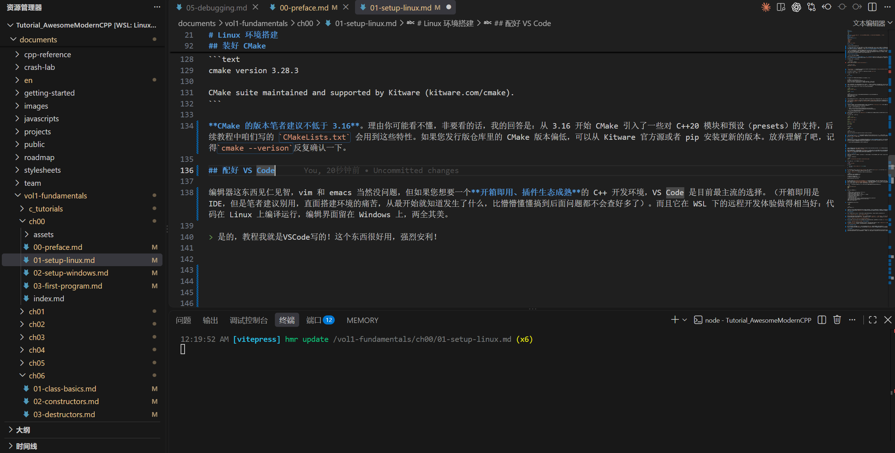

# Linux Environment Setup

Get moving! So says CharlieChen114514.

Alright, enough memes—before we put pen to paper on C++, we have to get the environment squared away. The job of this article is simple: build, from zero on Linux, a C++ development environment that can compile, can build, and is comfortable to write in. The whole process takes roughly **fifteen minutes (or not; hard to say)**, but if this is your first time fiddling with Linux environment setup, set aside half an hour—hmm, or possibly a day, to be safe. The premise is that you are already familiar with Linux; friends who aren't should head to the next article and do the Windows setup instead. Grinding through it anyway is not recommended. **But for Windows support, you will need to improvise a little, every single time~**

Why Linux? Frankly, the entire C++ toolchain ecosystem grew up around Unix/Linux. GCC's first line of code dates back to 1987, and both Clang and CMake are Unix-first designs. When you compile and debug C++ code on Linux, the references you can find when things break, the answers on Stack Overflow, the CI configurations of open-source projects—almost all of them assume you are running Linux. On top of that, later tutorials in this series will involve embedded cross-compilation and WSL development, so a Linux environment is a foundation you cannot get around. (One confession: Linux comes before Windows here also because I prefer developing on Linux—on my machine, Windows is purely for gaming. Who on earth would charge headlong into Windows to write code? (kidding))

## Get That Compiler Installed! Taking Office on the C++ Journey

> "Dude, what even is a compiler???"

A compiler is the tool that **translates C++ source code into binary files the machine can execute**. In the Linux world, the two mainstream C++ compilers are the **GCC (GNU Compiler Collection) suite** and **Clang (from the LLVM camp)**. Ubuntu/Debian's default `build-essential` package pulls in GCC along with the related build tools in one fell swoop—that's the easiest route for us.

Depending on your distribution, run the matching command:

::: code-group

```bash [Ubuntu / Debian]
sudo apt update && sudo apt install build-essential -y
```

```bash [Arch Linux]
sudo pacman -S gcc make
```

:::

`build-essential` is a meta package: it contains no software itself, but it pulls down a whole series of tools compilation requires, such as `g++`, `gcc`, `make`, and `libc6-dev`. Once this one package is installed, we have a basic C and C++ compilation environment.

Arch is even easier here: the default `gcc` package already includes C++ support, so we don't need to install `gcc-c++` separately.

Once it's installed, verify. Open a terminal and run:

```bash

g++ --version
```

The output you see should look roughly like this (the exact version number varies with distribution and update state):

```text
g++ (Ubuntu 13.2.0-23ubuntu4) 13.2.0
Copyright (C) 2023 Free Software Foundation, Inc.
This is free software; see the source for copying conditions.  There is NO
warranty; not even for MERCHANTABILITY or FITNESS FOR A PARTICULAR PURPOSE.
```

As long as a version number prints, GCC is installed. My recommendation is nothing older than version 11—GCC 11 fully supports most of C++20, and the later tutorials make heavy use of C++17 and C++20 features. If the GCC that ships with your distribution is rather old (Ubuntu 20.04, for instance, defaults to GCC 9), you can upgrade through a PPA or by building from source; we won't expand on that for now.

If you'd like to try Clang while you're at it (certain features in later tutorials will be compared against it), install it like this:

```bash
# Ubuntu / Debian
sudo apt install clang -y

# Verify
clang++ --version
```

```text
Ubuntu clang version 17.0.6 (++20231206065830+6009708b4367-1~exp1~20231206065905.65)
Target: x86_64-pc-linux-gnu
Thread model: posix
InstalledDir: /usr/bin
```

Clang's error messages are friendlier than GCC's—when I'm stuck debugging template code, I often switch to Clang to read the diagnostics. For day-to-day development, though, GCC is entirely sufficient; just keep both compilers installed, they don't conflict.

If you installed things inside WSL and still get `command not found`, don't panic—nine times out of ten you skipped `sudo apt update`, or the WSL distribution never got properly initialized. Run `sudo apt update && sudo apt upgrade -y` in the WSL terminal, then reinstall `build-essential`. Also, the Ubuntu image WSL pulls in by default can sometimes be on the old side; if in doubt, check your distribution's version in the Microsoft Store.

## Get CMake Installed

With a compiler in hand, we still need a build tool to manage the project's compilation pipeline. You might ask—isn't `g++ hello.cpp -o hello` enough? For a single file, certainly no problem, but real projects often have dozens or hundreds of source files with dependencies between them; typing compile commands by hand is simply not realistic.

> What, you've never seen a CMake project? Fine—open GitHub and browse:
>
> - CFBox: <https://github.com/Awesome-Embedded-Learning-Studio/CFBox>
> - CFDesktop: <https://github.com/Awesome-Embedded-Learning-Studio/CFDesktop>
>
> Poke around a bit. I bet you won't be hand-typing compiler commands.
> (Of course I'm not promoting my own projects again. I'm sure of it.)

That is exactly the job CMake does: it reads a configuration file called `CMakeLists.txt`, then automatically generates the corresponding build scripts (a Makefile or Ninja file, say), taking the grunt work of compiling and linking off our hands.

Installing CMake is likewise a one-command affair:

```bash
# Ubuntu / Debian
sudo apt install cmake -y

# Fedora
sudo dnf install cmake -y

# Arch
sudo pacman -S cmake

# Yay users, rejoice
yay -S cmake
```

Verify the installation:

```bash
cmake --version
```

```text
cmake version 3.28.3

CMake suite maintained and supported by Kitware (kitware.com/cmake).
```

**For CMake, I recommend nothing below version 3.16.** The reasoning may not land for you, but since you insist on asking, my answer is: starting with 3.16, CMake introduced support for pieces of C++20 modules and presets, and the `CMakeLists.txt` we write in later tutorials will use those features. If the CMake in your distribution's repositories is on the older side, you can install a newer version from Kitware's official repository or via pip. Give up on understanding it—just remember to double-check repeatedly with `cmake --version`.

## Get VS Code Set Up

Editors are a matter of taste; vim and emacs are of course fine. But if you want a C++ development environment that **works out of the box with a mature extension ecosystem**, VS Code is the most mainstream choice today. (Out of the box usually means an IDE, but I suggest you skip those—face the pain of setting up the environment yourself. Knowing what's actually going on from the very start beats bumbling your way to the deep end without even knowing how to investigate problems.) Its remote development experience under WSL is also remarkably good: the code compiles and runs on Linux while the editing interface stays on Windows—best of both worlds.

> Yes, this very tutorial is written in VS Code! The thing is genuinely great—I wholeheartedly recommend it!



There are many ways to install VS Code; let's take the easiest: go to the [official site](https://code.visualstudio.com/), download the `.deb` package (Ubuntu/Debian) or `.rpm` package (Fedora), then double-click to install. Arch users can simply run `sudo pacman -S code`.

With VS Code installed, a few key extensions remain. Press `Ctrl+Shift+X` to open the extensions panel. First, search for C/C++ (by Microsoft)—syntax highlighting, IntelliSense, and debugging support all ride on it; it's the cornerstone of writing C++ in VS Code. Next, grab its sibling CMake Tools, which lets you configure, build, and debug CMake projects by clicking buttons right inside the editor, no terminal-switching needed. Top it off with CMake by twxs, which gives `CMakeLists.txt` syntax highlighting and completion. With those three in place, this environment has taken shape.

## Get Your First CMake Project Running

At this point all the tools are ready, so let's drill for real: create a CMake-managed C++ project from scratch, compile it, and run it. If this step goes through smoothly, the whole toolchain is configured correctly, and the later chapters can be pure coding with peace of mind.

Find a spot and create a project directory—fire up that Linux command line~

```bash
# Recursively create ~/projects and ~/projects/hello_cmake, then switch into it.
mkdir -p ~/projects/hello_cmake && cd ~/projects/hello_cmake
```

Then create our first C++ source file, `hello.cpp`:

```cpp
// Create the file in VS Code, or with touch, or with echo "" > hello.cpp—whatever works~
#include <iostream>

int main()
{
    std::cout << "Hello, Modern C++!" << std::endl;
    return 0;
}
```

Let's look at this simplest of C++ programs first: `#include <iostream>` pulls in the standard input/output library; `std::cout` is C++'s standard output stream; the `<<` operator sends the string into the output stream. `std::endl`, besides emitting a newline, also flushes the output buffer, making sure the content shows up immediately.

Next, create `CMakeLists.txt`; this file tells CMake how our project should be built:

```cmake
cmake_minimum_required(VERSION 3.16)
project(hello_cmake LANGUAGES CXX)

set(CMAKE_CXX_STANDARD 20)
set(CMAKE_CXX_STANDARD_REQUIRED ON)

add_executable(hello hello.cpp)
```

Whoa there, don't run off—I'll take it slow.

- `cmake_minimum_required(VERSION 3.16)` declares the minimum CMake version this project needs; if your CMake is older than 3.16, the configure stage fails outright instead of producing baffling build failures later.
- `project(hello_cmake LANGUAGES CXX)` defines the project's name and supported languages; `CXX` is CMake's codename for C++.
- `set(CMAKE_CXX_STANDARD 20)` sets the C++ standard to C++20, and `CMAKE_CXX_STANDARD_REQUIRED ON` makes sure the build errors out if the compiler doesn't support C++20, rather than quietly downgrading.
- `add_executable(hello hello.cpp)` declares that we are building an executable named `hello` from the source file `hello.cpp`.

Now let's build. CMake's recommended practice is to build in a separate directory, keeping the generated temporary files from polluting the source directory:

```bash
mkdir build && cd build
cmake ..
make
```

You will see output like this:

```text
-- The CXX compiler identification is GNU 13.2.0
-- Detecting CXX compiler ABI info
-- Detecting CXX compiler ABI info - done
-- Check for working CXX compiler: /usr/bin/c++ - skipped
-- Detecting CXX compile features
-- Detecting CXX compile features - done
-- Configuring done (0.3s)
-- Generating done (0.0s)
-- Build files have been written to: /home/charlie/projects/hello_cmake/build
[ 50%] Building CXX object CMakeFiles/hello.dir/hello.cpp.o
[100%] Linking CXX executable hello
[100%] Built target hello
```

Build succeeded. Now run our program:

```bash
./hello
```

```text
Hello, Modern C++!
```

When you see that line of output, congratulations: the compiler, CMake, and the entire toolchain are all in place, and you can officially start writing C++. If you open this project directory with VS Code (`code ~/projects/hello_cmake`), the CMake Tools extension will recognize `CMakeLists.txt` automatically and configure the project; build and run buttons will appear in the status bar at the bottom, and from then on a click inside VS Code compiles and runs things—no more typing the commands every time.

## What to Do When You Hit Problems

Toolchain configuration is the step that varies the most from machine to machine, so if you stumble into a pit, that's perfectly normal. Here are a few of the most common errors and the corresponding lines of attack.

**`g++: command not found` or `cmake: command not found`**

This means the tool in question isn't installed, or is installed but not on your `PATH` environment variable. First check where they live with `which g++` and `which cmake`—if either comes back empty, reinstall the corresponding package. If a path comes back but the command still isn't found, your `PATH` is misconfigured; check whether `~/.bashrc` or `~/.zshrc` has removed `/usr/bin` from `PATH`.

**CMake reports `CMake Error: Could not find CMAKE_CXX_COMPILER`**

This usually happens inside WSL or a Docker container—the system has CMake installed but no compiler. Go back to the compiler installation section, confirm that `g++ --version` prints normally, then rerun `cmake ..`.

**Linker errors at compile time like `undefined reference to symbol`**

The single-file `hello.cpp` won't run into this one. But once projects grow more complex later on, if you hit a linking error, it's almost always a forgotten library in `CMakeLists.txt`: the `target_link_libraries` command is missing the library in question. We'll cover this in detail in later chapters.

**Slow file system performance under WSL**

WSL accessing the Windows file system (paths under `/mnt/c/`) is far slower than accessing the native Linux file system. If your project lives under `/mnt/c/Users/.../projects/`, compilation will visibly chug. The fix is to keep the project in the Linux-side home directory (`~/projects/`) and edit it through VS Code's Remote - WSL.

**Anything else?**

For whatever remains, ask the community, ask an AI, or ask the gurus around you; you can also come straight to <https://github.com/Awesome-Embedded-Learning-Studio/Tutorial_AwesomeModernCPP> and open an Issue on this repository to ask me. I sometimes read Issues faster than I go through email. As for why this is separate from the item above—the reason has been given already: I'm honestly mediocre, truly no guru, but beginner questions I can definitely help look at.
