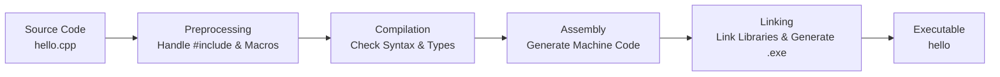

# The First C++ Program

The environment is set up, and the compiler is installed. Now it's time to get down to business—writing our first line of C++ code.

The first lesson in every language is always Hello, World. Whether I'm learning C#, Rust, C++, C, Java, Kotlin... honestly, all tutorials start with printing Hello World. I think this is probably a legacy from the legendary K&R C book, *The C Programming Language*. I remember the authors were the folks who created C. There's not much to say, except respect!

But I can guarantee that if we break down this small program clearly, many concepts later on will fall into place naturally. So don't rush to skip this; let's digest it line by line.

## From Scratch—The Skeleton of `hello.cpp`

Open your favorite editor, create a new file called `hello.cpp`, and type the following code in exactly as is. Note that I said *type* it, not copy-paste (we often joke that programmers only have three keys: Ctrl, C, and V. Let me clarify: don't do that when you are seriously learning. Save that for work you aren't interested in but have to do, like writing business logic I don't care about)—muscle memory is really important when learning programming.

```cpp
#include <iostream>

int main() {
    std::cout << "Hello, C++!" << std::endl;
    return 0;
}
```

In the repository, I used CMake to organize the project build. However, actually, if you

```bash
g++ -o hello hello.cpp
```

I have no objection, but I recommend you use cmake more:

```bash
cmake -B build
cmake --build build
```

Running result:

```text
Hello, C++!
```

Six lines of code. It looks ridiculously simple. But it actually hides several key concepts. Let's break it down line by line.

### Line 1: `#include <iostream>`

This line tells the compiler: we need to use the "input/output stream" functional module. You can think of it as taking a toolkit called `iostream` out of the toolbox—inside are `std::cout` (for output) and `std::cin` (for input), which are the most basic means we have to interact with the program. The C++ standard library has many such toolkits, such as `<vector>`, `<string>`, `<map>`, and you include whatever you need.

The angle brackets `< >` indicate that this is a system header file, and the compiler will look for it in the system's standard library path. If it's a header file you wrote yourself, use double quotes `" "`, and the compiler will search in the current directory first.

### Line 2: `int main()`

This is the entry point of the entire program. When the operating system starts our program, execution begins here. `int` indicates that this function will return an integer to the operating system—returning 0 means "everything is normal," while returning a non-zero value means "something went wrong." This return value can be retrieved in Linux scripts via `$?`, and CI/CD pipelines often rely on it to judge whether the program executed successfully.

### Lines 3 to 5: The Function Body

```cpp
{
    std::cout << "Hello, C++!" << std::endl;
    return 0;
}
```

`std::cout` stands for "character output" (c = character, out = output), and you can understand it as the screen. The `<<` operator is redefined here; its job is to "push" the content on the right into the output stream on the left. So `std::cout << "..."` pushes this text onto the screen.

`std::endl` is short for "end line". It does two things: it outputs a newline character, and then flushes the buffer—meaning it ensures your text appears on the screen immediately rather than being cached somewhere.

Finally, `return 0;` tells the operating system: I finished normally, nothing to worry about.

> ⚠️ **Warning**: In some tutorials or old code, you might see `void main()`. This is wrong. The C++ standard explicitly states that the return type of `main` must be `int`. While some older compilers might not report an error, that doesn't make it right. Make it a habit to always write `int main()`.

You might have noticed that both `std::cout` and `std::endl` have a `std::` prefix. `std` is an abbreviation for "standard", and it is a **namespace**—you can think of it as a brand label for a toolkit. Everything in the C++ standard library is placed in the `std` namespace to avoid name conflicts. For example, if you write a function called `cout` yourself, it won't fight with the standard library's `cout` because they are in different namespaces. Some tutorials add a line `using namespace std;` at the beginning and then write `cout` directly. While this saves typing, it can easily trigger naming conflicts in large projects, so let's get used to keeping the `std::` prefix from the start.

## Compiling and Running

The code is written. Now let's make it run. Open a terminal, navigate to the directory where `hello.cpp` is located, and execute:

```bash
g++ -o hello hello.cpp
```

This command does two things: it uses the `g++` compiler to compile `hello.cpp` into an executable file, and `-o hello` specifies the output filename as `hello` (if not specified, it defaults to `a.out` or `a.exe`, which isn't a meaningful name). After successful compilation, a `hello` file (or `hello.exe`) will appear in the current directory. Run it directly:

```bash
./hello
```

Output:

```text
Hello, C++!
```

Great, your first C++ program ran successfully.

If you've read the environment setup chapter, you might remember how to use CMake. For a small single-file program like this, using the `g++` command directly is the fastest. But as the project grows and files multiply, manually typing compile commands every time will drive you crazy—that's where the value of CMake shines. We'll use `g++` here for now and formally introduce CMake in later chapters.

## What Happened Behind the Scenes—The Compilation Pipeline

Hey, I have a lot to say about this. I've actually met a computer pseudo-expert who argued with me—what do you mean compile, link, and execute steps? Nowadays, we just click the run button and it runs.

I laugh every time I see this. Every time I talk about this, I whip out this person to flog them. Typical computer learning a little bit and then showing off. Come, let me tell you how complex this really is:

Every time you type `g++`, a complete pipeline runs in the background. We don't need to dive into the details of every stage, but we need to know this process exists, because when you encounter compilation errors later, knowing which stage the error occurred in can help you quickly locate the problem.

The whole process can be simplified into four steps. The first step is **Preprocessing**, where the compiler processes all instructions starting with `#`—replacing `#include` with the actual content of the `iostream` header file, expanding macro definitions, and handling conditional compilation. The second step is **Compilation**, which translates the preprocessed C++ code into assembly language—this is where the compiler checks syntax and types, and the syntax errors you write will be caught here. The third step is **Assembly**, which translates assembly code into machine code, generating an object file (`.o` or `.obj` file). The fourth step is **Linking**, which combines the object files with the library files needed (like the C++ standard library) to generate the final executable file.



You might ask: why do we need to know this? Because later you will definitely encounter various compilation errors—some are preprocessing issues (header files not found), some are compilation issues (syntax errors, type mismatches), and some are linking issues (duplicate definitions, symbols not found). Knowing which stage the error is in gives you direction when troubleshooting.

> ⚠️ **Warning**: When the compiler reports an error, **always look at the first error message**. Many beginners habitually look at the last one, but actually, C++ compilers have a "cascading error" feature—one error can lead to dozens of "false positive" errors later. Fix the first one, and the subsequent ones might disappear automatically. So make it a habit: look at the first one, fix the first one, recompile, then look again.

## Potholes We've Stepped In—Common Compilation Errors

Being able to write correct code isn't enough; we must also learn to read error messages. Below, we will intentionally create a few classic errors to see what the compiler says.

### Forgetting the Semicolon

Remove the semicolon from `main`:

```cpp
#include <iostream>

int main() {
    std::cout << "Hello, C++!" << std::endl
    return 0;
}
```

Compile it:

```bash
g++ -o hello hello.cpp
```

```text
hello.cpp: In function 'int main()':
hello.cpp:5:5: error: expected ';' before 'return'
     return 0;
     ^~~~~~
```

The compiler tells you: before `return` on line 5, it expected to see a semicolon. Although the error is marked on line 5, the actual problem is at the end of line 4—this situation where "the error location and the report location differ by one line" is very common in C++, so just remember this pattern.

### Forgetting to Include the Header

Delete the `#include <iostream>` line and compile again:

```bash
g++ -o hello hello.cpp
```

```text
hello.cpp: In function 'int main()':
hello.cpp:4:2: error: 'cout' is not a member of 'std'
     std::cout << "Hello, C++!" << std::endl;
     ^~~
```

The compiler says "`cout` is not a member of `std`"—because it doesn't know what `std::cout` is at all; no one told it. The solution is to add back `#include <iostream`. Interestingly, GCC will "kindly" suggest if you meant `printf`, which is sometimes quite funny.

### Typos

Write `std::cout` as `std::cot`:

```cpp
std::cot << "Hello, C++!" << std::endl;
```

The error message is very direct—`cot` is not a member of `std`. Just check the spelling carefully. This type of error is particularly common in the beginner stage. `std::cout` and `std::cin` are often typed as `std::out` or `std::in` and such; you'll get familiar with them after typing them a few times.

> ⚠️ **Warning**: If you are using GCC, it is recommended to add the `-Wall -Wextra` options when compiling, i.e., `g++ -Wall -Wextra -o hello hello.cpp`. These two options enable a large number of warnings—although warnings don't stop compilation, they often point to potential problems. Treating warnings as errors is the first step to becoming a qualified C++ programmer.

## A Step Further—Talking with the Program

Output alone isn't enough; let's make the program accept input. Create a new file called `calc.cpp` to implement a simple addition calculator.

We'll write the skeleton first, then fill it in gradually. First, we need to read two numbers from the user, so we need to use `std::cin` (c = character, in = input), which is the partner of `std::cout`.

```cpp
#include <iostream>

int main() {
    int a = 0;
    int b = 0;
    std::cout << "Enter two numbers: ";
    std::cin >> a >> b;
    std::cout << "Sum: " << a + b << std::endl;
    return 0;
}
```

Compile and run:

```bash
g++ -o calc calc.cpp
./calc
```

```text
Enter two numbers: 3 5
Sum: 8
```

There are a few noteworthy points here. `int a = 0;` declares an integer variable and initializes it to 0. The `>>` operator in `std::cin >> a` points in the opposite direction of `std::cout`—it "extracts" data from the input stream and puts it into the variable `a`. You can understand `std::cout <<` as "push out" (output), and `std::cin >>` as "pull in" (input); the direction of the arrow is the flow of data.

The line `std::cout << "Sum: " << a + b << std::endl;` uses multiple `<<` operators in succession, executing from left to right: first output the value of `a + b`, then output the string `"Sum: "`, then output the value of `a`, and so on. This "chaining" style is very common in C++, so get used to it.

For the variable declaration, we used `int a = 0;` instead of `int a;`. This is intentional. C++ does not automatically initialize local variables—if you don't assign an initial value, the value of `a` is garbage data left in memory. Although `std::cin >> a` will immediately overwrite it, developing the habit of "initialize upon declaration" is very important; it can help you avoid a large class of hard-to-debug problems.

## Try It Yourself

At this point, we can write code, compile, run, and read error messages. Now it's time to test your learning results—reading without practicing is like not learning at all. Here are three exercises, increasing in difficulty. I suggest you write each one by hand.

### Exercise 1: Output Your Name

Modify `hello.cpp` to make the program output your name instead of "Hello, C++!". For example, output "Hello everyone! I am ShuoDaoli!".

### Exercise 2: Read Age and Greet

Write a new program `age.cpp`, use `std::cin` to read the user's age, and then output a greeting containing the age. Expected interaction:

```text
Enter your age: 25
Hello! You are 25 years old.
```

### Exercise 3: Celsius to Fahrenheit

Write a `temp.cpp`, read a Celsius temperature, convert it to Fahrenheit, and output it. The conversion formula is $F = C \times 1.8 + 32$. Expected interaction:

```text
Enter Celsius: 25
Fahrenheit: 77.0
```

These three exercises cover all the core knowledge points of this chapter: variable declaration, input/output, and basic arithmetic. If you can complete all three independently, it means you have fully mastered the content of this chapter.

## Run Online

Try editing and running this code online to see the effect of modifying the output:

<OnlineCompilerDemo
  title="First C++ Program: Hello World and Simple Calculation"
  source-path="code/examples/vol1/01_first_program.cpp"
  description="Edit and run your first C++ program in the browser and observe the output."
  allow-run
/>

## Summary

In this chapter, we started from scratch, wrote a complete C++ program, and dissected it thoroughly. Let's review the key points: `#include` is used to introduce standard library functional modules, `int main()` is the program entry, `std::cout` and `std::cin` are responsible for output and input respectively, `<<` and `>>` are the corresponding data flow operators, and compilation requires four stages: preprocessing, compilation, assembly, and linking.

More importantly, we learned how to read compiler error messages—this is probably the most practical skill in this chapter. In your future studies, you will face compiler errors countless times. Don't be afraid; look at the first one, fix the first one, and recompile.

In the next chapter, we start learning C++'s type system—how variables actually store data, the difference between integers and floating-point numbers, and why C++ is so obsessed with types. This knowledge is the foundation for writing any meaningful program later on.
