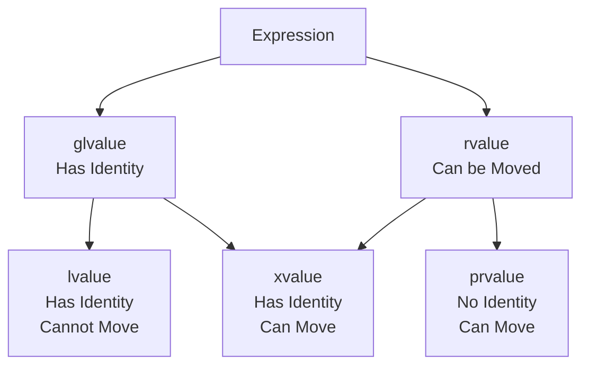

# Lvalues, Rvalues, and References: The Type System Foundations of Move Semantics

:::tip
This article is based on a deep dive into Ben Saks's "Back to Basics: Move Semantics" talk from CppCon 2025. Above is the YouTube link; users in China can watch the Bilibili version directly. The experimental environment for this article is Arch Linux WSL, GCC 16.1.1.
:::

In the previous post, we used experiments with `MyString` to prove that move semantics can reduce a heap allocation + `memcpy` copy to a single pointer assignment, speeding up string concatenation by over 4x for 100,000 operations. The conclusion was exciting, but we left a crucial suspense at the end—how does the compiler know when it is safe to "steal" resources? It needs a language mechanism to distinguish between "this object will be used again" and "this object is about to die." This distinction mechanism is the lvalue and rvalue.

Honestly, I used to have a vague fear of "lvalues and rvalues." The first time I heard these terms, my instinctive reaction was: "Isn't this just the left side and right side of the equal sign?"—and then I quickly realized it wasn't that simple. `const int n` in `const int n = 1;` is an lvalue, but you cannot assign to it; an `int&&` reference binds to an rvalue, but the reference itself is an lvalue... These seemingly contradictory phenomena took me a while to fully figure out.

## K&R's Original Definition: Left and Right of the Equal Sign

The terms lvalue and rvalue can be traced back to the birth of the C language. K&R introduced these concepts in *The C Programming Language*—"L value" comes from the assignment expression `a = b`, where the thing on the **Left** of the assignment sign must have certain specific properties. Specifically, `a` must be an expression that can be located—the compiler must be able to determine its location in memory to write the value of `b` into it.

This is the most primitive intuition: **lvalue = something that can appear on the left of an assignment**.

Take the simplest example:

```cpp
int n = 1;
n = 2;
```

`n` is a named variable. It has a definite location in memory, the compiler knows its address, so it can write a value into it. Literals like `1` and `2`—they are pure values. The compiler doesn't allocate a memory address you can write to for them. You can't tell the compiler "please write the value of `n` into the number 1," because the number 1 doesn't even have the concept of "inside."

This is the first level of understanding lvalues and rvalues. At this level, everything looks good—lvalues are "have address, can assign," rvalues are "no address, can't assign."

But wait—do you feel this definition implies an assumption? It assumes "can appear on the left of assignment" and "has a memory address" are the same thing. In the very early days of C, this assumption basically held. But C quickly introduced `const`, and C++ introduced references, class types, temporary objects... As the language became more complex, this assumption began to fall apart. Next, we will see how this crack appeared and why understanding it is crucial for move semantics.

## Basic Classification: Literals and Named Variables

Before patching those cracks, let's get the basic classifications clear, as these rules haven't changed since the C era.

**Literals are rvalues.** Integer literals `1`, floating point literals `3.14`, character literals `'a'`, enumeration constants—they are all rvalues. They have no memory address (at least not from the programmer's perspective), you cannot assign to them, they are just "values" themselves.

**Named variables are lvalues.** `int n = 1;` declares a variable `n`. It has a location in memory, you can both read and write to it. The key point is: an lvalue can appear on **either side** of an assignment expression. In `n = 2;`, `n` is on the left (being written to). In `int m = n;`, `n` is on the right (being read). But what happens when `n` is on the right? It is read—the compiler takes the value stored in the memory location where `n` resides. This "read" operation has a formal name: **lvalue-to-rvalue conversion**.

This conversion is almost everywhere, we just don't usually realize it. Whenever you write `int m = n;`, `n` is an lvalue, but to assign it to `m`, the compiler must first read the value stored by `n`—this step is lvalue-to-rvalue conversion. Understanding the existence of this conversion is important because it explains a subtle fact: **lvalues and rvalues are not two "things," but two "properties" of expressions**. The same variable `n` can exhibit lvalue properties or rvalue properties in different contexts.

## const Objects: The First Crack in the K&R Definition

Now the problem arises. Let's look at this code:

```cpp
#include <cstdio>

int main() {
    const int n = 1;
    printf("Address of const n: %p\n", (void*)&n);
    // n = 2; // Error!
    return 0;
}
```

`n` is a const object. You cannot assign to it—`n = 2;` is a compiler error. According to K&R's definition of "lvalue = can appear on the left of assignment," `n` shouldn't be an lvalue. But actually, `n` does have a memory address. You can take its pointer (`&n` is legal), and you can read its value through the pointer.

This is the crack in the K&R definition: **const objects are lvalues, but not assignable**. The standard terminology calls them "non-modifiable lvalues."

This distinction is very important because it reveals the true core of the lvalue concept—**having an address**, not **being assignable**. A `const int` object has an address but is not assignable; an integer literal `1` has neither an address nor is assignable. The former is a non-modifiable lvalue, the latter is an rvalue. The key to distinguishing them is not "can it be assigned," but "does it have a persistent memory location."

Actual results from GCC 16.1.1 confirm this:

```text
Address of const n: 0x7ffc874a0f7c
```

`printf` prints a legal stack address—this const object genuinely exists in memory.

Here we can make a comparison to deepen understanding. `const int n = 1;` where `n` is a non-modifiable lvalue: it has an address, you can't assign, but you can take the address and read through a pointer. The literal `1` is an rvalue: it has no address, and you can't assign. The common point is "cannot be assigned," but the key difference is "whether there is a persistent memory location." This difference becomes very important when it comes to class types and reference binding—because the compiler decides which references can bind to which expressions based on "whether there is a persistent location."

## Rvalues of Class Type: Can Call Member Functions

The distinction between lvalues and rvalues gets more interesting with class types. Consider a simple struct:

```cpp
struct Widget {
    int data;
    void print() const {
        printf("Widget at %p, data=%d\n", this, data);
    }
};
```

We have two ways to get a class type rvalue. The first is a function return value: a function that returns `Widget` by value, its return value is a class rvalue. The second is functional cast: `Widget(7)` converts the integer 7 into a temporary object of type `Widget`, which is also a class rvalue.

The interesting part is: **you can call member functions on a class rvalue**.

```cpp
Widget make_widget() {
    Widget w{7};
    return w;
}

int main() {
    make_widget().print(); // OK!
    Widget(7).print();     // OK!
    return 0;
}
```

This looks a bit strange—doesn't an rvalue "have no address"? How can you call a member function on something that has no address? The answer is that the compiler does one thing behind the scenes: it allocates a location in memory for this temporary object—the standard calls this process **temporary materialization conversion**. The `this` pointer points to that temporarily allocated memory location.

I ran this on GCC 16.1.1, and the results were interesting:

```text
Widget at 0x7ffc874a0f7c, data=7
Widget at 0x7ffc874a0f7c, data=7
```

Notice—the `this` addresses of the two calls are exactly the same! This is because the compiler performed NRVO (Named Return Value Optimization), placing the temporary object returned by `make_widget` directly in the caller's stack space, and the temporary object for `Widget(7)` happened to be allocated in the same area. Although these temporary objects have short lifecycles, they do possess real memory locations while alive.

:::warning The origin of temporary materialization, distinguish two things here
Saying "rvalues have no address" isn't quite accurate. The accurate way to put it is—an rvalue **doesn't need** to have an address; it isn't a persistent memory location. But if the compiler temporarily allocates a block of memory for it to implement some operation (like calling a member function, binding to a reference), then at that instant it "has an address." This process of implicitly allocating memory by the compiler is temporary materialization.

Regarding its origin, we need to separate two things: the **value category triad** of lvalue / xvalue / prvalue was indeed introduced in C++11; but "**temporary materialization conversion**" as a named standard conversion was only formally established in **C++17**. It was written into the language rules alongside C++17's mandatory copy elision (proposal P0135). The core idea is: **a prvalue itself isn't necessarily an object; only when it needs to act as an object (e.g., calling a member function, binding to a reference) is it "materialized" into a temporary object**. In the C++11 era, this mechanism was still brewing and wasn't formally named. So strictly speaking, the temporary materialization in `Widget(7).print()` above is standard semantics from C++17 onwards—don't confuse it with the C++11 value category triad.
:::

:::warning
The fact that class rvalues can call member functions is the foundation of move semantics. Move constructors and move assignment operators are essentially "member functions called on temporary objects about to die"—through rvalue references, we gain the right to modify these temporary objects.
:::

## Lvalue References: The First Binding Rule

Now we enter the world of references. Before C++11 introduced rvalue references, what C++ called "references" is what we now formally call "lvalue references."

"A reference to T must bind to a T-type lvalue"—this sounds convoluted, but the meaning is simple. A `T&` type reference can only bind to a `T`-type lvalue:

```cpp
int n = 1;
int& ref = n;  // OK

int& ref2 = 1; // Error!
```

Why is `int& ref2 = 1;` wrong? Because `1` is an rvalue; it has no persistent memory location. A reference needs to know the address of the thing it references, but an rvalue has no address—this is a contradiction.

But there is a very important exception here: **const lvalue references can bind to rvalues**.

```cpp
const int& cref = 1;      // OK
const int& cref2 = 3.14;  // OK, 3.14 -> 3
```

The mechanism behind this is: the compiler quietly creates a temporary `int` object to store that value (or converted value), and then lets the const reference bind to this temporary object. For `const int& cref2 = 3.14;`, the compiler first does a conversion from `double` to `int` (3.14 becomes 3), creates a temporary `int` holding 3, and then `cref2` binds to this temporary object. This is why I saw `3` in the GCC output—3.14 was truncated.

You might ask: why must it be `const`? Because if you allowed a non-const reference to bind to an rvalue, you could modify a temporary object through that reference—and that temporary object might be destroyed immediately, modifying it is meaningless and prone to bugs. A const reference binds to a temporary object; you can only read it, not modify it, so it is safe.

This rule has an important corollary: **const references extend the lifetime of temporary objects**. Normally, the temporary object in `const int& cref = 1;` would be destroyed after the statement ends. But if a const reference binds to it, the temporary object's lifetime is extended to be as long as the reference.

Let's take a concrete example to show how important this is. Suppose you write a function that returns `MyString`, and then use a const reference to receive it:

```cpp
MyString func() {
    return MyString("Hello");
}

const MyString& s = func(); // Temporary lifetime extended
```

Without the const reference lifetime extension rule, the temporary `MyString` returned by `func` would be destroyed after the statement ends, and `s` would become a dangling reference. But because `s` binds to this temporary object, the compiler guarantees the temporary object lives at least until `s` leaves scope.

However, there is a subtle pitfall here—only the "first" reference that binds directly to the temporary object extends its lifetime; indirect binding through a reference chain doesn't count. For example, in `const MyString& ref = s;`, `ref` binds to `s` (an lvalue), which doesn't involve a temporary object, so there is no lifetime extension. But if multi-level indirect binding to a temporary object is involved, be careful. We have a more detailed discussion in vol2's [Rvalue References: From Copy to Move](../../../../vol2-modern-features/ch00-move-semantics/01-rvalue-reference.md).

:::warning
Note: Rvalue references `T&&` also have the effect of extending temporary object lifetime. `MyString&& s = func();` will also make the returned temporary object live until `s` leaves scope. This is a common point between rvalue references and const lvalue references—they can both bind to temporary objects and extend their lifetime. The difference is that rvalue references allow you to modify this temporary object, while const lvalue references do not.
:::

## Rvalue References: Born for Move Semantics

C++11 introduced a new reference type—the rvalue reference, denoted by the double `&&` syntax.

```cpp
int&& rref = 1; // OK
```

The binding rules for rvalue references are the "reverse" of lvalue references: `T&&` can only bind to a `T`-type rvalue. `int&& rref2 = n;` is a compiler error because `n` is an lvalue.

:::warning
Even `const int&&` can only bind to rvalues—adding const to an rvalue reference doesn't suddenly let it bind to lvalues. This is often confused. `const` rvalue references are rarely seen in practice; the standard library almost never uses them, but they do exist.
:::

What is the use of rvalue references? The key lies in this: **through an rvalue reference, we can modify temporary objects**.

```cpp
int&& rref = 1;
rref = 2; // Modifying the temporary int
```

For simple types like `int`, this has no practical meaning. But when we discuss class types—imagine `std::string&&`, it binds to a temporary `std::string` object, and that temporary object internally has a dynamically allocated character array. Through this rvalue reference, we can directly "steal" the pointer to that array, set the temporary object's pointer to `nullptr`, and then let the temporary object's destructor do nothing.

This is exactly what the signatures of move constructors and move assignment operators express: they receive parameters via rvalue references, telling the compiler "I know this is a temporary object, I can safely steal its resources." But that's for the next post; let's finish the reference system first.

You might also ask a more fundamental question: why did C++11 introduce a brand new reference type to do this? Why not just reuse lvalue references? The answer is: if the move constructor signature were `MyString(MyString& other)`, it would be ambiguous with the copy constructor `MyString(const MyString& other)`—no, actually it wouldn't be ambiguous because `const` is different. But the real problem is: if a function accepts both `MyString&` and `const MyString&`, when the compiler sees `func(MyString("temp"))` (an rvalue), it can't find a matching non-const lvalue reference to bind to, so it still can't trigger "move." Rvalue references fill this gap: they are specifically used to bind to rvalues, and their binding rules don't overlap with lvalue references, so overload resolution can automatically distinguish between "this is a persistent object (copy it)" and "this is a temporary object (steal its resources)."

## C++11 Value Category System: lvalue, xvalue, prvalue

So far, I've been talking about the two categories of "lvalue" and "rvalue," as if the whole world were black and white. But actually, to support move semantics, C++11 expanded the value category system from binary to ternary.

Before C++11, every expression was either an lvalue or an rvalue—simple. But C++11 introduced a third category: **xvalue (expiring value)**. An xvalue represents "this object is about to die, its resources can be moved away."

The new classification system works like this. First, all expressions are divided by two dimensions: "has identity" (identity, can determine memory location) and "can be moved":

| Category | Has Identity | Can be Moved | Example |
|----------|:--------:|:----------:|------|
| **lvalue** | Yes | No | Named variable `n`, `*ptr`, `str[i]` |
| **xvalue** | Yes | Yes | Result of `std::move(obj)` |
| **prvalue** | No | Yes | Literal `1`, `x + y`, temporary object returned by function |

Then there are two combined concepts: **glvalue** (generalized lvalue) = lvalue + xvalue, **rvalue** = xvalue + prvalue. Here is a diagram:



- **lvalue**: Has identity, cannot be moved—ordinary named variables.
- **xvalue**: Has identity, can be moved—the return value of `std::move`. It has a name (or a definite memory location), but the compiler is told "you can move its resources away."
- **prvalue** (pure rvalue): No identity, can be moved—pure temporary values, like literals and temporary objects returned by functions.

This system looks much more complex than the binary classification, but its design logic is clear: move semantics needs a mechanism to express "this thing's resources can be stolen," and xvalue is that bridge. `std::move` essentially converts an lvalue to an xvalue, telling the compiler "although this object still has a name, you can move its resources."

### Value Categories of Common Expressions

Just looking at definitions might still be abstract. Let's list the most common expressions we write in daily code and mark which category they belong to:

| Expression | Value Category | Reason |
|--------|--------|------|
| `var` (named variable) | lvalue | Has a name, has a definite memory location |
| `*ptr` (dereference) | lvalue | The object pointed to has a memory location |
| `++i` (pre-increment) | lvalue | Returns the modified `i` itself |
| `i++` (post-increment) | prvalue | Returns a copy of the old value, a temporary value |
| `42` (integer literal) | prvalue | Pure value with no memory location |
| `"hello"` (string literal) | lvalue | String literal is a const char array, has an address |
| `Widget(7)` (functional cast) | prvalue | Creates a temporary Widget object |
| `func()` (return by value) | prvalue | Temporary value returned by function |
| `std::move(obj)` | xvalue | Explicitly converts lvalue to "movable" state |
| `a.mem` (member access, a is lvalue) | lvalue | Follows `a`'s identity property |
| `a.mem` (member access, a is xvalue) | xvalue | Follows `a`'s xvalue property |

There are a few points worth special attention. String literals `"hello"` are lvalues, which often surprises people—it is actually an array of type `const char[6]`, stored in the read-only data segment of the program, has a definite address, so it is an lvalue. Postfix `i++` returns a copy of the old value (a temporary value), so it is a prvalue; while prefix `++i` returns the modified object itself, so it is an lvalue. The value category of the member access expression `a.mem` follows the value category of `a`—if `a` is an lvalue, `a.mem` is an lvalue; if `a` is an xvalue, `a.mem` is an xvalue.

## Verifying Value Categories with the Compiler

We've talked a lot about theory; let's use `decltype` and type traits to actually verify it. `decltype` has a useful feature: when applied to a **parenthesized** variable name `(expr)`, it gives different types based on the expression's value category—lvalue gives `T&`, xvalue gives `T&&`, prvalue gives `T`.

```cpp
#include <type_traits>
#include <cstdio>

struct Widget { int data; };

Widget make_widget() { return Widget{7}; }
Widget&& move_widget(Widget& w) { return static_cast<Widget&&>(w); }

int main() {
    Widget w;
    const Widget& cw = w;

    // decltype on parenthesized expression
    using T1 = decltype((w));           // Widget&
    using T2 = decltype((make_widget())); // Widget
    using T3 = decltype((move_widget(w))); // Widget&&

    // Verify with is_reference / is_rvalue_reference
    static_assert(std::is_lvalue_reference_v<T1>);
    static_assert(!std::is_reference_v<T2>);
    static_assert(std::is_rvalue_reference_v<T3>);

    printf("All checks passed!\n");
    return 0;
}
```

Output from GCC 16.1.1 perfectly confirms the theory:

```text
All checks passed!
```

`decltype((w))` yields `Widget&` because `w` is an lvalue expression. `decltype((make_widget()))` yields `Widget` (bare type) because `make_widget()` is a prvalue. `decltype((move_widget(w)))` yields `Widget&&` because the return value of `move_widget` is an xvalue, and xvalue manifests as `T&&` in `decltype`.

## "If It Has a Name, It's an Lvalue"—The Trap of Rvalue Reference Parameters

Now we should talk about a pitfall almost every C++ newbie steps into. Ben Saks emphasized this rule in his talk: **if something has a name, it is an lvalue**.

Consider a function that accepts an rvalue reference:

```cpp
void consume(MyString&& str) {
    // str has a name here!
}
```

From outside the function, when you call `consume(MyString("temp"))`, `MyString("temp")` is an rvalue, so this call is fine—an rvalue reference can bind to an rvalue. But **inside** the function, the parameter `str` has a name. It is a named object. According to the "if it has a name, it's an lvalue" rule, **inside the function body, `str` is treated as an lvalue**.

What does this mean? If you want to move resources from `str` again inside the function body, you can't move directly—the compiler will treat `str` as an lvalue and choose copy instead of move. You must explicitly use `std::move` to tell the compiler "I know what I'm doing, please treat it as an rvalue."

```cpp
void consume(MyString&& str) {
    MyString local = std::move(str); // Explicit cast needed
}
```

The logic behind this rule is actually quite reasonable: the function body might have many lines of code; `str` might be used again on line 10 after being moved on line 1. The compiler can't assume "you only use it on the last line," so it chooses a conservative strategy—named objects aren't automatically moved, you must explicitly authorize it.

:::tip
This "name = lvalue" rule can be verified with `decltype`. If you write `decltype((t))` in a function template, when `t`'s declared type is `T&&`, `decltype((t))` will still give `T&` (lvalue reference), not `T&&`. Because parenthesized `decltype((t))` looks at the expression's value category, and `t` as a named object has an lvalue value category. This is often used to dig traps in interview questions.
:::

:::tip
This "if it has a name, it's an lvalue" rule has an important exception: **return statements**. `return str;` inside a function treats `str` as an rvalue (or xvalue) even though it has a name, allowing move from it without `std::move`.
:::

## Reference Binding Rules Cheat Sheet

Let's summarize all the reference binding rules covered in this article into a table for easy reference:

| Reference Type | Can bind to lvalue? | Can bind to rvalue? | Can bind to different type? | Can modify referenced object? |
|----------|:-----------------:|:-----------------:|:------------------:|:-----------------:|
| `T&` | Yes | **No** | No | Yes |
| `const T&` | Yes | **Yes** | Yes (with conversion) | No |
| `T&&` | **No** | Yes | No | Yes |
| `const T&&` | **No** | Yes | No | No |

This table has a lot of information, but there are a few key conclusions worth remembering. First, `const T&` is a "universal receiver"—it can bind to almost anything (lvalue, rvalue, even different types), at the cost of not being able to modify the referenced object through it. Second, `T&&` only binds to rvalues, which is exactly what move semantics needs: it guarantees that what is bound is definitely an object that "can have its resources safely stolen." Third, `const T&&` exists but is almost useless—it binds to rvalues but can't modify them, losing the core advantage of rvalue references "allowing modification of temporary objects."

## What We've Cleared Up So Far

In this post, starting from K&R's "left of the equal sign," we built a complete picture of C++ value categories step by step. We saw how `const` objects broke the old definition of "lvalue = assignable," how class rvalues gain memory locations through temporary materialization, the distinct binding rules of lvalue and rvalue references, and finally found the theoretical basis for move semantics in the C++11 lvalue/xvalue/prvalue tripartite system.

The core takeaways are two: first, rvalue references `T&&` only bind to rvalues, giving the compiler a natural signal—"the bound thing is temporary, its resources can be safely stolen." Second, the "if it has a name, it's an lvalue" rule means we sometimes need `std::move` to explicitly tell the compiler "please allow moving."

Looking back, the distinction between lvalues and rvalues wasn't invented out of thin air by C++11—it has existed since the C language era, just much simpler back then. C++ introduced `const`, class types, references, operator overloading, and every step blurred the boundaries of value categories, until move semantics needed a precise mechanism to distinguish "persistent" and "temporary" objects, and C++11 finally formalized this system into the three-level classification of lvalue/xvalue/prvalue. Understanding the evolution logic of this system makes learning `std::move`, move constructors, perfect forwarding, and other concepts much smoother later—because their designs all respond to the same question: "How does the compiler know if this object can be safely moved?"

With this theoretical foundation, in the next post we can enter actual combat—implementing move constructors and move assignment operators for `MyString`, seeing exactly how `std::move` works, and under what conditions copy elision lets us skip even the move.

If you want a more systematic explanation of rvalue references, vol2's [Rvalue References: From Copy to Move](../../../../vol2-modern-features/ch00-move-semantics/01-rvalue-reference.md) is a great supplementary material.

<ReferenceCard title="References">
  <ReferenceItem
    :id="1"
    author="ISO/IEC 14882:2020"
    title="C++ Standard, [conv.lval] — Lvalue-to-rvalue conversion"
    :year="2020"
    chapter="Standard description of lvalue-to-rvalue conversion"
  />
  <ReferenceItem
    :id="2"
    author="ISO/IEC 14882:2020"
    title="C++ Standard, [conv.rval] — Temporary materialization conversion"
    :year="2020"
    chapter="Standard description of temporary materialization conversion"
  />
  <ReferenceItem
    :id="3"
    author="Ben Saks"
    title="Back to Basics: Move Semantics — CppCon 2025"
    :year="2025"
    url="https://www.youtube.com/watch?v=szU5b972F7E"
  />
  <ReferenceItem
    :id="4"
    author="cppreference.com"
    title="Value categories"
    url="https://en.cppreference.com/w/cpp/language/value_category"
  />
  <ReferenceItem
    :id="5"
    author="cppreference.com"
    title="Reference declaration"
    url="https://en.cppreference.com/w/cpp/language/reference"
  />
  <ReferenceItem
    :id="6"
    author="Brian W. Kernighan, Dennis M. Ritchie"
    title="The C Programming Language, 2nd Edition"
    :year="1988"
    chapter="Original definition of Lvalue"
  />
</ReferenceCard>
