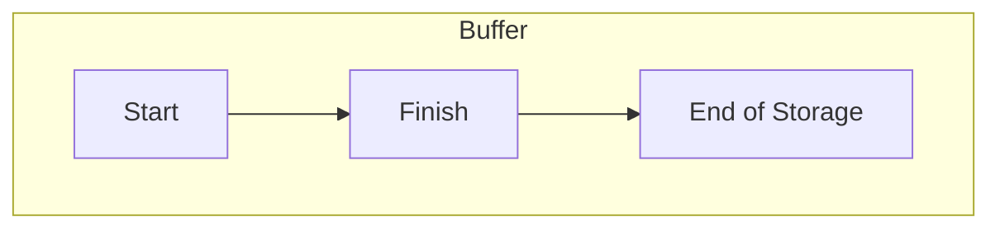
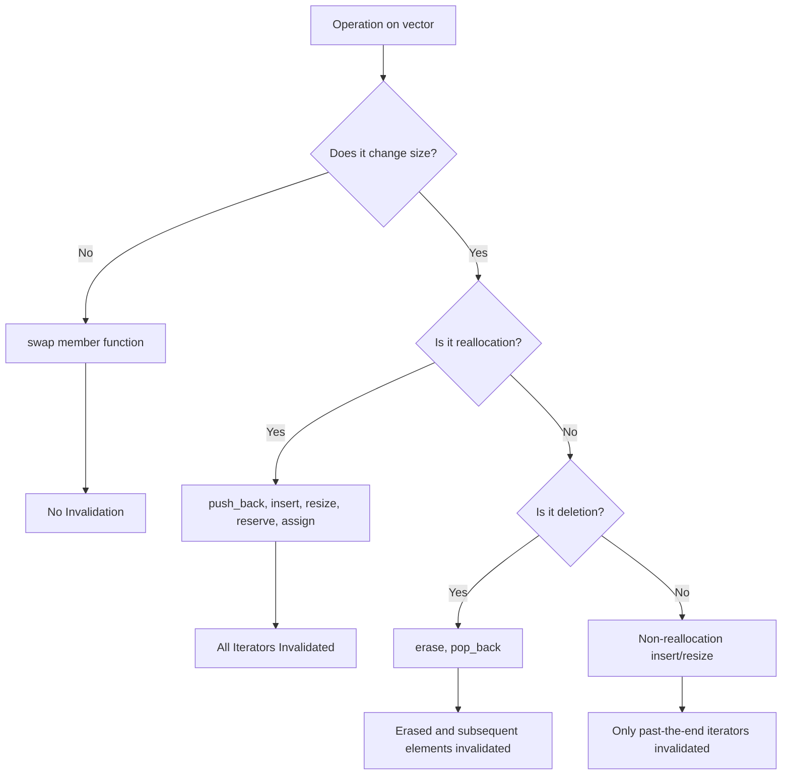

# Deep Dive into vector: Three Pointers, Reallocation, and Iterator Invalidation

In this article, I want to have a thorough discussion with you about the implementation layer of `std::vector`.

In Volume 1, we've been using `std::vector` quite smoothly as a "self-growing array," with `push_back`, `emplace_back`, `size`, and `capacity` at our fingertips. But I must be honest—being able to use it smoothly and truly understanding it are two different things. Have you ever encountered these weird situations: calling `push_back` continuously in a loop, where it's blazingly fast most of the time, but inexplicably stutters horribly on one specific iteration; or you carefully cache an iterator or a pointer, and one day it points to a piece of garbage; or you thought you wrote strong exception safety code, but a reallocation quietly tore a hole in it?

These pitfalls have their roots entirely in the implementation layer of `std::vector`. So, in this article, we won't repeat how to call those APIs from Volume 1 (you surely know that by now). Instead, we will break `std::vector` down into three pointers, a reallocation strategy, and a table of invalidation rules, and then conveniently connect the two new doors C++20 opened for it—`constexpr` and `std::erase_if`.

------

## Three Pointers Hold Up the Entire vector

In mainstream standard library implementations (libstdc++, libc++, MSVC STL), the body of a `std::vector` is actually just three pointers. Not an array, not a linked list, just three pointers: `_M_start` pointing to the first element, `_M_finish` pointing to the position "after" the last valid element, and `_M_end_of_storage` pointing to the end of the allocated buffer. (I remember there was a question on Zhihu about this, and mainstream implementations are indeed like this.)



Once you follow this diagram, everything makes sense: `size()` is just `_M_finish - _M_start`, `capacity()` is `_M_end_of_storage - _M_start`, and the "capacity" is precisely the number of elements you can still stuff in without reallocation. The standard text doesn't actually mandate that `std::vector` must look like this (it only requires contiguous storage plus a bunch of interface behaviors), but once you know the underlying layer is these three pointers, all subsequent features become logical:

1. Reallocation is nothing more than moving this chunk of `_M_start` to `_M_end_of_storage` to a new buffer;
2. Iterator invalidation is nothing more than the buffer being swapped out;
3. `data()` can feed directly into C APIs simply because `_M_start` points to a whole chunk of contiguous raw memory.

## Reallocation: Amortized Constant, but Single Call Can Be O(n)

So what happens when you `push_back` into a `std::vector` that is already full? It triggers a *reallocation*—applying for a new buffer, moving old elements over, and releasing the old buffer. The standard's guarantee for this step is **amortized constant time complexity** for `push_back`. Please hold onto the word "amortized"; it is not "constant."

This is too easily misread as "`push_back` is O(1) every time," so some friends confidently put `push_back` in hot loops, only to see one specific reallocation result in an O(n) move, causing a sharp spike in the performance curve. Why does amortized analysis hold? The key is that during each reallocation, the capacity grows by a geometric factor greater than 1, so the cost of that one expensive move is spread (amortized) over the previous several cheap `push_back` calls.

(PS: I've been incredibly busy lately. If you find this topic interesting, try profiling it locally!)

```mermaid
gantt
    title Vector Capacity Growth Strategy
    dateFormat s
    axisFormat %s

    section Cheap Operations
    push_back (O(1))    :active, 0, 1
    push_back (O(1))    :active, 1, 2
    push_back (O(1))    :active, 2, 3

    section Expensive Operation
    Reallocation (O(n)) :crit, 3, 5
```



So what is this multiplier exactly? Well, **the standard doesn't specify** (strictly speaking, it's *unspecified*, which is looser than *implementation-defined*; the latter at least requires the implementation to document it). So the three big players chose their own paths: libstdc++ and libc++ are both approximately 2× (formulas are `capacity() * 2` and `capacity() + capacity() / 2` respectively), while MSVC STL uses 1.5× (`capacity() * 3 / 2`). If you don't believe me, `push_back` 16 elements in a row and print `capacity()`—libstdc++/libc++ follow the sequence 1, 2, 4, 8, 16, while MSVC follows 1, 2, 3, 4, 6, 9, 13, 19...

MSVC choosing 1.5× wasn't a random decision. When the multiplier is strictly less than 2, the free blocks released earlier have a chance to be reused by a later allocation—mathematically:

$$ \text{prev\_size} \times \text{growth\_factor} \le \text{prev\_size} + \text{block\_size} $$

This means a previously released block might be large enough to satisfy the current request, allowing the allocator to reuse it, reduce fragmentation, and keep RSS (Resident Set Size) from staying too high. With strict 2×, `prev_size * 2 > prev_size + block_size`, so no previously released block can fit the current request, making reuse impossible. The cost, of course, is that 1.5× involves more moves. This is a trade-off between "memory reuse" and "number of moves," and each vendor has their own calculation. (There's a small boundary case: the very first `push_back` jumps capacity from 0 to 1 directly, all three agree on this. It's purely a special case of "initially 0," don't use this to verify the 2×/1.5× rule.)

> ⚠️ Let me say it again: when writing performance conclusions, please use "amortized constant." Don't write "constant" just to save space. The single `push_back` that triggers reallocation is genuinely O(n).

## Iterator Invalidation: A Table Covers All Rules

Probably no container makes it easier to trip over "iterator invalidation" than `std::vector`—you store an iterator or a pointer, and after some operation, it quietly becomes a dangling pointer. The rules can actually be summarized in a table:

| Operation | When Invalidated | Scope of Invalidation |
|------|---------|---------|
| `push_back` / `emplace_back` | Only when reallocation is triggered | If triggered: **All** invalidated; if not (space remains): **None** invalidated |
| `resize` | When `resize` triggers reallocation | If triggered: All invalidated; otherwise: Not invalidated |
| `reserve` | If reallocation occurs | All invalidated |
| `insert` | `insert` triggers reallocation | If triggered: All invalidated; otherwise references/pointers not invalidated, only past-the-end iterators invalidated |
| `pop_back` / `erase` | Always | **Deleted element and those after it** are all invalidated |
| `assign` | If reallocation | If triggered: All invalidated; otherwise `begin()` and after are invalidated |
| `clear` | Always | All invalidated |
| `operator=` / `swap` | Always | All invalidated |
| `swap` (member) | —— | **Not invalidated**: Iterators/pointers/references remain valid, but they now point to elements in the "other" container |

Think the table is too dense? Compress it into a decision tree and it's easier to remember:



The easiest one to remember backwards in the table is the last one, `swap`. It doesn't invalidate—you swapped the contents of the containers, but the iterators remain pinned to their original memory blocks, so they now point to the container that was swapped in. Once you understand this, you can see why some libraries like to write weird code like `std::vector<T>().swap(x)` to "truly release" memory: it swaps in an empty temporary object, taking the original buffer and capacity away to be destructed, leaving things squeaky clean.

## move_if_noexcept During Reallocation

The strong exception guarantee requires that an operation either succeeds completely or leaves the state unchanged. When `std::vector` triggers reallocation, it must move old elements to the new buffer one by one. This step itself is a potential exception throwing point. To achieve "can rollback if moving fails halfway," the standard library makes a critical judgment on each element during reallocation: **if the element's move constructor is `noexcept`, move; otherwise, honestly fall back to copy.**

The basis for this judgment is `std::is_nothrow_move_constructible_v`. Translating this—if you wrote a move constructor for your type but didn't mark it `noexcept`, `std::vector` won't feel safe during reallocation and would rather take the slower copy path. Why? If a copy fails, the old buffer is still there, so we can rollback. If a move fails, the source element might have been gutted already, making recovery impossible. So my advice is simple: if you can add `noexcept` to a move constructor, definitely do it. It directly decides whether reallocation in `std::vector` is a "move" or a "copy raid." The standard library specifically prepared a `std::move_if_noexcept` tool for this, though its real stage is exactly this kind of job inside containers "choosing between move/copy based on exception safety."

## Two New Doors C++20 Opened for vector

### One Door is Called constexpr vector

C++20 finally allows `std::vector` to be used at compile time. Behind this are two proposals接力: **P0784R7** "More constexpr containers" first laid the mechanism—making `std::vector`'s `allocator`/`deallocator` and `construct`/`destroy` `constexpr`, plus a model called *transient constexpr allocation*; **P1004R2** "Making std::vector constexpr" then built on this mechanism to mark `std::vector` (and `std::string` by the way) member functions as `constexpr` one by one. To detect support, check the `__cpp_lib_constexpr_vector` feature test macro.

There is a **must-clarify** limitation here: the transient allocation model requires that *memory allocated during constant evaluation must be released before the end of that same constant evaluation*, otherwise the program is ill-formed. In plain English—you can't define a persistent `constexpr` variable and "bring out" its buffer containing heap objects from compile time to runtime. So how exactly do you use `std::vector` at compile time? The correct posture is: temporarily create it inside a `constexpr` function, do a bunch of operations, and finally **only return a scalar result** (sum of elements, count of elements, value of a certain element are all fine), letting the buffer destruct itself before the function returns. This fits embedded and lookup table scenarios perfectly—use `std::vector` as a temporary workspace at compile time to calculate a constant, then move the result into a `std::array` or `constexpr` variable, saving all runtime initialization.

### The Other Door is Called erase / erase_if

In old C++, to delete all elements satisfying a condition from a `std::vector`, you had to hand-write the famous erase-remove idiom: `v.erase(std::remove(v.begin(), v.end(), value), v.end());`. It's long and error-prone—I've seen accident sites where people forgot the second parameter's `.end()`, or forgot to wrap the outer `erase`. C++20 incorporated this with a pair of free functions: `std::erase` deletes all elements equal to `value`, `std::erase_if` deletes all elements satisfying a predicate, and both return the number of elements deleted.

These functions come from proposal **P1209R0**, titled "Adopt Consistent Container Erasure from Library Fundamentals 2 for C++20"—just looking at the title you understand their intent: to officially land the unified erasure API that was originally in the Library Fundamentals TS into C++20. cppreference has a crisp definition for them: they *"erase all elements that compare equal to value / satisfy the predicate from the container"*, replacing that error-prone erase-remove. A detail not to mix up: sequence containers (`vector`, `deque`, `forward_list`, `list`, `string`) get both `std::erase` and `std::erase_if`, while associative/unordered associative containers only have `std::erase_if`—because their member `erase` was already doing "delete by key," and stuffing another `std::erase` in would cause semantic conflict. To detect support, look at `__cpp_lib_erase_if` (C++20, value `202002L`).

------

## Let's Run It

Talk is cheap. The sections below are marked with platform and standard and can be compiled standalone. We will run through the previous concepts one by one.

First, observe reallocation. Print a line every time capacity changes, so you can intuitively see whether yours is 2× or 1.5×.

```cpp
// g++ -std=c++20 ./demo_reallocation.cpp -o demo
#include <vector>
#include <iostream>

int main() {
    std::vector<int> v;
    std::size_t last_cap = 0;

    // Push 16 elements to observe capacity jumps
    for (int i = 0; i < 16; ++i) {
        v.push_back(i);
        if (v.capacity() != last_cap) {
            std::cout << "Size: " << v.size()
                      << ", New Capacity: " << v.capacity() << std::endl;
            last_cap = v.capacity();
        }
    }
    return 0;
}
```

Second, compare the two scenarios of iterator invalidation. `push_back` doesn't invalidate when there is room, but invalidates all once reallocation triggers; `reserve` inevitably swaps buffers once it exceeds current capacity.

```cpp
// g++ -std=c++20 ./demo_invalidation.cpp -o demo
#include <vector>
#include <iostream>

int main() {
    std::vector<int> v(5, 100); // size 5, capacity 5
    auto it = v.begin();        // Points to first element

    // Scenario 1: push_back without reallocation
    // v.push_back(1); // If uncommented, 'it' is still valid (capacity > size)

    // Scenario 2: push_back with reallocation
    v.push_back(1); // Triggers reallocation (size 6 > capacity 5)

    if (it == v.begin()) {
        std::cout << "Iterator valid" << std::endl;
    } else {
        std::cout << "Iterator invalidated (dangling)" << std::endl;
    }

    return 0;
}
```

Third, `move_if_noexcept`. For a type with a move constructor marked `noexcept`, reallocation moves; without it, it falls back to copy.

```cpp
// g++ -std=c++20 ./demo_move_if_noexcept.cpp -o demo
#include <vector>
#include <iostream>
#include <string>

struct CopyOnly {
    std::string data;
    CopyOnly(const std::string& s) : data(s) {}
    // Move constructor NOT noexcept (or not defined)
    CopyOnly(CopyOnly&& other) noexcept(false) : data(std::move(other.data)) {}
    CopyOnly(const CopyOnly& other) : data(other.data) {}
};

struct MoveOnly {
    std::string data;
    MoveOnly(const std::string& s) : data(s) {}
    // Move constructor IS noexcept
    MoveOnly(MoveOnly&& other) noexcept(true) : data(std::move(other.data)) {}
    MoveOnly(const MoveOnly& other) = delete;
};

int main() {
    std::cout << "Testing CopyOnly (fallback to copy)..." << std::endl;
    std::vector<CopyOnly> v1;
    v1.reserve(1);
    v1.emplace_back("A"); // No reallocation
    // Trigger reallocation: will use Copy Constructor because Move is not noexcept
    v1.emplace_back("B");

    std::cout << "Testing MoveOnly (use move)..." << std::endl;
    std::vector<MoveOnly> v2;
    v2.reserve(1);
    v2.emplace_back("A"); // No reallocation
    // Trigger reallocation: will use Move Constructor
    v2.emplace_back("B");

    return 0;
}
```

Fourth, `constexpr vector`. Use it as a temporary workspace at compile time, only bringing out scalar results.

```cpp
// g++ -std=c++20 ./demo_constexpr_vector.cpp -o demo
#include <vector>
#include <cassert>

// Compile-time calculation using vector
constexpr int sum_range(int n) {
    std::vector<int> v; // Transient allocation
    v.reserve(n);

    int sum = 0;
    for (int i = 0; i < n; ++i) {
        v.push_back(i);
        sum += v.back();
    }
    // v is destroyed here, memory released
    return sum;
}

int main() {
    // Result is computed at compile time
    constexpr int s = sum_range(10);
    static_assert(s == 45, "Sum check");

    std::cout << "Sum of 0..9 is " << s << std::endl;
    return 0;
}
```

Fifth, `std::erase_if`, one line to replace erase-remove.

```cpp
// g++ -std=c++20 ./demo_erase_if.cpp -o demo
#include <vector>
#include <algorithm>
#include <iostream>

int main() {
    std::vector<int> v = {1, 2, 3, 4, 5, 6, 7, 8, 9, 10};

    // Old way (C++98)
    // v.erase(std::remove(v.begin(), v.end(), 5), v.end());

    // New way (C++20)
    std::erase(v, 5); // Remove all elements equal to 5

    // Remove all even numbers
    std::erase_if(v, [](int x) { return x % 2 == 0; });

    for (auto x : v) {
        std::cout << x << " ";
    }
    std::cout << std::endl;

    return 0;
}
```

Of course, you can also click here to see the phenomenon!

<OnlineCompilerDemo
  title="Deep Dive into vector Implementation: Reallocation, Invalidation, constexpr, erase_if"
  source-path="code/examples/vol3/03_vector_deep_dive.cpp"
  description="Observe vector capacity jumps, iterator invalidation, move_if_noexcept, and C++20 constexpr/erase_if"
  allow-run
  allow-x86-asm
/>

------

## Final Thoughts

Piecing these back into engineering practice, my advice usually boils down to a few points. First, **if you can estimate the scale, `reserve` it**—right after constructing the `std::vector`, `reserve` it based on the known or estimated final size, compressing several reallocations into a single allocation, which is immediately effective in hot paths. Second, **use `std::erase_if` for deleting elements**, stop hand-writing erase-remove, it's shorter and less likely to miss that `.end()`. Third, **for compile-time table generation, use `std::vector` as a temporary area**, calculate it, and only hand the scalar result to `std::array` or stuff it into a `constexpr` variable, comfortably enjoying the compile-time dynamic capabilities given by transient allocation without crossing the line.

Finally, leave an impression: the body of `std::vector` is roughly three pointers `_M_start`, `_M_finish`, `_M_end_of_storage`, and `size()`/`capacity()` are calculated from them; `push_back` is amortized constant, not constant, and the growth factor isn't specified by the standard (libstdc++/libc++ use 2×, MSVC uses 1.5×); invalidation rules are just one table—"reallocation-type operations invalidate all only if triggered," `erase` invalidates "deleted and subsequent," `swap` doesn't invalidate at all; whether elements move during reallocation depends on if the move constructor is marked `noexcept`; C++20 makes `std::vector` `constexpr` (P0784R7 + P1004R2), but limited by transient allocation to be a compile-time temporary area only; in the same year `std::erase`/`std::erase_if` (P1209R0) took care of erase-remove for you. Keep these in your pocket, and you'll basically avoid all `std::vector` pitfalls.

------

## References

- [std::vector — cppreference](https://en.cppreference.com/w/cpp/container/vector)
- [vector::capacity — cppreference](https://en.cppreference.com/w/cpp/container/vector/capacity)
- [vector::push_back — cppreference](https://en.cppreference.com/w/cpp/container/vector/push_back)
- [std::erase / std::erase_if (vector) — cppreference](https://en.cppreference.com/w/cpp/container/vector/erase2)
- [vector.capacity — eel.is/c++draft](https://eel.is/c++draft/vector.capacity) · [sequence.reqmts — eel.is/c++draft](https://eel.is/c++draft/sequence.reqmts)
- [P0784R7 More constexpr containers](https://www.open-std.org/jtc1/sc22/wg21/docs/papers/2019/p0784r7.html)
- [P1004R2 Making std::vector constexpr](https://www.open-std.org/jtc1/sc22/wg21/docs/papers/2019/p1004r2.pdf)
- [P1209R0 Adopt Consistent Container Erasure from Library Fundamentals 2 for C++20](https://www.open-std.org/jtc1/sc22/wg21/docs/papers/2018/p1209r0.html)
