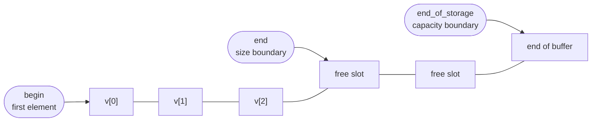
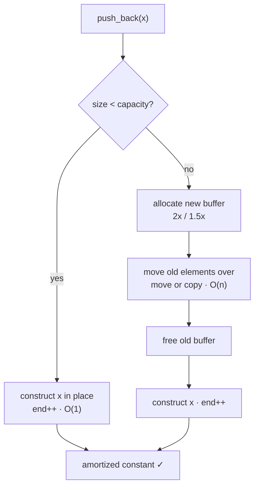
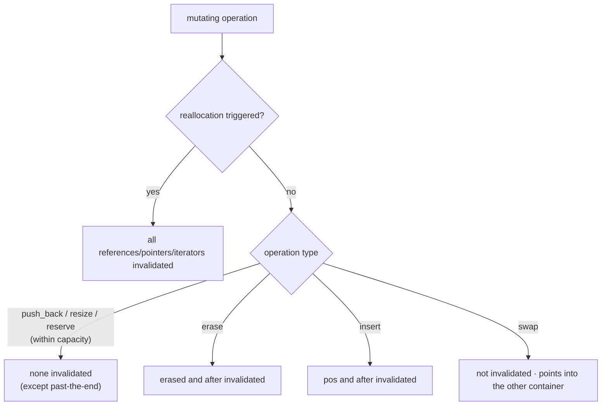

# Deep Dive into vector: Three Pointers, Reallocation, and Iterator Invalidation

In this article, we want to sit down and properly talk about the implementation layer of `std::vector`.

Back in Volume One we already drove `vector` smoothly as a "self-growing array"—`push_back`, `size()`, `capacity()`, `reserve()` all rolled off our fingers. But we have to say one honest thing here: using it fluently and truly understanding it are two different things. Have you ever run into one of these uncanny situations: a loop that keeps calling `push_back`, blazing fast the overwhelming majority of the time, yet one particular call stutters absurdly; or you carefully cache an iterator, a pointer, and one day it points at a pile of garbage; or the strong exception safety you thought you had written rock-solid gets quietly ripped open by a single reallocation.

The roots of all these traps are buried in `vector`'s implementation layer. So in this article we won't rehash how to call those Volume One APIs (you surely know that part by now); instead we'll tear `vector` down into three pointers, one growth strategy, and one table of invalidation rules, and then hook up the two new doors C++20 opened for it—`constexpr` and `erase/erase_if`.

------

## Three Pointers Hold Up the Entire vector

In the mainstream standard library implementations (libstdc++, libc++, MSVC STL), the body of a `vector` is literally three pointers. Not an array, not a linked list—just `begin` pointing at the first element, `end` pointing at the "one past" position after the last valid element, and `end_of_storage` pointing at the end of the allocated buffer. (We remember seeing a question about this on Zhihu; the mainstream implementations do look exactly like this.)


```mermaid
flowchart LR
    BEGIN(["begin<br/>first element"]) --> S0["v[0]"]
    TAIL(["end<br/>size boundary"]) --> S3["free slot"]
    CAP(["end_of_storage<br/>capacity boundary"]) --> S5["end of buffer"]
    S0 --- S1["v[1]"] --- S2["v[2]"] --- S3 --- S4["free slot"] --- S5
```

Follow this diagram through and everything clicks: `size()` is just `end - begin`, `capacity()` is just `end_of_storage - begin`, and `capacity() - size()` is exactly the number of elements you can still stuff in without triggering a reallocation. The standard text doesn't actually mandate that `vector` must be shaped this way (it only requires contiguous storage plus a pile of interface behaviors), but once you know the underlying machinery is these three pointers, every property that follows becomes perfectly natural:

1. Reallocation is nothing more than hauling the `[begin, end)` chunk over to a new buffer;
2. Iterator invalidation is nothing more than the buffer being swapped out from under you;
3. `data()` can be fed straight to C APIs, simply because what `begin` points at is one whole block of contiguous raw memory.

## Reallocation: They Call It Amortized Constant, but a Single Call Can Be O(n)

So what happens when you `push_back` into a `vector` whose `capacity` is already stuffed full? It triggers a *reallocation*—requesting a new buffer, moving the old elements over, and freeing the old buffer. The standard's promise for this step is **amortized constant complexity** of `push_back`. Please, everyone, burn the word "amortized" into your memory—it is not "constant".

This wording is far too easy to read as "every `push_back` is O(1)", so some folks confidently stuff `push_back` into hot loops—only for one particular reallocation to be a straight-up O(n) house move, dropping a sharp spike onto the performance curve. Why does amortized analysis hold up? The key is that at every reallocation, the capacity is multiplied up by a geometric factor greater than 1, so the cost of that one expensive move gets spread across the preceding run of cheap `push_back` calls.

(PS: we've been swamped lately, but if you find this topic interesting, try profiling it locally!)


```mermaid
flowchart TD
    A["push_back(x)"] --> Q{"size &lt; capacity?"}
    Q -- "yes" --> C["construct x in place<br/>end++ · O(1)"]
    Q -- "no" --> D["allocate new buffer<br/>2x / 1.5x"]
    D --> E["move old elements over<br/>move or copy · O(n)"]
    E --> F["free old buffer"]
    F --> G["construct x · end++"]
    C --> H["amortized constant ✓"]
    G --> H
```

So what exactly is this factor? Sorry to disappoint: **the standard doesn't specify it** (strictly speaking it is *unspecified*, which is even looser than *implementation-defined*—the latter at least requires the implementation to write it into its documentation). So each of the big three picked its own: libstdc++ and libc++ both sit at roughly 2× (formulas `size()+max(size(),n)` and `max(2*capacity(),n)` respectively), while MSVC STL uses 1.5× (`capacity()+capacity()/2`). If you don't believe it, `push_back` 16 elements in a row and print `capacity()` yourself—libstdc++/libc++ walk `0 → 1 → 2 → 4 → 8 → 16 → 32`, while MSVC walks `0 → 1 → 2 → 3 → 4 → 6 → 9 → 13 → 19`.

MSVC's choice of 1.5× wasn't a coin flip. When the factor is strictly less than 2, the free blocks released by earlier reallocations can actually get reused by some later allocation—mathematically,

$$\sum_{i=0}^{k-1} 1.5^i = 2(1.5^k - 1) > 1.5^k$$

meaning that if some previously freed block is large enough to hold the current request, the allocator can reuse it, generate less fragmentation, and keep RSS from staying persistently high. With strict 2×, on the other hand, $\sum_{i=0}^{k-1} 2^i = 2^k - 1 < 2^k$: no previously freed block can ever fit the current request, so reuse never happens. Of course there is a price: 1.5× means more moves. It's a trade-off between "memory reuse vs. number of moves", and each side runs its own arithmetic. (There's also a small edge case: the very first `push_back` jumps capacity from 0 straight to 1, identically across all three—purely a special case of "starting from 0"; don't use it to extrapolate the 2×/1.5× rules.)

> ⚠️ Let us nag once more: when you write performance conclusions, say "amortized constant", don't take the shortcut and write "constant". The single `push_back` that triggers a reallocation is a solid, genuine O(n).

## Iterator Invalidation: One Table for All the Rules

Probably no container trips people up on "iterator invalidation" more than `vector`—you save an iterator, you save a pointer, some operation goes by, and it has quietly become a wild pointer. The rules can actually be boiled down into one table:

| Operation | When It Invalidates | Scope of Invalidation |
|------|---------|---------|
| `push_back` / `emplace_back` | Only when a reallocation is triggered | **All** invalidated when triggered; **none** when not (spare capacity remains) |
| `reserve(n)` | When `n > current capacity()` triggers a reallocation | All if triggered; otherwise none |
| `shrink_to_fit` | If a reallocation occurs | All |
| `resize(n)` | `n > capacity()` triggers a reallocation | All if triggered; otherwise references/pointers stay valid, only past-the-end iterators are invalidated |
| `erase(p)` / `erase(first, last)` | Always | **The erased elements and everything after them** |
| `insert` / `emplace` | If a reallocation occurs | All if triggered; otherwise from `pos` onward |
| `clear` | Always | All |
| `assign` / `assign_range` | Always | All |
| `swap` | —— | **No invalidation**: iterators/pointers/references remain valid, but they now refer to elements in the "other" container |

Table too dense for your taste? Compress it into a decision tree and it becomes easy to remember:


```mermaid
flowchart TD
    OP["mutating operation"] --> T{"reallocation triggered?"}
    T -- "yes" --> ALL["all references/pointers/iterators invalidated"]
    T -- "no" --> K{"operation type"}
    K -- "push_back / resize / reserve<br/>(within capacity)" --> NONE["none invalidated<br/>(except past-the-end)"]
    K -- "erase" --> AFTER["erased and after invalidated"]
    K -- "insert" --> POS["pos and after invalidated"]
    K -- "swap" --> SWAP["not invalidated · points into the other container"]
```

The row easiest to get backwards is the last one, `swap`. It invalidates nothing—what you swap away is the container's contents, but the iterator stays pinned to that original chunk of memory, so what it points into now is the container that was swapped in. Once you understand this, you can see why some libraries love writing eerie-looking code like `vector<T>().swap(v)` to "truly release" memory: it swaps in an empty temporary, carries the original buffer off to destruction along with the capacity, and leaves things spotless.

## move_if_noexcept during Reallocation

The strong exception guarantee demands that an operation either succeeds or leaves the state untouched. When a `push_back` triggers a reallocation, the old elements have to be moved over to the new buffer one by one, and this step is itself a potential throw point. So to allow "roll back even if the move fails halfway", the standard library passes a key judgment on every element during reallocation: **if this element's move constructor is `noexcept`, move it; otherwise, honestly retreat to copying.**

The verdict hangs on `std::is_nothrow_move_constructible_v<T>`. To put it plainly—if you wrote a move constructor for your type but didn't mark it `noexcept`, `vector` gets nervous at reallocation time and would rather take the slower copy. Why? If a copy fails, the old buffer is still there and you can roll back; if a move fails, the source element may already have been gutted—beyond saving. Hence our advice is plain: whenever a move constructor can be `noexcept`, mark it so. Inside `vector`, it directly decides whether a reallocation "moves house" or "copies the whole house down". The standard library keeps a dedicated tool for this, `std::move_if_noexcept`, though its real stage is precisely this kind of container-internal job: "pick move or copy based on exception safety".

## The Two New Doors C++20 Opened for vector

### One Door Is Called constexpr vector

C++20 finally lets `vector` work at compile time. Behind it are two proposals running a relay: **P0784R7**, "More constexpr containers", first laid down the machinery—`constexpr` `new`/`delete`, `std::construct_at`/`std::destroy_at`, plus a model called *transient constexpr allocation*; then **P1004R2**, "Making std::vector constexpr", built on top of that machinery, marking `vector`'s (and, while at it, `string`'s) member functions `constexpr` one by one. To probe for support, just check the feature-test macro `__cpp_lib_constexpr_vector`.

Here is a limitation we **must thrash out clearly**: the transient allocation model demands that *memory allocated during constant evaluation must be released before that same constant evaluation ends*, otherwise the program is straight-up ill-formed. In plain words—you cannot define a persistent `constexpr std::vector` variable and "carry" its buffer of heap objects out of compile time. So how do you actually use `vector` at compile time? The correct posture: inside a `constexpr` function, create it as a temporary, run a batch of operations, and at the end **return only a scalar result** (a sum of elements, an element count, some element value—all fine), letting the buffer destruct itself before the function returns. This suits embedded and table-lookup scenarios to a T—use `vector` at compile time as a temporary workspace to compute a constant, then move the result into a `std::array` or a `constexpr` variable, and all the runtime initialization is saved.

### The Other Door Is Called erase / erase_if

In old C++, removing every element satisfying a condition from a `vector` meant hand-writing that famous erase-remove idiom: `v.erase(std::remove_if(v.begin(), v.end(), pred), v.end());`. Long and easy to get wrong—forgetting the second argument's `v.end()`, forgetting to wrap the outer `erase`—we've seen those accident scenes firsthand. C++20 corralled it with a pair of free functions: `std::erase(v, value)` removes everything equal to `value`, `std::erase_if(v, pred)` removes everything satisfying the predicate, and both return the number of elements removed.

This pair of functions comes from proposal **P1209R0**, titled "Adopt Consistent Container Erasure from Library Fundamentals 2 for C++20"—the title alone tells you its intent: formally landing the unified erasure API that had been sitting in the Library Fundamentals TS into C++20. cppreference gives them one crisply definitional line: they *"erase all elements that compare equal to value / satisfy the predicate from the container"*, replacing exactly that error-prone erase-remove. One detail not to mix up: sequence containers (`vector`, `deque`, `list`, `forward_list`, `string`) got both `erase` and `erase_if`, while the associative/unordered associative containers got only `erase_if`—because their member `erase(key)` was already doing the "delete by key" job, and stuffing an `erase(c, value)` in alongside would pick a semantic fight. Probe for support with `__cpp_lib_erase_if` (C++20, value `202002`).

------

## Hands-On Time

All talk and no practice is kung fu on paper; the snippets below are all tagged with platform and standard, and each compiles standalone. We'll run through the earlier concepts one by one.

First up, watching reallocation. Every time the capacity changes we print a line, so you can see with your own eyes whether your toolchain of choice is 2× or 1.5×.

```cpp
// Standard: C++17  | Platform: host
#include <iostream>
#include <vector>

void trace_growth(std::vector<int>& v, int value)
{
    std::size_t cap_before = v.capacity();
    v.push_back(value);
    if (v.capacity() != cap_before) {
        std::cout << "push " << value << ": size=" << v.size()
                  << " capacity " << cap_before << " -> " << v.capacity() << '\n';
    }
}

int main()
{
    std::vector<int> v;
    for (int i = 0; i < 17; ++i) {
        trace_growth(v, i);
    }
    return 0;
}
```

Second, the two iterator-invalidation scenarios side by side. `push_back` invalidates nothing while spare capacity remains, and invalidates everything the moment a reallocation triggers; `reserve`, once it exceeds the current capacity, inevitably swaps the buffer.

```cpp
// Standard: C++17  | Platform: host
#include <iostream>
#include <vector>

int main()
{
    std::vector<int> v{1, 2, 3};
    v.reserve(3);  // Reserve: we already hold 3, no reallocation

    const int* p = &v[1];
    v.push_back(4);  // 1 slot of spare capacity left, no reallocation
    std::cout << "no realloc, p valid? " << (p == &v[1]) << '\n';  // 1

    v.reserve(100);  // Exceeds capacity, buffer is inevitably swapped
    std::cout << "after reserve, p valid? " << (p == &v[1]) << '\n';  // 0, now invalidated
    return 0;
}
```

Third, `move_if_noexcept`. For a type whose move constructor is marked `noexcept`, reallocation moves; unmarked, it retreats to copy.

```cpp
// Standard: C++17  | Platform: host
#include <iostream>
#include <vector>

class Tracked {
public:
    int id;
    static int move_count;
    static int copy_count;

    explicit Tracked(int i) : id(i) {}
    Tracked(const Tracked& o) : id(o.id) { ++copy_count; }
    // Deliberately not marked noexcept: reallocation distrusts it and retreats to copy
    Tracked(Tracked&& o) noexcept(false) : id(o.id) { ++move_count; }
};
int Tracked::move_count = 0;
int Tracked::copy_count = 0;

int main()
{
    std::vector<Tracked> v;
    v.reserve(2);
    v.emplace_back(1);
    v.emplace_back(2);
    v.emplace_back(3);  // Triggers reallocation

    std::cout << "moves=" << Tracked::move_count
              << " copies=" << Tracked::copy_count << '\n';
    // Unmarked noexcept mostly takes copy; change noexcept(false) to noexcept and run again, it becomes move
    return 0;
}
```

Fourth, `constexpr vector`. Use it at compile time as a temporary workspace, carrying out only the scalar result.

```cpp
// Standard: C++20  | Platform: host
#include <vector>

constexpr int sum_first_n(int n)
{
    std::vector<int> v;
    for (int i = 0; i < n; ++i) {
        v.push_back(i + 1);  // Allocated during constant evaluation, must be released before the function returns
    }
    int sum = 0;
    for (int x : v) {
        sum += x;
    }
    return sum;  // Return only a scalar; the buffer destructs naturally within the function
}

static_assert(sum_first_n(100) == 5050);  // Entirely done at compile time

int main() { return 0; }
```

Fifth, `erase_if`, one line that does away with erase-remove.

```cpp
// Standard: C++20  | Platform: host
#include <iostream>
#include <vector>

int main()
{
    std::vector<int> v{1, 2, 3, 4, 5, 6};
    std::size_t removed = std::erase_if(v, [](int x) { return x % 2 == 0; });
    std::cout << "removed " << removed << ", left:";
    for (int x : v) {
        std::cout << ' ' << x;
    }
    std::cout << '\n';  // removed 3, left: 1 3 5
    return 0;
}
```

And of course, feel free to poke this and watch the behavior for yourself!

<OnlineCompilerDemo
  title="vector Implementation Deep Dive: Reallocation, Invalidation, constexpr, erase_if"
  source-path="code/examples/vol3/03_vector_deep_dive.cpp"
  description="Watch vector's reallocation capacity jumps, iterator invalidation, move_if_noexcept, and C++20 constexpr/erase_if"
  allow-run
  allow-x86-asm
/>

------

## A Few Parting Words

Stitching the foregoing back into engineering practice, the advice we keep repeating boils down to a few lines. One: **if you can estimate the size, `reserve`**—right after constructing the `vector`, immediately `reserve` for the known or guessed final size, collapsing several reallocations into a single allocation; on hot paths the payoff is immediate. Two: **use `erase_if` to remove elements**—stop hand-writing erase-remove; it's shorter and makes it much harder to drop that `v.end()`. Three: **for compile-time table computation, treat `vector` as a scratch zone**—when done, hand only the scalar result to `static_assert` or tuck it into a `constexpr` variable, comfortably enjoying the compile-time dynamism that transient allocation grants, without stepping over the line.

Finally, leave with this impression: a `vector`'s body is approximately three pointers `{begin, end, end_of_storage}`, and `size`/`capacity` are both computed from them; `push_back` is amortized constant, not constant, and the growth factor is unspecified by the standard (libstdc++/libc++ use 2×, MSVC uses 1.5×); the invalidation rules fit in one table—reallocation-style operations "invalidate all only when triggered", `erase` "invalidates the erased and everything after", and `swap` doesn't invalidate at all; whether elements move during reallocation depends on whether the move constructor is marked `noexcept`; C++20 made `vector` `constexpr` (P0784R7 + P1004R2), but under the transient-allocation restriction it can only serve as a compile-time temporary zone; and that same release, `erase`/`erase_if` (P1209R0) did away with erase-remove for you. Tuck these into your pocket, and you'll be basically immune to `vector`'s pitfalls.

------

## References

- [std::vector — cppreference](https://en.cppreference.com/w/cpp/container/vector)
- [vector::capacity — cppreference](https://en.cppreference.com/w/cpp/container/vector/capacity)
- [vector::push_back — cppreference](https://en.cppreference.com/w/cpp/container/vector/push_back)
- [std::erase / std::erase_if (vector) — cppreference](https://en.cppreference.com/w/cpp/container/vector/erase2)
- [vector.capacity — eel.is/c++draft](https://eel.is/c++draft/vector.capacity) · [sequence.reqmts — eel.is/c++draft](https://eel.is/c++draft/sequence.reqmts)
- [P0784R7 More constexpr containers](https://www.open-std.org/jtc1/sc22/wg21/docs/papers/2019/p0784r7.html)
- [P1004R2 Making std::vector constexpr](https://www.open-std.org/jtc1/sc22/wg21/docs/papers/2019/p1004r2.pdf)
- [P1209R0 Adopt Consistent Container Erasure from Library Fundamentals 2 for C++20](https://www.open-std.org/jtc1/sc22/wg21/docs/papers/2018/p1209r0.html)
