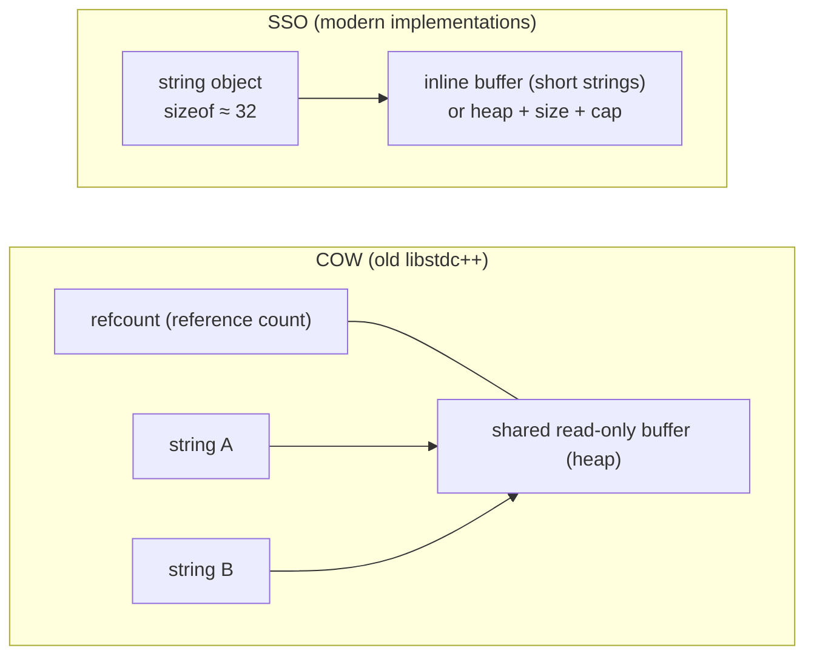
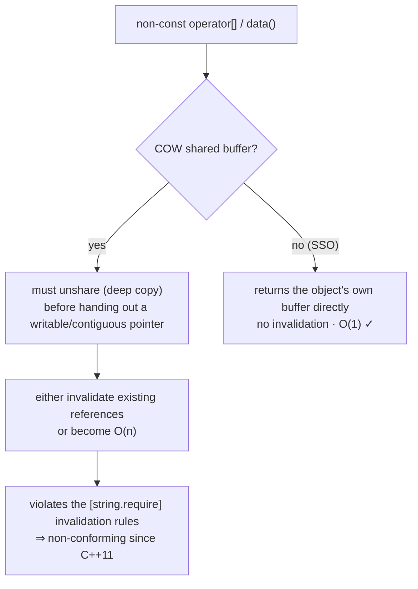

# Deep Dive into string: SSO, COW, and resize_and_overwrite

`std::string` is probably the most-used yet least-understood type in the standard library. Everyone happily writes `std::string s = "hello";` all day long, but the moment someone presses you — "Why is `sizeof(std::string)` 32 on my machine?" "Why do two strings in this old code share the same buffer?" "What exactly does C++23's `resize_and_overwrite` save?" — most of us are stumped. The roots of all these questions lie in `string`'s memory model and its long history.

In this article, we will focus on the single main line of `string`'s memory and buffers: the historical entanglement between SSO and COW, the implementation thresholds of SSO, and the buffer-reuse API that C++23 delivered to us — `resize_and_overwrite`. (C++20's `char8_t` is a separate topic; see [char8_t and UTF-8 Strings](../strings/30-char8-t-utf8.md) elsewhere in this volume.)

------

## SSO and COW: An Old ABI Story

To understand why today's `string` looks the way it does, we have to wind the clock back to C++03. Back then, there was a particularly tempting implementation strategy — **copy-on-write (COW)**: when you wrote `string b = a;`, no characters were actually copied. Instead, `b` shared the same read-only buffer with `a`, with only a reference count maintained on the side; a real deep copy happened only when one side was about to write. In workloads that copy large numbers of read-only strings, this saves a substantial amount of memory and time, and early libstdc++ (GCC's C++ standard library) was a die-hard fan of COW.



Then C++11 arrived, and with one stroke of the standard, COW was ruled "non-conforming". Proposal **N2668**, "Concurrency Modifications to Basic String", rewrote the invalidation rules of `[string.require]` and the semantics of `data()`/`c_str()`. One sentence in the original text could not be more blunt — *"This change effectively disallows copy-on-write implementations."* So what exactly is the legal root cause? A word of caution first: many people assume it is "thread safety" or "`noexcept`" — wrong. Those two are at best side branches that amplified the conflict; the real verdict is these three requirements stacked together:

- **Invalidation rules**: `[string.require]` requires that element accessors — `operator[]`, `at`, `front`, `back`, `begin/end`, and `data()` itself — must not invalidate existing references and iterators.
- **Contiguous, null-terminated `data()`/`c_str()`**: the two must return an array, inside this very object's buffer, that is contiguous and null-terminated.
- **Non-const access must hand out a writable pointer**: the moment `s[0]` or `s.data()` gives you a non-const result, COW is forced to *unshare* (deep-copy) the shared buffer before it can hand you an exclusive, contiguous, writable pointer.



You see it: COW trying to hold "sharing", "no reference invalidation", "O(1)", and "contiguous null-terminated" all in its arms at once is self-contradictory. The standard decisively chose the latter three, and COW duly became non-conforming. Reality then added its own plot twists: libstdc++, weighed down by ABI-compatibility baggage, held out until **GCC 5 (2015)** before switching to a non-COW implementation through the `_GLIBCXX_USE_CXX11_ABI` toggle (its new inline symbol is `std::__cxx11::basic_string`); libc++ and the MSVC implementation descended from Dinkumware, meanwhile, were SSO from day one and never carried this historical debt at all.

## The SSO Threshold: Why sizeof Ends Up at 32

With COW off the stage, mainstream implementations pivoted in unison to **SSO (Small String Optimization)**: set aside a small inline buffer inside the `string` object itself, and any string short enough to fit in that buffer skips the heap entirely — it lives right on the object. This also answers "why is `sizeof(std::string)` 32": the object has to hold the inline buffer, the heap pointer, size, and capacity at once, and mainstream implementations pack all of that into roughly 32 bytes.

One caveat worth stating: the SSO threshold is an **implementation detail — the standard never specifies it** (it falls under QoI, quality of implementation). In mainstream implementations, the thresholds of libstdc++, libc++, and MSVC STL all sit around 15 bytes (libc++ additionally has a 22-byte layout variant). These numbers are not promises — they can change across implementations and versions. So let's put this plainly: **do not bake the threshold into your code as a hard assumption**. Today it is 15; tomorrow, on a different compiler, it may not be.

## resize_and_overwrite: C++23 Finally Lets You Use string as a Buffer

C++23 slipped a genuinely handy member into `string` — `resize_and_overwrite`, from proposal **P1072R10**, "basic_string::resize_and_overwrite". Its most typical use: treat the `string` as a writable buffer and interface with the kind of C API that "writes part of the data, then tells you how much it wrote" (the `read`, `fread`, `getenv` crowd).

The signature looks like this: `template<class Operation> constexpr void resize_and_overwrite(size_type count, Operation op);`. It first grows the string's capacity to at least `count`, then hands the callback `op` a pointer `p` (to the first character of the contiguous storage) together with that `count`; `op` writes the actual content in place and then **returns an integer r that becomes the new length** (required to satisfy `r ∈ [0, count]`). Where is the win? Unlike `resize(count)`, it does **not** value-initialize (zero out) the newly added region, saving one unnecessary pass of writes; you write exactly the bytes you actually need inside the callback, report the real length, and you are done.

Freedom comes at a price, and `resize_and_overwrite` has several UB red lines to keep your eyes on: `op` must return an integer within `[0, count]` — anything outside is undefined behavior; an exception escaping `op` is UB (which is why `op` is usually marked `noexcept`); `op` must not modify `p` or `count` themselves; and finally, every character in the preserved range `[p, p+r)` must be a definite value written by `op`'s own hand — no indeterminate values left behind. One more easily missed point: whether or not this particular call triggers a reallocation, it invalidates every iterator, pointer, and reference. Probe for support with `__cpp_lib_string_resize_and_overwrite` (C++23, value `202110L`).

------

## Let's Run It

First, SSO. We print `sizeof(std::string)`, then check whether the `data()` addresses of a short string and a long string actually land inside the object or not.

```cpp
// Standard: C++17  | Platform: host
#include <iostream>
#include <string>

bool points_inside_object(const std::string& s)
{
    const char* obj = reinterpret_cast<const char*>(&s);
    return s.data() >= obj && s.data() < obj + sizeof(std::string);
}

int main()
{
    std::cout << "sizeof(std::string) = " << sizeof(std::string) << '\n';

    std::string short_s = "hi";       // very likely SSO
    std::string long_s(64, 'x');      // past the SSO threshold, goes to the heap

    std::cout << "short_s.data() in object? " << points_inside_object(short_s) << '\n';  // usually 1
    std::cout << "long_s.data()  in object? " << points_inside_object(long_s) << '\n';   // usually 0
    return 0;
}
```

Next, `resize_and_overwrite` against the old `resize()` idiom. We have built a "fake C API" here — one that writes a fixed payload into the buffer and returns the number of bytes actually written — so the difference between the two styles is plain to see.

```cpp
// Standard: C++23  | Platform: host
#include <algorithm>
#include <cstring>
#include <iostream>
#include <string>

// Simulate a C API: write at most n bytes into buf, return the number actually written
std::size_t fake_read(char* buf, std::size_t n)
{
    static const char msg[] = "hello";
    std::size_t len = std::min(n, sizeof(msg) - 1);
    std::memcpy(buf, msg, len);
    return len;
}

int main()
{
    // Old way: resize(64) value-initializes (zeroes) all 64 characters first, then they get overwritten
    std::string old_buf;
    old_buf.resize(64);
    std::size_t got = fake_read(old_buf.data(), old_buf.size());
    old_buf.resize(got);  // then trim back to the actual length
    std::cout << "old: '" << old_buf << "' (len=" << old_buf.size() << ")\n";

    // C++23: resize_and_overwrite skips zeroing the extra characters; the callback reports the actual length
    std::string buf;
    buf.resize_and_overwrite(64, [](char* p, std::size_t n) noexcept {
        return fake_read(p, n);  // write only the actual bytes, return the new length
    });
    std::cout << "new: '" << buf << "' (len=" << buf.size() << ")\n";
    return 0;
}
```

<OnlineCompilerDemo
  title="string Memory Deep Dive: SSO Observation and resize_and_overwrite"
  source-path="code/examples/vol3/04_string_memory.cpp"
  description="Observe sizeof(std::string) and SSO behavior, and compare buffer reuse between resize() and C++23 resize_and_overwrite"
  run-options="-std=c++23"
  allow-run
  allow-x86-asm
/>

------

## References

- [std::basic_string — cppreference](https://en.cppreference.com/w/cpp/string/basic_string)
- [basic_string::data — cppreference](https://en.cppreference.com/w/cpp/string/basic_string/data)
- [basic_string::resize_and_overwrite — cppreference](https://en.cppreference.com/w/cpp/string/basic_string/resize_and_overwrite)
- [N2668 Concurrency Modifications to Basic String](https://www.open-std.org/jtc1/sc22/wg21/docs/papers/2008/n2668.htm)
- [P1072R10 basic_string::resize_and_overwrite](https://www.open-std.org/jtc1/sc22/wg21/docs/papers/2021/p1072r10.html)
