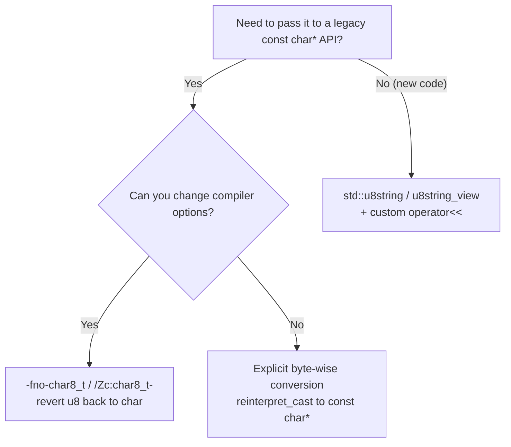

# char8_t and UTF-8 Strings

Before C++20, the UTF-8 string literal `u8"..."` had type `const char[N]` — utterly indistinguishable from an ordinary string at the type level. That may sound harmless, but it is actually the breeding ground for quite a few pitfalls: you cannot tell at the type level whether "this sequence is UTF-8" or "this sequence is in the native execution character set", and the compiler cannot help you block the mistake of blasting UTF-8 out as raw bytes. C++20 introduced `char8_t` precisely to pull UTF-8 out of that gray zone of `char`, give it a dedicated type of its own, and let the type system do the gatekeeping for us. The change comes from proposal **P0482R6**, "char8_t: A type for UTF-8 characters and strings"; feature support can be detected via `__cpp_char8_t` (C++20, value `201811L`).

However — let us plant a warning sign up front — this "distinct type" change is **breaking**: it changed the type of `u8` literals in one stroke, so a whole batch of old code that sat peacefully under C++17 flat-out fails to compile after upgrading to C++20. In this article we will cover, in one pass, the two pitfalls you are most likely to step on, how to carry the code over, and the little bit that C++23 later gave back.

------

## u8 Literals: The Type Got a Whole New Soul

Starting with C++20, the type of the UTF-8 string literal `u8"..."` changed from `const char[N]` to `const char8_t[N]`, and the type of the UTF-8 character literal `u8'c'` changed from `char` to `char8_t`. This `char8_t` is a **distinct fundamental type** whose underlying type is `unsigned char`; it agrees with `unsigned char` in size, alignment, and conversion rank — but it **does not participate in the aliasing rules** (it is not one of the types [basic.lval] permits to access objects through aliasing). That is to say, you cannot take a `char8_t*` and legally alias the memory of some other object.

Why insist on forging a separate type so pedantically? The reasoning is simple: once the types are split apart, the compiler can reject mistakes such as "using a UTF-8 string as a natively encoded `char` string" or "printing a `char8_t` as an integer" on the spot, instead of waiting until runtime spews a screenful of mojibake and you slap your forehead. Trading a bit of migration cost for type safety — C++20 judged that a deal worth taking.

## The Two Most Classic Pitfalls

With the type swapped out, two migration pitfalls rose to the surface.

**Pitfall one: `u8""` can no longer implicitly convert to `const char*`.** In C++17, `const char* p = u8"text";` was perfectly legal (back then the `u8` literal was still part of the `char` family); under C++20, `u8"text"` is a `const char8_t[N]`, and since `char8_t` does not implicitly convert to `char`, this line is flat-out ill-formed. Every legacy interface that gets handed a `u8` literal where a `const char*` is expected is affected — constructing a `std::string`, passing data to a C API, certain overloads of `std::filesystem::u8path`, and so on.

**Pitfall two: the standard library deliberately `=delete`s the ostream overloads for `char8_t`.** You might be thinking — fine, then I'll just print it directly with `std::cout << u8"text";`, right? Also no. Since C++20, the standard library's `operator<<` overloads on `basic_ostream<char>` and `basic_ostream<wchar_t>` for UTF-8 characters and strings — `char8_t`, `const char8_t*`, and the like — are **explicitly deleted** (note: not "forgot to implement" — deliberate). So `std::cout << u8'z'` and `std::cout << u8"text"` both fail to compile because they resolve to a deleted overload. The point of the move is to intercept legacy code that would otherwise splatter UTF-8 data onto the screen as integers or pointers.

## How to Carry Old Code Over

When you hit these two pitfalls, how do you move C++17-era code over to C++20? A few routes, which we will lay out for you from lowest cost to highest:



The least troublesome is the **compiler-flag fallback**: add `-fno-char8_t` on GCC/Clang or `/Zc:char8_t-` on MSVC, push the type of `u8` literals back to C++17's `char` semantics, and the old code compiles again right away. This is only a stopgap for the transition period — do not let new code lean on it long-term. Next comes **explicit byte-wise conversion**: when you genuinely must feed an interface that only understands `const char*`, and you know full well the content is UTF-8 bytes, use `reinterpret_cast<const char*>(u8"text")` (or a C-style cast) to switch the viewpoint — the byte content stays unchanged, only the pointer type is swapped, and pitfall one is sidestepped. The most "politically correct" option is the **`std::u8string` route**: hold UTF-8 text type-safely in `u8string`/`u8string_view`, and when it is time to print, write a tiny `operator<<` to convert on the way out — carrying type safety through to the very end.

## C++23's P2513: A Little Given Back

The scope of the "cannot initialize" part of pitfall one did get trimmed back a little later on. Proposal **P2513R4**, "char8_t Compatibility and Portability", was adopted as a defect report (DR) against C++20 and landed in C++23 (the value of `__cpp_char8_t` changed accordingly to `202207L`); it **once again allows initializing an array of `char` or `unsigned char` from a `u8` string literal** — so `char ca[] = u8"text";` is legal again. But note carefully: it relaxes exactly one thing, array initialization. The implicit pointer conversion from `const char8_t*` to `const char*` is **still ill-formed to this day** — the pointer-assignment scenario in pitfall one did not get a pardon.

------

## Run It Yourself

The demo below puts the two pitfalls (we have "sealed" them inside comments — uncomment them and compilation fails on the spot) side by side with the two correct ways of writing it, for easy comparison.

```cpp
// Standard: C++20  | Platform: host
#include <iostream>
#include <string>

// -- Pitfall 1 (uncommenting breaks the build): u8"" no longer implicitly converts to const char* --
// const char* p = u8"text";   // ill-formed since C++20

// -- Pitfall 2 (uncommenting breaks the build): ostream explicitly =deletes the char8_t overloads --
// std::cout << u8"text";      // ill-formed since C++20
// std::cout << u8'z';         // ill-formed since C++20

// Correct approach 1: explicit byte-wise conversion (content unchanged, only the pointer type view switches)
void print_as_char(const char* s)
{
    std::cout << s << '\n';
}

// Correct approach 2: hold UTF-8 type-safely in std::u8string, with custom printing
std::ostream& operator<<(std::ostream& os, const std::u8string& s)
{
    return os << reinterpret_cast<const char*>(s.data());
}

int main()
{
    // Route A: use the u8 literal as const char* (fits legacy interfaces that only accept narrow characters)
    print_as_char(reinterpret_cast<const char*>(u8"text"));

    // Route B: keep the UTF-8 type as u8string all the way, convert only when printing
    std::u8string u8s = u8"UTF-8 text";
    std::cout << u8s << '\n';
    return 0;
}
```

<OnlineCompilerDemo
  title="char8_t and UTF-8 Strings: Two Pitfalls and the Correct Patterns"
  source-path="code/examples/vol3/14_char8_t.cpp"
  description="Demonstrates the two compilation-failure pitfalls caused by the C++20 u8 literal type change, plus two correct patterns: explicit conversion and u8string"
  allow-run
  allow-x86-asm
/>

------

## References

- [char8_t — cppreference](https://en.cppreference.com/w/cpp/keyword/char8_t)
- [String literal — cppreference](https://en.cppreference.com/w/cpp/language/string_literal)
- [operator<<(basic_ostream) — cppreference](https://en.cppreference.com/w/cpp/io/basic_ostream/operator_ltlt2)
- [P0482R6 char8_t: A type for UTF-8 characters and strings](https://www.open-std.org/jtc1/sc22/wg21/docs/papers/2018/p0482r6.html)
- [P2513R4 char8_t Compatibility and Portability](https://www.open-std.org/jtc1/sc22/wg21/docs/papers/2022/p2513r4.html)
