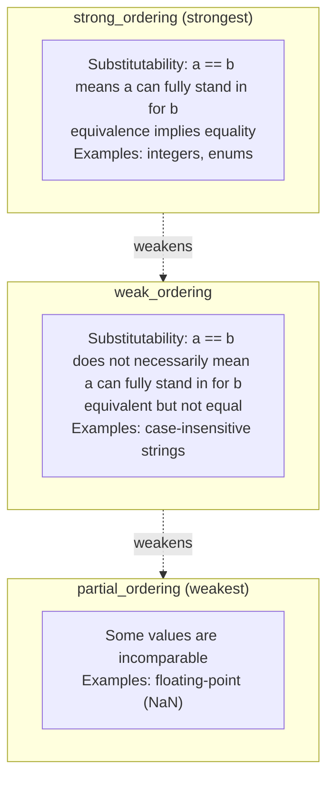

# Embedded Modern C++ Development — The Three-Way Comparison Operator

When you're writing embedded code, have comparison operators ever given you a headache?

```cpp
class SensorReading {
public:
    uint16_t sensor_id;
    int32_t value;
    uint32_t timestamp;

    // You need to implement 6 comparison operators!
    bool operator==(const SensorReading& other) const {
        return sensor_id == other.sensor_id &&
               value == other.value &&
               timestamp == other.timestamp;
    }

    bool operator!=(const SensorReading& other) const {
        return !(*this == other);
    }

    bool operator<(const SensorReading& other) const {
        if (sensor_id != other.sensor_id)
            return sensor_id < other.sensor_id;
        if (value != other.value)
            return value < other.value;
        return timestamp < other.timestamp;
    }

    bool operator<=(const SensorReading& other) const {
        return *this < other || *this == other;
    }

    bool operator>(const SensorReading& other) const {
        return other < *this;
    }

    bool operator>=(const SensorReading& other) const {
        return !(*this < other);
    }
};
```

This is a disaster! To get a fully sortable type, you have to write six comparison operators, with intricate dependencies among them. Worse still, if you change a member variable, you have to update every one of those operators in sync.

The **three-way comparison operator** introduced in C++20—commonly nicknamed the **spaceship operator** (`<=>`)—exists precisely to solve this problem.

> In one sentence: **the three-way comparison operator generates all six comparison operators from a single definition, dramatically simplifying comparison logic for custom types.**

In embedded development, this feature is especially useful:

1. Sorting sensor data by timestamp or priority
2. Comparing firmware version numbers (complex versions with alphabetic suffixes)
3. Lexicographic comparison of configuration parameters
4. Ordering tasks in a priority queue

------
**Warning**: As of 2024, only GCC 10+, Clang 10+, and MSVC 2019+ fully support the three-way comparison operator. If your compiler is older, you may need to upgrade or fall back to a workaround.

------

## Basics of the Three-Way Comparison Operator

### The Operator Symbol

The three-way comparison operator uses the `<=>` symbol, and it got its nickname from looking like a spaceship:

```cpp
#include <compare>

struct Point {
    int x, y;

    // Three-way comparison operator
    std::strong_ordering operator<=>(const Point& other) const {
        if (auto cmp = x <=> other.x; cmp != 0)
            return cmp;
        return y <=> other.y;
    }
};
```

### The Return Type

The three-way comparison operator doesn't return `bool`; it returns a "comparison category" that represents the outcome:

```cpp
// The <=> return value can be understood as:
// a <=> b < 0  means a < b
// a <=> b == 0 means a == b
// a <=> b > 0  means a > b

// In reality, it returns a type
auto result = (a <=> b);

if (result < 0) { /* a < b */ }
else if (result == 0) { /* a == b */ }
else { /* a > b */ }
```

### Testing the Comparison Result

The returned comparison category can be compared against 0, or you can use its named values:

```cpp
#include <compare>

int main() {
    auto cmp = 5 <=> 3;

    // Approach 1: compare against 0
    if (cmp < 0)    std::cout << "less\n";
    if (cmp == 0)   std::cout << "equal\n";
    if (cmp > 0)    std::cout << "greater\n";

    // Approach 2: use the named values (recommended, clearer)
    if (cmp == std::strong_ordering::less)    std::cout << "less\n";
    if (cmp == std::strong_ordering::equal)   std::cout << "equal\n";
    if (cmp == std::strong_ordering::greater) std::cout << "greater\n";

    return 0;
}
```

------
**Best practice**: test the comparison result directly with `<`, `==`, and `>` instead of naming the category values. The code is more concise, and it works with every comparison category.

------

## Auto-Generated Comparison Functions

### Auto-Generation with = default

The simplest usage is `= default`, which has the compiler generate all the comparison operators for you:

```cpp
#include <compare>

struct SensorReading {
    uint16_t sensor_id;
    int32_t value;
    uint32_t timestamp;

    // One line of code covers all 6 comparison operators!
    auto operator<=>(const SensorReading&) const = default;

    // C++20 also auto-generates !=
    // but == still needs an explicit default (if you need it)
    bool operator==(const SensorReading&) const = default;
};
```

Now you can use all the comparison operators:

```cpp
SensorReading s1{1, 100, 1000};
SensorReading s2{1, 100, 1000};
SensorReading s3{2, 100, 1000};

// All of these work!
bool b1 = (s1 == s2);  // true
bool b2 = (s1 != s2);  // false
bool b3 = (s1 < s3);   // true (lexicographic)
bool b4 = (s1 <= s3);  // true
bool b5 = (s1 > s3);   // false
bool b6 = (s1 >= s3);  // false

// It also works in standard containers
std::set<SensorReading> sensor_set;
std::map<SensorReading, std::string> sensor_map;

// And in algorithms
std::vector<SensorReading> sensors;
std::sort(sensors.begin(), sensors.end());
```

### Comparison Order

The defaulted `<=>` compares lexicographically in **member declaration order**:

```cpp
struct Version {
    uint8_t major;
    uint8_t minor;
    uint8_t patch;

    auto operator<=>(const Version&) const = default;
    bool operator==(const Version&) const = default;
};

Version v1{1, 2, 3};
Version v2{1, 2, 4};
Version v3{1, 3, 0};

// Comparison order: major -> minor -> patch
// v1 < v2 (patch: 3 < 4)
// v1 < v3 (minor: 2 < 3)
// v2 < v3 (minor: 2 < 3)
```

------
**Note**: the order of your member variables matters! If you want a specific comparison order, arrange the member declarations accordingly.

------

## Comparison Categories in Depth

C++20 defines three comparison categories, representing different strengths of the comparison relation.

### strong_ordering: Strong Order

`strong_ordering` represents the strongest comparison relation, with the following properties:

1. **Equivalence implies equality**: `a == b` if and only if all members of `a` and `b` are equal
2. **Substitutability**: whenever `a == b`, `f(a) == f(b)` holds for any function `f`

Good fits: integers, strings, simple value types

```cpp
#include <compare>
#include <string>

struct Integer {
    int value;

    std::strong_ordering operator<=>(const Integer& other) const {
        return value <=> other.value;
    }

    bool operator==(const Integer& other) const = default;
};

// Usage
Integer a{5}, b{5}, c{10};
static_assert((a <=> b) == std::strong_ordering::equal);
static_assert((a <=> c) == std::strong_ordering::less);
static_assert((c <=> a) == std::strong_ordering::greater);
```

`std::strong_ordering` has three possible values:

| Value | Meaning |
|-----|------|
| `std::strong_ordering::less` | Less than |
| `std::strong_ordering::equal` | Equal to |
| `std::strong_ordering::greater` | Greater than |
| `std::strong_ordering::equivalent` | Equivalent (for strong ordering, identical to equal) |

### partial_ordering: Partial Order

`partial_ordering` covers cases where "incomparable" values may exist:

1. Some values may not be comparable (such as `NaN`)
2. Equivalence does not imply equality

Good fits: floating-point numbers (which have `NaN`), ranges with permitted values

```cpp
#include <compare>
#include <cmath>

struct FloatValue {
    float value;

    std::partial_ordering operator<=>(const FloatValue& other) const {
        if (std::isnan(value) || std::isnan(other.value))
            return std::partial_ordering::unordered;
        return value <=> other.value;
    }

    bool operator==(const FloatValue& other) const {
        return value == other.value;
    }
};

// Usage
FloatValue a{1.0f}, b{2.0f}, c{NAN};

static_assert((a <=> b) == std::partial_ordering::less);
// (a <=> c) == std::partial_ordering::unordered
```

`std::partial_ordering` has four possible values:

| Value | Meaning |
|-----|------|
| `std::partial_ordering::less` | Less than |
| `std::partial_ordering::equivalent` | Equivalent |
| `std::partial_ordering::greater` | Greater than |
| `std::partial_ordering::unordered` | Incomparable |

### weak_ordering: Weak Order

`weak_ordering` sits between strong and partial order:

1. Equivalence does not imply equality (there may be indistinguishable alternative representations)
2. But all values are comparable (no `unordered` exists)

Good fits: case-insensitive strings, comparisons that ignore certain fields

```cpp
#include <compare>
#include <string>
#include <cctype>

struct CaseInsensitiveString {
    std::string value;

    // Helper: case-insensitive comparison
    static int compare_ic(const std::string& a, const std::string& b) {
        size_t i = 0;
        while (i < a.size() && i < b.size()) {
            int ca = std::tolower(static_cast<unsigned char>(a[i]));
            int cb = std::tolower(static_cast<unsigned char>(b[i]));
            if (ca != cb)
                return ca - cb;
            ++i;
        }
        if (a.size() < b.size()) return -1;
        if (a.size() > b.size()) return 1;
        return 0;
    }

    std::weak_ordering operator<=>(const CaseInsensitiveString& other) const {
        int cmp = compare_ic(value, other.value);
        if (cmp < 0) return std::weak_ordering::less;
        if (cmp > 0) return std::weak_ordering::greater;
        return std::weak_ordering::equivalent;
    }

    bool operator==(const CaseInsensitiveString& other) const {
        return compare_ic(value, other.value) == 0;
    }
};

// Usage
CaseInsensitiveString s1{"Hello"}, s2{"HELLO"}, s3{"hello"}, s4{"World"};

// s1, s2, s3 are equivalent (weak_ordering::equivalent)
// but they are not equal (value differs)
static_assert((s1 <=> s2) == std::weak_ordering::equivalent);
static_assert(!(s1 == s2));  // not equal!
```

`std::weak_ordering` has three possible values:

| Value | Meaning |
|-----|------|
| `std::weak_ordering::less` | Less than |
| `std::weak_ordering::equivalent` | Equivalent |
| `std::weak_ordering::greater` | Greater than |

### Choosing Among the Three Categories

```cpp
#include <compare>

// Selection guide

// 1. strong_ordering: every field compared exactly
struct SensorData {
    uint8_t id;
    int16_t value;

    auto operator<=>(const SensorData&) const = default;
    bool operator==(const SensorData&) const = default;
    // Returns strong_ordering
};

// 2. partial_ordering: NaN or incomparable values exist
struct Measurement {
    float value;  // May be NaN

    std::partial_ordering operator<=>(const Measurement& other) const {
        if (std::isnan(value) || std::isnan(other.value))
            return std::partial_ordering::unordered;
        return value <=> other.value;
    }
};

// 3. weak_ordering: equivalent but not equal
struct ConfigKey {
    std::string key;
    bool case_sensitive;

    std::weak_ordering operator<=>(const ConfigKey& other) const {
        if (!case_sensitive) {
            // Case-insensitive comparison
            return case_insensitive_compare(key, other.key);
        }
        return key <=> other.key;
    }
};
```

### Comparison Category Relationship Diagram



------
**Important**: with `= default`, the compiler automatically selects the most appropriate comparison category from the member types. If every member supports `strong_ordering`, that is what gets generated.

------

## Hands-On Embedded Scenarios

### Scenario 1: Sorting Sensor Data by Priority

In embedded systems, sensor data usually needs to be ordered by priority and timestamp:

```cpp
#include <compare>
#include <cstdint>
#include <queue>

class SensorMessage {
public:
    enum class Priority : uint8_t {
        Critical = 0,
        High = 1,
        Normal = 2,
        Low = 3
    };

    uint16_t sensor_id;
    Priority priority;
    int32_t value;
    uint32_t sequence;  // Sequence number, used to order within the same priority

    // Ascending by priority (Critical at the front of the queue), then by sequence number
    auto operator<=>(const SensorMessage& other) const {
        // Smaller priority value means more important
        if (auto cmp = priority <=> other.priority; cmp != 0)
            return cmp;
        // Same priority: by sequence number (FIFO)
        return sequence <=> other.sequence;
    }

    bool operator==(const SensorMessage& other) const {
        return sensor_id == other.sensor_id &&
               priority == other.priority &&
               value == other.value &&
               sequence == other.sequence;
    }

    // For the priority queue (needs the > operator)
    bool operator>(const SensorMessage& other) const {
        return (*this <=> other) > 0;
    }
};

// Usage example
void message_queue_example() {
    // Min-heap (smaller Priority value = higher priority)
    std::priority_queue<
        SensorMessage,
        std::vector<SensorMessage>,
        std::greater<>
    > message_queue;

    message_queue.push(SensorMessage{1, SensorMessage::Priority::Low, 100, 1});
    message_queue.push(SensorMessage{2, SensorMessage::Priority::Critical, 200, 2});
    message_queue.push(SensorMessage{3, SensorMessage::Priority::High, 150, 3});

    // Process in priority order: Critical -> High -> Low
    while (!message_queue.empty()) {
        auto msg = message_queue.top();
        process_message(msg);
        message_queue.pop();
    }
}
```

### Scenario 2: Comparing Firmware Versions

Firmware version numbers can come in complex formats, such as ones with alphabetic suffixes:

```cpp
#include <compare>
#include <string>
#include <variant>

class FirmwareVersion {
public:
    uint8_t major;
    uint8_t minor;
    uint8_t patch;

    // Pre-release identifier: alpha < beta < rc < official release
    enum class PreRelease : uint8_t {
        None = 0,
        Alpha = 1,
        Beta = 2,
        RC = 3
    };

    PreRelease pre_release = PreRelease::None;
    uint8_t pre_release_version = 0;  // alpha1, alpha2, etc.

    // Compare version numbers
    std::strong_ordering operator<=>(const FirmwareVersion& other) const {
        // Major version
        if (auto cmp = major <=> other.major; cmp != 0)
            return cmp;

        // Minor version
        if (auto cmp = minor <=> other.minor; cmp != 0)
            return cmp;

        // Patch version
        if (auto cmp = patch <=> other.patch; cmp != 0)
            return cmp;

        // Pre-release identifier
        if (auto cmp = pre_release <=> other.pre_release; cmp != 0)
            return cmp;

        // Pre-release version (only compared when both are pre-releases)
        if (pre_release != PreRelease::None) {
            return pre_release_version <=> other.pre_release_version;
        }

        return std::strong_ordering::equal;
    }

    bool operator==(const FirmwareVersion& other) const = default;

    // Parse a version string "1.2.3-beta2"
    static FirmwareVersion parse(const std::string& version_str);

    std::string to_string() const;
};

// Usage example
void version_comparison() {
    FirmwareVersion current{1, 2, 3};
    FirmwareVersion available{1, 2, 4};

    if (available > current) {
        printf("New version available: %s\n",
               available.to_string().c_str());
    }

    // Pre-release version comparison
    FirmwareVersion v1{2, 0, 0, FirmwareVersion::PreRelease::Alpha, 1};
    FirmwareVersion v2{2, 0, 0, FirmwareVersion::PreRelease::Beta, 1};
    FirmwareVersion v3{2, 0, 0, FirmwareVersion::PreRelease::None, 0};

    static_assert(v1 < v2);  // alpha < beta
    static_assert(v2 < v3);  // beta < official release
}
```

### Scenario 3: Comparing Config Parameters (Partial Equality Allowed)

In a configuration system, we may only want to compare certain key fields:

```cpp
#include <compare>
#include <string>
#include <optional>

struct NetworkConfig {
    std::string ssid;
    std::optional<std::string> password;  // Password does not participate in comparison
    uint8_t channel;
    bool hidden;

    // Ignore the password field when comparing
    auto operator<=>(const NetworkConfig& other) const {
        if (auto cmp = ssid <=> other.ssid; cmp != 0)
            return cmp;
        if (auto cmp = channel <=> other.channel; cmp != 0)
            return cmp;
        return hidden <=> other.hidden;
    }

    bool operator==(const NetworkConfig& other) const {
        return ssid == other.ssid &&
               channel == other.channel &&
               hidden == other.hidden;
        // Note: password does not participate in comparison
    }

    // Full comparison (including the password)
    bool fully_equal(const NetworkConfig& other) const {
        if (*this != other) return false;
        if (password.has_value() != other.password.has_value())
            return false;
        if (password.has_value() && *password != *other.password)
            return false;
        return true;
    }
};

// Usage example
void config_example() {
    NetworkConfig config1{"MyWiFi", "password123", 6, false};
    NetworkConfig config2{"MyWiFi", "different", 6, false};

    // The two configs are "equal" (password ignored)
    static_assert(config1 == config2);

    // Detect whether the configuration changed
    NetworkConfig saved_config = load_from_flash();
    NetworkConfig current_config = get_current_config();

    if (current_config != saved_config) {
        printf("Configuration changed, need to save\n");
        save_to_flash(current_config);
    }

    // But checking whether the password changed takes an explicit call
    if (!config1.fully_equal(config2)) {
        printf("Password changed\n");
    }
}
```

### Scenario 4: Sensor Data with NaN

Some sensors may return invalid data (a concept similar to NaN):

```cpp
#include <compare>
#include <optional>
#include <cmath>

struct SensorValue {
    std::optional<float> value;

    // An invalid value (no value) is treated as less than any valid value
    std::partial_ordering operator<=>(const SensorValue& other) const {
        if (!value.has_value() && !other.value.has_value())
            return std::partial_ordering::equivalent;
        if (!value.has_value())
            return std::partial_ordering::less;
        if (!other.value.has_value())
            return std::partial_ordering::greater;

        // Both have values
        float v1 = *value;
        float v2 = *other.value;

        if (std::isnan(v1) || std::isnan(v2))
            return std::partial_ordering::unordered;

        if (v1 < v2) return std::partial_ordering::less;
        if (v1 > v2) return std::partial_ordering::greater;
        return std::partial_ordering::equivalent;
    }

    bool operator==(const SensorValue& other) const {
        if (!value.has_value() && !other.value.has_value())
            return true;
        if (!value.has_value() || !other.value.has_value())
            return false;
        return *value == *other.value;
    }
};

// Usage example
void sensor_with_invalid_values() {
    std::vector<SensorValue> readings = {
        {10.5f},
        {std::nullopt},  // Invalid reading
        {15.2f},
        {NAN},           // NaN reading
        {12.0f}
    };

    // Sorting: invalid values first, then NaN, then valid values
    std::sort(readings.begin(), readings.end());

    for (const auto& reading : readings) {
        if (reading.value) {
            printf("%.1f ", *reading.value);
        } else {
            printf("(invalid) ");
        }
    }
    // Output: (invalid) nan 10.5 12.0 15.2
}
```

### Scenario 5: Multi-Level Sensor Alarms

An alarm system needs ordering along several dimensions:

```cpp
#include <compare>
#include <string>
#include <chrono>

class Alarm {
public:
    enum class Severity : uint8_t {
        Info = 0,
        Warning = 1,
        Error = 2,
        Critical = 3
    };

    enum class Status : uint8_t {
        Active = 0,
        Acknowledged = 1,
        Resolved = 2
    };

    uint32_t id;
    Severity severity;
    Status status;
    std::chrono::system_clock::time_point timestamp;
    std::string message;

    // Comparison logic:
    // 1. Active alarms come first
    // 2. Within the same status, Critical comes first
    // 3. Within the same severity, the newest comes first
    std::strong_ordering operator<=>(const Alarm& other) const {
        // Status: Active < Acknowledged < Resolved
        if (auto cmp = status <=> other.status; cmp != 0)
            return cmp;

        // Severity: Critical > Error > Warning > Info
        // but we want Critical first (i.e. "smaller")
        if (auto cmp = other.severity <=> severity; cmp != 0)
            return cmp;

        // Timestamp: newest first (i.e. "smaller")
        return other.timestamp <=> timestamp;
    }

    bool operator==(const Alarm& other) const {
        return id == other.id;
    }
};

// Usage example
void alarm_system() {
    std::vector<Alarm> alarms = {
        {1, Alarm::Severity::Warning, Alarm::Status::Active,
         std::chrono::system_clock::now(), "Temperature high"},
        {2, Alarm::Severity::Critical, Alarm::Status::Acknowledged,
         std::chrono::system_clock::now(), "Power failure"},
        {3, Alarm::Severity::Error, Alarm::Status::Active,
         std::chrono::system_clock::now(), "Connection lost"}
    };

    // After sorting:
    // 1. Active Error (the newest active alarm)
    // 2. Active Warning
    // 3. Acknowledged Critical
    std::sort(alarms.begin(), alarms.end());

    for (const auto& alarm : alarms) {
        printf("[%d] %s: %s\n",
               static_cast<int>(alarm.severity),
               alarm.status == Alarm::Status::Active ? "Active" : "Acked",
               alarm.message.c_str());
    }
}
```

------

## Writing Custom Three-Way Comparisons

### Implementing Multi-Field Comparison by Hand

When the default lexicographic order doesn't meet your needs, you implement it manually:

```cpp
#include <compare>

struct Task {
    uint8_t priority;      // 0-255; smaller = more important
    uint32_t deadline;     // Deadline timestamp
    uint32_t created_at;   // Creation timestamp
    uint16_t task_id;

    // Comparison logic:
    // 1. The highest priority executes first
    // 2. Same priority: the nearest deadline executes first
    // 3. Same deadline: the earliest created executes first
    // 4. All equal: the smaller task_id executes first
    std::strong_ordering operator<=>(const Task& other) const {
        // Ascending priority
        if (auto cmp = priority <=> other.priority; cmp != 0)
            return cmp;

        // Ascending deadline
        if (auto cmp = deadline <=> other.deadline; cmp != 0)
            return cmp;

        // Ascending creation time (earlier first)
        if (auto cmp = created_at <=> other.created_at; cmp != 0)
            return cmp;

        // Ascending task_id
        return task_id <=> other.task_id;
    }

    bool operator==(const Task& other) const = default;
};
```

### Using Comparison Synthesis Helpers

Since C++20, tools like `std::compare_three_way` simplify comparing two values (note it takes exactly two arguments; multi-field comparisons must be chained field by field):

```cpp
#include <compare>

// C++23-style comparison synthesis
struct Task {
    uint8_t priority;
    uint32_t deadline;
    uint32_t created_at;
    uint16_t task_id;

    std::strong_ordering operator<=>(const Task& other) const {
        // Use the C++23 synthesis function (if available)
        if (auto c = priority <=> other.priority; c != 0) return c;
        if (auto c = deadline <=> other.deadline; c != 0) return c;
        if (auto c = created_at <=> other.created_at; c != 0) return c;
            task_id, other.task_id
        );
    }

    bool operator==(const Task& other) const = default;
};
```

For C++20, you can implement a simple helper yourself:

```cpp
// C++20 comparison synthesis helper
namespace detail {
    template<typename... Ts>
    constexpr auto synthesized_three_way(const Ts&... args) {
        using R = std::common_comparison_category_t<
            typename std::decay_t<decltype(args <=> std::declval<Ts>())>::comparison_category...>;
        return R{};
    }

    // Simple implementation
    template<typename T>
    constexpr auto compare_fields(const T& a, const T& b) {
        return a <=> b;
    }

    template<typename T, typename U, typename... Rest>
    constexpr auto compare_fields(const T& a, const T& b,
                                  const U& ua, const U& ub,
                                  const Rest&... rest) {
        if (auto cmp = a <=> b; cmp != 0)
            return cmp;
        return compare_fields(ua, ub, rest...);
    }
}

struct Task {
    uint8_t priority;
    uint32_t deadline;
    uint32_t created_at;
    uint16_t task_id;

    std::strong_ordering operator<=>(const Task& other) const {
        return detail::compare_fields(
            priority, other.priority,
            deadline, other.deadline,
            created_at, other.created_at,
            task_id, other.task_id
        );
    }

    bool operator==(const Task& other) const = default;
};
```

------
**Note**: since C++20 the library offers comparison tools such as `std::compare_three_way`; there is no `std::compare_*_result` multi-field synthesis family (the usual approaches are the if-chain above, or `std::tie` with `<=>`). Consult the latest standard library documentation when using them.

------

## Common Pitfalls

### Pitfall 1: A Defaulted == Does Not Reverse-Generate <=> (Generation Is One-Way)

A widely repeated—but outdated—claim goes: "writing only `<=>` and no `==` fails to compile." That did hold in early C++20 drafts, but it was later fixed by **P1185 (Consistent defaulted comparisons, landed as a C++20 defect report)**—the generation relationship between `<=>` and `==` is **one-way**:

- A defaulted `<=>` → the compiler hands you `==`, `!=`, `<`, `>`, `<=`, and `>=`, all of them. Writing `<=>` alone is therefore completely sufficient—`==` comes "for free."
- The other direction, a defaulted `==` → generates only `==` and `!=`; it never gives you `<=>` or any relational operator in return.

The trap people actually step into is the latter: you figure "I only care about equality, one defaulted `==` is enough," and then one day somebody writes `a < b` and the build explodes—because `==` carries no relational comparison.

```cpp
#include <compare>
#include <iostream>

// ✅ Only default <=>: both == and < are available automatically (the old claim of a "compile error" was simply wrong)
struct HasSpaceship {
    int value;
    auto operator<=>(const HasSpaceship&) const = default;
};

// ⚠️ Only default ==: equality is fine, but there is no < / <=>
struct HasEquality {
    int value;
    bool operator==(const HasEquality&) const = default;
};

int main() {
    HasSpaceship a{1}, b{2};
    std::cout << (a == b) << (a < b) << '\n';   // OK: <=> generated both == and <

    HasEquality c{1}, d{2};
    std::cout << (c == d) << '\n';              // OK: == is explicitly defaulted
    // std::cout << (c < d) << '\n';            // Compile error: a defaulted == does not reverse-generate <=>
}
```

Verified in practice (Arch Linux WSL, `-std=c++20`; g++ 16.1.1 and clang++ 22.1.6 behave identically):

```text
$ g++ -std=c++20 gotcha.cpp -o gotcha && ./gotcha
01
0
$ g++ -std=c++20 -DTRY_LT gotcha.cpp
gotcha.cpp: In function 'int main()':
gotcha.cpp:23:21: error: no match for 'operator<' (operand types are 'HasEquality' and 'HasEquality')
   23 |     std::cout << (c < d) << '\n';
      |                   ~ ^ ~
```

A one-line mnemonic: `<=>` is "upstream" and `==` is "downstream"—the upstream flows every operator downstream, while the downstream only tends its own little patch. Whenever you want any kind of ordering comparison, you need `<=>`; defaulting `==` alone will never buy you `<=>`. See the "[Default comparisons](https://en.cppreference.com/mwiki/index.php?title=cpp/language/default_comparisons)" section on cppreference for details.

### Pitfall 2: Inconsistent Comparison Categories

When implementing by hand, keep the returned comparison category consistent:

```cpp
// ❌ Wrong: mixing different comparison categories
struct BadCompare {
    float f;
    int i;

    std::partial_ordering operator<=>(const BadCompare& other) const {
        // float <=> float returns partial_ordering
        // int <=> int returns strong_ordering
        // They cannot be combined directly!
        if (f <=> other.f != std::partial_ordering::equivalent)
            return f <=> other.f;
        return i <=> other.i;  // Type mismatch
    }
};

// ✅ Correct: unify the return type
struct GoodCompare {
    float f;
    int i;

    std::partial_ordering operator<=>(const GoodCompare& other) const {
        if (auto cmp = f <=> other.f;
            cmp != std::partial_ordering::equivalent)
            return cmp;
        // strong_ordering implicitly converts to partial_ordering
        return i <=> other.i;
    }
};

// ✅ Or use a generic comparison category
struct BetterCompare {
    float f;
    int i;

    auto operator<=>(const BetterCompare& other) const {
        // Use auto to deduce a suitable comparison category
        if (auto cmp = f <=> other.f; cmp != 0)
            return cmp;
        return i <=> other.i;
    }
};
```

### Pitfall 3: Comparison in Inheritance Hierarchies

Using `= default` inside an inheritance hierarchy calls for care:

```cpp
struct Base {
    int x;
    auto operator<=>(const Base&) const = default;
    bool operator==(const Base&) const = default;
};

// ✅ If the derived class adds no data members
struct Derived : Base {
    // The inherited comparison operators still work
};

// ❌ If the derived class adds data members
struct DerivedWithNew : Base {
    int y;
    // The comparison operators must be redefined
    auto operator<=>(const DerivedWithNew&) const = default;
    bool operator==(const DerivedWithNew&) const = default;
};

// ⚠️ Comparing different types
Derived d1{1};
DerivedWithNew d2{1, 2};
// bool cmp = (d1 == d2);  // Compile error! Different types
```

### Pitfall 4: The Floating-Point NaN Problem

A floating-point `NaN` (Not a Number) makes comparisons come out `unordered`:

```cpp
#include <cmath>

float nan_value = std::nan("1");

// ❌ The problem with traditional comparison operators
if (nan_value > 0.0f) { /* Not executed */ }
if (nan_value < 0.0f) { /* Not executed */ }
if (nan_value == 0.0f) { /* Not executed */ }
// Comparing NaN with any floating-point number is false!

// ✅ Handle NaN with partial_ordering
struct SafeFloat {
    float value;

    std::partial_ordering operator<=>(const SafeFloat& other) const {
        if (std::isnan(value) || std::isnan(other.value))
            return std::partial_ordering::unordered;
        return value <=> other.value;
    }

    bool operator==(const SafeFloat& other) const {
        if (std::isnan(value) || std::isnan(other.value))
            return false;
        return value == other.value;
    }
};
```

### Pitfall 5: Compiler Support

The three-way comparison operator needs a fairly recent compiler:

```cpp
// Check compiler support
#if __cplusplus < 202002L
    #error "Three-way comparison requires C++20"
#endif

#if defined(__GNUC__) && __GNUC__ < 10
    #error "GCC 10 or later required for three-way comparison"
#endif

#if defined(__clang__) && __clang_major__ < 10
    #error "Clang 10 or later required for three-way comparison"
#endif

#if defined(_MSC_VER) && _MSC_VER < 1920
    #error "MSVC 2019 or later required for three-way comparison"
#endif
```

For projects that must support older compilers, you can use a macro for conditional compilation:

```cpp
#if __cpp_spaceship  // or __cplusplus >= 202002L
    // Use the three-way comparison operator
    #define ENABLE_SPACESHIP 1
#else
    // Fall back to the traditional approach
    #define ENABLE_SPACESHIP 0
#endif

#if ENABLE_SPACESHIP
    struct ModernCompare {
        int value;
        auto operator<=>(const ModernCompare&) const = default;
        bool operator==(const ModernCompare&) const = default;
    };
#else
    struct LegacyCompare {
        int value;
        bool operator==(const LegacyCompare& other) const {
            return value == other.value;
        }
        bool operator!=(const LegacyCompare& other) const {
            return !(*this == other);
        }
        bool operator<(const LegacyCompare& other) const {
            return value < other.value;
        }
        bool operator<=(const LegacyCompare& other) const {
            return value <= other.value;
        }
        bool operator>(const LegacyCompare& other) const {
            return value > other.value;
        }
        bool operator>=(const LegacyCompare& other) const {
            return value >= other.value;
        }
    };
#endif
```

------

## Related C++20 Updates

### Rewriting the Everyday Comparison Operators

C++20 allows the compiler to automatically rewrite certain comparison operators based on `<=>`:

```cpp
struct X {
    // Just define <=> and ==
    auto operator<=>(const X&) const = default;
    bool operator==(const X&) const = default;
};

X x1, x2;

// The following expressions are automatically rewritten as:
x1 != x2;  // !(x1 == x2)
x1 < x2;   // (x1 <=> x2) < 0
x1 <= x2;  // (x1 <=> x2) <= 0
x1 > x2;   // (x1 <=> x2) > 0
x1 >= x2;  // (x1 <=> x2) >= 0
```

### Integration with std:: Algorithms

The three-way comparison operator works seamlessly with the standard algorithms:

```cpp
#include <algorithm>
#include <vector>

struct Data {
    int key;
    std::string value;

    auto operator<=>(const Data&) const = default;
    bool operator==(const Data&) const = default;
};

void algorithm_example() {
    std::vector<Data> data = {
        {3, "three"}, {1, "one"}, {2, "two"}
    };

    // Sort
    std::sort(data.begin(), data.end());

    // Binary search
    auto it = std::lower_bound(data.begin(), data.end(), Data{2, ""});
    if (it != data.end() && it->key == 2) {
        printf("Found: %s\n", it->value.c_str());
    }

    // Deduplicate
    std::sort(data.begin(), data.end());
    auto last = std::unique(data.begin(), data.end());

    // Min/max
    auto [min_it, max_it] = std::minmax_element(data.begin(), data.end());
}
```

### Key Types for Associative Containers

A defaulted `<=>` makes a type usable as a key in associative containers:

```cpp
#include <map>
#include <set>

struct ConfigKey {
    std::string section;
    std::string key;

    auto operator<=>(const ConfigKey&) const = default;
    bool operator==(const ConfigKey&) const = default;
};

// Usable directly as a map key
std::map<ConfigKey, std::string> config = {
    {{"Network", "IP"}, "192.168.1.1"},
    {{"Network", "Port"}, "8080"},
    {{"Sensor", "Rate"}, "1000"}
};

// Usable directly as a set element
std::set<ConfigKey> keys;
keys.insert({"Network", "IP"});
```

------
**Note**: Before C++20, associative containers used `std::less` (which requires `operator<`). C++20 introduced `std::compare_three_way`, which can compare via `<=>`. For compatibility, however, most implementations still use `operator<`.

------

## Try It Online

Try C++20 three-way comparison online—defaulted generation, a custom version-number comparison, and partial_ordering:

<OnlineCompilerDemo
  title="C++20 Three-Way Comparison (Spaceship)"
  source-path="code/examples/vol4/08_spaceship.cpp"
  description="Watch a defaulted <=> auto-generate comparisons, a custom version-number comparison, and partial_ordering"
  allow-run
/>

Looking back one more time: the three-way comparison operator is a major C++20 feature that greatly simplifies comparison logic for custom types:

**Core concepts**:

| Concept | Description |
|-----|------|
| `<=>` operator | Three-way comparison; one definition auto-generates all six comparison operators |
| Comparison categories | `strong_ordering`, `weak_ordering`, `partial_ordering` |
| `= default` | Lets the compiler generate the comparison logic |
| Comparison order | Defaults to lexicographic comparison in member declaration order |

**Choosing a comparison category**:

| Category | Characteristic | Use cases |
|-----|------|---------|
| `strong_ordering` | Equivalence implies equality | Integers, enums, simple value types |
| `weak_ordering` | Equivalent but not equal | Case-insensitive strings, comparisons ignoring some fields |
| `partial_ordering` | May be incomparable | Floating-point numbers (NaN) |

The three-way comparison operator makes comparison logic in C++ cleaner and safer. Combined with what we covered earlier—auto, structured bindings, attributes, and more—modern C++ has grown into a systems programming language that is both powerful and expressive. Used judiciously in embedded development, these features keep your code clearer and easier to maintain.
