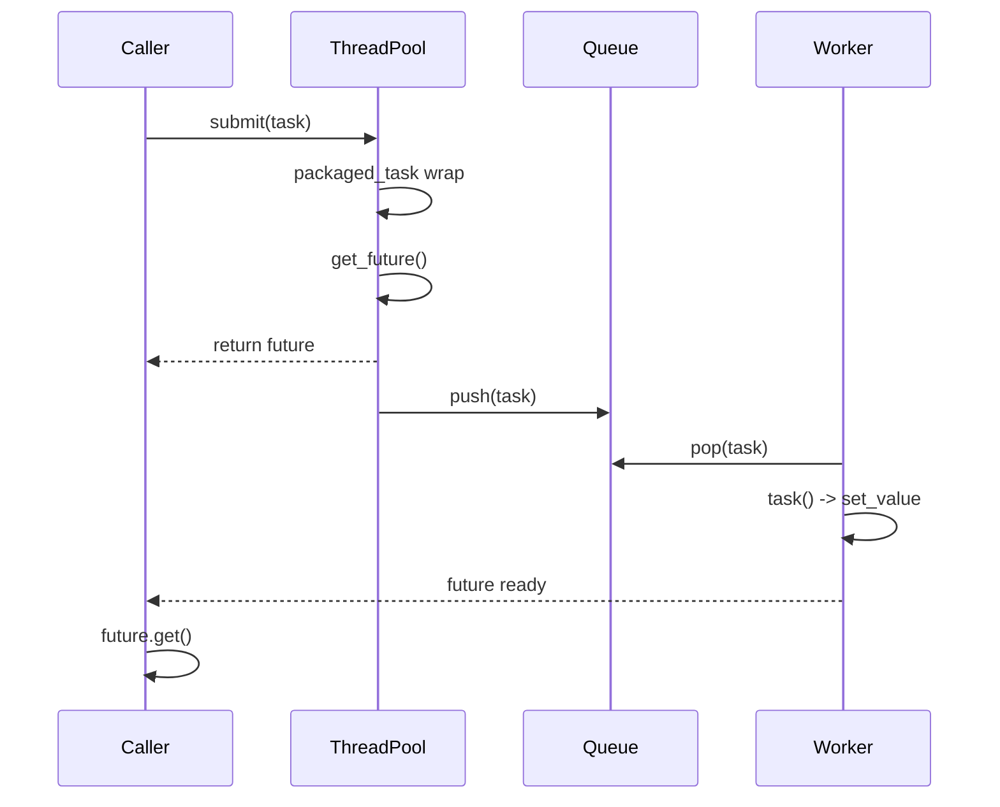

# promise and packaged_task

In the previous post, we used `std::async` to launch asynchronous tasks and retrieve results via `std::future`. While the process is convenient, I found a limitation that feels restrictive: `std::async` tightly couples "launching a task" with "getting the result." As soon as you call `std::async`, the task launches, and the returned `future` is bound to that specific task. You cannot create a `future` first and manually satisfy it later, nor can you wrap an existing function object into an asynchronous task to be queued for execution later. Once you need to decouple "task submission" from "task execution" (for instance, in a thread pool), `std::async` simply isn't enough.

In this post, we will meet the other side of `std::future`—`std::promise` and `std::packaged_task`. They allow us to manually control when values are set and when tasks are executed, serving as the infrastructure for building more flexible asynchronous pipelines (such as task submission interfaces for thread pools). We will also encounter `std::shared_future`, which solves the pain point of `std::future` being "read-only once."

## std::promise\<T\>: Manually Setting a future's Value

Let's start with `std::promise`. You can think of it as the write end of a `std::future`. A promise and a future are connected via a shared state: you set the value through the promise, and read the value through the future. Their lifecycle relationship is: the promise calls `get_future()` to retrieve the associated future, then passes the future to the consumer thread, while remaining in the producer thread to set the value.

Let's not overcomplicate things yet. Here is a minimal example to establish the relationship between a promise and a future. The following code compiles and runs on any standard compiler supporting C++11 or later:

```cpp
#include <future>
#include <thread>
#include <iostream>

void worker(std::promise<int> prom) {
    try {
        // Simulate some work
        std::this_thread::sleep_for(std::chrono::milliseconds(100));
        // Set the result
        prom.set_value(42);
    } catch (...) {
        // If an exception occurs, set it
        prom.set_exception(std::current_exception());
    }
}

int main() {
    // 1. Create promise
    std::promise<int> prom;

    // 2. Get associated future
    std::future<int> fut = prom.get_future();

    // 3. Move promise to worker thread
    std::thread t(worker, std::move(prom));

    // 4. Wait for result in main thread
    std::cout << "Result: " << fut.get() << std::endl;

    t.join();
    return 0;
}
```

The core flow of this code is: the main thread creates a `std::promise`, calls `get_future()` to get the associated `std::future`, and then moves the `std::promise` to the worker thread via `std::move` (because `std::promise` is also move-only). After the worker thread finishes its work, it calls `set_value()`, and the `std::future` in the main thread receives this value. You will notice that we didn't use `std::async` at all—promise allows us to manually control "when to set the value."

Here is an important design choice: why is the promise passed to the worker thread by move instead of by reference? Because a promise represents the "authority to set a value"—this authority is exclusive and should not be shared. By moving the promise, you explicitly transfer the authority to set the value to the worker thread, leaving the main thread with only the read-only future. This is a very clear expression of ownership.

### set_value(), set_exception(), and get_future()

Now that we understand the basic usage, let's look closely at the three core operations of a promise. First is `get_future()`, which returns a `std::future` associated with this promise—this operation can only be called once; a second call throws `std::future_error`. The returned future shares the same underlying shared state with the promise. Next is `set_value()`, which sets the value in the shared state; once the value is set, all threads waiting on this shared state via futures are woken up. If the promise's template parameter is `void`, `set_value()` takes no arguments and simply signifies "computation complete." Just like `get_future()`, `set_value()` can only be called once—attempting to set a second value throws `std::future_error`. Finally, there is `set_exception()`, which sets an exception into the shared state; when the consumer calls `get()`, this exception will be re-thrown. It is typically used with `std::current_exception`—capturing the current exception in a catch block and storing it into the promise.

Let's look at a complete example that demonstrates both normal value passing and exception passing, chaining these three operations together:

```cpp
#include <future>
#include <thread>
#include <iostream>
#include <stdexcept>

void worker(std::promise<int> prom) {
    try {
        // Simulate an error condition
        throw std::runtime_error("Something went wrong in worker");
    } catch (...) {
        // Capture exception and store it in promise
        prom.set_exception(std::current_exception());
    }
}

int main() {
    std::promise<int> prom;
    std::future<int> fut = prom.get_future();

    std::thread t(worker, std::move(prom));

    try {
        // This will re-throw the exception set in the worker
        int result = fut.get();
        std::cout << "Result: " << result << std::endl;
    } catch (const std::runtime_error& e) {
        std::cout << "Caught exception: " << e.what() << std::endl;
    }

    t.join();
    return 0;
}
```

Before moving on, let's break down this exception passing chain clearly. `std::current_exception` is a function used in a catch block that returns a `std::exception_ptr` pointing to the currently handled exception. `set_exception()` accepts this `std::exception_ptr` and stores the exception into the shared state. When the consumer calls `get()`, the stored exception is re-thrown, allowing you to handle it with a corresponding catch block on the consumer side.

This exception passing pattern is incredibly useful for cross-thread communication—you don't need to design error code systems, nor do you need to serialize exception information into strings. The exception object crosses thread boundaries intact, with type information preserved. Honestly, I was quite surprised when I first realized exceptions could be passed across threads, given that thread stacks are independent, but the standard library solves this elegantly via `std::exception_ptr`.

### The Value Channel of promise

Now, let's look back at the core abstraction of promise/future. The value channel of a promise is the essence of the entire model: promise is the write end, future is the read end, and the shared state is the pipe between them. This abstraction allows us to pass values between different threads without needing shared variables or locks—synchronization is entirely guaranteed by the internal mechanism of the shared state.

The value channel has a very important characteristic called a "synchronization point": when the producer calls `set_value()`, the value is written to the shared state and all waiting consumers are woken up; when the consumer calls `get()`, it blocks if the value is not yet ready. You will find that the semantics of this synchronization point are much clearer than condition variables—no predicates, no spurious wakeup defenses, no manual locking. For simple "one-shot value passing" scenarios, promise/future is much easier to use than `condition_variable`.

But don't rush to use promise for everything—it has a non-negligible limitation: it is one-shot. `set_value()` can only be called once; after that, the promise is useless. This symmetry with the one-shot consumption semantics of `std::future`—one end writes once, the other reads once—is intentional. If you need a channel that can be repeatedly written to and read from, you should use `std::atomic` or a message queue, not promise/future.

## std::packaged_task\<F\>: Wrapping Callable Objects

Great, now we know that a promise can manually set a future's value. But writing try-catch blocks and manually calling `set_value()` or `set_exception()` every time is tedious. The C++ standard library provides a higher-level wrapper—`std::packaged_task`. It wraps a callable object (function, lambda, functor, etc.) and automatically associates a promise/future pair. When you invoke this `packaged_task`, it internally calls the wrapped callable object and automatically pushes the return value into the promise (or pushes the exception if one is thrown).

The value of `packaged_task` lies in "decoupling task definition from task execution"—you can create a `packaged_task` in one thread, push it into a queue, and then pull it out for execution in another thread. This is the foundational model of a thread pool, and exactly what we aim to build in this volume.

```cpp
#include <future>
#include <thread>
#include <iostream>
#include <queue>

int calculate(int a, int b) {
    // Simulate heavy computation
    std::this_thread::sleep_for(std::chrono::milliseconds(200));
    return a + b;
}

int main() {
    // 1. Wrap function into packaged_task
    // Template parameter is the function signature
    std::packaged_task<int(int, int)> task(calculate);

    // 2. Get future before moving the task
    std::future<int> fut = task.get_future();

    // 3. Move task to worker thread
    std::thread t(std::move(task), 10, 20);

    // 4. Wait for result
    std::cout << "Result: " << fut.get() << std::endl;

    t.join();
    return 0;
}
```

Let's break down this code. The template parameter for `packaged_task` is a function signature, for example, `int(int, int)` indicates "accepts two int arguments and returns an int." The signature of the wrapped callable must be compatible with this template parameter. When you call `get_future()`, you get the future associated with the internal promise. When you call `task(10, 20)`—note it's not `run()` or `execute()`, just the function call operator directly—the internal promise is automatically set.

Also, note that `packaged_task` is also a move-only type—you cannot copy it, only move it. This design is reasonable: if two `packaged_task`s shared the same callable object and shared state, calling it twice would lead to the promise being set twice (the second time throwing an exception), which is clearly not the desired behavior.

### Exception Propagation in packaged_task

So, what happens if the wrapped function throws an exception? The good news is that `packaged_task` handles this automatically—no need for manual try-catch and `set_exception`. When the wrapped function throws an exception, `packaged_task` captures it internally and stores it in the shared state, which the consumer can retrieve via `get()`.

```cpp
#include <future>
#include <thread>
#include <iostream>
#include <stdexcept>

void failingTask() {
    throw std::runtime_error("Task failed!");
}

int main() {
    std::packaged_task<void()> task(failingTask);
    std::future<void> fut = task.get_future();

    std::thread t(std::move(task));

    try {
        // task() call inside thread won't throw here
        // The exception is captured by packaged_task
        fut.get(); // Re-throws the exception here
    } catch (const std::runtime_error& e) {
        std::cout << "Caught: " << e.what() << std::endl;
    }

    t.join();
    return 0;
}
```

Note that the call to `task()` inside the thread does not throw—the exception is silently captured by `packaged_task`. What actually throws is `fut.get()`. This design allows task invocation and error handling to happen in different threads, which is very flexible—the worker thread only executes, while the main thread only handles results and exceptions, each doing its own job.

### Building a Simple Task Queue with packaged_task

The most typical application scenario for `packaged_task` is as the task type for a thread pool. In this section, we will build a rudimentary version—a task queue with only one worker thread. Small as it is, it fully demonstrates how promise, packaged_task, and future work together.

```cpp
#include <future>
#include <thread>
#include <iostream>
#include <queue>
#include <functional>

using Task = std::function<void()>;

void worker_thread(std::queue<Task>& q, std::mutex& m, std::condition_variable& cv) {
    while (true) {
        Task task;
        {
            std::unique_lock<std::mutex> lock(m);
            // Wait for task (simplified: no stop mechanism)
            cv.wait(lock, [&]{ return !q.empty(); });
            task = std::move(q.front());
            q.pop();
        }
        // Execute task
        task();
    }
}

template<typename F, typename... Args>
auto submit_task(std::queue<Task>& q, std::mutex& m, std::condition_variable& cv, F f, Args... args) {
    // Deduce return type
    using R = std::invoke_result_t<F, Args...>;

    // 1. Wrap callable into packaged_task
    std::packaged_task<R(Args...)> task(f);

    // 2. Get future
    std::future<R> fut = task.get_future();

    // 3. Wrap packaged_task into type-erased function
    Task wrapper = [task = std::move(task), args...]() mutable {
        task(args...);
    };

    // 4. Push to queue
    {
        std::lock_guard<std::mutex> lock(m);
        q.push(std::move(wrapper));
    }
    cv.notify_one();

    // 5. Return future to caller
    return fut;
}

int main() {
    std::queue<Task> q;
    std::mutex m;
    std::condition_variable cv;

    std::thread worker(worker_thread, std::ref(q), std::ref(m), std::ref(cv));

    // Submit a task
    auto fut = submit_task(q, m, cv, [](int x) {
        return x * x;
    }, 10);

    std::cout << "Waiting for result..." << std::endl;
    std::cout << "Result: " << fut.get() << std::endl; // Prints 100

    // Cleanup omitted for brevity
    // ...
}
```

Although this `submit_task` is rudimentary, it demonstrates the collaboration of promise, packaged_task, and future in a task queue. Let's break down the flow of `submit_task`: it wraps the user-provided callable into a `std::packaged_task`, wraps that in a `std::function` to push into the queue, and returns the corresponding future to the caller. The worker thread pulls the task from the queue and executes it; the execution result is automatically set into the shared state via the promise inside `packaged_task`, and the caller's future can `get()` the result. The entire chain is: caller submits task -> packaged_task enqueued -> worker thread dequeues and executes -> promise auto set_value -> caller receives result via future.

Usage is as follows:

```cpp
int main() {
    // ... setup queue and worker ...

    auto fut1 = submit_task(q, m, cv, [](int a, int b) { return a + b; }, 2, 3);
    auto fut2 = submit_task(q, m, cv, [](std::string s) { return s + " world"; }, std::string("Hello"));

    std::cout << "Task 1: " << fut1.get() << std::endl;
    std::cout << "Task 2: " << fut2.get() << std::endl;
}
```

The return type of `submit_task` is automatically adapted via trailing return type deduction—no matter what callable you pass, it correctly deduces the return type and returns the corresponding `std::future`. `std::invoke_result_t` is a type trait provided in C++17 to deduce the return type of a callable. If your compiler only supports C++11/14, you can use `std::result_of` (which was deprecated in C++17 and removed in C++20, so using `std::invoke_result_t` is recommended).

## std::shared_future\<T\>: Shareable Future Values

Previously, we emphasized the one-shot consumption semantics of `std::future`—`get()` can only be called once, after which the future is invalid. In most scenarios, this is fine, but sometimes you need multiple threads to wait for the same result. For example, after an initialization task completes, multiple worker threads need the initialization result before they can start—in this case, a single `std::future` isn't enough because after the first thread calls `get()`, the future is invalid. `std::shared_future` is designed for this "one-to-many" scenario.

The key difference between `std::shared_future` and `std::future` is: `shared_future::get()` returns a const reference (for object types) instead of an rvalue reference, so it can be called repeatedly without consuming the shared state. Also, `shared_future` is copyable—each waiting thread can hold its own copy, and all copies share the same underlying state.

You obtain a `std::shared_future` by calling the `share()` method on a `std::future`. At this point, the original `std::future` becomes invalid (its `valid()` returns `false`), and the state is transferred to the `shared_future`.

```cpp
#include <future>
#include <thread>
#include <iostream>
#include <vector>
#include <chrono>

int main() {
    // Producer
    std::promise<int> prom;
    std::future<int> fut = prom.get_future();
    std::shared_future<int> shared_fut = fut.share(); // fut is now invalid

    // Consumers
    std::vector<std::thread> threads;
    for (int i = 0; i < 4; ++i) {
        threads.emplace_back([shared_fut, i]() {
            // Wait for result
            int value = shared_fut.get(); // Can be called multiple times
            std::cout << "Thread " << i << " got " << value << std::endl;
        });
    }

    // Simulate work
    std::this_thread::sleep_for(std::chrono::milliseconds(100));
    prom.set_value(42);

    for (auto& t : threads) t.join();
    return 0;
}
```

A few points in this code are worth explaining. The lambda captures `shared_fut` by value—since `shared_future` is copyable, the lambda holds a copy. The four threads each have their own `shared_future` copy, but they all point to the same shared state. When `prom.set_value(42)` is called, all futures waiting on this shared state are woken up.

Here is a thread-safety detail worth noting: `shared_future`'s `get()` and `wait()` member functions are guaranteed by the standard to be thread-safe—multiple threads can concurrently call `get()` on the same `shared_future` object without data races. This is also an important distinction between `std::future` and `std::shared_future`: `std::future::get()` can only be called once, while `shared_future::get()` not only supports repeated calls but also concurrent calls. However, the recommended practice is still for each thread to hold its own `shared_future` copy, which makes the code's intent clearer and avoids concerns about contention on the same object.

### Broadcast Mode for Multiple Waiters

The most typical usage of `std::shared_future` is "one-shot broadcast"—one producer sets a value, and multiple consumers are woken up simultaneously. If you are familiar with `condition_variable`, you will find `shared_future` semantics much simpler: no predicates, no locks, no worries about spurious wakeup. The cost, of course, is that it can only be used once—`set_value` can only be called once.

```cpp
#include <future>
#include <thread>
#include <iostream>
#include <vector>

int main() {
    std::promise<void> prom;
    std::shared_future<void> ready = prom.get_future().share();

    std::vector<std::thread> workers;
    for (int i = 0; i < 5; ++i) {
        workers.emplace_back([ready, i]() {
            ready.wait(); // All threads wait here
            std::cout << "Worker " << i << " started!" << std::endl;
        });
    }

    std::cout << "Starting all workers..." << std::endl;
    std::this_thread::sleep_for(std::chrono::milliseconds(100));
    prom.set_value(); // Signal all workers

    for (auto& t : workers) t.join();
    return 0;
}
```

This pattern is very practical in scenarios like system initialization or global state change notifications. The producer only needs one `set_value`, and all consumers automatically receive the notification.

## Pattern: Task Submission -> promise -> Queue -> worker -> set_value

At this point, we have reviewed the usage of promise, packaged_task, and future. Now let's put them together to see how they collaborate in a thread pool scenario. This is a classic design pattern, and almost every C++ thread pool is built on this structure.

The entire flow is: the caller submits a task (a callable object + arguments), the thread pool wraps it into a `std::packaged_task`, gets a `std::future` from `packaged_task::get_future()`, returns the future to the caller, and pushes the `packaged_task` (wrapped in a `std::function`) into the task queue. The worker thread pulls the task from the queue and executes it—upon execution, the internal `promise` of `packaged_task` is automatically set (via `set_value` or `set_exception`), and the `future` in the caller's hand becomes ready. The caller doesn't need to know which thread executes the task, and the worker thread doesn't need to know the source or destination of the return value.

Here is a pseudo-code diagram representing this flow:



The core advantage of this pattern is **decoupling**: the caller doesn't need to know where or when the task executes; the worker thread doesn't need to know the task's source or return value destination. They communicate via shared state (held jointly by the promise inside packaged_task and the future returned to the caller), and all synchronization details are encapsulated in the `std::future`/`std::promise` implementation.

This is also why we said in the previous post that "thread pools are suitable for large numbers of short tasks"—through the encapsulation of `packaged_task`, the result passing and exception handling for each task are automatic. The caller only needs two steps: `submit` and `future.get()`.

## Exercises: Value Passing Chains using promise/packaged_task

### Exercise 1: Promise Chain Passing

Create a processing chain of three threads: Thread A generates a random number and passes it to Thread B via promise/future; Thread B multiplies this number by 2 and passes it to Thread C via promise/future; Thread C prints the result. Each thread runs independently, and values are passed between threads via promise/future.

```cpp
#include <future>
#include <thread>
#include <random>
#include <iostream>

void stage_a(std::promise<int> prom) {
    std::random_device rd;
    std::mt19937 gen(rd());
    std::uniform_int_distribution<> dis(1, 100);
    int val = dis(gen);
    std::cout << "Stage A generated: " << val << std::endl;
    prom.set_value(val);
}

void stage_b(std::future<int> fut, std::promise<int> prom) {
    int val = fut.get();
    int processed = val * 2;
    std::cout << "Stage B processed: " << val << " -> " << processed << std::endl;
    prom.set_value(processed);
}

void stage_c(std::future<int> fut) {
    int val = fut.get();
    std::cout << "Stage C received: " << val << std::endl;
}

int main() {
    std::promise<int> prom_a_b;
    std::future<int> fut_a_b = prom_a_b.get_future();

    std::promise<int> prom_b_c;
    std::future<int> fut_b_c = prom_b_c.get_future();

    std::thread t_a(stage_a, std::move(prom_a_b));
    std::thread t_b(stage_b, std::move(fut_a_b), std::move(prom_b_c));
    std::thread t_c(stage_c, std::move(fut_b_c));

    t_a.join();
    t_b.join();
    t_c.join();

    return 0;
}
```

Note that `stage_b` accepts both a `std::future` (as input) and a `std::promise` (as output), acting as an intermediate node in the processing chain. `std::move` ensures the exclusive ownership of promises and futures is correctly transferred between threads.

### Exercise 2: Implement Timeout Waiting with packaged_task

Create a `std::packaged_task` that wraps a potentially time-consuming calculation. Use `future.wait_for()` to set a timeout: if the task completes before the timeout, print the result; if it times out, print "Calculation timed out" and stop waiting.

```cpp
#include <future>
#include <thread>
#include <iostream>
#include <chrono>

int heavy_computation() {
    std::this_thread::sleep_for(std::chrono::seconds(3));
    return 42;
}

int main() {
    std::packaged_task<int()> task(heavy_computation);
    std::future<int> fut = task.get_future();

    std::thread t(std::move(task));

    std::future_status status = fut.wait_for(std::chrono::seconds(1));

    if (status == std::future_status::ready) {
        std::cout << "Result: " << fut.get() << std::endl;
    } else {
        std::cout << "Calculation timed out." << std::endl;
    }

    // Note: The thread is still running in the background
    // In a real app, you need a mechanism to stop it (e.g., jthread + stop_token)
    t.join();
    return 0;
}
```

Note that the timeout here only prevents the main thread from waiting indefinitely, but the worker thread itself is not cancelled—C++ standards currently do not provide a thread cancellation mechanism. If the task never ends, `t.join()` will block indefinitely. In the next post, when discussing `jthread` and stop tokens, we will see how to gracefully terminate long-running tasks via cooperative cancellation.

### Exercise 3: shared_future Broadcast

Use `std::shared_future` to implement a "starting gun": the main thread sets a shared_future, and multiple worker threads wait for this future to be ready before starting work simultaneously. Observe if their start times are close (indicating they were woken up simultaneously, not serially).

```cpp
#include <future>
#include <thread>
#include <iostream>
#include <vector>
#include <chrono>

int main() {
    std::promise<void> prom;
    std::shared_future<void> start_signal = prom.get_future().share();

    std::vector<std::thread> runners;
    for (int i = 0; i < 5; ++i) {
        runners.emplace_back([start_signal, i]() {
            start_signal.wait();
            auto now = std::chrono::steady_clock::now();
            std::cout << "Runner " << i << " started at "
                      << now.time_since_epoch().count() << std::endl;
        });
    }

    // Give threads time to reach wait()
    std::this_thread::sleep_for(std::chrono::milliseconds(100));

    // BANG!
    prom.set_value();

    for (auto& t : runners) t.join();
    return 0;
}
```

## Summary

In this post, we met three partners of `std::future`: `std::promise`, `std::packaged_task`, and `std::shared_future`.

`std::promise` is the write end of `std::future`, setting normal results via `set_value` and exception results via `set_exception`. Promise and future communicate via a shared state, providing simpler synchronization semantics than condition variables—no locks, no predicates, no spurious wakeup defenses. The cost is that it is one-shot; you can only set a value once, but for single-shot result passing, this is actually a safe design.

`std::packaged_task` is a higher-level wrapper that packages a callable object with a promise, automatically pushing the result (or exception) into the promise when called. Its greatest value is decoupling task definition from execution, which is the foundational model of thread pool task queues: the caller submits a `packaged_task`, the worker thread pulls and executes it, and the `future` passes the result across both.

`std::shared_future` solves the limitation of `std::future` being "read-only once"—it allows the same result to be read by multiple consumers, and `get()` can be called repeatedly and is thread-safe. The typical usage is "one-shot broadcast": one producer calls `set_value`, and all waiting consumers are woken up simultaneously.

These four components (future, promise, packaged_task, shared_future) form the C++ standard library's infrastructure for asynchronous value passing. Mastering them provides a solid foundation for building thread pools. In the next post, we will continue discussing `jthread` and stop tokens, looking at the improvements C++20 brings to thread lifecycle management—specifically, a cooperative cancellation mechanism that I feel should have existed a long time ago.

> 💡 Complete example code is available at [Tutorial_AwesomeModernCPP](https://github.com/Awesome-Embedded-Learning-Studio/Tutorial_AwesomeModernCPP), visit `docs/async/promise_packaged_task.md`.

## References

- [std::promise — cppreference](https://en.cppreference.com/w/cpp/thread/promise)
- [std::packaged_task — cppreference](https://en.cppreference.com/w/cpp/thread/packaged_task)
- [std::shared_future — cppreference](https://en.cppreference.com/w/cpp/thread/shared_future)
- [C++11 Concurrency Tutorial - Futures — Baptiste Wicht](https://baptiste-wicht.com/posts/2017/09/cpp11-concurrency-tutorial-futures.html)
- [Daily bit(e) of C++: std::promise, std::future — Simon Toth](https://medium.com/@simontoth/daily-bit-e-of-c-std-promise-std-future-4af3b6dd23ac)
- [What is std::promise? — isocpp.org](https://isocpp.org/blog/2013/07/what-is-stdpromise-stackoverflow)
