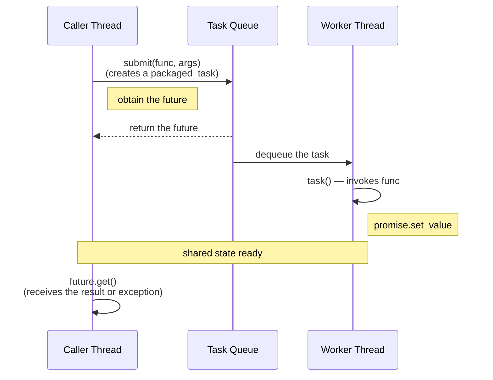

# promise and packaged_task

In the previous article, we used `std::async` to launch asynchronous tasks and got the results back through `std::future`. The whole thing is certainly convenient, but after wrestling with it for a while, we found one restriction rather uncomfortable: `std::async` hard-couples "launching the task" and "getting the result". Once you call `std::async`, the task is launched, and the returned future is bound to that task. You can't create a future first and push a value into it at some chosen moment; nor can you wrap an existing function object into an asynchronous task, drop it into a queue, and run it later. The moment you want to separate "task submission" from "task execution" (a thread pool, for instance), `std::async` stops being enough.

In this article we meet the "other end" of `std::future`: `std::promise` and `std::packaged_task`. They let you control manually when a value is set and when a task runs, and they are the infrastructure for building more flexible asynchronous pipelines (a thread pool's task-submission interface, for example). We will also meet `std::shared_future`, which fixes the pain point of `std::future` being "readable only once".

## std::promise\<T\>: Setting a future's Value by Hand

Let's start with `std::promise`. You can think of it as the write end of a `std::future`. A promise and a future are connected through a shared state: you set the value through the promise and read the value through the future. The lifecycle relationship between the two goes like this: the promise first calls `get_future()` to obtain the associated future, hands that future to the consumer thread, and stays behind in the producer thread to set the value.

No need to overthink it yet—let's establish the relationship between promise and future with the simplest possible example. The following code compiles and runs on any standard-conforming compiler at C++11 or later:

```cpp
#include <future>
#include <iostream>
#include <thread>

void worker(std::promise<int> prom)
{
    // Simulate some work
    std::this_thread::sleep_for(std::chrono::seconds(1));

    // Set the result value through the promise
    prom.set_value(42);
}

int main()
{
    // Create the promise-future pair
    std::promise<int> prom;
    std::future<int> fut = prom.get_future();

    // Move the promise to the worker thread
    std::thread t(worker, std::move(prom));

    // Wait for the result via the future on the main thread
    int result = fut.get();
    std::cout << "从 worker 收到: " << result << "\n";

    t.join();
    return 0;
}
```

The core flow of this code: the main thread creates the `promise`, calls `get_future()` to obtain the associated `future`, then hands the `promise` over to the worker thread with `std::move` (because `std::promise` is also a move-only type). When the worker thread finishes its work, it calls `prom.set_value(42)`, and the main thread's `fut.get()` picks up the value. You'll notice that `std::async` appears nowhere in the process—the promise gives us manual control over "when the value gets set".

There is an important design choice hiding here: why is the promise passed to the worker thread by move rather than by reference? Because a promise stands for the "right to set the value"—that right is exclusive and should not be shared. By moving the promise, you explicitly transfer the right to set the value to the worker thread, leaving the main thread holding nothing but the read-only future. This is a very clean expression of ownership.

### set_value(), set_exception(), and get_future()

With the basic usage in hand, let's now line up the three core operations of a promise and look at them clearly. First, `get_future()` returns the `std::future` associated with this promise—this operation can be called exactly once; a second call throws `std::future_error`. The returned future and the promise share the same underlying shared state. Next, `set_value()` sets the value of the shared state; once the value is set, every thread waiting on a future over that shared state is woken up. If the promise's template parameter is `void`, then `set_value()` takes no arguments and simply means "the computation is done". Like `get_future()`, `set_value()` can also be called only once—attempting to set a second value throws `std::future_error`. Finally, `set_exception()` stores an exception into the shared state; when the consumer calls `future.get()`, that exception is rethrown. It is usually paired with `std::current_exception()`—capture the current exception inside a catch block and store it into the promise.

Here is a complete example demonstrating both the normal value path and the exception path, tying the three operations above together:

```cpp
#include <future>
#include <iostream>
#include <thread>
#include <stdexcept>

void compute(std::promise<int> prom, int x)
{
    try {
        if (x < 0) {
            throw std::invalid_argument("输入不能为负数");
        }
        prom.set_value(x * x);
    } catch (...) {
        // Capture the exception and store it into the promise
        prom.set_exception(std::current_exception());
    }
}

int main()
{
    // Normal path
    {
        std::promise<int> prom;
        std::future<int> fut = prom.get_future();
        std::thread t(compute, std::move(prom), 5);

        try {
            std::cout << "5 的平方: " << fut.get() << "\n";
        } catch (const std::exception& e) {
            std::cout << "异常: " << e.what() << "\n";
        }
        t.join();
    }

    // Exception path
    {
        std::promise<int> prom;
        std::future<int> fut = prom.get_future();
        std::thread t(compute, std::move(prom), -3);

        try {
            std::cout << "-3 的平方: " << fut.get() << "\n";
        } catch (const std::invalid_argument& e) {
            std::cout << "捕获到异常: " << e.what() << "\n";
        }
        t.join();
    }
    return 0;
}
```

Before rushing on, let's untangle the exception-delivery chain in this code. `std::current_exception()` is a function used inside a catch block; it returns a `std::exception_ptr` pointing at the exception currently being handled. That `exception_ptr` is exactly what `promise.set_exception()` accepts, and it stores the exception into the shared state. When the consumer calls `fut.get()`, the stored exception is rethrown, and you can handle it with a matching catch block on the consumer side.

This exception-delivery pattern is extremely useful in cross-thread communication—you don't need to design an error-code scheme, you don't need to serialize exception information into strings; the exception object crosses the thread boundary intact, type information and all. Honestly, we were rather surprised the first time we realized exceptions can travel across threads—thread stacks are independent, after all—but the standard library solves the problem elegantly through `exception_ptr`.

### The Value Channel of a promise

Now let's step back and look at the core abstraction of promise/future. The value channel of a promise is the essence of the whole model: the promise is the write end, the future is the read end, and the shared state is the pipe between them. This abstraction lets us pass values between threads without shared variables or locks—synchronization is guaranteed entirely by the internal machinery of the shared state.

The value channel has an important property called the "synchronization point": when the producer calls `set_value()`, the value is written into the shared state and all waiting consumers are woken; when a consumer calls `get()`, it blocks until the value is ready if it isn't yet. You'll find that the semantics of this synchronization point are far clearer than condition variables—no predicates, no spurious-wakeup defenses, no manual locking. For a simple "one-shot value delivery" scenario, promise/future is much nicer to use than `condition_variable`.

But don't reach for a promise for everything—it has a limitation you cannot ignore: it is one-shot. `set_value()` can be called only once, and after that call the promise has little use left. This is symmetric with the one-shot consumption semantics of `std::future`—one end writes once, the other end reads once. If you need a channel that can be written and read repeatedly, you should use `std::condition_variable` or a message queue, not promise/future.

## std::packaged_task\<F\>: Wrapping Callable Objects

Good—now we know a promise can set a future's value by hand. But writing try-catch yourself and manually calling `set_value()` or `set_exception()` every single time gets tedious. The C++ standard library offers a higher-level wrapper: `std::packaged_task<F>`. It wraps a callable (a function, a lambda, a function object, and so on) and automatically pairs it with a promise/future pair. When you invoke this packaged_task, it internally calls the wrapped callable and automatically stuffs the return value into the promise (or the exception, if one is thrown).

The value of packaged_task lies in "decoupling task definition from task execution"—you can create a packaged_task in one thread, drop it into a queue, and then pull it out and execute it in another thread. This is the basic model of a thread pool, and it is what we will ultimately build in this volume.

```cpp
#include <future>
#include <iostream>
#include <thread>
#include <queue>
#include <mutex>
#include <functional>
#include <memory>

int add(int a, int b)
{
    return a + b;
}

int main()
{
    // Create a packaged_task wrapping a callable
    std::packaged_task<int(int, int)> task(add);

    // Get the associated future
    std::future<int> fut = task.get_future();

    // Execute the task on another thread
    std::thread t(std::move(task), 10, 20);

    // Fetch the result on the main thread
    int result = fut.get();
    std::cout << "10 + 20 = " << result << "\n";

    t.join();
    return 0;
}
```

Let's take this code apart. The template parameter of a packaged_task is a function signature; `int(int, int)`, for instance, means "takes two int arguments and returns int". The signature of the wrapped callable must be compatible with this template parameter. When you call `task.get_future()`, what you get is the future associated with the internal promise. And when you call `task(args...)`—note, not `task.run()` and not `task.execute()`, just the plain function-call operator—the internal promise is set automatically.

Also note that packaged_task is a move-only type too—you cannot copy it, only move it. The design is sound: if two packaged_tasks shared the same callable and shared state, invoking them twice would set the promise twice (with the second call throwing), which is clearly not the intended behavior.

### Exception Propagation in packaged_task

Next question: what happens if the wrapped function throws? The good news is that packaged_task handles it for you automatically—no manual try-catch followed by set_exception. When the wrapped function throws an exception, the packaged_task catches it internally and stores it in the shared state, and the consumer picks it up through `future.get()`.

```cpp
#include <future>
#include <iostream>
#include <stdexcept>

int risky_func(int x)
{
    if (x == 0) {
        throw std::runtime_error("除零错误");
    }
    return 100 / x;
}

int main()
{
    std::packaged_task<int(int)> task(risky_func);
    std::future<int> fut = task.get_future();

    // Invoke the task on the current thread (another thread works too)
    task(0);  // Pass 0, triggering the exception

    try {
        int result = fut.get();  // Rethrows the exception
        std::cout << "结果: " << result << "\n";
    } catch (const std::runtime_error& e) {
        std::cout << "捕获到异常: " << e.what() << "\n";
    }
    return 0;
}
```

Note that the `task(0)` call itself does not throw—the exception is captured silently inside the packaged_task. The call that actually throws is `fut.get()`. This design lets task invocation and error handling happen on different threads, which is very flexible—the worker thread just executes, the main thread just handles results and exceptions, each sticking to its own job.

### Building a Simple Task Queue with packaged_task

The most typical use of packaged_task is as a thread pool's task type. In this section we build the most bare-bones version first—a task queue with a single worker thread. Small as it is, it has all the vital organs, and it shows clearly how promise, packaged_task, and future cooperate.

```cpp
#include <future>
#include <iostream>
#include <thread>
#include <queue>
#include <mutex>
#include <condition_variable>
#include <functional>

class SimpleTaskQueue
{
public:
    using TaskType = std::function<void()>;

    SimpleTaskQueue()
    {
        worker_ = std::thread([this]() { worker_loop(); });
    }

    ~SimpleTaskQueue()
    {
        {
            std::lock_guard<std::mutex> lock(mutex_);
            done_ = true;
        }
        cv_.notify_one();
        worker_.join();
    }

    // Submit a packaged_task and return the corresponding future
    template <typename F, typename... Args>
    auto submit(F&& f, Args&&... args)
        -> std::future<std::invoke_result_t<F, Args...>>
    {
        using ReturnType = std::invoke_result_t<F, Args...>;

        auto task = std::make_shared<std::packaged_task<ReturnType()>>(
            std::bind(std::forward<F>(f), std::forward<Args>(args)...));

        std::future<ReturnType> fut = task->get_future();

        {
            std::lock_guard<std::mutex> lock(mutex_);
            queue_.push([task]() { (*task)(); });
        }
        cv_.notify_one();

        return fut;
    }

private:
    void worker_loop()
    {
        while (true) {
            TaskType task;
            {
                std::unique_lock<std::mutex> lock(mutex_);
                cv_.wait(lock, [this]() { return done_ || !queue_.empty(); });
                if (done_ && queue_.empty()) {
                    return;
                }
                task = std::move(queue_.front());
                queue_.pop();
            }
            task();
        }
    }

    std::thread worker_;
    std::queue<TaskType> queue_;
    std::mutex mutex_;
    std::condition_variable cv_;
    bool done_{false};
};
```

Bare-bones as it is, this `SimpleTaskQueue` already shows how promise, packaged_task, and future cooperate inside a task queue. Let's unpack the flow of `submit()`: it wraps the user-supplied callable into a `packaged_task`, wraps that in a `shared_ptr`, pushes it into the queue, and returns the corresponding future to the caller. The worker thread pulls the task from the queue and executes it; the execution result is set into the shared state automatically through the promise inside the packaged_task, and the caller's future can `get()` it. The whole chain strung together reads: caller submits task -> packaged_task enqueued -> worker thread dequeues and executes -> promise calls set_value automatically -> caller receives the result through the future.

Here is how you use it:

```cpp
int heavy_compute(int x)
{
    std::this_thread::sleep_for(std::chrono::seconds(1));
    return x * x;
}

int main()
{
    SimpleTaskQueue queue;

    auto f1 = queue.submit(heavy_compute, 5);
    auto f2 = queue.submit(heavy_compute, 10);
    auto f3 = queue.submit([]() {
        return std::string("hello from task queue");
    });

    std::cout << "f1: " << f1.get() << "\n";  // 25
    std::cout << "f2: " << f2.get() << "\n";  // 100
    std::cout << "f3: " << f3.get() << "\n";  // hello from task queue
    return 0;
}
```

The return type of `submit()` adapts automatically through trailing-return-type deduction—whatever callable you pass in, it deduces the correct return type and returns the matching `std::future<T>`. `std::invoke_result_t<F, Args...>` is a type trait provided by C++17 for deducing the return type of `F(Args...)`. If your compiler only supports C++11/14, you can substitute `std::result_of_t<F(Args...)>` instead (`std::result_of` was deprecated in C++17 and removed in C++20, so going straight to `invoke_result_t` is the recommended move).

## std::shared_future\<T\>: Sharing the Future Value

We have stressed repeatedly the one-shot consumption semantics of `std::future`—`get()` can be called only once, and after that the future is spent. For most scenarios this is no problem, but sometimes you need multiple threads waiting on the same result. For example, once an initialization task finishes, several worker threads all need the initialization result before they can start—one `std::future` is no longer enough, because the first thread's `get()` spends it. `std::shared_future<T>` is designed for exactly this "one-to-many" scenario.

The key difference between `std::shared_future` and `std::future` is this: `shared_future`'s `get()` returns a `const` reference (for object types) instead of an rvalue reference, so it can be called repeatedly without consuming the shared state. At the same time, `std::shared_future` is copyable—each waiting thread can hold its own copy, and all copies share the same underlying state.

You obtain a `std::shared_future` by calling the `share()` method on a `std::future` to convert it. At that point the original `std::future` becomes invalid (`valid()` turns false), and the state is transferred to the shared_future.

```cpp
#include <future>
#include <iostream>
#include <thread>
#include <vector>

int main()
{
    std::promise<int> prom;
    std::shared_future<int> sf = prom.get_future().share();

    // prom.get_future() returns std::future<int>
    // .share() converts the future to shared_future<int>; the original future becomes invalid

    auto worker = [sf](int id) {
        // Each thread fetches the result through its own shared_future copy
        int value = sf.get();  // Can be called repeatedly
        std::cout << "worker " << id << " 收到: " << value << "\n";
    };

    std::vector<std::thread> threads;
    for (int i = 0; i < 4; ++i) {
        threads.emplace_back(worker, i);
    }

    // The main thread sets the value (simulating completed initialization)
    std::this_thread::sleep_for(std::chrono::seconds(1));
    prom.set_value(42);

    for (auto& t : threads) {
        t.join();
    }
    return 0;
}
```

A few points in this code deserve a note. The lambda captures `sf`—since shared_future is copyable, the lambda holds a copy. The four threads each have their own shared_future copy, but they all point to the same shared state. When `prom.set_value(42)` is called, every future waiting on that shared state is woken up.

Here is a thread-safety detail worth spelling out: the member functions of `std::shared_future` such as `get()` and `wait()` are thread-safe by guarantee of the standard—multiple threads can call `get()` concurrently on the same shared_future object without a data race. This is another important difference between shared_future and future: `std::future::get()` can be called only once, while `std::shared_future::get()` supports not only repeated calls but concurrent ones. In practice, though, the recommended approach is still to let each thread hold its own shared_future copy—the code's intent is clearer that way, and it removes any worry about contention on a single object.

### The Broadcast Pattern for Multiple Waiters

The most typical use of `std::shared_future` is the "one-shot broadcast"—one producer sets the value, and many consumers wake up at the same time. If you are familiar with `std::condition_variable::notify_all()`, you'll find shared_future's semantics simpler: no predicate, no lock, no worrying about spurious wakeups. There is a price, of course—it works only once, and set_value can be called only once.

```cpp
#include <future>
#include <iostream>
#include <thread>
#include <vector>
#include <chrono>

int main()
{
    // Simulate loading a global configuration
    std::promise<std::string> config_prom;
    std::shared_future<std::string> config_fut = config_prom.get_future().share();

    auto worker = [config_fut](int id) {
        // Wait for the configuration to finish loading
        std::string config = config_fut.get();
        std::cout << "[worker " << id << "] 收到配置: "
                  << config << "，开始工作\n";
    };

    std::vector<std::thread> threads;
    for (int i = 0; i < 5; ++i) {
        threads.emplace_back(worker, i);
    }

    // Simulate loading the configuration
    std::cout << "正在加载配置...\n";
    std::this_thread::sleep_for(std::chrono::seconds(2));
    config_prom.set_value("mode=production, threads=8, cache=512MB");

    std::cout << "配置已广播\n";

    for (auto& t : threads) {
        t.join();
    }
    return 0;
}
```

This pattern is very practical in scenarios such as system initialization or global-state-change notification. One `set_value()` from the producer, and every consumer is notified automatically.

## Pattern: task submission -> promise -> queue -> worker -> set_value

With that done, we have been through the individual usage of promise, packaged_task, and future. Now it's time to put them together and see how they cooperate in a thread-pool setting. This is a thoroughly classic design; almost every C++ thread pool has this structure at its core.

The whole flow goes like this: the caller submits a task (a callable plus arguments); the thread pool wraps it into a `packaged_task`, obtains the `future` from the `packaged_task`, returns the future to the caller, and pushes the `packaged_task` (wrapped in a `std::function`) into the task queue. A worker thread pulls the task from the queue and executes it—during execution, the promise inside the `packaged_task` is set automatically (via `set_value` or `set_exception`), and the future in the caller's hand becomes ready. Throughout the process, the caller never needs to know which thread the task runs on, and the worker thread never needs to know where the task came from.

Here is the flow rendered as a pseudocode diagram:


```mermaid
sequenceDiagram
    participant Caller Thread
    participant Task Queue
    participant Worker Thread

    Caller Thread->>Task Queue: submit(func, args)<br/>(creates a packaged_task)
    Note right of Caller Thread: obtain the future
    Task Queue-->>Caller Thread: return the future
    Task Queue->>Worker Thread: dequeue the task
    Worker Thread->>Worker Thread: task() — invokes func
    Note right of Worker Thread: promise.set_value
    Note over Caller Thread,Worker Thread: shared state ready
    Caller Thread->>Caller Thread: future.get()<br/>(receives the result or exception)
```

The core advantage of this pattern is **decoupling**: the caller does not need to know which thread executes the task or when; the worker thread does not need to know where the task came from or where its return value goes. The two sides communicate through the shared state (jointly held by the `promise` inside the packaged_task and the `future` returned to the caller), and every synchronization detail is encapsulated inside the implementation of `std::promise`/`std::future`.

This is also why we said in the previous article that "thread pools suit large numbers of short tasks"—with the packaging of packaged_task, result delivery and exception handling for every task are automatic, and the caller needs only the two steps `submit()` + `get()`.

## Exercises: Value-Passing Chains with promise/packaged_task

### Exercise 1: Chaining Promises

Build a processing chain of three threads: thread A produces a random number and passes it to thread B via promise/future; thread B multiplies the number by 2 and passes it to thread C via promise/future; thread C prints the result. Each thread runs independently, with values traveling between threads through promise/future.

```cpp
#include <future>
#include <iostream>
#include <thread>
#include <random>

void stage_a(std::promise<int> out)
{
    std::mt19937 rng(12345);
    std::uniform_int_distribution<int> dist(1, 100);
    int value = dist(rng);
    std::cout << "[A] 产生: " << value << "\n";
    out.set_value(value);
}

void stage_b(std::future<int> in, std::promise<int> out)
{
    int value = in.get();  // Wait for A's result
    int doubled = value * 2;
    std::cout << "[B] 翻倍: " << doubled << "\n";
    out.set_value(doubled);
}

void stage_c(std::future<int> in)
{
    int value = in.get();  // Wait for B's result
    std::cout << "[C] 最终结果: " << value << "\n";
}

int main()
{
    // The A -> B channel
    std::promise<int> prom_ab;
    std::future<int> fut_ab = prom_ab.get_future();

    // The B -> C channel
    std::promise<int> prom_bc;
    std::future<int> fut_bc = prom_bc.get_future();

    std::thread ta(stage_a, std::move(prom_ab));
    std::thread tb(stage_b, std::move(fut_ab), std::move(prom_bc));
    std::thread tc(stage_c, std::move(fut_bc));

    ta.join();
    tb.join();
    tc.join();
    return 0;
}
```

Note that `stage_b` takes both a `future` (as input) and a `promise` (as output), acting as the middle node of the processing chain. `std::move` ensures that the exclusive ownership of the promise and the future is transferred correctly between threads.

### Exercise 2: Timeout Waits with packaged_task

Create a `packaged_task` wrapping a potentially slow computation. Use `wait_for()` to set a timeout: if the task finishes before the timeout, print the result; if the timeout expires, print "computation timed out" and give up waiting.

```cpp
#include <future>
#include <iostream>
#include <chrono>

int slow_computation()
{
    // Simulate a computation that takes 3 seconds
    std::this_thread::sleep_for(std::chrono::seconds(3));
    return 42;
}

int main()
{
    std::packaged_task<int()> task(slow_computation);
    std::future<int> fut = task.get_future();

    // Execute on a separate thread
    std::thread t(std::move(task));

    // Set a 2-second timeout
    auto status = fut.wait_for(std::chrono::seconds(2));

    if (status == std::future_status::ready) {
        std::cout << "结果: " << fut.get() << "\n";
    } else if (status == std::future_status::timeout) {
        std::cout << "计算超时，放弃等待\n";
        // Note: the worker thread is still running; we need to wait for it to finish
    } else {
        std::cout << "任务被延迟\n";
    }

    t.join();  // Make sure the thread ends cleanly
    return 0;
}
```

Note that the timeout merely spares the main thread from waiting forever; the worker thread itself has not been cancelled—the C++ standard currently provides no thread-cancellation mechanism. If the task never finishes, `t.join()` blocks forever. In the next article, when we discuss jthread and stop tokens, we will see how cooperative cancellation gracefully terminates long-running tasks.

### Exercise 3: shared_future Broadcast

Use `std::shared_future` to build a "starting gun": the main thread sets a shared_future, and multiple worker threads wait on that future and start working the moment it is ready. Observe whether their start times are close together (evidence that they were woken simultaneously rather than one after another).

## Summary

In this article we met the three partners of `std::future`: `std::promise`, `std::packaged_task`, and `std::shared_future`.

`std::promise<T>` is the write end of `std::future<T>`: set the normal result with `set_value()`, set the exceptional result with `set_exception()`. The promise and the future communicate through the shared state, offering synchronization semantics far simpler than condition variables—no lock, no predicate, no spurious-wakeup defense. The price is that it is one-shot, a value can be set only once—but for a single result delivery, that is if anything a safe design.

`std::packaged_task<F>` is a higher-level wrapper—it bundles a callable together with a promise, and when invoked, automatically stuffs the result (or exception) into the promise. Its greatest value is decoupling task definition from task execution, which is the basic model behind a thread pool's task queue: the caller submits the packaged_task, the worker thread dequeues and executes it, and the future carries the result across the two.

`std::shared_future<T>` lifts the "readable only once" restriction of `std::future`—it allows the same result to be read by multiple consumers, and `get()` can be called repeatedly and is thread-safe. The typical use is the "one-shot broadcast": one producer calls set_value, and every waiting consumer wakes up at the same time.

These four components (future, promise, packaged_task, shared_future) form the asynchronous value-delivery infrastructure of the C++ standard library. With them in hand, we have a solid foundation for the thread pools coming later. In the next article we will move on to jthread and stop tokens, to see what C++20 improves in thread lifecycle management—in particular, a cooperative cancellation mechanism that made us think "this should have existed all along".

> 💡 The complete example code is in [Tutorial_AwesomeModernCPP](https://github.com/Awesome-Embedded-Learning-Studio/Tutorial_AwesomeModernCPP); visit `code/volumn_codes/vol5/ch05-future-task-threadpool/`.

## References

- [std::promise — cppreference](https://en.cppreference.com/w/cpp/thread/promise)
- [std::packaged_task — cppreference](https://en.cppreference.com/w/cpp/thread/packaged_task)
- [std::shared_future — cppreference](https://en.cppreference.com/w/cpp/thread/shared_future)
- [C++11 Concurrency Tutorial - Futures — Baptiste Wicht](https://baptiste-wicht.com/posts/2017/09/cpp11-concurrency-tutorial-futures.html)
- [Daily bit(e) of C++: std::promise, std::future — Simon Toth](https://medium.com/@simontoth/daily-bit-e-of-c-std-promise-std-future-4af3b6dd23ac)
- [What is std::promise? — isocpp.org](https://isocpp.org/blog/2013/07/what-is-stdpromise-stackoverflow)
