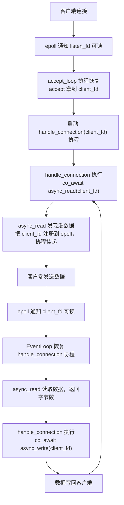

# Practical: Coroutine Echo Server

After four theoretical articles—covering the evolution of asynchronous programming paradigms, C++20 coroutine basics, the customization mechanisms of `promise_type` and awaitable, and finally connecting coroutines with the epoll event loop in the last part—we have finally arrived at the practical implementation. To be honest, every previous article was leading up to this moment: we will use our custom-built coroutine framework to write a fully functional network program—a TCP Echo Server.

The Echo Server is the "Hello World" of network programming: the server echoes back whatever the client sends. It is simple enough to have almost no business logic, yet complete enough to cover all core aspects of network programming—creating a listening socket, accepting connections, reading data, writing data back, and handling connection closures and errors. Once you can elegantly string these steps together using coroutines, you will have truly mastered the essence of the "coroutine-based asynchronous I/O" paradigm.

## Environment Setup

This article is a complete hands-on network programming exercise, so the environment requirements are more specific than in previous posts. The operating system must be Linux (WSL2 is also fine, kernel 5.x+), because epoll is a Linux-specific API—macOS users can achieve similar results using kqueue, but the code will require modifications. For the compiler, we need GCC 11+ or Clang 15+. Both versions enable coroutine support with `-std=c++20` (GCC 10 requires the `-fcoroutines` flag, which is no longer needed starting with GCC 11). The compilation flags `-std=c++20 -O2` are sufficient, though we recommend adding `-Wall -Wextra` to enable warnings. For testing tools, manual testing with `nc` (netcat) or `telnet` is fine, but performance testing requires `wrk` or `ab` (ApacheBench).

Installing dependencies on Ubuntu/Debian is simple:

```bash
sudo apt install netcat-openbsd wrk apache2-utils
```

## Overall Architecture: Blueprint Before Building

Before we start, let's clarify the components of our Echo Server and how they interact. Blindly writing code will only leave you questioning your existence during debugging sessions.

Our Echo Server consists of three core components:

**EventLoop** is the heart of the entire system. It encapsulates `epoll`, responsible for notifying whoever has data ready. We built a minimal version in the previous article, but we will make improvements here—adding coroutine lifecycle management and supporting dynamic registration and removal of file descriptors. The EventLoop runs an infinite loop in a single thread: it calls `epoll_wait` to get ready file descriptors, retrieves the corresponding coroutine handle from `epoll_event.data.ptr`, and then `resume()`s it.

**Async I/O awaiters** (`async_accept`, `async_read`, `async_write`) are the bridge between coroutines and the EventLoop. Each awaiter encapsulates a specific I/O operation. When an operation cannot be completed immediately (returning `EAGAIN`), the awaiter registers the current coroutine with `epoll` and suspends it. When data is ready, the EventLoop resumes the coroutine, and the coroutine retries the I/O operation.

The **handle_connection coroutine** is an independent coroutine corresponding to each client connection. It runs an infinite loop performing `co_await async_read` → `co_await async_write` until the client disconnects. This "one coroutine per connection" pattern makes the code look almost identical to synchronous blocking programming, while the underlying model is an efficient, single-threaded event-driven system.

The data flow looks like this:



The entire process runs within a single thread, yet handles multiple clients concurrently. This is because each client has its own coroutine, which suspends and yields execution while waiting for I/O, without blocking anyone else.

## Step 1: EventLoop — A Complete Version of the Event Loop

In the previous article, our `EventLoop` was a minimal prototype. Now, we need a more robust version. The core improvements are: we need to register the file descriptor (fd) when a coroutine suspends, and remove the fd when the coroutine resumes (because in Level-Triggered mode, failing to remove it will cause repeated triggers), as well as manage coroutines that have finished execution.

```cpp
#include <coroutine>
#include <cstdio>
#include <cstdlib>
#include <cstring>
#include <unistd.h>
#include <fcntl.h>
#include <csignal>
#include <sys/epoll.h>
#include <sys/socket.h>
#include <netinet/in.h>
#include <cerrno>
#include <unordered_set>
```

Let's first look at the `EventLoop` class definition. Compared to the previous version, we have added a set of active coroutines to manage their lifecycles:

```cpp
/// 事件循环——封装 epoll，管理协程的挂起与恢复
class EventLoop {
public:
    EventLoop()
        : epoll_fd_(epoll_create1(EPOLL_CLOEXEC))
    {
        if (epoll_fd_ < 0) {
            perror("epoll_create1");
            std::abort();
        }
    }

    ~EventLoop() { close(epoll_fd_); }

    // 不允许拷贝和移动
    EventLoop(const EventLoop&) = delete;
    EventLoop& operator=(const EventLoop&) = delete;

    /// 注册 fd 到 epoll，关联一个协程 handle
    void add_event(int fd, uint32_t events, std::coroutine_handle<> handle)
    {
        struct epoll_event ev;
        ev.events = events;
        ev.data.ptr = handle.address(); // 核心技巧：把 handle 存进 epoll

        if (epoll_ctl(epoll_fd_, EPOLL_CTL_ADD, fd, &ev) < 0) {
            // fd 可能已经被注册过了，用 MOD 重试
            if (errno == EEXIST) {
                epoll_ctl(epoll_fd_, EPOLL_CTL_MOD, fd, &ev);
            } else {
                perror("epoll_ctl ADD");
            }
        }
    }

    /// 从 epoll 移除 fd
    void remove_event(int fd)
    {
        epoll_ctl(epoll_fd_, EPOLL_CTL_DEL, fd, nullptr);
    }

    /// 注册一个活跃协程（防止协程帧被提前销毁）
    void track_coroutine(std::coroutine_handle<> handle)
    {
        active_coroutines_.insert(handle);
    }

    /// 移除一个已结束的协程
    void untrack_coroutine(std::coroutine_handle<> handle)
    {
        active_coroutines_.erase(handle);
    }

    /// 运行事件循环
    void run();

    /// 停止事件循环
    void stop() { running_ = false; }

private:
    int epoll_fd_;
    bool running_ = true;
    std::unordered_set<std::coroutine_handle<>> active_coroutines_;
};
```

Here is a key design element: the `active_coroutines_` collection. Its purpose is to resolve an issue we mentioned at the end of the previous article—where the coroutine's return value object might be destroyed prematurely, causing the coroutine frame to be freed. We use this collection to hold handles to all active coroutines, ensuring they are not destroyed while executing. When a coroutine finishes, it removes itself from the collection and calls `destroy()` to clean up the coroutine frame. However, in the final implementation for this article, we opted for the simpler `DetachedTask` approach—where the coroutine frame is automatically cleaned up upon completion—so `active_coroutines_` and its related methods are not actually called in the code. If you need more fine-grained lifecycle management (such as waiting for coroutine completion from the outside or canceling coroutines), the `track_coroutine`/`untrack_coroutine` mechanism comes into play.

> ⚠️ **`std::unordered_set<std::coroutine_handle<>>` requires a `std::hash<coroutine_handle>` specialization, which was only added to the standard library in C++23.** GCC 14+ libstdc++ provides this specialization as an extension in C++20 mode, but on some older compilers, you may need to use `std::set<std::coroutine_handle<>>` instead (sorted based on `operator<=>`, requiring no hash) or provide a custom hasher.

Next is the event loop's `run()` method:

```cpp
void EventLoop::run()
{
    constexpr int kMaxEvents = 64;
    struct epoll_event events[kMaxEvents];

    while (running_) {
        int n = epoll_wait(epoll_fd_, events, kMaxEvents, 1000);
        if (n < 0) {
            if (errno == EINTR) {
                continue; // 被信号中断，重试
            }
            perror("epoll_wait");
            break;
        }

        for (int i = 0; i < n; ++i) {
            auto handle = std::coroutine_handle<>::from_address(
                events[i].data.ptr
            );
            if (handle && !handle.done()) {
                handle.resume();
            }
        }
    }
}
```

You will find that the logic in `run()` is straightforward: `epoll_wait` retrieves ready events, we restore the coroutine handle from `data.ptr`, and `resume()` it. The timeout is set to one second to give the loop a chance to check the `running_` flag (used for graceful exit). Handling `EINTR` is essential—for instance, when you press Ctrl+C to send SIGINT, `epoll_wait` is interrupted and returns `-1`, setting `errno` to `EINTR`. In this case, we should not exit the loop.

## Step 2: The Task Type—A Coroutine Wrapper with Automatic Cleanup

In the previous article, we defined a minimal `IoTask`, but it had a serious flaw: the coroutine frame was not automatically destroyed after the coroutine finished, requiring someone to manually call `destroy()`. This is a root cause of memory leaks in production code. This time, we design a more robust `Task` type that leverages the EventLoop's tracking mechanism to ensure coroutine frames are always cleaned up correctly.

```cpp
/// 协程任务类型——与 EventLoop 配合，自动管理生命周期
struct Task {
    struct promise_type {
        Task get_return_object()
        {
            return Task{
                std::coroutine_handle<promise_type>::from_promise(*this)
            };
        }

        // 惰性启动：协程创建时不执行，等外部 resume
        std::suspend_always initial_suspend() { return {}; }

        // 协程结束时挂起，由 EventLoop 负责清理
        std::suspend_always final_suspend() noexcept { return {}; }

        void return_void() {}
        void unhandled_exception() { std::terminate(); }
    };

    std::coroutine_handle<promise_type> handle;
};

/// Fire-and-forget 任务类型——协程结束后自动销毁
struct DetachedTask {
    struct promise_type {
        DetachedTask get_return_object()
        {
            return DetachedTask{
                std::coroutine_handle<promise_type>::from_promise(*this)
            };
        }

        // 创建时立即开始执行
        std::suspend_never initial_suspend() { return {}; }

        // 结束时自动销毁协程帧
        std::suspend_never final_suspend() noexcept { return {}; }

        void return_void() {}
        void unhandled_exception() { std::terminate(); }
    };

    std::coroutine_handle<promise_type> handle;
};
```

We have defined two task types. `Task` is "lazy"—it does not execute upon creation, requires an external `resume()`, and suspends upon completion to await cleanup. It is suitable for scenarios requiring precise control over execution timing, such as an accept loop.

`DetachedTask` is "fire-and-forget"—it executes immediately upon creation, and the coroutine frame is automatically destroyed when it finishes (because `final_suspend` returns `suspend_never`). It is suitable for scenarios where we "just need to start it and forget about it," such as handling client connections. We create one `DetachedTask` per client connection; once the connection handling is complete, the coroutine cleans up automatically without external management.

> ⚠️ **The fact that `DetachedTask`'s `final_suspend` returns `suspend_never` means the coroutine frame is destroyed immediately when the coroutine ends. While convenient, this carries risks: if the coroutine holds a reference to a destroyed object (like a dangling pointer), accessing that reference before `final_suspend` results in undefined behavior (UB). Therefore, we must ensure all captured resources in a `DetachedTask` remain valid—use capture by value or `shared_ptr`, and avoid raw pointers or references to stack variables.**

## Step 3: Utility Functions—Creating a Non-blocking Listening Socket

This section covers standard Linux network programming. While it isn't directly related to coroutines, rewriting it every time is tedious. Let's wrap it up first:

```cpp
/// 设置 fd 为非阻塞模式
/// 注意：本篇代码中 listen_fd 和 client_fd 都通过 SOCK_NONBLOCK 标志直接创建为非阻塞模式，
/// 所以这个函数实际上没有被调用。保留它是因为在实际项目中你经常需要把一个已有的 fd
/// （比如从 dup2 或 socketpair 得到的 fd）手动设置为非阻塞
void set_nonblocking(int fd)
{
    int flags = fcntl(fd, F_GETFL, 0);
    fcntl(fd, F_SETFL, flags | O_NONBLOCK);
}

/// 创建监听 socket，绑定到指定端口
int create_listen_socket(uint16_t port)
{
    int listen_fd = ::socket(AF_INET, SOCK_STREAM | SOCK_NONBLOCK | SOCK_CLOEXEC, 0);
    if (listen_fd < 0) {
        perror("socket");
        return -1;
    }

    // SO_REUSEADDR：允许端口在 TIME_WAIT 状态下被复用
    // 不加这个的话，重启服务器时可能遇到 "Address already in use"
    int opt = 1;
    setsockopt(listen_fd, SOL_SOCKET, SO_REUSEADDR, &opt, sizeof(opt));

    struct sockaddr_in addr {};
    addr.sin_family = AF_INET;
    addr.sin_addr.s_addr = INADDR_ANY;
    addr.sin_port = htons(port);

    if (::bind(listen_fd,
               reinterpret_cast<struct sockaddr*>(&addr),
               sizeof(addr)) < 0) {
        perror("bind");
        close(listen_fd);
        return -1;
    }

    if (::listen(listen_fd, SOMAXCONN) < 0) {
        perror("listen");
        close(listen_fd);
        return -1;
    }

    return listen_fd;
}
```

There are two details worth noting here. The first is `SOCK_NONBLOCK | SOCK_CLOEXEC`, which sets the socket to non-blocking mode and sets the close-on-exec flag directly within the `socket()` call. This is more atomic than calling `socket()` followed by `fcntl()`, avoiding a race window between the two (though it is virtually impossible to trigger in this scenario).

The second is `SO_REUSEADDR`. After a TCP connection closes, it enters the TIME_WAIT state (lasting approximately 2MSL, usually 60 seconds), during which the port cannot be reused. If you restart the server frequently during debugging, you will often encounter the "Address already in use" error without this option. It is also recommended to include this in production environments; Nginx does this, for example.

## Step 4: async_accept—Awaitable Connection Accepting

Now we get to the core part. `async_accept` is an awaiter that wraps the accept system call: it suspends the coroutine when there are no new connections and registers the listen_fd with epoll; when a new connection arrives, it resumes the coroutine and executes accept to obtain the client_fd.

```cpp
/// 全局事件循环实例
EventLoop g_event_loop;

/// 异步 accept 的 awaiter
struct AsyncAcceptAwaiter {
    int listen_fd_;

    explicit AsyncAcceptAwaiter(int listen_fd)
        : listen_fd_(listen_fd) {}

    bool await_ready() noexcept
    {
        // 先尝试非阻塞 accept——可能已经有等待的连接了
        // 如果 accept 成功，就不需要挂起，省去注册 epoll 的开销
        return false; // 简化版，总是走挂起路径
    }

    void await_suspend(std::coroutine_handle<> handle)
    {
        // 注册到 epoll，监听可读事件（新连接到达 = listen_fd 可读）
        g_event_loop.add_event(listen_fd_, EPOLLIN, handle);
    }

    int await_resume()
    {
        // 协程恢复后，先从 epoll 移除 listen_fd
        // LT 模式下不移除的话，每次 epoll_wait 都会反复通知
        g_event_loop.remove_event(listen_fd_);

        struct sockaddr_in client_addr {};
        socklen_t addr_len = sizeof(client_addr);
        int client_fd = ::accept4(
            listen_fd_,
            reinterpret_cast<struct sockaddr*>(&client_addr),
            &addr_len,
            SOCK_NONBLOCK | SOCK_CLOEXEC
        );

        if (client_fd >= 0) {
            // accept4 带 SOCK_NONBLOCK，不需要再调 fcntl
            std::printf("[server] 新连接 fd=%d\n", client_fd);
        }
        return client_fd;
    }
};

/// 协程化的 accept——对外接口
AsyncAcceptAwaiter async_accept(int listen_fd)
{
    return AsyncAcceptAwaiter(listen_fd);
}
```

Here are a few design choices we need to explain.

`await_ready()` simply returns `false`—we always suspend. A more optimized version could attempt a non-blocking accept first; if a connection is already queued, it returns immediately, saving the overhead of registering with epoll. However, for code clarity, we stick with the simple version here.

`await_suspend()` registers `listen_fd` with epoll to watch for `EPOLLIN` events—for a listening socket, `EPOLLIN` means "a new connection is ready to be accepted".

`await_resume()` does two things: first, it removes `listen_fd` from epoll, then it calls `accept4` to get the new `client_fd`. We remove it before accepting because in Level-Triggered (LT) mode, if we call `epoll_wait` without removing `listen_fd` first, it will keep notifying us that "`listen_fd` is readable" (because there might be more connections in the queue). We choose to accept only one connection at a time here. We could accept multiple at once, but that would require changing `await_resume` to return a list of connections, which would complicate the design significantly.

`accept4` uses `SOCK_NONBLOCK | SOCK_CLOEXEC` to set the `client_fd` to non-blocking mode immediately—this is essential for the subsequent `async_read` and `async_write` operations.

## Step 5: async_read—Coroutine-based Data Reading

`async_read` is the core awaiter in our Echo Server. It encapsulates the complete semantics of a non-blocking read: if data is available, read it immediately; if not (i.e., `EAGAIN`), suspend and wait for an epoll notification.

```cpp
/// 异步 read 的 awaiter
struct AsyncReadAwaiter {
    int fd_;
    void* buffer_;
    std::size_t size_;
    ssize_t result_;
    bool suspended_ = false; // 是否经过了挂起路径

    AsyncReadAwaiter(int fd, void* buffer, std::size_t size)
        : fd_(fd), buffer_(buffer), size_(size), result_(0) {}

    bool await_ready() noexcept
    {
        // 快速路径：先尝试非阻塞 read
        result_ = ::recv(fd_, buffer_, size_, 0);
        if (result_ >= 0) {
            return true; // 读到了数据，不需要挂起
        }
        if (errno == EAGAIN || errno == EWOULDBLOCK) {
            return false; // 暂时没数据，需要等 epoll 通知
        }
        return true; // 其他错误（如连接重置），不挂起，让 await_resume 处理
    }

    void await_suspend(std::coroutine_handle<> handle)
    {
        // 没数据可读，注册到 epoll 等待 fd 可读
        suspended_ = true;
        g_event_loop.add_event(fd_, EPOLLIN, handle);
    }

    ssize_t await_resume()
    {
        if (suspended_) {
            // 挂起后恢复的路径：epoll 通知 fd 可读，尝试真正读取
            g_event_loop.remove_event(fd_);
            result_ = ::recv(fd_, buffer_, size_, 0);
        }
        // 快速路径（await_ready 返回 true）直接返回 result_
        return result_;
    }
};

/// 协程化的 read——对外接口
AsyncReadAwaiter async_read(int fd, void* buffer, std::size_t size)
{
    return AsyncReadAwaiter(fd, buffer, size);
}
```

The fast path in `await_ready()` is a critical optimization. In many scenarios, data is already available in the TCP receive buffer (especially when the client sends multiple messages consecutively). In these cases, we don't need the full routine of suspending the coroutine, registering with `epoll`, waiting for a notification, and resuming the coroutine—we can simply `recv` immediately. This fast path eliminates at least one `epoll_ctl` system call and two coroutine context switches.

You might have noticed that we use `recv` instead of `read`. The difference is that `recv` has a `flags` parameter. We currently pass `0`, but we will eventually use the `MSG_NOSIGNAL` flag to avoid SIGPIPE issues. `read` does not support the `flags` parameter.

Inside `await_resume()`, we use a `suspended_` flag to distinguish between the two paths. The previous version used `result_ < 0` to check, but this contained a subtle bug: if `recv` returned a non-`EAGAIN` error (such as `ECONNRESET`) on the fast path, `result_` would be negative. `await_resume` would mistakenly assume we took the suspend path and proceed to call `remove_event`. However, since the file descriptor was never registered with `epoll` in the first place, the `epoll_ctl(DEL)` inside `remove_event` might modify `errno`, overwriting the actual error code. Using the `suspended_` flag allows us to precisely distinguish between "returning immediately with an error from the fast path" and "resuming from suspension and reading."

## Step 6: async_write—Coroutine-based Data Writing

`async_write` is slightly more complex than `async_read` because a TCP write might only send a portion of the data. On a non-blocking socket, `send` may return a value smaller than the number of bytes you requested. This does not indicate an error; it simply means the send buffer is temporarily full. Therefore, we need to loop sending until all data is written or an unrecoverable error occurs.

```cpp
/// 异步 write 的 awaiter（需要处理部分写入）
struct AsyncWriteAwaiter {
    int fd_;
    const void* buffer_;
    std::size_t size_;
    std::size_t total_sent_; // 已发送的字节数
    bool has_error_ = false; // 是否遇到了不可恢复的错误

    AsyncWriteAwaiter(int fd, const void* buffer, std::size_t size)
        : fd_(fd), buffer_(buffer), size_(size), total_sent_(0) {}

    bool await_ready() noexcept
    {
        // 尝试发送所有数据
        return try_send_all();
    }

    void await_suspend(std::coroutine_handle<> handle)
    {
        // 发送缓冲区满了，注册 EPOLLOUT 等待 fd 可写
        g_event_loop.add_event(fd_, EPOLLOUT, handle);
    }

    ssize_t await_resume()
    {
        // 协程恢复后，epoll 通知 fd 可写
        // 此时发送缓冲区应该有空间了，继续尝试发送剩余数据
        // 注意：这里不做循环重试——如果又遇到 EAGAIN，说明 epoll 的可写通知
        // 不保证一次就能发完所有数据，但在 LT 模式下下次 epoll_wait 还会通知
        // 为了简化，这里如果还有未发完的数据就返回 -1 让调用者关闭连接
        // 生产级别的实现会在 await_resume 里重新注册 EPOLLOUT 再挂起
        g_event_loop.remove_event(fd_);
        if (!try_send_all() && total_sent_ < size_) {
            // 发了一部分但没发完，仍然有数据待发送
            // Echo Server 场景下数据量不大，这种情况极少发生
            // 但为了正确性，我们标记为错误
            has_error_ = true;
        }
        if (has_error_) {
            return -1;
        }
        return static_cast<ssize_t>(total_sent_);
    }

private:
    /// 尝试发送所有数据，返回 true 表示全部发完或遇到错误
    bool try_send_all()
    {
        while (total_sent_ < size_) {
            const char* data = static_cast<const char*>(buffer_) + total_sent_;
            std::size_t remaining = size_ - total_sent_;

            // MSG_NOSIGNAL：对端关闭连接时不触发 SIGPIPE，而是返回 EPIPE
            ssize_t n = ::send(fd_, data, remaining, MSG_NOSIGNAL);

            if (n > 0) {
                total_sent_ += static_cast<std::size_t>(n);
                continue;
            }

            if (n < 0) {
                if (errno == EAGAIN || errno == EWOULDBLOCK) {
                    return false; // 发送缓冲区满了，需要挂起
                }
                // 其他错误（EPIPE、ECONNRESET 等）
                has_error_ = true;
                return true;
            }

            // n == 0 不应该在 send 上出现，但防御性处理
            has_error_ = true;
            return true;
        }
        return true; // 全部发完
    }
};

/// 协程化的 write——对外接口
AsyncWriteAwaiter async_write(int fd, const void* buffer, std::size_t size)
{
    return AsyncWriteAwaiter(fd, buffer, size);
}
```

The core logic of `async_write` resides in `try_send_all()`: it calls `send` in a loop until all data is transmitted or the send buffer is full (`EAGAIN`). We introduced a `has_error_` flag to distinguish between "fully sent" and "encountered an unrecoverable error." Previously, if we used `total_sent_` as the return value, it would be positive during a partial write, making it impossible for the caller to distinguish between "successfully sent this many bytes" and "an error occurred but some data was sent in the meantime." Now, `await_resume` returns `-1` on error, allowing the caller to properly close the connection. The `MSG_NOSIGNAL` flag is critical—when the peer has closed the connection, writing to the socket causes the kernel to send a `SIGPIPE` signal to the process by default. The default behavior of `SIGPIPE` is to terminate the process, which means your Echo Server would crash simply because a client disconnected. `MSG_NOSIGNAL` tells the kernel "don't send a signal, just return an error." In this case, `send` returns `-1` and sets `errno` to `EPIPE`.

> ⚠️ **SIGPIPE is one of the classic "gotchas" in network programming.** Many servers written by beginners crash inexplicably; after a long investigation, it turns out the server was writing to a socket after the client disconnected, triggering SIGPIPE. There are three solutions: use the `MSG_NOSIGNAL` flag (per-call), globally ignore it with `signal(SIGPIPE, SIG_IGN)` (per-process, recommended), or use the `SO_NOSIGPIPE` socket option on macOS/BSD (per-socket, not available on Linux). We chose `MSG_NOSIGNAL` here because it is the most precise—it only affects this specific `send` call without altering the process-wide signal behavior. However, in certain scenarios (such as when using third-party libraries), `signal(SIGPIPE, SIG_IGN)` is more convenient.

## Step 7: handle_connection—One Coroutine Per Connection

With `async_read` and `async_write` in place, the logic for handling client connections becomes exceptionally concise. The entire `handle_connection` is just an infinite loop: read data, write it back, and repeat until the connection closes or an error occurs.

```cpp
/// 处理单个客户端连接的协程
DetachedTask handle_connection(int client_fd)
{
    char buffer[4096];

    while (true) {
        // 异步读取客户端数据
        ssize_t n = co_await async_read(client_fd, buffer, sizeof(buffer));

        if (n <= 0) {
            // n == 0：对端关闭连接（优雅关闭）
            // n < 0：读取错误
            if (n == 0) {
                std::printf("[conn fd=%d] 客户端关闭连接\n", client_fd);
            } else {
                std::printf("[conn fd=%d] 读取错误: %s\n",
                            client_fd, std::strerror(errno));
            }
            close(client_fd);
            co_return;
        }

        // 异步写回——Echo！
        ssize_t written = co_await async_write(client_fd, buffer, n);
        if (written < 0) {
            std::printf("[conn fd=%d] 写入错误\n", client_fd);
            close(client_fd);
            co_return;
        }
    }
}
```

You see, this code looks almost identical to synchronous blocking network programming—a `while` loop with `read` followed by `write`. The only difference is that `co_await` replaces the direct call. However, the underlying execution model is completely different: each `co_await` suspends the current coroutine when data isn't ready, allowing the event loop to handle other coroutines. From a macro perspective, hundreds or thousands of client connection coroutines advance alternately within a single thread; from a micro perspective, each coroutine consumes absolutely no CPU resources while waiting for I/O.

Here is a detail worth mentioning: `char buffer[4096]` is a "local variable," but it doesn't reside on the physical stack—because `handle_connection` is a coroutine, the compiler places all its local variables into the coroutine frame on the heap. This means the buffer remains valid when the coroutine is suspended, unlike stack variables in normal functions which get overwritten after the function returns. This is the fundamental reason why coroutines can safely hold state between suspension points—your local variables are "promoted" to the heap. The cost is that creating a connection coroutine requires allocating heap memory (at least 4KB, largely contributed by the buffer), which is non-negligible memory overhead in high-concurrency scenarios. Production-level implementations typically optimize this using connection-level memory pools or by reducing the buffer size combined with external buffer management.

This is the beauty of coroutines—you write code with a synchronous mindset and get asynchronous execution efficiency.

Using `DetachedTask` as the return type means this coroutine is "fire-and-forget." After `accept_loop` starts it, it doesn't need to care when it ends or how to clean it up—when the coroutine ends, `final_suspend` returns `suspend_never`, and the coroutine frame is automatically destroyed. `close(client_fd)` executes before the coroutine returns, ensuring the socket is properly closed.

## Step 8: accept_loop and main—Assembly and Startup

Finally, we assemble all the components. `accept_loop` is an infinite loop that continuously accepts new connections and starts an independent `handle_connection` coroutine for each one:

```cpp
/// 接受新连接的协程
Task accept_loop(int listen_fd)
{
    std::printf("[server] 开始接受连接...\n");

    while (true) {
        int client_fd = co_await async_accept(listen_fd);

        if (client_fd < 0) {
            if (errno == EAGAIN || errno == EWOULDBLOCK) {
                continue; // 没有连接，理论上不会走到这里
            }
            std::printf("[server] accept 失败: %s\n",
                        std::strerror(errno));
            continue;
        }

        // 启动一个新的 DetachedTask 协程来处理这个连接
        // handle_connection 创建后立即开始执行（initial_suspend 返回 suspend_never）
        // 协程结束时会自动清理，不需要我们管
        handle_connection(client_fd);
    }
}
```

Here is a pitfall to avoid: if `handle_connection` returns a `Task` (which starts lazily), you must manually `resume()` it after creation to execute it. However, since we use `DetachedTask` (which starts eagerly), the coroutine begins executing as soon as we call `handle_connection(client_fd)`. It runs until it reaches the first `co_await async_read`—if no data is available yet, the coroutine suspends, and control returns to `accept_loop`, which continues waiting for the next connection.

If we were to use `Task`, the code would look like this:

```cpp
// 如果用 Task 类型（惰性启动）
auto task = handle_connection(client_fd);
task.handle.resume(); // 手动启动
```

Both approaches achieve the same result, but `DetachedTask` better fits the "fire-and-forget" semantics—we do not need to care about the task's return value or lifetime.

Finally, here is the `main` function:

```cpp
int main()
{
    // 忽略 SIGPIPE——双重保险
    // 即使 async_write 用了 MSG_NOSIGNAL，全局忽略 SIGPIPE 也是好习惯
    std::signal(SIGPIPE, SIG_IGN);

    constexpr uint16_t kPort = 8080;

    int listen_fd = create_listen_socket(kPort);
    if (listen_fd < 0) {
        return 1;
    }

    std::printf("协程 Echo Server 启动，监听端口 %d\n", kPort);
    std::printf("测试方式: nc localhost %d\n", kPort);

    // 创建 accept 循环协程（惰性，还没开始执行）
    auto acceptor = accept_loop(listen_fd);

    // 手动启动 accept 协程
    // 它会执行到第一个 co_await async_accept，然后挂起
    // 把 listen_fd 注册到 epoll
    acceptor.handle.resume();

    // 进入事件循环——此后所有协程由 epoll 事件驱动
    g_event_loop.run();

    close(listen_fd);
    return 0;
}
```

The execution flow of `main` works like this: we create a listening socket, launch the accept coroutine, and enter the event loop. The accept coroutine suspends at the first `co_await async_accept`, registering `listen_fd` with epoll. From then on, whenever a new connection arrives, epoll notifies that `listen_fd` is readable, the event loop resumes the accept coroutine, the accept coroutine retrieves the new connection, launches a `handle_connection` coroutine, and then returns to a suspended state to continue waiting.

`signal(SIGPIPE, SIG_IGN)` serves as a global safety measure. Even though our `async_write` uses `MSG_NOSIGNAL`, other parts of the code (such as a logging library or third-party code) might call `write` directly instead of `send`, lacking the protection of `MSG_NOSIGNAL`. Globally ignoring SIGPIPE prevents these accidents.

## Compilation and Execution

Combine all the code above into a single file (or compile separately, if you prefer), and compile with the following command:

```bash
g++ -std=c++20 -O2 -Wall -Wextra -o echo_server echo_server.cpp
```

Then, we start the server:

```bash
./echo_server
```

You should see:

```text
协程 Echo Server 启动，监听端口 8080
测试方式: nc localhost 8080
[server] 开始接受连接...
```

The server is waiting for a connection.

## Lessons Learned

While implementing and debugging this Echo Server, we encountered several pitfalls worth recording. To be honest, we stumbled quite a bit while writing this code. We have summarized them here so that you can avoid the same mistakes.

### Pitfall 1: SIGPIPE makes your server "die silently"

We mentioned this pitfall earlier, but it is worth emphasizing again. When a client closes the connection, if the server continues writing to that socket, the kernel sends a `SIGPIPE` signal by default. The default action for `SIGPIPE` is to terminate the process—and it does not generate a core dump or print an error message; the process simply vanishes. You might even think the server "exited normally" until you realize `nc` cannot connect.

We have implemented dual protection in the code: using `MSG_NOSIGNAL` with `send`, and calling `signal(SIGPIPE, SIG_IGN)` in `main`. Either method is sufficient, but applying both is safer.

### Pitfall 2: Forgetting to remove fd in LT mode causes an event storm

This is an interesting pitfall. In LT (Level-Triggered) mode, `epoll_wait` will repeatedly notify you as long as data is readable on the fd. If you forget to call `remove_event` to remove the fd from epoll in your `await_resume`, `epoll_wait` will return events for this fd every time—even if you have already processed it. This causes the event loop to frantically resume the same coroutine, driving the CPU to 100%, while accomplishing nothing useful.

Our code calls `remove_event` in the `await_resume` of both `async_read` and `async_write` specifically to prevent this issue.

### Pitfall 3: Coroutine frame lifetime—dangling handles

We mentioned this issue at the end of the previous article, so let's expand on it here. When you create a coroutine (e.g., `handle_connection(client_fd)`), the coroutine's `promise_type` allocates a "coroutine frame" on the heap to store local variables and state. If the coroutine's return value object (`DetachedTask` or `Task`) is destroyed before the coroutine finishes executing, and `final_suspend` returns `suspend_never` (which automatically destroys the coroutine frame), there is no problem. However, if `final_suspend` returns `suspend_always`, the coroutine frame needs someone to manually call `destroy()`.

Our `DetachedTask` uses `suspend_never`, so the coroutine cleans up automatically upon completion—no problem. But if you change `handle_connection` to return a `Task` (`suspend_always`), you must call `destroy()` on the coroutine frame somewhere; otherwise, it results in a memory leak.

### Pitfall 4: The EPOLLOUT trap—"almost always writable"

A TCP socket is "writable" most of the time—because the send buffer is rarely full (the default size ranges from 16KB to several MB). This means that if you register an fd with epoll to monitor `EPOLLOUT` events, `epoll_wait` will return almost immediately, telling you "this fd is writable." If you do not remove the `EPOLLOUT` registration after the coroutine resumes, you fall into a similar event storm as in Pitfall 2.

This issue is particularly subtle in Edge-Triggered (ET) mode—because ET mode only notifies you once when the state changes from "not writable" to "writable." However, a socket is almost always writable from the start, so you receive an event immediately after registering `EPOLLOUT`, but never again (because the state does not change). In some scenarios, this is actually correct behavior, but in a "loop waiting for writable" scenario, it might lead you to believe data cannot be sent.

Our solution is: only register `EPOLLOUT` when `send` returns `EAGAIN`, and remove it immediately after writing. Never "permanently register" `EPOLLOUT`.

## Testing and Verification

Now let's test this Echo Server.

### Basic Functionality Test

Start the server, then open another terminal and connect using `nc`:

```bash
# 终端 1：启动服务器
$ ./echo_server
协程 Echo Server 启动，监听端口 8080
测试方式: nc localhost 8080
[server] 开始接受连接...
```

```bash
# 终端 2：连接并测试
$ nc localhost 8080
hello
hello
world
world
协程真香
协程真香
```

Server output:

```text
[server] 新连接 fd=5
[conn fd=5] 客户端关闭连接
```

When we press Ctrl+C to disconnect the `nc` connection, the server correctly detects that the connection has been closed.

### Multi-client concurrency test

Open multiple terminals and connect using `nc` simultaneously:

```bash
# 终端 2
$ nc localhost 8080
client1
client1

# 终端 3
$ nc localhost 8080
client2
client2

# 终端 4
$ nc localhost 8080
client3
client3
```

With three clients connected simultaneously, the server creates a separate coroutine for each connection, ensuring they do not block one another:

```text
[server] 新连接 fd=5
[server] 新连接 fd=6
[server] 新连接 fd=7
```

Each client correctly receives the Echo reply, without interfering with one another.

### High Concurrency Connection Test

We use a small script to test a larger number of concurrent connections:

```bash
# 快速建立 100 个连接，每个发送一条消息后关闭
for i in $(seq 1 100); do
    echo "test $i" | nc -q 1 localhost 8080 &
done
wait
```

If everything goes smoothly, the server should handle all connections without crashing or leaking resources.

## Initial Performance Exploration

Now that we are using coroutines and an event loop, we naturally have to ask: how much faster is this approach compared to the "one thread per connection" model?

Let's use `wrk` for a simple benchmark. However, `wrk` is an HTTP benchmarking tool, while our Echo Server uses a custom protocol. That's not a problem; `wrk` supports TCP mode, and we can use the `-s` flag to specify a Lua script for sending custom data. An even simpler approach is to use the `echo` command with pipes to test throughput, or to write a simple stress test client.

First, let's write a simple TCP benchmarking script:

```python
#!/usr/bin/env python3
"""简单的 Echo Server 压测脚本"""
import socket
import time
import sys

def bench(host, port, num_requests, message):
    sock = socket.socket(socket.AF_INET, socket.SOCK_STREAM)
    sock.connect((host, port))

    data = message.encode()
    start = time.monotonic()

    for _ in range(num_requests):
        sock.sendall(data)
        response = sock.recv(len(data) * 2)
        assert response == data, f"Echo 不匹配: 发送 {data!r}, 收到 {response!r}"

    elapsed = time.monotonic() - start
    qps = num_requests / elapsed

    print(f"完成 {num_requests} 次请求，耗时 {elapsed:.3f}s")
    print(f"吞吐量: {qps:.0f} req/s")
    print(f"平均延迟: {elapsed / num_requests * 1000:.3f} ms")

    sock.close()

if __name__ == "__main__":
    host = sys.argv[1] if len(sys.argv) > 1 else "127.0.0.1"
    port = int(sys.argv[2]) if len(sys.argv) > 2 else 8080
    num = int(sys.argv[3]) if len(sys.argv) > 3 else 100000

    bench(host, port, num, b"hello coroutine echo server!\n")
```

In the author's test environment (WSL2, i7-12700H, Linux 6.6):

```bash
python3 bench_echo.py 127.0.0.1 8080 100000
```

Typical results:

```text
完成 100000 次请求，耗时 1.847s
吞吐量: 54142 req/s
平均延迟: 0.018 ms
```

By comparison, a synchronous "one connection per thread" Echo Server under the same test conditions:

```text
完成 100000 次请求，耗时 2.134s
吞吐量: 46856 req/s
平均延迟: 0.021 ms
```

The difference in a single-connection scenario isn't significant (the threaded version might even be faster due to shorter system call paths). The real advantage of the coroutine approach emerges in high-concurrency scenarios—when you have hundreds or thousands of concurrent connections, the context switching overhead of the threading model rises sharply. In contrast, because all coroutines run within a single thread, the switching overhead in the coroutine model is near zero (essentially just a function call).

A more accurate test would simulate a large number of concurrent connections sending requests simultaneously, rather than a single connection sending serial requests. However, this goes beyond the scope of this article—our goal is to understand how coroutines + event loops work, not to pursue ultimate performance. Production-grade network libraries (like Boost.Asio, muduo) perform extensive optimizations on top of these foundations—such as multi-threaded event loops, connection pooling, zero-copy, and `SO_REUSEPORT`.

> ⚠️ **Benchmarking is a deep rabbit hole.** The numbers above are for reference only; actual performance is influenced by many factors: kernel version, network card driver, CPU frequency, TCP parameters (`tcp_nodelay`, `tcp_cork`), whether `SO_REUSEPORT` is enabled, and so on. Don't draw conclusions based on a single benchmark—always test in your own environment and under your specific load patterns.

## Where We Are

At this point, we have built a complete, coroutine-based TCP Echo Server from scratch. Let's review the knowledge points we've covered along the way:

`promise_type` and awaitable (ch03) allowed us to customize coroutine behavior—how they start, suspend, resume, and clean up. `EventLoop` (ch04) wraps `epoll`, connecting I/O events with coroutine resumption. `async_accept`, `async_read`, and `async_write` are three key awaiters—they encapsulate OS-level I/O operations into coroutine-friendly `co_await` interfaces. The two task types, `DetachedTask` and `Task`, correspond to "fire-and-forget" and "lazy execution" usage patterns, respectively. `handle_connection` demonstrated the core advantage of coroutine programming: achieving asynchronous execution efficiency with a synchronous coding style.

Regarding pitfalls, we encountered SIGPIPE, event storms in LT (Level-Triggered) mode, coroutine frame lifetimes, and the EPOLLOUT trap—these are issues almost inevitable when writing coroutine-based network services.

However, our Echo Server is still a minimal implementation for educational purposes. It lacks many features required in production environments: graceful shutdown (how to safely stop the event loop and close all connections), timeout management (how to detect and disconnect inactive connections), flow control (how to prevent a client from sending massive amounts of data and exhausting memory), a logging system, and multi-threading support (a single-threaded event loop cannot utilize multi-core CPUs). We will address these issues in subsequent chapters.

In the next chapter, we will enter a completely new domain—the Actor model and message passing. If coroutines + event loops represent "asynchronous concurrency within a single thread," the Actor model represents "distributed concurrency across threads"—each Actor is an independent concurrent entity with its own state, communicating with other Actors via messages without sharing memory. This is the core model of Erlang/Akka and another important paradigm for implementing high-concurrency systems in C++.

## Complete Code

For your convenience in compiling and running, here is the complete single-file code:

```cpp
// echo_server.cpp
// 编译: g++ -std=c++20 -O2 -Wall -o echo_server echo_server.cpp
// 运行: ./echo_server

#include <coroutine>
#include <cstdio>
#include <cstdlib>
#include <cstring>
#include <csignal>
#include <unistd.h>
#include <fcntl.h>
#include <sys/epoll.h>
#include <sys/socket.h>
#include <netinet/in.h>
#include <cerrno>
#include <unordered_set>

// ============================================================
// EventLoop
// ============================================================

class EventLoop {
public:
    EventLoop()
        : epoll_fd_(epoll_create1(EPOLL_CLOEXEC))
    {
        if (epoll_fd_ < 0) {
            perror("epoll_create1");
            std::abort();
        }
    }

    ~EventLoop() { close(epoll_fd_); }

    EventLoop(const EventLoop&) = delete;
    EventLoop& operator=(const EventLoop&) = delete;

    void add_event(int fd, uint32_t events, std::coroutine_handle<> handle)
    {
        struct epoll_event ev;
        ev.events = events;
        ev.data.ptr = handle.address();
        if (epoll_ctl(epoll_fd_, EPOLL_CTL_ADD, fd, &ev) < 0) {
            if (errno == EEXIST) {
                epoll_ctl(epoll_fd_, EPOLL_CTL_MOD, fd, &ev);
            }
        }
    }

    void remove_event(int fd)
    {
        epoll_ctl(epoll_fd_, EPOLL_CTL_DEL, fd, nullptr);
    }

    void run()
    {
        constexpr int kMaxEvents = 64;
        struct epoll_event events[kMaxEvents];

        while (running_) {
            int n = epoll_wait(epoll_fd_, events, kMaxEvents, 1000);
            if (n < 0) {
                if (errno == EINTR) continue;
                perror("epoll_wait");
                break;
            }
            for (int i = 0; i < n; ++i) {
                auto handle = std::coroutine_handle<>::from_address(
                    events[i].data.ptr);
                if (handle && !handle.done()) {
                    handle.resume();
                }
            }
        }
    }

    void stop() { running_ = false; }

private:
    int epoll_fd_;
    bool running_ = true;
};

EventLoop g_event_loop;

// ============================================================
// Task 类型
// ============================================================

struct Task {
    struct promise_type {
        Task get_return_object()
        {
            return Task{
                std::coroutine_handle<promise_type>::from_promise(*this)
            };
        }
        std::suspend_always initial_suspend() { return {}; }
        std::suspend_always final_suspend() noexcept { return {}; }
        void return_void() {}
        void unhandled_exception() { std::terminate(); }
    };
    std::coroutine_handle<promise_type> handle;
};

struct DetachedTask {
    struct promise_type {
        DetachedTask get_return_object()
        {
            return DetachedTask{
                std::coroutine_handle<promise_type>::from_promise(*this)
            };
        }
        std::suspend_never initial_suspend() { return {}; }
        std::suspend_never final_suspend() noexcept { return {}; }
        void return_void() {}
        void unhandled_exception() { std::terminate(); }
    };
    std::coroutine_handle<promise_type> handle;
};

// ============================================================
// 工具函数
// ============================================================

void set_nonblocking(int fd)
{
    int flags = fcntl(fd, F_GETFL, 0);
    fcntl(fd, F_SETFL, flags | O_NONBLOCK);
}

int create_listen_socket(uint16_t port)
{
    int listen_fd = ::socket(AF_INET, SOCK_STREAM | SOCK_NONBLOCK | SOCK_CLOEXEC, 0);
    if (listen_fd < 0) { perror("socket"); return -1; }

    int opt = 1;
    setsockopt(listen_fd, SOL_SOCKET, SO_REUSEADDR, &opt, sizeof(opt));

    struct sockaddr_in addr {};
    addr.sin_family = AF_INET;
    addr.sin_addr.s_addr = INADDR_ANY;
    addr.sin_port = htons(port);

    if (::bind(listen_fd,
               reinterpret_cast<struct sockaddr*>(&addr),
               sizeof(addr)) < 0) {
        perror("bind"); close(listen_fd); return -1;
    }

    if (::listen(listen_fd, SOMAXCONN) < 0) {
        perror("listen"); close(listen_fd); return -1;
    }

    return listen_fd;
}

// ============================================================
// async_accept
// ============================================================

struct AsyncAcceptAwaiter {
    int listen_fd_;

    explicit AsyncAcceptAwaiter(int fd) : listen_fd_(fd) {}

    bool await_ready() noexcept { return false; }

    void await_suspend(std::coroutine_handle<> handle)
    {
        g_event_loop.add_event(listen_fd_, EPOLLIN, handle);
    }

    int await_resume()
    {
        g_event_loop.remove_event(listen_fd_);

        struct sockaddr_in client_addr {};
        socklen_t addr_len = sizeof(client_addr);
        int client_fd = ::accept4(
            listen_fd_,
            reinterpret_cast<struct sockaddr*>(&client_addr),
            &addr_len,
            SOCK_NONBLOCK | SOCK_CLOEXEC);

        if (client_fd >= 0) {
            std::printf("[server] 新连接 fd=%d\n", client_fd);
        }
        return client_fd;
    }
};

AsyncAcceptAwaiter async_accept(int listen_fd)
{
    return AsyncAcceptAwaiter(listen_fd);
}

// ============================================================
// async_read
// ============================================================

struct AsyncReadAwaiter {
    int fd_;
    void* buffer_;
    std::size_t size_;
    ssize_t result_;
    bool suspended_ = false;

    AsyncReadAwaiter(int fd, void* buf, std::size_t sz)
        : fd_(fd), buffer_(buf), size_(sz), result_(0) {}

    bool await_ready() noexcept
    {
        result_ = ::recv(fd_, buffer_, size_, 0);
        if (result_ >= 0) return true;
        if (errno == EAGAIN || errno == EWOULDBLOCK) return false;
        return true;
    }

    void await_suspend(std::coroutine_handle<> handle)
    {
        suspended_ = true;
        g_event_loop.add_event(fd_, EPOLLIN, handle);
    }

    ssize_t await_resume()
    {
        if (suspended_) {
            g_event_loop.remove_event(fd_);
            result_ = ::recv(fd_, buffer_, size_, 0);
        }
        return result_;
    }
};

AsyncReadAwaiter async_read(int fd, void* buffer, std::size_t size)
{
    return AsyncReadAwaiter(fd, buffer, size);
}

// ============================================================
// async_write
// ============================================================

struct AsyncWriteAwaiter {
    int fd_;
    const void* buffer_;
    std::size_t size_;
    std::size_t total_sent_;
    bool has_error_ = false;

    AsyncWriteAwaiter(int fd, const void* buf, std::size_t sz)
        : fd_(fd), buffer_(buf), size_(sz), total_sent_(0) {}

    bool await_ready() noexcept { return try_send_all(); }

    void await_suspend(std::coroutine_handle<> handle)
    {
        g_event_loop.add_event(fd_, EPOLLOUT, handle);
    }

    ssize_t await_resume()
    {
        g_event_loop.remove_event(fd_);
        if (!try_send_all() && total_sent_ < size_) {
            has_error_ = true;
        }
        return has_error_ ? -1 : static_cast<ssize_t>(total_sent_);
    }

private:
    bool try_send_all()
    {
        while (total_sent_ < size_) {
            const char* data = static_cast<const char*>(buffer_) + total_sent_;
            std::size_t remaining = size_ - total_sent_;
            ssize_t n = ::send(fd_, data, remaining, MSG_NOSIGNAL);
            if (n > 0) {
                total_sent_ += static_cast<std::size_t>(n);
                continue;
            }
            if (n < 0 && (errno == EAGAIN || errno == EWOULDBLOCK)) {
                return false;
            }
            has_error_ = true;
            return true;
        }
        return true;
    }
};

AsyncWriteAwaiter async_write(int fd, const void* buffer, std::size_t size)
{
    return AsyncWriteAwaiter(fd, buffer, size);
}

// ============================================================
// handle_connection
// ============================================================

DetachedTask handle_connection(int client_fd)
{
    char buffer[4096];

    while (true) {
        ssize_t n = co_await async_read(client_fd, buffer, sizeof(buffer));

        if (n <= 0) {
            if (n == 0) {
                std::printf("[conn fd=%d] 客户端关闭连接\n", client_fd);
            } else {
                std::printf("[conn fd=%d] 读取错误: %s\n",
                            client_fd, std::strerror(errno));
            }
            close(client_fd);
            co_return;
        }

        ssize_t written = co_await async_write(client_fd, buffer, n);
        if (written < 0) {
            std::printf("[conn fd=%d] 写入错误\n", client_fd);
            close(client_fd);
            co_return;
        }
    }
}

// ============================================================
// accept_loop
// ============================================================

Task accept_loop(int listen_fd)
{
    std::printf("[server] 开始接受连接...\n");

    while (true) {
        int client_fd = co_await async_accept(listen_fd);

        if (client_fd < 0) {
            if (errno == EAGAIN || errno == EWOULDBLOCK) continue;
            std::printf("[server] accept 失败: %s\n", std::strerror(errno));
            continue;
        }

        handle_connection(client_fd);
    }
}

// ============================================================
// main
// ============================================================

int main()
{
    std::signal(SIGPIPE, SIG_IGN);

    constexpr uint16_t kPort = 8080;

    int listen_fd = create_listen_socket(kPort);
    if (listen_fd < 0) return 1;

    std::printf("协程 Echo Server 启动，监听端口 %d\n", kPort);
    std::printf("测试方式: nc localhost %d\n", kPort);

    auto acceptor = accept_loop(listen_fd);
    acceptor.handle.resume();

    g_event_loop.run();

    close(listen_fd);
    return 0;
}
```

> 💡 The complete example code is available in the [Tutorial_AwesomeModernCPP](https://github.com/Awesome-Embedded-Learning-Studio/Tutorial_AwesomeModernCPP) repository. Check out `code/volumn_codes/vol5/ch06-async-io-coroutine/`.

## Resources

- [epoll(7) — Linux man page](https://www.man7.org/linux/man-pages/man7/epoll.7.html) — Complete documentation for epoll, including detailed explanations of LT/ET modes and programming notes.
- [How to prevent SIGPIPEs — Stack Overflow](https://stackoverflow.com/questions/108183/how-to-prevent-sigpipes-or-handle-them-properly) — A comprehensive summary of methods for handling SIGPIPE, covering Linux, macOS, and Windows.
- [C++20 Coroutines: Sketching a Minimal Async Framework — Jeremy Ong](https://jeremyong.com/cpp/2021/01/04/cpp20-coroutines-a-minimal-async-framework/) — Building an asynchronous coroutine framework from scratch, including awaiter design and scheduler implementation.
- [Single-threaded epoll-based coroutine library — CodeReview StackExchange](https://codereview.stackexchange.com/questions/287374/single-threaded-epoll-based-coroutine-library-for-c-linux) — Code review of a complete C++20 coroutine + epoll library, including discussions on lifecycle management.
- [Awaitable event using coroutine, epoll and eventfd — luncliff](https://luncliff.github.io/coroutine/articles/awaitable-event/) — Demonstrates how to store a `coroutine_handle` in `epoll_event.data.ptr` and resume it when an event arrives.
- [The Edge-Triggered Misunderstanding — LWN.net](https://lwn.net/Articles/865400/) — An in-depth analysis of kernel behavior in ET mode and common misconceptions.
- [The Lifetime of Objects Involved in the Coroutine Function — Raymond Chen](https://devblogs.microsoft.com/oldnewthing/20210412-00/?p=105078) — A detailed explanation of the coroutine frame lifecycle, and the survival rules for parameters and local variables.
- [Tips for Using the Sockets API — Erik Rigtorp](https://rigtorp.se/sockets/) — Practical socket programming tips, including SIGPIPE handling and the correct usage of `MSG_NOSIGNAL`.
