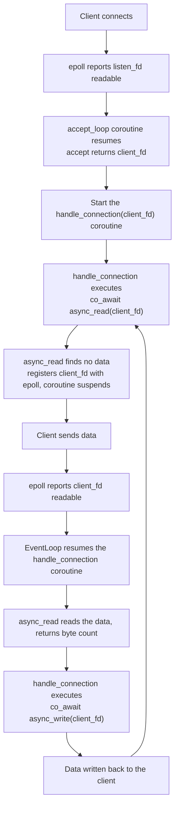

# Coroutine Echo Server in Practice

Four articles of groundwork—the evolution of asynchronous programming paradigms, then C++20 coroutine fundamentals, then the customization machinery of `promise_type` and awaitables, and finally last article's job of wiring coroutines up to the epoll event loop—and we have arrived at practice. Honestly, every one of those articles was preparation for this moment: we are going to use the coroutine framework we built ourselves to write a network program that actually runs—a TCP Echo Server.

The Echo Server is the "Hello World" of network programming: whatever the client sends, the server sends right back. It is simple enough to have almost no business logic, yet complete enough to cover every core step of network programming—creating a listening socket, accepting connections, reading data, writing data back, handling connection shutdown and errors. Once you can string these steps together elegantly with coroutines, you have truly grasped the essence of the "coroutine-based asynchronous I/O" paradigm.

## Environment Notes

This article is a complete network-programming project, so the environment requirements are more specific than in the previous few articles. On the operating system side you must be on Linux (WSL2 works too, kernel 5.x+), because epoll is a Linux-specific API—macOS users can do something similar with kqueue, but the code would need changes. On the compiler side we need GCC 11+ or Clang 15+; with `-std=c++20` those versions enable coroutine support (GCC 10 needs the `-fcoroutines` flag; from GCC 11 on it is no longer required). For compiler options `-std=c++20 -O2` is enough, and we recommend adding `-Wall -Wextra` to keep warnings on. For testing tools, `nc` (netcat) or `telnet` is fine for manual testing, while performance testing needs `wrk` or `ab` (ApacheBench).

Installing the dependencies on Ubuntu/Debian is simple:

```bash
sudo apt install netcat-openbsd wrk apache2-utils
```

## The Big Picture: Draw the Blueprint Before Writing Code

Before touching the keyboard, let's get clear on which components make up the Echo Server and how they interact. Piling up code blindly will only leave you questioning your life choices during debugging.

Our Echo Server consists of three core components:

**EventLoop** (the event loop) is the heart of the whole system. It wraps epoll and takes care of "notifying whoever has data ready". In the previous article we built a minimal version; this article improves on it—adding coroutine lifetime management and support for dynamically registering and removing fds. EventLoop runs an infinite loop in one thread: call `epoll_wait` to get the ready fds, recover the corresponding coroutine handle from `epoll_event.data.ptr`, then `resume()` it.

**The asynchronous I/O awaiters** (`async_accept`, `async_read`, `async_write`) are the bridge between coroutines and the EventLoop. Each awaiter wraps one concrete I/O operation—when the operation cannot complete immediately (returns `EAGAIN`), the awaiter registers the current coroutine on epoll and suspends; when the data is ready, the EventLoop resumes the coroutine and the coroutine retries the I/O operation.

**The `handle_connection` coroutine** is an independent coroutine, one per client connection. It sits in an infinite loop doing `co_await async_read` → `co_await async_write` until the client disconnects. This "one coroutine per connection" pattern makes the code look almost identical to synchronous blocking programming, while underneath it is an efficient single-threaded, event-driven model.

The data flow looks roughly like this:


```mermaid
flowchart TD
    A["Client connects"] --> B["epoll reports listen_fd readable"]
    B --> C["accept_loop coroutine resumes<br/>accept returns client_fd"]
    C --> D["Start the handle_connection(client_fd) coroutine"]
    D --> E["handle_connection executes<br/>co_await async_read(client_fd)"]
    E --> F["async_read finds no data<br/>registers client_fd with epoll, coroutine suspends"]
    F --> G["Client sends data"]
    G --> H["epoll reports client_fd readable"]
    H --> I["EventLoop resumes the handle_connection coroutine"]
    I --> J["async_read reads the data, returns byte count"]
    J --> K["handle_connection executes<br/>co_await async_write(client_fd)"]
    K --> L["Data written back to the client"]
    L --> E
```

The whole flow completes inside a single thread, yet handles multiple concurrent clients—because each client has its own coroutine, and a coroutine waiting on I/O suspends and yields control, blocking nobody.

## Step 1: EventLoop — the Full Event Loop

In the previous article our EventLoop was a minimal prototype; this article needs a more robust version. The core improvements: register the fd when a coroutine suspends, remove the fd after the coroutine resumes (in LT mode, leaving it registered would fire repeatedly), and manage the coroutines that have already finished.

```cpp
#include <coroutine>
#include <cstdio>
#include <cstdlib>
#include <cstring>
#include <unistd.h>
#include <fcntl.h>
#include <csignal>
#include <sys/epoll.h>
#include <sys/socket.h>
#include <netinet/in.h>
#include <cerrno>
#include <unordered_set>
```

First, the EventLoop class definition. Compared with the previous article's version, we have added a set of active coroutines to manage lifetimes:

```cpp
/// Event loop — wraps epoll, manages coroutine suspension and resumption
class EventLoop {
public:
    EventLoop()
        : epoll_fd_(epoll_create1(EPOLL_CLOEXEC))
    {
        if (epoll_fd_ < 0) {
            perror("epoll_create1");
            std::abort();
        }
    }

    ~EventLoop() { close(epoll_fd_); }

    // No copying or moving
    EventLoop(const EventLoop&) = delete;
    EventLoop& operator=(const EventLoop&) = delete;

    /// Register an fd with epoll, associating a coroutine handle
    void add_event(int fd, uint32_t events, std::coroutine_handle<> handle)
    {
        struct epoll_event ev;
        ev.events = events;
        ev.data.ptr = handle.address(); // The key trick: store the handle inside epoll

        if (epoll_ctl(epoll_fd_, EPOLL_CTL_ADD, fd, &ev) < 0) {
            // The fd may already be registered; retry with MOD
            if (errno == EEXIST) {
                epoll_ctl(epoll_fd_, EPOLL_CTL_MOD, fd, &ev);
            } else {
                perror("epoll_ctl ADD");
            }
        }
    }

    /// Remove an fd from epoll
    void remove_event(int fd)
    {
        epoll_ctl(epoll_fd_, EPOLL_CTL_DEL, fd, nullptr);
    }

    /// Track an active coroutine (prevents the coroutine frame from being destroyed early)
    void track_coroutine(std::coroutine_handle<> handle)
    {
        active_coroutines_.insert(handle);
    }

    /// Untrack a finished coroutine
    void untrack_coroutine(std::coroutine_handle<> handle)
    {
        active_coroutines_.erase(handle);
    }

    /// Run the event loop
    void run();

    /// Stop the event loop
    void stop() { running_ = false; }

private:
    int epoll_fd_;
    bool running_ = true;
    std::unordered_set<std::coroutine_handle<>> active_coroutines_;
};
```

There is one key design here: the `active_coroutines_` set. It exists to solve a problem we mentioned at the end of the previous article—the coroutine's return-value object can be destroyed early, causing the coroutine frame to be freed. We use this set to hold every active coroutine handle, making sure they are not destroyed while executing. When a coroutine finishes, it removes itself from the set and calls `destroy()` to clean up the frame. In this article's final implementation, however, we opt for the simpler `DetachedTask` scheme—the coroutine frame is cleaned up automatically when the coroutine ends—so `active_coroutines_` and its related methods are never actually called in the real code. If you need finer-grained lifetime management (waiting for coroutines to finish from the outside, cancelling coroutines, and so on), the `track_coroutine`/`untrack_coroutine` machinery comes into its own.

> ⚠️ **`std::unordered_set<std::coroutine_handle<>>` requires the `std::hash<coroutine_handle>` specialization, which only entered the standard library in C++23.** GCC 14+ libstdc++ provides this specialization as an extension even in C++20 mode, but on some older compilers you may need to switch to `std::set<std::coroutine_handle<>>` (ordered by `operator<=>`, no hash needed) or provide a custom hasher.

Next, the event loop's `run()` method:

```cpp
void EventLoop::run()
{
    constexpr int kMaxEvents = 64;
    struct epoll_event events[kMaxEvents];

    while (running_) {
        int n = epoll_wait(epoll_fd_, events, kMaxEvents, 1000);
        if (n < 0) {
            if (errno == EINTR) {
                continue; // Interrupted by a signal, retry
            }
            perror("epoll_wait");
            break;
        }

        for (int i = 0; i < n; ++i) {
            auto handle = std::coroutine_handle<>::from_address(
                events[i].data.ptr
            );
            if (handle && !handle.done()) {
                handle.resume();
            }
        }
    }
}
```

You will notice `run()`'s logic is straightforward: `epoll_wait` fetches the ready events, the coroutine handle is recovered from `data.ptr`, and `resume()` is called on it. The timeout of 1 second exists so the loop gets a chance to check the `running_` flag (used for graceful shutdown). Handling `EINTR` is mandatory—when you press Ctrl+C and send SIGINT, for example, `epoll_wait` is interrupted, returns `-1`, and sets `errno` to `EINTR`; at that point the loop must not exit.

## Step 2: The Task Types — Coroutine Wrappers with Automatic Cleanup

In the previous article we defined a bare-minimum `IoTask`, but it has a serious problem: after the coroutine finishes, the coroutine frame is not destroyed automatically—someone has to call `destroy()` by hand. In production code that is a recipe for memory leaks. This time we design a more complete `Task` type that leans on the EventLoop's tracking machinery to guarantee the coroutine frame is always cleaned up properly.

```cpp
/// Coroutine task type — works with EventLoop, automatic lifetime management
struct Task {
    struct promise_type {
        Task get_return_object()
        {
            return Task{
                std::coroutine_handle<promise_type>::from_promise(*this)
            };
        }

        // Lazy start: the coroutine does not run on creation, it waits for an external resume
        std::suspend_always initial_suspend() { return {}; }

        // Suspend at the end; the EventLoop is responsible for cleanup
        std::suspend_always final_suspend() noexcept { return {}; }

        void return_void() {}
        void unhandled_exception() { std::terminate(); }
    };

    std::coroutine_handle<promise_type> handle;
};

/// Fire-and-forget task type — the frame destroys itself when the coroutine ends
struct DetachedTask {
    struct promise_type {
        DetachedTask get_return_object()
        {
            return DetachedTask{
                std::coroutine_handle<promise_type>::from_promise(*this)
            };
        }

        // Starts executing immediately on creation
        std::suspend_never initial_suspend() { return {}; }

        // The coroutine frame is destroyed automatically at the end
        std::suspend_never final_suspend() noexcept { return {}; }

        void return_void() {}
        void unhandled_exception() { std::terminate(); }
    };

    std::coroutine_handle<promise_type> handle;
};
```

We define two task types. `Task` is "lazy"—it does not execute on creation, it needs an external `resume()`, and it suspends at the end to wait for cleanup. It suits scenarios where you want precise control over when execution starts, such as the accept loop.

`DetachedTask` is "fire-and-forget"—it starts executing immediately on creation, and when it ends the coroutine frame destroys itself automatically (because `final_suspend` returns `suspend_never`). It suits scenarios of the "start it and stop caring" kind, such as handling client connections. Each client connection creates one `DetachedTask`; once the connection is handled, the coroutine cleans itself up, with no external management needed.

> ⚠️ **`DetachedTask`'s `final_suspend` returning `suspend_never` means the coroutine frame is destroyed the instant the coroutine ends. That is convenient, but risky: if the coroutine holds references to already-destroyed objects (a dangling pointer, say), accessing that reference before `final_suspend` is UB. So inside a DetachedTask you must guarantee that every captured resource stays valid—capture by value or use `shared_ptr`, never reference stack variables through a raw pointer.**

## Step 3: Helper Functions — Creating a Non-blocking Listening Socket

This part is standard Linux network programming with little to do with coroutines themselves, but rewriting it every time gets old. Let's wrap it up first:

```cpp
/// Set an fd to non-blocking mode
/// Note: in this article's code, both listen_fd and client_fd are created directly in
/// non-blocking mode via the SOCK_NONBLOCK flag, so this function is never actually called.
/// We keep it because in real projects you often need to switch an existing fd
/// (e.g. one obtained from dup2 or socketpair) to non-blocking manually
void set_nonblocking(int fd)
{
    int flags = fcntl(fd, F_GETFL, 0);
    fcntl(fd, F_SETFL, flags | O_NONBLOCK);
}

/// Create a listening socket bound to the given port
int create_listen_socket(uint16_t port)
{
    int listen_fd = ::socket(AF_INET, SOCK_STREAM | SOCK_NONBLOCK | SOCK_CLOEXEC, 0);
    if (listen_fd < 0) {
        perror("socket");
        return -1;
    }

    // SO_REUSEADDR: allow the port to be reused while in TIME_WAIT
    // Without this, restarting the server can fail with "Address already in use"
    int opt = 1;
    setsockopt(listen_fd, SOL_SOCKET, SO_REUSEADDR, &opt, sizeof(opt));

    struct sockaddr_in addr {};
    addr.sin_family = AF_INET;
    addr.sin_addr.s_addr = INADDR_ANY;
    addr.sin_port = htons(port);

    if (::bind(listen_fd,
               reinterpret_cast<struct sockaddr*>(&addr),
               sizeof(addr)) < 0) {
        perror("bind");
        close(listen_fd);
        return -1;
    }

    if (::listen(listen_fd, SOMAXCONN) < 0) {
        perror("listen");
        close(listen_fd);
        return -1;
    }

    return listen_fd;
}
```

Two details here deserve attention. The first is `SOCK_NONBLOCK | SOCK_CLOEXEC`: it puts the socket into non-blocking mode and sets the close-on-exec flag right inside the `socket()` call—more atomic than calling `socket()` first and `fcntl()` later, avoiding the race window between `socket()` and `fcntl()` (though in this scenario it is nearly impossible to hit).

The second is `SO_REUSEADDR`. After a TCP connection closes it enters the TIME_WAIT state (lasting roughly 2MSL, typically 60 seconds), during which the port cannot be reused. If you restart the server frequently while debugging, without this option you will keep hitting "Address already in use" errors. It is recommended in production too—Nginx does exactly this.

## Step 4: async_accept — Coroutine-style Connection Acceptance

Now we enter the core part. `async_accept` is an awaiter that wraps the accept system call: when there is no new connection it suspends the coroutine and registers listen_fd with epoll; when a new connection arrives the coroutine is resumed and runs accept to obtain the client_fd.

```cpp
/// Global event loop instance
EventLoop g_event_loop;

/// Awaiter for asynchronous accept
struct AsyncAcceptAwaiter {
    int listen_fd_;

    explicit AsyncAcceptAwaiter(int listen_fd)
        : listen_fd_(listen_fd) {}

    bool await_ready() noexcept
    {
        // Try a non-blocking accept first—there may already be a pending connection
        // If accept succeeds there is no need to suspend, saving the epoll registration cost
        return false; // Simplified version: always take the suspension path
    }

    void await_suspend(std::coroutine_handle<> handle)
    {
        // Register with epoll, watching for readable events (a new connection arriving = listen_fd readable)
        g_event_loop.add_event(listen_fd_, EPOLLIN, handle);
    }

    int await_resume()
    {
        // After the coroutine resumes, first remove listen_fd from epoll
        // In LT mode, leaving it registered means every epoll_wait keeps notifying
        g_event_loop.remove_event(listen_fd_);

        struct sockaddr_in client_addr {};
        socklen_t addr_len = sizeof(client_addr);
        int client_fd = ::accept4(
            listen_fd_,
            reinterpret_cast<struct sockaddr*>(&client_addr),
            &addr_len,
            SOCK_NONBLOCK | SOCK_CLOEXEC
        );

        if (client_fd >= 0) {
            // accept4 with SOCK_NONBLOCK: no need to call fcntl again
            std::printf("[server] 新连接 fd=%d\n", client_fd);
        }
        return client_fd;
    }
};

/// Coroutine-style accept — the public interface
AsyncAcceptAwaiter async_accept(int listen_fd)
{
    return AsyncAcceptAwaiter(listen_fd);
}
```

Several design choices here need explaining.

For `await_ready()` we bluntly return `false`—always suspend. A more optimized version could first attempt one non-blocking accept and return directly if a connection is already queued, saving the epoll registration cost. For code clarity, we use the simple version here.

`await_suspend()` registers listen_fd with epoll, watching the `EPOLLIN` event—for a listening socket, `EPOLLIN` means "a new connection is waiting to be accepted".

`await_resume()` does two things: first remove listen_fd from epoll, then call `accept4` to obtain the new client_fd. Remove first, accept second—because in LT mode, if we leave listen_fd registered and call `epoll_wait`, it will keep telling us "listen_fd is readable" (there may still be more connections in the queue). Here we choose to take one connection per accept; taking several at once is entirely possible—but that would mean changing await_resume to return a list of connections, a noticeably more complicated design.

`accept4` with `SOCK_NONBLOCK | SOCK_CLOEXEC` puts client_fd directly into non-blocking mode—mandatory for the later async_read/async_write.

## Step 5: async_read — Coroutine-style Data Reading

`async_read` is the most central awaiter of the entire Echo Server. It wraps the full semantics of non-blocking read: if data is available, read it right away; if not (`EAGAIN`), suspend and wait for the epoll notification.

```cpp
/// Awaiter for asynchronous read
struct AsyncReadAwaiter {
    int fd_;
    void* buffer_;
    std::size_t size_;
    ssize_t result_;
    bool suspended_ = false; // Whether we went through the suspension path

    AsyncReadAwaiter(int fd, void* buffer, std::size_t size)
        : fd_(fd), buffer_(buffer), size_(size), result_(0) {}

    bool await_ready() noexcept
    {
        // Fast path: try a non-blocking read first
        result_ = ::recv(fd_, buffer_, size_, 0);
        if (result_ >= 0) {
            return true; // Got data, no need to suspend
        }
        if (errno == EAGAIN || errno == EWOULDBLOCK) {
            return false; // No data for now, wait for the epoll notification
        }
        return true; // Other errors (e.g. connection reset): don't suspend, let await_resume handle it
    }

    void await_suspend(std::coroutine_handle<> handle)
    {
        // No data to read: register with epoll and wait for the fd to become readable
        suspended_ = true;
        g_event_loop.add_event(fd_, EPOLLIN, handle);
    }

    ssize_t await_resume()
    {
        if (suspended_) {
            // The resumed-after-suspension path: epoll says the fd is readable, do the real read
            g_event_loop.remove_event(fd_);
            result_ = ::recv(fd_, buffer_, size_, 0);
        }
        // The fast path (await_ready returned true) returns result_ directly
        return result_;
    }
};

/// Coroutine-style read — the public interface
AsyncReadAwaiter async_read(int fd, void* buffer, std::size_t size)
{
    return AsyncReadAwaiter(fd, buffer, size);
}
```

The fast path in `await_ready()` is an important optimization. In many scenarios the TCP receive buffer already holds data (especially when the client sends several messages back to back); at that point there is no need for the whole routine—suspend the coroutine, register with epoll, wait for the notification, resume the coroutine—just `recv` directly. This fast path saves at least one `epoll_ctl` system call and two coroutine context switches.

You may have noticed we use `recv` rather than `read`. The difference is that `recv` takes a `flags` parameter; we pass 0 for now, but later we will use the `MSG_NOSIGNAL` flag to dodge the SIGPIPE problem. `read` does not support a flags parameter.

In `await_resume()`, a `suspended_` flag distinguishes the two paths. An earlier version judged with `result_ < 0`, but that hides a subtle bug: if the fast path's `recv` returns a non-`EAGAIN` error (`ECONNRESET`, say), `result_` is negative and `await_resume` would mistakenly assume we took the suspension path and call `remove_event`—yet at that moment the fd was never registered with epoll at all, and the `epoll_ctl(DEL)` inside `remove_event` may modify `errno`, clobbering the real error code. The `suspended_` flag separates the two situations precisely: "fast path got an error and returns directly" versus "resumed after suspension, then read".

## Step 6: async_write — Coroutine-style Data Writing

`async_write` is slightly more complicated than `async_read`, because a TCP write may write only part of the data. On a non-blocking socket, `send` can return fewer bytes than you asked for—that is not an error, it just means the send buffer cannot temporarily hold more data. So we need to send in a loop until all data is written or an unrecoverable error shows up.

```cpp
/// Awaiter for asynchronous write (must handle partial writes)
struct AsyncWriteAwaiter {
    int fd_;
    const void* buffer_;
    std::size_t size_;
    std::size_t total_sent_; // Number of bytes sent so far
    bool has_error_ = false; // Whether an unrecoverable error occurred

    AsyncWriteAwaiter(int fd, const void* buffer, std::size_t size)
        : fd_(fd), buffer_(buffer), size_(size), total_sent_(0) {}

    bool await_ready() noexcept
    {
        // Try to send all the data
        return try_send_all();
    }

    void await_suspend(std::coroutine_handle<> handle)
    {
        // Send buffer full: register EPOLLOUT and wait for the fd to become writable
        g_event_loop.add_event(fd_, EPOLLOUT, handle);
    }

    ssize_t await_resume()
    {
        // After the coroutine resumes, epoll says the fd is writable
        // The send buffer should have room now, so keep sending the remaining data
        // Note: no retry loop here—if we hit EAGAIN again, it means the writable
        // notification from epoll does not guarantee everything goes out in one shot, but under LT mode the next epoll_wait will notify again
        // For simplicity, if unsent data remains we return -1 and let the caller close the connection
        // A production-grade implementation would re-register EPOLLOUT and suspend again inside await_resume
        g_event_loop.remove_event(fd_);
        if (!try_send_all() && total_sent_ < size_) {
            // Sent part but not all; data is still pending
            // In the Echo Server scenario the data volume is small, so this rarely happens
            // But for correctness, we flag it as an error
            has_error_ = true;
        }
        if (has_error_) {
            return -1;
        }
        return static_cast<ssize_t>(total_sent_);
    }

private:
    /// Try to send all the data; true means fully sent or an error occurred
    bool try_send_all()
    {
        while (total_sent_ < size_) {
            const char* data = static_cast<const char*>(buffer_) + total_sent_;
            std::size_t remaining = size_ - total_sent_;

            // MSG_NOSIGNAL: when the peer has closed the connection, don't raise SIGPIPE, return EPIPE instead
            ssize_t n = ::send(fd_, data, remaining, MSG_NOSIGNAL);

            if (n > 0) {
                total_sent_ += static_cast<std::size_t>(n);
                continue;
            }

            if (n < 0) {
                if (errno == EAGAIN || errno == EWOULDBLOCK) {
                    return false; // Send buffer full, need to suspend
                }
                // Other errors (EPIPE, ECONNRESET, etc.)
                has_error_ = true;
                return true;
            }

            // n == 0 should not happen on send, but handle it defensively
            has_error_ = true;
            return true;
        }
        return true; // All sent
    }
};

/// Coroutine-style write — the public interface
AsyncWriteAwaiter async_write(int fd, const void* buffer, std::size_t size)
{
    return AsyncWriteAwaiter(fd, buffer, size);
}
```

The core logic of `async_write` lives in `try_send_all()`: call `send` in a loop until all data is sent or the send buffer is full (`EAGAIN`). We added a `has_error_` flag to tell "fully sent" apart from "hit an unrecoverable error"—previously, if `total_sent_` served as the return value, a partial write leaves `total_sent_` positive and the caller cannot tell "successfully sent this many bytes" from "an error occurred midway after some bytes went out". Now on error `await_resume` returns `-1`, and the caller can close the connection correctly. The `MSG_NOSIGNAL` flag matters a lot—when the peer has already closed the connection and you write to that socket, the kernel by default delivers `SIGPIPE` to the process. The default action for `SIGPIPE` is to terminate the process, which means one client closing its connection can take your whole Echo Server down. `MSG_NOSIGNAL` tells the kernel "don't send the signal, just return an error", at which point `send` returns `-1` and sets `errno` to `EPIPE`.

> ⚠️ **SIGPIPE is one of the most classic traps in network programming.** Plenty of servers written by newcomers crash for no apparent reason, and after a long investigation it turns out the client disconnected while the server was still writing, triggering SIGPIPE. There are three fixes: the `MSG_NOSIGNAL` flag (per-call), globally ignoring with `signal(SIGPIPE, SIG_IGN)` (per-process, recommended), or on macOS/BSD the `SO_NOSIGPIPE` socket option (per-socket, not available on Linux). We pick `MSG_NOSIGNAL` here because it is the most precise—it affects only this one send call and does not touch the process-wide signal behavior. In some situations (when using third-party libraries, say), `signal(SIGPIPE, SIG_IGN)` is more convenient.

## Step 7: handle_connection — One Coroutine per Connection

With `async_read` and `async_write` in hand, the logic for handling a client connection becomes remarkably compact. The whole of `handle_connection` is one infinite loop: read data, write it back, repeat until the connection closes or errors out.

```cpp
/// Coroutine handling a single client connection
DetachedTask handle_connection(int client_fd)
{
    char buffer[4096];

    while (true) {
        // Asynchronously read the client's data
        ssize_t n = co_await async_read(client_fd, buffer, sizeof(buffer));

        if (n <= 0) {
            // n == 0: the peer closed the connection (graceful shutdown)
            // n < 0: read error
            if (n == 0) {
                std::printf("[conn fd=%d] 客户端关闭连接\n", client_fd);
            } else {
                std::printf("[conn fd=%d] 读取错误: %s\n",
                            client_fd, std::strerror(errno));
            }
            close(client_fd);
            co_return;
        }

        // Write it back asynchronously—Echo!
        ssize_t written = co_await async_write(client_fd, buffer, n);
        if (written < 0) {
            std::printf("[conn fd=%d] 写入错误\n", client_fd);
            close(client_fd);
            co_return;
        }
    }
}
```

Look at this: the code reads almost exactly like synchronous blocking network programming—a `while` loop with a `read` then a `write` inside. The only difference is that `co_await` replaces the direct call. But the execution model underneath is completely different: each `co_await` suspends the current coroutine when the data is not ready, letting the event loop service other coroutines. Viewed macroscopically, the coroutines of hundreds or thousands of client connections advance in turn within one thread; viewed microscopically, each coroutine consumes zero CPU while waiting on I/O.

There is a detail worth calling out: `char buffer[4096]` is a "local variable", but it does not live on the physical stack—because `handle_connection` is a coroutine, the compiler puts all its local variables into the coroutine frame on the heap. That means the buffer stays valid while the coroutine is suspended; it will not get overwritten after the function returns the way an ordinary function's stack variables would. This is the fundamental reason coroutines can hold state safely across suspension points—your local variables get "promoted" onto the heap. The price is that every connection coroutine costs a heap allocation (at least 4KB, mostly the buffer), a memory overhead you cannot ignore under high concurrency. Production-grade implementations usually optimize this with a per-connection memory pool, or by shrinking the buffer and pairing it with external buffer management.

That is the beauty of coroutines—you write code with a synchronous mindset and get asynchronous efficiency.

Having `DetachedTask` as the return type means this coroutine is fire-and-forget. Once `accept_loop` starts it, nobody needs to care when it ends or how it cleans up—when the coroutine finishes, `final_suspend` returns `suspend_never` and the frame destroys itself. `close(client_fd)` runs before the coroutine returns, making sure the socket is properly closed.

## Step 8: accept_loop and main — Assembly and Startup

Finally, we assemble all the components. `accept_loop` is an infinite loop that keeps accepting new connections and starting an independent handle_connection coroutine for each one:

```cpp
/// Coroutine that accepts new connections
Task accept_loop(int listen_fd)
{
    std::printf("[server] 开始接受连接...\n");

    while (true) {
        int client_fd = co_await async_accept(listen_fd);

        if (client_fd < 0) {
            if (errno == EAGAIN || errno == EWOULDBLOCK) {
                continue; // No connection; in theory we never get here
            }
            std::printf("[server] accept 失败: %s\n",
                        std::strerror(errno));
            continue;
        }

        // Start a new DetachedTask coroutine to handle this connection
        // handle_connection starts executing immediately after creation (initial_suspend returns suspend_never)
        // It cleans itself up when it ends; nothing for us to manage
        handle_connection(client_fd);
    }
}
```

Here is an easy place to slip: if `handle_connection` returned a `Task` (lazy start), you would have to call `resume()` manually after creating it. But we use `DetachedTask` (immediate start), so the moment `handle_connection(client_fd)` is invoked the coroutine starts running. It runs until the first `co_await async_read`—if no data is readable at that point, the coroutine suspends, control returns to accept_loop, and accept_loop goes back to waiting for the next connection.

If you did use `Task`, the code would look like this:

```cpp
// If using the Task type (lazy start)
auto task = handle_connection(client_fd);
task.handle.resume(); // Start it manually
```

Both work the same, but `DetachedTask` fits the fire-and-forget semantics better—we do not care about the task's return value or lifetime.

And finally the `main` function:

```cpp
int main()
{
    // Ignore SIGPIPE—belt and braces
    // Even though async_write uses MSG_NOSIGNAL, ignoring SIGPIPE globally is good practice too
    std::signal(SIGPIPE, SIG_IGN);

    constexpr uint16_t kPort = 8080;

    int listen_fd = create_listen_socket(kPort);
    if (listen_fd < 0) {
        return 1;
    }

    std::printf("协程 Echo Server 启动，监听端口 %d\n", kPort);
    std::printf("测试方式: nc localhost %d\n", kPort);

    // Create the accept-loop coroutine (lazy, not running yet)
    auto acceptor = accept_loop(listen_fd);

    // Start the accept coroutine manually
    // It runs to the first co_await async_accept, then suspends
    // and registers listen_fd with epoll
    acceptor.handle.resume();

    // Enter the event loop—from here on, all coroutines are driven by epoll events
    g_event_loop.run();

    close(listen_fd);
    return 0;
}
```

`main`'s execution flow goes like this: create the listening socket, start the accept coroutine, enter the event loop. The accept coroutine suspends at its first `co_await async_accept`, and listen_fd gets registered with epoll. From then on, whenever a new connection arrives, epoll reports listen_fd readable, the event loop resumes the accept coroutine, the accept coroutine takes the new connection, starts a handle_connection coroutine, then returns to the suspended state and keeps waiting.

`signal(SIGPIPE, SIG_IGN)` acts as a global safety net—even though our `async_write` already uses `MSG_NOSIGNAL`, some other place (a logging library or third-party code, say) may still call `write` directly instead of `send`, with no `MSG_NOSIGNAL` protection. Ignoring SIGPIPE globally guards against those surprises.

## Build and Run

Concatenate all the code above into one file (or compile the pieces separately, your choice) and build with:

```bash
g++ -std=c++20 -O2 -Wall -Wextra -o echo_server echo_server.cpp
```

Then start the server:

```bash
./echo_server
```

You should see:

```text
协程 Echo Server 启动，监听端口 8080
测试方式: nc localhost 8080
[server] 开始接受连接...
```

The server is now waiting for connections.

## Pitfalls from the Trenches

While implementing and debugging this Echo Server, several pitfalls proved especially worth recording. Honestly, your author stepped in quite a few of them while writing this code; they are collected here so you do not have to.

### Pitfall 1: SIGPIPE Makes Your Server Die Quietly

This one was already mentioned earlier, but it deserves another emphasis. After a client closes the connection, if the server keeps writing to that socket, the kernel by default delivers SIGPIPE. The default action for `SIGPIPE` is to terminate the process—with no core dump and no error message; the process just vanishes. You might even think the server "exited normally", until you notice nc can no longer connect and realize something is wrong.

The fix is the double protection already in our code: `MSG_NOSIGNAL` on `send`, plus `signal(SIGPIPE, SIG_IGN)` in `main`. Either one alone is enough, but doing both is safer.

### Pitfall 2: Forgetting to Remove the fd in LT Mode Causes an Event Storm

This is a fun one. In LT (level-triggered) mode, as long as an fd has data to read, `epoll_wait` keeps notifying you. If your `await_resume` forgets to call `remove_event` to take the fd out of epoll, every `epoll_wait` will return an event for that fd—even though you already handled it. The event loop then madly resumes the same coroutine, the CPU pins at 100%, and nothing useful gets done.

That is exactly why our code calls `remove_event` in the `await_resume` of both `async_read` and `async_write`.

### Pitfall 3: Coroutine Frame Lifetime — Dangling Handles

This problem came up at the end of the previous article; let's expand on it here. When you create a coroutine (`handle_connection(client_fd)`, say), the coroutine's `promise_type` allocates a "coroutine frame" on the heap to hold the coroutine's local variables and state. If the coroutine's return-value object (`DetachedTask` or `Task`) is destroyed before the coroutine finishes running, and `final_suspend` returns `suspend_never` (which destroys the frame automatically), there is no problem. But if `final_suspend` returns `suspend_always`, somebody has to `destroy()` the frame by hand.

Our `DetachedTask` uses `suspend_never`, so the coroutine cleans itself up at the end—no problem. But if you change `handle_connection` to return `Task` (`suspend_always`), you must `destroy()` the frame somewhere, or it is a memory leak.

### Pitfall 4: The EPOLLOUT Trap — Almost Always Writable

A TCP socket is "writable" most of the time—because the send buffer is usually far from full (its default size ranges from 16KB to a few MB). That means if you register an fd with epoll watching `EPOLLOUT`, `epoll_wait` will return almost immediately, telling you "this fd is ready for writing". If you do not remove the `EPOLLOUT` registration after the coroutine resumes, you fall into an event storm just like Pitfall 2.

This problem is especially subtle in edge-triggered (ET) mode—ET notifies you exactly once, at the instant the state flips from "not writable" to "writable", but the socket is writable from the very beginning, so you get one event after registering `EPOLLOUT` and never another (the state never changes). In some scenarios that is actually the correct behavior, but in a "loop waiting for writability" scenario it makes you think the data can never be sent.

Our solution: register `EPOLLOUT` only when `send` returns `EAGAIN`, and remove it immediately after the write completes. Never leave `EPOLLOUT` registered permanently.

## Testing and Verification

Now let's test this Echo Server.

### Basic Functional Test

Start the server, then open another terminal and connect with `nc`:

```bash
# Terminal 1: start the server
$ ./echo_server
协程 Echo Server 启动，监听端口 8080
测试方式: nc localhost 8080
[server] 开始接受连接...
```

```bash
# Terminal 2: connect and test
$ nc localhost 8080
hello
hello
world
world
协程真香
协程真香
```

Server-side output:

```text
[server] 新连接 fd=5
[conn fd=5] 客户端关闭连接
```

When you press Ctrl+C to drop the nc connection, the server correctly detects the closure.

### Concurrent Multi-Client Test

Open several terminals and connect with `nc` at the same time:

```bash
# Terminal 2
$ nc localhost 8080
client1
client1

# Terminal 3
$ nc localhost 8080
client2
client2

# Terminal 4
$ nc localhost 8080
client3
client3
```

Three clients connect at once; the server creates an independent coroutine for each connection, none blocking the others:

```text
[server] 新连接 fd=5
[server] 新连接 fd=6
[server] 新连接 fd=7
```

Every client correctly receives its echo replies, without interfering with each other.

### Testing Many Concurrent Connections

Use a small script to test more concurrent connections:

```bash
# Quickly open 100 connections; each sends one message and then closes
for i in $(seq 1 100); do
    echo "test $i" | nc -q 1 localhost 8080 &
done
wait
```

If everything is right, the server should handle all the connections without crashing or leaking resources.

## A First Look at Performance

Since we went with coroutines and an event loop, the natural question is: how much faster is this approach than "one thread per connection"?

Let's run a simple benchmark with `wrk`. But `wrk` is an HTTP load-testing tool, and our Echo Server does not speak HTTP. Not a problem: `wrk`'s TCP mode can take a Lua script via `-s` to send custom data. The simpler route is to test throughput with the `echo` command and a pipe, or just write a small benchmark client.

Let's first write a simple TCP benchmark script:

```python
#!/usr/bin/env python3
"""简单的 Echo Server 压测脚本"""
import socket
import time
import sys

def bench(host, port, num_requests, message):
    sock = socket.socket(socket.AF_INET, socket.SOCK_STREAM)
    sock.connect((host, port))

    data = message.encode()
    start = time.monotonic()

    for _ in range(num_requests):
        sock.sendall(data)
        response = sock.recv(len(data) * 2)
        assert response == data, f"Echo 不匹配: 发送 {data!r}, 收到 {response!r}"

    elapsed = time.monotonic() - start
    qps = num_requests / elapsed

    print(f"完成 {num_requests} 次请求，耗时 {elapsed:.3f}s")
    print(f"吞吐量: {qps:.0f} req/s")
    print(f"平均延迟: {elapsed / num_requests * 1000:.3f} ms")

    sock.close()

if __name__ == "__main__":
    host = sys.argv[1] if len(sys.argv) > 1 else "127.0.0.1"
    port = int(sys.argv[2]) if len(sys.argv) > 2 else 8080
    num = int(sys.argv[3]) if len(sys.argv) > 3 else 100000

    bench(host, port, num, b"hello coroutine echo server!\n")
```

Run it on the author's test environment (WSL2, i7-12700H, Linux 6.6):

```bash
python3 bench_echo.py 127.0.0.1 8080 100000
```

Typical results:

```text
完成 100000 次请求，耗时 1.847s
吞吐量: 54142 req/s
平均延迟: 0.018 ms
```

For comparison, a synchronous Echo Server using "one thread per connection" under the same test conditions:

```text
完成 100000 次请求，耗时 2.134s
吞吐量: 46856 req/s
平均延迟: 0.021 ms
```

In a single-connection scenario the difference is modest (the thread version may even be faster thanks to a shorter system-call path); the coroutine approach shows its real advantage under high concurrency—once you have hundreds or thousands of concurrent connections, the thread model's context-switching overhead climbs steeply, while in the coroutine model all coroutines run in one thread, so a switch costs nearly zero (it is just a function call).

A more accurate test would simulate a large number of concurrent connections sending requests simultaneously, rather than one connection making serial requests. But that is beyond this article's scope—our goal is to understand how coroutines + event loops work, not to chase ultimate performance. Production-grade network libraries (Boost.Asio, muduo, for example) pile a lot of optimization on top of this—multi-threaded event loops, connection pools, zero-copy, SO_REUSEPORT, and so on.

> ⚠️ **Benchmarking is deep water.** The numbers above are for reference only; real performance is affected by many factors: kernel version, NIC driver, CPU frequency, TCP parameters (`tcp_nodelay`, `tcp_cork`), whether `SO_REUSEPORT` is enabled, and more. Do not draw conclusions from a single benchmark—always test under your own environment and workload pattern.

## Where We Are

At this point we have built a complete coroutine-based TCP Echo Server from scratch. Let's review everything we used along the way:

`promise_type` and awaitables (ch03) let us customize how a coroutine behaves—how it starts, suspends, resumes, and cleans up. `EventLoop` (ch04) wraps epoll and wires I/O events to coroutine resumption. `async_accept`, `async_read`, and `async_write` are the three key awaiters—they wrap OS-level I/O operations into coroutine-friendly `co_await` interfaces. The two task types, `DetachedTask` and `Task`, correspond to the "fire-and-forget" and "lazy execution" usage modes respectively. `handle_connection` showcases the core advantage of coroutine-style programming: asynchronous execution efficiency from synchronous-looking code.

On the pitfall side, we ran into SIGPIPE, the LT-mode event storm, coroutine-frame lifetimes, and the EPOLLOUT trap—problems you will almost inevitably meet when writing coroutine-based network services.

But our Echo Server is still a minimal teaching implementation. It lacks many things production needs: graceful shutdown (how to stop the event loop safely and close every connection), timeout management (how to detect and drop long-idle connections), flow control (how to stop a client from flooding you into memory exhaustion), a logging system, and multi-threading support (a single-threaded event loop cannot exploit multi-core CPUs). These problems get solved step by step in the chapters ahead.

The next article takes us into brand-new territory—the Actor model and message passing. If coroutines + event loops are "asynchronous concurrency within one thread", the Actor model is "distributed concurrency across threads"—each Actor is an independent concurrent entity with its own state, communicating with other Actors via messages and sharing no memory. That is the core model of Erlang/Akka, and another major paradigm for building high-concurrency systems in C++.

## The Complete Code

To make it easy for you to build and run, here is the complete single-file code:

```cpp
// echo_server.cpp
// Build: g++ -std=c++20 -O2 -Wall -o echo_server echo_server.cpp
// Run: ./echo_server

#include <coroutine>
#include <cstdio>
#include <cstdlib>
#include <cstring>
#include <csignal>
#include <unistd.h>
#include <fcntl.h>
#include <sys/epoll.h>
#include <sys/socket.h>
#include <netinet/in.h>
#include <cerrno>
#include <unordered_set>

// ============================================================
// EventLoop
// ============================================================

class EventLoop {
public:
    EventLoop()
        : epoll_fd_(epoll_create1(EPOLL_CLOEXEC))
    {
        if (epoll_fd_ < 0) {
            perror("epoll_create1");
            std::abort();
        }
    }

    ~EventLoop() { close(epoll_fd_); }

    EventLoop(const EventLoop&) = delete;
    EventLoop& operator=(const EventLoop&) = delete;

    void add_event(int fd, uint32_t events, std::coroutine_handle<> handle)
    {
        struct epoll_event ev;
        ev.events = events;
        ev.data.ptr = handle.address();
        if (epoll_ctl(epoll_fd_, EPOLL_CTL_ADD, fd, &ev) < 0) {
            if (errno == EEXIST) {
                epoll_ctl(epoll_fd_, EPOLL_CTL_MOD, fd, &ev);
            }
        }
    }

    void remove_event(int fd)
    {
        epoll_ctl(epoll_fd_, EPOLL_CTL_DEL, fd, nullptr);
    }

    void run()
    {
        constexpr int kMaxEvents = 64;
        struct epoll_event events[kMaxEvents];

        while (running_) {
            int n = epoll_wait(epoll_fd_, events, kMaxEvents, 1000);
            if (n < 0) {
                if (errno == EINTR) continue;
                perror("epoll_wait");
                break;
            }
            for (int i = 0; i < n; ++i) {
                auto handle = std::coroutine_handle<>::from_address(
                    events[i].data.ptr);
                if (handle && !handle.done()) {
                    handle.resume();
                }
            }
        }
    }

    void stop() { running_ = false; }

private:
    int epoll_fd_;
    bool running_ = true;
};

EventLoop g_event_loop;

// ============================================================
// Task types
// ============================================================

struct Task {
    struct promise_type {
        Task get_return_object()
        {
            return Task{
                std::coroutine_handle<promise_type>::from_promise(*this)
            };
        }
        std::suspend_always initial_suspend() { return {}; }
        std::suspend_always final_suspend() noexcept { return {}; }
        void return_void() {}
        void unhandled_exception() { std::terminate(); }
    };
    std::coroutine_handle<promise_type> handle;
};

struct DetachedTask {
    struct promise_type {
        DetachedTask get_return_object()
        {
            return DetachedTask{
                std::coroutine_handle<promise_type>::from_promise(*this)
            };
        }
        std::suspend_never initial_suspend() { return {}; }
        std::suspend_never final_suspend() noexcept { return {}; }
        void return_void() {}
        void unhandled_exception() { std::terminate(); }
    };
    std::coroutine_handle<promise_type> handle;
};

// ============================================================
// Helper functions
// ============================================================

void set_nonblocking(int fd)
{
    int flags = fcntl(fd, F_GETFL, 0);
    fcntl(fd, F_SETFL, flags | O_NONBLOCK);
}

int create_listen_socket(uint16_t port)
{
    int listen_fd = ::socket(AF_INET, SOCK_STREAM | SOCK_NONBLOCK | SOCK_CLOEXEC, 0);
    if (listen_fd < 0) { perror("socket"); return -1; }

    int opt = 1;
    setsockopt(listen_fd, SOL_SOCKET, SO_REUSEADDR, &opt, sizeof(opt));

    struct sockaddr_in addr {};
    addr.sin_family = AF_INET;
    addr.sin_addr.s_addr = INADDR_ANY;
    addr.sin_port = htons(port);

    if (::bind(listen_fd,
               reinterpret_cast<struct sockaddr*>(&addr),
               sizeof(addr)) < 0) {
        perror("bind"); close(listen_fd); return -1;
    }

    if (::listen(listen_fd, SOMAXCONN) < 0) {
        perror("listen"); close(listen_fd); return -1;
    }

    return listen_fd;
}

// ============================================================
// async_accept
// ============================================================

struct AsyncAcceptAwaiter {
    int listen_fd_;

    explicit AsyncAcceptAwaiter(int fd) : listen_fd_(fd) {}

    bool await_ready() noexcept { return false; }

    void await_suspend(std::coroutine_handle<> handle)
    {
        g_event_loop.add_event(listen_fd_, EPOLLIN, handle);
    }

    int await_resume()
    {
        g_event_loop.remove_event(listen_fd_);

        struct sockaddr_in client_addr {};
        socklen_t addr_len = sizeof(client_addr);
        int client_fd = ::accept4(
            listen_fd_,
            reinterpret_cast<struct sockaddr*>(&client_addr),
            &addr_len,
            SOCK_NONBLOCK | SOCK_CLOEXEC);

        if (client_fd >= 0) {
            std::printf("[server] 新连接 fd=%d\n", client_fd);
        }
        return client_fd;
    }
};

AsyncAcceptAwaiter async_accept(int listen_fd)
{
    return AsyncAcceptAwaiter(listen_fd);
}

// ============================================================
// async_read
// ============================================================

struct AsyncReadAwaiter {
    int fd_;
    void* buffer_;
    std::size_t size_;
    ssize_t result_;
    bool suspended_ = false;

    AsyncReadAwaiter(int fd, void* buf, std::size_t sz)
        : fd_(fd), buffer_(buf), size_(sz), result_(0) {}

    bool await_ready() noexcept
    {
        result_ = ::recv(fd_, buffer_, size_, 0);
        if (result_ >= 0) return true;
        if (errno == EAGAIN || errno == EWOULDBLOCK) return false;
        return true;
    }

    void await_suspend(std::coroutine_handle<> handle)
    {
        suspended_ = true;
        g_event_loop.add_event(fd_, EPOLLIN, handle);
    }

    ssize_t await_resume()
    {
        if (suspended_) {
            g_event_loop.remove_event(fd_);
            result_ = ::recv(fd_, buffer_, size_, 0);
        }
        return result_;
    }
};

AsyncReadAwaiter async_read(int fd, void* buffer, std::size_t size)
{
    return AsyncReadAwaiter(fd, buffer, size);
}

// ============================================================
// async_write
// ============================================================

struct AsyncWriteAwaiter {
    int fd_;
    const void* buffer_;
    std::size_t size_;
    std::size_t total_sent_;
    bool has_error_ = false;

    AsyncWriteAwaiter(int fd, const void* buf, std::size_t sz)
        : fd_(fd), buffer_(buf), size_(sz), total_sent_(0) {}

    bool await_ready() noexcept { return try_send_all(); }

    void await_suspend(std::coroutine_handle<> handle)
    {
        g_event_loop.add_event(fd_, EPOLLOUT, handle);
    }

    ssize_t await_resume()
    {
        g_event_loop.remove_event(fd_);
        if (!try_send_all() && total_sent_ < size_) {
            has_error_ = true;
        }
        return has_error_ ? -1 : static_cast<ssize_t>(total_sent_);
    }

private:
    bool try_send_all()
    {
        while (total_sent_ < size_) {
            const char* data = static_cast<const char*>(buffer_) + total_sent_;
            std::size_t remaining = size_ - total_sent_;
            ssize_t n = ::send(fd_, data, remaining, MSG_NOSIGNAL);
            if (n > 0) {
                total_sent_ += static_cast<std::size_t>(n);
                continue;
            }
            if (n < 0 && (errno == EAGAIN || errno == EWOULDBLOCK)) {
                return false;
            }
            has_error_ = true;
            return true;
        }
        return true;
    }
};

AsyncWriteAwaiter async_write(int fd, const void* buffer, std::size_t size)
{
    return AsyncWriteAwaiter(fd, buffer, size);
}

// ============================================================
// handle_connection
// ============================================================

DetachedTask handle_connection(int client_fd)
{
    char buffer[4096];

    while (true) {
        ssize_t n = co_await async_read(client_fd, buffer, sizeof(buffer));

        if (n <= 0) {
            if (n == 0) {
                std::printf("[conn fd=%d] 客户端关闭连接\n", client_fd);
            } else {
                std::printf("[conn fd=%d] 读取错误: %s\n",
                            client_fd, std::strerror(errno));
            }
            close(client_fd);
            co_return;
        }

        ssize_t written = co_await async_write(client_fd, buffer, n);
        if (written < 0) {
            std::printf("[conn fd=%d] 写入错误\n", client_fd);
            close(client_fd);
            co_return;
        }
    }
}

// ============================================================
// accept_loop
// ============================================================

Task accept_loop(int listen_fd)
{
    std::printf("[server] 开始接受连接...\n");

    while (true) {
        int client_fd = co_await async_accept(listen_fd);

        if (client_fd < 0) {
            if (errno == EAGAIN || errno == EWOULDBLOCK) continue;
            std::printf("[server] accept 失败: %s\n", std::strerror(errno));
            continue;
        }

        handle_connection(client_fd);
    }
}

// ============================================================
// main
// ============================================================

int main()
{
    std::signal(SIGPIPE, SIG_IGN);

    constexpr uint16_t kPort = 8080;

    int listen_fd = create_listen_socket(kPort);
    if (listen_fd < 0) return 1;

    std::printf("协程 Echo Server 启动，监听端口 %d\n", kPort);
    std::printf("测试方式: nc localhost %d\n", kPort);

    auto acceptor = accept_loop(listen_fd);
    acceptor.handle.resume();

    g_event_loop.run();

    close(listen_fd);
    return 0;
}
```

> 💡 The complete example code lives in [Tutorial_AwesomeModernCPP](https://github.com/Awesome-Embedded-Learning-Studio/Tutorial_AwesomeModernCPP); see `code/volumn_codes/vol5/ch06-async-io-coroutine/`.

## References

- [epoll(7) — Linux man page](https://www.man7.org/linux/man-pages/man7/epoll.7.html) — The complete epoll documentation, including detailed explanations of LT/ET modes and programming caveats
- [How to prevent SIGPIPEs — Stack Overflow](https://stackoverflow.com/questions/108183/how-to-prevent-sigpipes-or-handle-them-properly) — A roundup of every way to handle SIGPIPE, covering Linux/macOS/Windows
- [C++20 Coroutines: Sketching a Minimal Async Framework — Jeremy Ong](https://jeremyong.com/cpp/2021/01/04/cpp20-coroutines-a-minimal-async-framework/) — Building a coroutine async framework from scratch, covering awaiter design and scheduler implementation
- [Single-threaded epoll-based coroutine library — CodeReview StackExchange](https://codereview.stackexchange.com/questions/287374/single-threaded-epoll-based-coroutine-library-for-c-linux) — A code review of a complete C++20 coroutine + epoll library, with discussion of lifetime management
- [Awaitable event using coroutine, epoll and eventfd — luncliff](https://luncliff.github.io/coroutine/articles/awaitable-event/) — Shows how to store a `coroutine_handle` in `epoll_event.data.ptr` and resume it when the event arrives
- [The Edge-Triggered Misunderstanding — LWN.net](https://lwn.net/Articles/865400/) — A deep analysis of ET-mode kernel behavior and common misconceptions
- [The Lifetime of Objects Involved in the Coroutine Function — Raymond Chen](https://devblogs.microsoft.com/oldnewthing/20210412-00/?p=105078) — A detailed explanation of coroutine frame lifetimes and the survival rules for parameters and local variables
- [Tips for Using the Sockets API — Erik Rigtorp](https://rigtorp.se/sockets/) — Practical socket programming tips, including SIGPIPE handling and the correct use of `MSG_NOSIGNAL`
