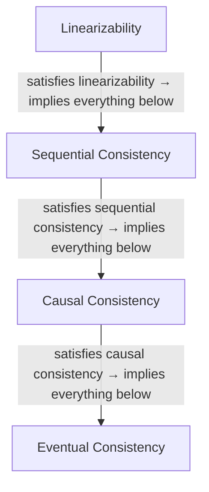

# A First Look at Distributed Consistency Primitives

> ℹ️ **Where this section fits**: Picking up where the previous article left off, we continue the conceptual tour. The spectrum of consistency models covered here likewise comes with no runnable code—the point is to help you build an intuition for "from strong to weak consistency", laying the groundwork for reading distributed systems papers later on and for the hands-on work in Volume 8.

In the previous article we saw the five fundamental differences between single-machine concurrency and distributed systems, and came to terms with the facts of life in a distributed environment: networks are unreliable, clocks are inaccurate, and partial failures are unavoidable. Honestly, the first time we encountered distributed consistency, it was something of a shock—on a single machine, consistency is nearly "free" (the price is a few nanoseconds of lock/unlock), but in a distributed environment it becomes something you must pay for with paper-grade protocols, multiple rounds of network communication, and majority voting. In this article we face that core difficulty head-on: **consistency**.

Let's build an intuition first: when a piece of data has replicas on multiple machines, do clients reading from different replicas see the same value? When do they see the latest value? How far apart can the data on different replicas drift? The answers to these questions depend on which consistency model the system has chosen. A consistency model is not a binary choice (consistent or not consistent); it is a spectrum from strong to weak—understanding this spectrum is a foundational skill for understanding distributed systems, and it is the central thread of this article.

## The Spectrum of Consistency Models

What we are about to do is build this spectrum with four consistency models, from strongest to weakest. For each model we will explain it through a concrete scenario rather than dropping a definition on you—understanding "why this model is needed" matters far more than memorizing "how this model is defined".

### Linearizability: The Strongest Guarantee

We start with the strongest. Linearizability, also known as strong consistency or atomic consistency, means: every operation appears to happen atomically at some **unique point in time**—a point between the operation's invocation and its completion—and the time points of all operations together form a total order. Put plainly—treat the distributed system as a black box, and from an external observer's perspective, all operations look as if they happened on a single machine. This has more than a little in common with the `memory_order_seq_cst` we discussed in ch03: the strongest memory order on a single machine guarantees that all threads see a consistent order of operations, and linearizability is the equivalent guarantee in a distributed environment.

Let's illustrate with a bank transfer scenario. Suppose you and your roommate share an account with a balance of 1000 yuan. You transfer 800 yuan out from your phone app, and at the very moment of the transfer your roommate checks the balance at an ATM. Under linearizability, your roommate's query can have only two outcomes: either they see 1000 yuan (your transfer has not taken effect yet), or they see 200 yuan (your transfer has taken effect). It is absolutely impossible for your roommate to see some "intermediate state" such as 500 or 900 yuan.

Even more crucial is the guarantee on time ordering: if you finished the transfer first (you received the "transfer successful" response) and only then did your roommate initiate the query, your roommate is guaranteed to see 200 yuan—an old value is out of the question. This is the "real-time" property of linearizability: the actual time order of operations and the order the system presents are the same.

Linearizability is the strongest consistency guarantee, but also the most expensive. To implement it, every write must wait for acknowledgment from a majority of replicas before returning success, and every read must query a majority for the latest value (or query the Leader and make sure the Leader has not changed). In latency this means at least one network round trip (usually several); in availability it means that if a majority cannot be reached, the system must refuse service.

Which systems provide linearizability? ZooKeeper (for writes and synchronous reads), etcd, and Consul—all mentioned in the previous article—provide it. Google Spanner achieves external consistency (even stronger than linearizability) through the TrueTime API we mentioned last time, and many relational databases are naturally linearizable in single-machine mode.

### Sequential Consistency: Relaxing the Time Requirement

Alright—linearizability is the strongest, but also the priciest. If we relax the requirements a little—no longer demanding that the actual time order of operations match the order the system presents, only that all processes see the same order of operations—we get sequential consistency. Concretely, all processes see the same total order of operations, but that order does not have to match the physical time at which operations actually occurred; it only has to keep each process's own operations in the order the program specified.

Back to the bank transfer example. Suppose you transfer 800 yuan out on your phone first, and then your roommate transfers 500 yuan out at an ATM. Under sequential consistency, the system may present the order "your roommate transfers 500 first, then you transfer 800"—the reverse of the physical order of your operations. But the key point is: all observers see the same order. Nobody will say "800 went first" while someone else says "500 went first".

The difference between sequential consistency and linearizability lies in exactly that "real-time" constraint: linearizability requires the order the system presents to match actual time; sequential consistency does not. Both, however, require a globally consistent arrangement of all operations. This difference looks subtle, but it matters enormously in implementation—linearizability needs some form of global clock or consensus protocol to synchronize time, while sequential consistency only needs to guarantee an atomic broadcast order for operations.

### Causal Consistency: Preserving Causality, Not Global Order

If we relax the constraints one step further—no longer requiring a consistent total order over all operations, only that **causally related** operations be seen by all processes in the same order, while causally unrelated operations may be seen in different orders—that is causal consistency.

What does "causally related" mean? Simply put: if operation B reads a value written by operation A, then A and B are causally related—A "caused" B. Or, if operation C happens after operation B (within the same process), and B causally depends on A, then C also causally depends on A. Beyond these direct and indirect dependency relations, two operations are **concurrent**—there is no causal relationship between them.

A social media scenario explains it. User Alice makes a post: "The weather is lovely today!" (operation A). User Bob sees Alice's post and replies: "Indeed it is!" (operation B). Operation B causally depends on operation A—because Bob replied only after reading Alice's post. Under causal consistency, every user is guaranteed to see Alice's post first and Bob's reply second—nobody can see Bob's reply without seeing Alice's post; that would make no semantic sense.

Meanwhile, user Carol also makes a post: "Had hotpot today." (operation C). Operation C and operation A are concurrent—there is no causal relationship between them. Under causal consistency, different users may see A and C in different orders: some see the weather post first and then the hotpot post, others the other way around—both are fine, because there is no "who caused whom" relationship between them.

Causal consistency is the practical choice for many distributed databases, because it costs far less to implement than linearizability—you do not need global consensus; tracking and propagating causal relationships (usually with vector clocks) is enough to guarantee semantic correctness. Dynamo-style systems (Amazon Dynamo, Apache Cassandra, Riak) offer eventual consistency with causal session guarantees in certain configurations, which is strictly speaking stronger than "pure" eventual consistency but weaker than strict causal consistency.

### Eventual Consistency: Weakest but Fastest

At the very bottom of the spectrum sits eventual consistency, and its guarantee is very weak: if no new writes arrive, then eventually ("eventually" is a fuzzy point in time—it might be milliseconds, seconds, or even minutes) all replicas converge to the same value. Before convergence, different replicas may return different values—you might read the latest write from one replica and a value five seconds stale from another.

This guarantee sounds sketchy, but in many scenarios it is good enough. DNS is the classic example of eventual consistency: you update a DNS record, and it may take minutes or even hours for DNS servers around the world to all pick it up—yet in most cases that is perfectly acceptable. Like counts, follower lists, comment counts on social media—this data being a second or two behind carries no catastrophic consequences.

The advantage of eventual consistency is performance and availability: because there is no synchronous waiting for other replicas, writes return success immediately, and reads only touch the local replica. Under a network partition, every replica can serve requests independently—availability maxed out.

### The Hierarchy of Consistency Models

Good—now let's put the four models side by side. They form a hierarchy from strong to weak:



The hierarchy means: a system that satisfies linearizability also satisfies sequential consistency, causal consistency, and eventual consistency. In the other direction, a system that satisfies eventual consistency does not necessarily satisfy causal consistency. Each level you climb buys a stronger consistency guarantee, at the price of higher latency and lower availability.

> ⚠️ **Pitfall Warning**
> In the real world, very few systems "purely" implement exactly one consistency model—we stepped in this very pit ourselves: early on we assumed a certain database "was" eventually consistent, only to discover that under a particular configuration it actually provided stronger consistency guarantees. Many systems offer tunable consistency levels. Cassandra, for example, supports the ONE, QUORUM, and ALL read/write consistency levels, selectable per operation. QUORUM reads and writes guarantee that you read the latest written value (because the write majority and the read majority must overlap), but this does not strictly guarantee linearizability—strict linearizability requires extra machinery (such as Raft's ReadIndex or lease reads). Understanding what guarantees your system provides under which configuration matters far more than memorizing theoretical definitions.

## The Core Ideas of Paxos/Raft

With the spectrum of consistency models in hand, a natural question follows: if we need strong consistency (linearizability, say), how do we actually implement it? The answer is **consensus protocols**. In the world of distributed systems, the core problem a consensus protocol solves is: getting a group of machines to agree on a value—even if some of the machines may crash and the network may partition. This shares a certain spirit with the atomic operations we discussed in ch03—both exist so that multiple execution units (threads or machines) can reach agreement on the state of a value; the difference is that atomic operations lean on the CPU's cache coherence protocol, while distributed consensus leans on multiple rounds of network communication and voting.

Let's be upfront: we do not intend to give a complete protocol description of Paxos or Raft here (that is genuinely a paper's worth of work—Lamport's Paxos paper reads like a Greek myth, and the Raft paper, clear as it is, still runs thirty-odd pages). Instead we focus on the core ideas, so that you understand "why it was designed this way".

### Why We Need a Majority (Quorum)

The cornerstone of a consensus protocol is the **quorum**—the majority. Suppose we have $N$ machines; a value must be accepted by at least $\lfloor N/2 \rfloor + 1$ machines (that is, a majority) before it counts as "decided". Your first reaction might be—why a majority? Why not require unanimous agreement?

The core insight: any two majorities must overlap. With 5 machines, a majority is at least 3. However you choose them, any two groups of 3 machines share at least 1 machine in common. This overlap means: if a previous value has already been accepted by a majority, then any new majority must contain at least one machine that knows the previous value. As long as the protocol is designed properly, that "witness" machine ensures a new value cannot overwrite a previously decided value.

From this insight it follows that tolerating $f$ crashed machines requires at least $2f + 1$ machines—tolerating 1 crash takes 3 machines ($3 = 2 \times 1 + 1$), and tolerating 2 crashes takes 5 ($5 = 2 \times 2 + 1$). This is why coordination services such as ZooKeeper, etcd, and Consul recommend 3-node or 5-node deployments: 3 nodes tolerate 1 node failure, 5 nodes tolerate 2.

### Leader Election: Who Calls the Shots

With the principle of majorities in place, let's turn to Raft. Raft's design philosophy in one sentence: "understandability first". When Diego Ongaro and John Ousterhout designed Raft, they explicitly made "easy to understand" a goal on par with "correctness"—a stark contrast to Paxos's "correct but nobody can read it" style. Raft decomposes consensus into three sub-problems: Leader election, log replication, and safety. Let's start with Leader election.

In Raft, there is at most one Leader in the cluster at any moment—all write requests are handled by the Leader, and all logs are replicated from the Leader to the Followers. This "strong Leader" design is easier to understand and implement than Paxos's "multi-Proposer" model.

Leader election is driven by **terms** and **heartbeats**. Each term is a monotonically increasing integer, and each term has at most one Leader. Under normal conditions the Leader periodically sends heartbeats to all Followers (AppendEntries RPCs—empty heartbeats even when there is nothing to replicate). If a Follower receives no heartbeat within an election timeout, it concludes the Leader is dead and starts a new round of election.

In plain words, the election is "a group of people voting for a leader": the Follower increments its current term, becomes a Candidate, first votes for itself, then sends a RequestVote RPC to every other node. The voting rule on the other nodes: at most one vote per term, first come first served (with one restriction: the Candidate's log must be at least as up-to-date as the voter's). If a Candidate receives votes from a majority, it becomes the new Leader and immediately starts sending heartbeats to stop anyone else from initiating an election.

The process has one rather clever randomized mechanism: each node's election timeout is chosen randomly within a range. This greatly reduces the odds of several nodes starting elections at the same time and splitting the vote—because their timeouts differ, the node that times out first usually initiates the election first and wins the majority.

### Log Replication: The Leader Speaks, the Followers Fall in Line

Once the Leader is elected, log replication is fairly straightforward—the heart of the whole flow is "the Leader says a line, the Followers repeat it". A client sends a write request to the Leader; the Leader appends the operation to its own log and then replicates that entry to all Followers (via AppendEntries RPCs). When the Leader confirms that the entry has been accepted by a majority (itself included), it **commits** the entry, applies it to the state machine, and returns success to the client.

The key safety guarantee: committed log entries are never overwritten. Raft achieves this with one simple constraint—the Leader carries the index and term of the preceding log entry in its AppendEntries; upon receipt, the Follower checks whether the corresponding position in its own log matches. If it does not match, the Follower rejects the entry, and the Leader backs up and retries until it finds the position where both sides agree, then overwrites forward from there.

This mechanism guarantees: if two entries at the same index position in any Follower's log carry the same term number, their content is identical (because a Leader creates only one entry at a given index within a term), and all entries preceding that entry are also identical (through the recursive matching check). That is log consistency.

To wrap up the whole Raft flow with an analogy: picture a committee (the cluster) whose members communicate by letter (network messages). They need to agree on a series of decisions (the log). Raft's approach is to first elect a chair (Leader election); the chair proposes all the decisions (log replication), and a decision takes effect only with majority approval (the quorum vote). If the chair goes silent, the committee votes in a new chair and carries on. The analogy is crude, but it captures Raft's core design idea—the key to consensus is not "everyone agrees", but "a majority agreeing is enough", and the intersection of majorities is what carries information forward.

## Directions for C++ Practice

Plenty of theory—now let's look at something practical. With the theoretical foundations of distributed consistency in place, let's see how to actually write distributed communication code in C++. To be clear up front—we will not implement a complete distributed protocol (that is a standalone-project-sized effort; a correct implementation of Raft alone can eat several weeks). Instead, we will show how to build the basic skeleton of inter-service communication with gRPC + C++20 coroutines. This draws directly on the coroutine knowledge from ch06—tying together what we accumulated along the way.

### gRPC Basics: Defining Services with Protobuf

gRPC uses Protocol Buffers (protobuf) to define service interfaces and message formats—the key piece of infrastructure, as we mentioned in the previous article, that connects "concurrency" and "distribution" in the modern C++ ecosystem. Suppose we want to implement a simple distributed key-value store; the proto file would look roughly like this:

```protobuf
// kv_store.proto
syntax = "proto3";

package kvstore;

// Key-value store service
service KvStoreService {
    // Get the value for a given key
    rpc Get(GetRequest) returns (GetResponse);

    // Set a key-value pair
    rpc Put(PutRequest) returns (PutResponse);

    // Delete a given key
    rpc Delete(DeleteRequest) returns (DeleteResponse);
}

message GetRequest {
    string key = 1;
}

message GetResponse {
    bool found = 1;
    string value = 2;
    int64 version = 3;    // Causal version number, a monotonic version like a vector clock
}

message PutRequest {
    string key = 1;
    string value = 2;
    int64 expected_version = 3;  // Optimistic concurrency control: the expected current version
}

message PutResponse {
    bool success = 1;
    int64 new_version = 2;
}

message DeleteRequest {
    string key = 1;
}

message DeleteResponse {
    bool success = 1;
}
```

After the `protoc` compiler generates the C++ code, you end up with a pile of `.pb.h` and `.pb.cc` files, plus a `.grpc.pb.h` and a `.grpc.pb.cc`—the latter pair contains the gRPC server base class and the client stub code. Do not be intimidated by the pile of generated files; the only things you actually need to care about are the base class and the stub class.

### Server Implementation: Handling RPC Requests

Next, the server side—inherit from the generated `KvStoreService::Service` base class and override each RPC method. We use a simple in-memory map as the storage backend, paired with `std::shared_mutex` for thread safety. If you remember the reader-writer lock pattern from ch02, this is a direct application of it.

```cpp
// kv_store_server.h
#pragma once

#include <grpcpp/grpcpp.h>
#include "kv_store.grpc.pb.h"

#include <string>
#include <unordered_map>
#include <shared_mutex>
#include <optional>

/// @brief gRPC server implementation of the distributed key-value store
class KvStoreServer final : public kvstore::KvStoreService::Service {
public:
    KvStoreServer() = default;

    /// @brief Handle a Get request
    grpc::Status Get(grpc::ServerContext* context,
                     const kvstore::GetRequest* request,
                     kvstore::GetResponse* response) override
    {
        // Read lock: allow multiple concurrent readers
        std::shared_lock lock(mutex_);

        auto it = store_.find(request->key());
        if (it == store_.end()) {
            response->set_found(false);
            return grpc::Status::OK;
        }

        response->set_found(true);
        response->set_value(it->second.value);
        response->set_version(it->second.version);
        return grpc::Status::OK;
    }

    /// @brief Handle a Put request (with optimistic concurrency control)
    grpc::Status Put(grpc::ServerContext* context,
                     const kvstore::PutRequest* request,
                     kvstore::PutResponse* response) override
    {
        // Write lock: exclusive access
        std::unique_lock lock(mutex_);

        auto it = store_.find(request->key());

        // Optimistic concurrency control:
        // if the client sent expected_version,
        // check whether the current version matches
        if (request->expected_version() > 0) {
            if (it == store_.end()
                || it->second.version != request->expected_version()) {
                response->set_success(false);
                return grpc::Status::OK;
            }
        }

        int64_t new_version = (it != store_.end())
            ? it->second.version + 1
            : 1;

        store_[request->key()] = {request->value(), new_version};

        response->set_success(true);
        response->set_new_version(new_version);
        return grpc::Status::OK;
    }

    /// @brief Handle a Delete request
    grpc::Status Delete(grpc::ServerContext* context,
                        const kvstore::DeleteRequest* request,
                        kvstore::DeleteResponse* response) override
    {
        std::unique_lock lock(mutex_);

        auto erased = store_.erase(request->key());
        response->set_success(erased > 0);
        return grpc::Status::OK;
    }

private:
    struct StoreEntry {
        std::string value;
        int64_t version;
    };

    std::unordered_map<std::string, StoreEntry> store_;
    std::shared_mutex mutex_;    // Reader-writer lock protecting store_
};
```

This code demonstrates several important design points. We use `std::shared_mutex` rather than `std::mutex` to protect the store—read operations (Get) take a shared lock (`std::shared_lock`), while write operations (Put/Delete) take an exclusive lock (`std::unique_lock`). This matches the reader-writer lock pattern we discussed in ch02: in read-mostly workloads, shared locks raise concurrency noticeably. Another point worth noting is the `expected_version` field in the Put request—this implements Optimistic Concurrency Control (OCC). A client that reads a value also receives its version number, and sends that version back along with the modified write. If the server finds that the current version does not match what the client expected, someone else has already modified the value, and the write is rejected—the client must re-read, re-modify, and re-submit. This is far lighter than a distributed lock, and it sidesteps the various safety problems of distributed locks we discussed in the previous article.

The code to start the server is just as concise:

```cpp
// main.cpp (server)
#include "kv_store_server.h"

int main()
{
    std::string server_address("0.0.0.0:50051");
    KvStoreServer service;

    grpc::ServerBuilder builder;
    builder.AddListeningPort(
        server_address, grpc::InsecureServerCredentials());
    builder.RegisterService(&service);

    std::unique_ptr<grpc::Server> server(builder.BuildAndStart());
    std::cout << "KvStore 服务端启动，监听: "
              << server_address << "\n";

    server->Wait();
    return 0;
}
```

### Asynchronous gRPC: Wrapping the CompletionQueue with Coroutines

Everything so far has used gRPC's **synchronous API**—every RPC call blocks the calling thread until it completes. That is fine in low-concurrency scenarios, but if you run the synchronous model under high concurrency (a server that must handle thousands of requests at once, say), the thread count explodes and context switching outright becomes the bottleneck—the very same "why we need async" problem we discussed in ch06.

gRPC provides an asynchronous API whose centerpiece is the `CompletionQueue` (CQ)—an event loop. Every asynchronous operation posts a completion event to the CQ when it finishes, and you need a thread that keeps pulling events out of the CQ and handling them. This model closely resembles the asynchronous I/O we discussed in ch06: at bottom, both are event-driven plus callbacks. But writing directly against the CQ is extremely tedious—you manage request-object lifetimes by hand, juggle state transitions by hand, and chain callbacks together by hand. Wrapping the CQ with C++20 coroutines improves code readability dramatically. Let's look at a simplified coroutine-flavored gRPC client call.

```cpp
#pragma once

#include <grpcpp/grpcpp.h>
#include "kv_store.grpc.pb.h"

#include <coroutine>
#include <iostream>
#include <memory>

/// @brief A coroutine awaitable that wraps an asynchronous gRPC call
/// This is a simplified version showing the core idea
template<typename ResponseType>
struct GrpcAwaitable {
    grpc::ClientContext context;
    ResponseType response;
    grpc::Status status;
    std::unique_ptr<grpc::ClientAsyncResponseReader<ResponseType>> reader;

    /// @brief Whether the coroutine needs to suspend (always suspends, waiting for gRPC to finish)
    bool await_ready() const noexcept { return false; }

    /// @brief Start the asynchronous RPC call upon suspension
    void await_suspend(std::coroutine_handle<> handle)
    {
        // Start the asynchronous call; the coroutine is resumed once it completes
        reader->StartCall();

        // Finish() posts a completion event onto the CQ
        // We use a tag to associate the coroutine handle
        reader->Finish(&response, &status,
                       reinterpret_cast<void*>(handle.address()));
    }

    /// @brief Return the response when the coroutine resumes
    ResponseType await_resume()
    {
        if (!status.ok()) {
            throw std::runtime_error(
                "gRPC 调用失败: " + status.error_message());
        }
        return std::move(response);
    }
};

/// @brief A coroutine-based gRPC key-value store client
class KvStoreCoroutineClient {
public:
    explicit KvStoreCoroutineClient(std::shared_ptr<grpc::Channel> channel)
        : stub_(kvstore::KvStoreService::NewStub(channel))
        , cq_()
    {}

    /// @brief Start the CompletionQueue event loop (runs in a dedicated thread)
    void start_event_loop()
    {
        void* tag = nullptr;
        bool ok = false;
        while (cq_.Next(&tag, &ok)) {
            // Resume the coroutine associated with the tag
            auto handle = std::coroutine_handle<>::from_address(tag);
            if (handle && !handle.done()) {
                handle.resume();
            }
        }
    }

    /// @brief Asynchronous Get: a coroutine-friendly call
    GrpcAwaitable<kvstore::GetResponse> get(const std::string& key)
    {
        GrpcAwaitable<kvstore::GetResponse> awaitable;

        kvstore::GetRequest request;
        request.set_key(key);

        awaitable.reader = stub_->AsyncGet(
            &awaitable.context, request, &cq_);

        return awaitable;
    }

    /// @brief Asynchronous Put: a coroutine-friendly call
    GrpcAwaitable<kvstore::PutResponse> put(
        const std::string& key,
        const std::string& value,
        int64_t expected_version = 0)
    {
        GrpcAwaitable<kvstore::PutResponse> awaitable;

        kvstore::PutRequest request;
        request.set_key(key);
        request.set_value(value);
        request.set_expected_version(expected_version);

        awaitable.reader = stub_->AsyncPut(
            &awaitable.context, request, &cq_);

        return awaitable;
    }

    grpc::CompletionQueue& completion_queue() { return cq_; }

private:
    std::unique_ptr<kvstore::KvStoreService::Stub> stub_;
    grpc::CompletionQueue cq_;
};
```

The heart of this code is the `GrpcAwaitable` struct—an object satisfying the C++20 coroutine `awaitable` requirements, in other words exactly the machinery we dug into in ch06. When a coroutine `co_await`s this object, `await_suspend` is invoked: it starts the gRPC asynchronous call and registers the coroutine handle as the tag on the `CompletionQueue`. When the gRPC asynchronous operation completes, the CQ event loop pops the tag (which is in effect the coroutine handle) and calls `resume()` to resume the coroutine. Once resumed, the coroutine picks up the response in `await_resume`—the same playbook as the awaitable we hand-wrote in ch06, step for step.

At the application layer, you can use it like this:

```cpp
/// @brief Example: using the coroutine-based gRPC client
Task<void> demo_usage(KvStoreCoroutineClient& client)
{
    try {
        // Write a key-value pair
        auto put_resp = co_await client.put("hello", "world");
        std::cout << "Put 成功，新版本: "
                  << put_resp.new_version() << "\n";

        // Read it back
        auto get_resp = co_await client.get("hello");
        std::cout << "Get 结果: found=" << get_resp.found()
                  << ", value=" << get_resp.value()
                  << ", version=" << get_resp.version() << "\n";

        // Optimistic concurrency control: write with the version
        auto occ_resp = co_await client.put(
            "hello", "updated_world", get_resp.version());
        if (occ_resp.success()) {
            std::cout << "OCC 写入成功，新版本: "
                      << occ_resp.new_version() << "\n";
        } else {
            std::cout << "OCC 写入失败：版本冲突\n";
        }
    }
    catch (const std::exception& e) {
        std::cerr << "gRPC 错误: " << e.what() << "\n";
    }
}
```

Notice how the application-layer code is barely distinguishable from ordinary local function calls—`co_await` makes the asynchronous gRPC calls read linearly and smoothly, like synchronous code, while underneath everything is fully asynchronous: while waiting for a gRPC response, the current thread does not block; it goes off to service other coroutines or CQ events. This is the value of coroutines that we hammered on repeatedly in ch06—not making code faster, but making asynchronous code readable and maintainable.

> ⚠️ **Pitfall Warning**
> The `GrpcAwaitable` above is a simplified example demonstrating the core idea of coroutine-friendly gRPC; do not take it into production as-is. In production you need to handle many more details: graceful shutdown of the CQ event loop, timeout control, retry logic, connection state management, thread-safe CQ access, and so on. If you would rather not build this wheel yourself (we strongly recommend not building it), take a look at [agrpc](https://github.com/Tradias/agrpc)—a library that provides production-grade asynchronous gRPC wrappers on top of Boost.Asio's C++20 coroutine support.

## Summary: The Journey Through Volume 5

With this, the final article of Volume 5 is written. Looking back over the volume's learning path, we traveled from "what is a thread" all the way to "how distributed systems communicate"—quite a journey indeed.

**ch00 Concurrency Fundamentals**—We built a baseline understanding of concurrency: concurrency and parallelism are not the same thing; Amdahl's law and Gustafson's law bound the speedup from both sides; the throughput-versus-latency trade-off guides architectural choices; and some scenarios simply do not need concurrency at all. Correctness first, performance second—that principle ran through the entire volume.

**ch01 Thread Lifecycle and RAII**—We got acquainted with the lifecycle of `std::thread`, understood the difference between `join()` and `detach()`, and learned to guard thread resources with RAII so that threads neither leak nor get forgotten. This is the bread and butter of concurrent programming.

**ch02 Synchronization Primitives**—`std::mutex`, `std::condition_variable`, `std::shared_mutex`... these are the toolbox of concurrent programming. We learned to use them to protect shared data, coordinate execution order between threads, and implement the producer-consumer pattern. We also saw their limits: lock granularity is hard to control, deadlock comes easy, and performance suffers under high contention.

**ch03 Atomic Operations and the Memory Model**—One of the hardest-core parts of Volume 5, and the part we had the most fun writing. Starting from the basic usage of `std::atomic`, we went deep into the six memory orders of the C++ memory model (`memory_order_relaxed`, `memory_order_consume`, `memory_order_acquire`, `memory_order_release`, `memory_order_acq_rel`, `memory_order_seq_cst`), understood the reordering rules of compilers and CPUs, and mastered the reasoning method for happens-before relationships. This knowledge is what lets you know what you are doing when writing lock-free code.

**ch04 Concurrent Data Structures**—We applied the synchronization primitives and atomic operations from earlier chapters to concrete data structures: thread-safe queues, concurrent maps, ring buffers. We weighed the different strategies—coarse-grained locking, fine-grained locking, reader-writer locks, lock-free approaches.

**ch05 Futures, Tasks, and Thread Pools**—We moved up a level from "bare threads" to "tasks". `std::async`, `std::future`, and `std::promise` provide higher-level concurrency abstractions, while thread pools let us reuse thread resources and control the degree of concurrency. The task mindset fits most application scenarios better than the thread mindset.

**ch06 Async and Coroutines**—C++20 coroutines are a major paradigm shift in concurrent programming. Starting from the basic coroutine machinery (`co_await`, `co_return`, `co_yield`, `promise_type`, `awaitable`), we learned to rewrite callback-style asynchronous code into a linear, readable form. Coroutines are not a silver bullet, but they genuinely raise the maintainability of asynchronous code a notch.

**ch07 Actor and Channel**—We stepped outside the "shared memory + locks" model and explored message-passing concurrency paradigms. The Actor model and the CSP/Channel model avoid data races by "sharing nothing, communicating only through messages"—naturally suited to multicore and distributed scenarios.

**ch08 Debugging and Performance**—Concurrency bugs are the hardest bugs to debug. We learned to detect data races with ThreadSanitizer, locate lock contention with profiling tools, and understand performance traps such as false sharing and lock convoys.

**ch09 Bridging to Distributed Systems**—The two articles you are reading. Starting from the boundary of single-machine concurrency, we saw the five fundamental differences of distributed systems, understood the spectrum of consistency models, met the core ideas of the Paxos/Raft consensus protocols, and closed with gRPC + C++20 coroutines as a direction for writing distributed communication code in C++.

Looking back, none of the steps stood alone. The RAII mindset of ch01 runs through the entire volume—from thread management to lock management to connection management; the memory model knowledge of ch03 is the foundation for understanding the consistency models of ch09 (`memory_order_seq_cst` and linearizability are, at bottom, answering the same question); the coroutine machinery of ch06 is the cornerstone of the asynchronous gRPC wrapper in ch09; and the Actor model of ch07 gains its greatest value in a distributed environment—location transparency means local code can be deployed across multiple machines with almost no changes.

Learning concurrent programming is never "finished"—it is a field that demands constant practice, constant faceplants, and constantly rebuilt intuition. But if you have followed Volume 5 to this point, you should now have a solid theoretical foundation and enough hands-on experience to face the vast majority of concurrent scenarios. What remains is to hone it all on real projects.

### Directions for Further Learning

If you want to push the foundation laid in Volume 5 further, here are some directions we have personally tested and recommend.

**Book recommendations**: Martin Kleppmann's *Designing Data-Intensive Applications* is widely recognized as the best entry-level book in the field of distributed systems, covering the core topics of consistency, consensus, replication, and partitioning—we strongly recommend reading at least the first five chapters. Anthony Williams' *C++ Concurrency in Action* is the authoritative reference on C++ concurrency; the second edition covers C++17 (a third edition covering C++20 is expected), the kind of "dictionary" you keep on your desk for quick lookups. If lock-free programming is your particular interest, Herlihy and Shavit's *The Art of Multiprocessor Programming* is the classic text—though the book leans academic and there's a real barrier to entry.

**Open-source projects**: If you want to read a real distributed consensus protocol implementation, etcd's Raft implementation (in Go, roughly 2000 lines of core code) is the best starting point—richly commented, clearly organized, with every concept from the Raft paper mapping onto code, a genuinely comfortable read. In the C++ ecosystem, Apache brpc—the C++ RPC framework open-sourced by Baidu—ships bvar (concurrent variables), bthread (coroutine scheduling), and other components, making it good material for studying production-grade C++ concurrency code.

**Practice directions**: If you want to go deeper into distributed systems development in C++, try building a simple distributed key-value store with gRPC + a Raft library (such as `libraft`)—the classic lab project from MIT 6.824 (Distributed Systems). The workload is moderate but the coverage is broad; once you finish it, your understanding of consensus protocols will simply not be the same.

## Reference Resources

- [Designing Data-Intensive Applications — Martin Kleppmann](https://dataintensive.net/) — the "bible" of distributed systems, covering all the core topics: consistency, consensus, replication, and more
- [C++ Concurrency in Action, 2nd Edition — Anthony Williams](https://www.manning.com/books/c-plus-plus-concurrency-in-action-second-edition) — the authoritative reference on C++ concurrent programming (a third edition covering C++20 is expected)
- [In Search of an Understandable Consensus Algorithm (the Raft paper)](https://raft.github.io/raft.pdf) — the Raft paper by Diego Ongaro and John Ousterhout, 100 times more readable than the Paxos paper
- [The Part-Time Parliament (the Paxos paper) — Leslie Lamport](https://lamport.azurewebsites.net/pubs/lamport-paxos.pdf) — the original Paxos paper, which explains consensus through the story of an ancient Greek parliament
- [Jepsen Consistency Models](https://jepsen.io/consistency/models) — a visual hierarchy diagram of consistency models with detailed explanations
- [agrpc — gRPC with C++20 Coroutines](https://github.com/Tradias/agrpc) — an asynchronous gRPC coroutine wrapper library based on Boost.Asio
- [C++20 Coroutines for Asynchronous gRPC Services — Dennis Hezel](https://medium.com/3yourmind/c-20-coroutines-for-asynchronous-grpc-services-5b3dab1d61) — how to adapt gRPC's CompletionQueue to C++20 coroutines
- [MIT 6.824 Distributed Systems](https://pdos.csail.mit.edu/6.824/) — MIT's distributed systems course, with labs implementing Raft
