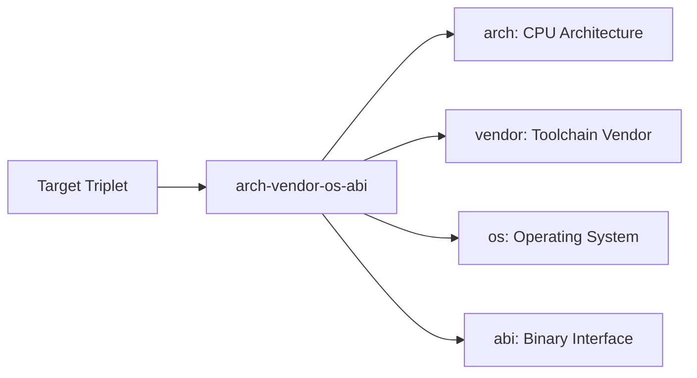

# Modern Embedded C++ Tutorial: Cross-Compilation Basics and CMake Multi-Target Builds

## Introduction

In the field of embedded development, we often face an interesting challenge: the development environment and the target runtime environment are often completely different hardware platforms. You might write code on a powerful x86_64 workstation, but the final program needs to run on an ARM architecture microcontroller or a RISC-V processor. This is where cross-compilation comes into play.

This article will delve into the basic concepts of cross-compilation and detail how to use CMake, a modern build system, to manage build processes for multiple target platforms. Whether you are a newcomer to embedded development or a senior developer looking to optimize your existing build process, this article will provide you with practical knowledge and techniques.

## Part 1: Cross-Compilation Basics

#### What is Cross-Compilation

Cross-compilation refers to the process of **compiling on one platform (the Host Platform) to generate an executable program that runs on another platform (the Target Platform)**. This contrasts with our common native compilation—where native compilation generates programs that run on the same platform that compiled them.

A simple example: when you compile a C++ program on your Ubuntu x86_64 laptop, and this program will run on a Raspberry Pi's ARM processor, you are performing cross-compilation.

#### Why We Need Cross-Compilation

This question isn't really a question; let me ask you a question instead—would you dare to deploy a complete compiler toolchain on your microcontroller? A microcontroller with only a few MB of Flash and a few dozen KB of RAM obviously cannot run a GCC compiler.

Moreover, even if the target device could theoretically compile code, compiling on resource-constrained hardware would be very slow. In contrast, compiling on a high-performance development machine can significantly shorten the development cycle and improve work efficiency. Desktop development environments usually have a more complete ecosystem of development tools, including IDEs, debuggers, performance analyzers, etc., which can significantly improve the development experience.

#### Cross-Compilation Toolchain

A cross-compilation toolchain is a set of tools specifically used for cross-compilation, usually including:

- **Cross Compiler**: This is the core of the toolchain, such as `arm-none-eabi-gcc` for bare-metal ARM development, or `aarch64-linux-gnu-gcc` for ARM64 Linux systems. The compiler is responsible for translating source code into machine code for the target platform.

- **Cross Assembler**: Converts assembly language code into machine code for the target platform, usually used in conjunction with the compiler.

- **Cross Linker**: Links multiple object files (.o files) generated by compilation into the final executable or library files, handling symbol resolution and address relocation.

- **Standard Libraries**: C/C++ standard libraries compiled for the target platform, including libc, libstdc++, etc. These libraries must be compiled for the target architecture.

- **Auxiliary Tools**: Tools such as `objdump` (view object files), `objcopy` (convert object file formats), `size` (view program size), `nm` (view symbol tables), etc.

##### Target Triplet

In cross-compilation, we use a "target triplet" to precisely describe the target platform. This triplet usually consists of three or four parts:



Let's look at a few actual examples:

- `arm-none-eabi`: ARM architecture, no vendor, no OS (bare-metal), EABI (Embedded Application Binary Interface)
- `aarch64-linux-gnu`: ARM64 architecture, Linux OS, GNU toolchain
- `x86_64-w64-mingw32`: x86_64 architecture, Windows OS, MinGW toolchain
- `riscv64-unknown-elf`: RISC-V 64-bit architecture, unknown vendor, ELF format

Understanding the target triplet is crucial for selecting the correct toolchain and configuring the build system. Different triplets imply different instruction sets, calling conventions, binary formats, and runtime environments.

#### Challenges of Cross-Compilation

While powerful, cross-compilation also brings some challenges:

**Dependency Management**: When a program depends on third-party libraries, you need to ensure these libraries are also compiled for the target platform. You cannot link a library compiled for x86 into an ARM program.

**System Call Differences**: Different operating systems have different system call interfaces, and these differences need to be handled properly in the code.

**Endianness Issues**: Different architectures may use different endianness (big-endian or little-endian), which requires special attention when handling network protocols or file formats.

**Pointer Size**: Pointer sizes differ between 32-bit and 64-bit architectures, which can lead to subtle bugs.

**Floating Point Operations**: Implementations of floating-point operations may vary slightly across platforms, and some embedded platforms even lack hardware floating-point units.

## CMake Build System Basics

Well, there isn't any actual combat here, so just have a look. Later on, there will be a special chapter to chat about this.

### Why Choose CMake

CMake (Cross-platform Make) is a cross-platform build system generator. It does not build programs directly; instead, it generates files required for the native build system (such as Makefiles, Ninja build files, or Visual Studio project files).

For embedded development, CMake has the following advantages:

**Cross-platform Support**: The same set of CMake configurations can be used on Linux, Windows, and macOS to generate build files for the corresponding platform.

**Cross-compilation Support**: CMake natively supports cross-compilation, making it easy to configure the target platform through Toolchain files.

**Modular Design**: CMake's module system facilitates managing multiple components and dependencies in complex projects.

**Modern Features**: Supports Target-oriented build configuration, making dependencies clearer and configuration more intuitive.

**Wide IDE Support**: Mainstream IDEs such as CLion, Visual Studio Code, and Qt Creator have good support for CMake.

### CMake Basic Concepts

Before diving into cross-compilation configuration, let's quickly review CMake's several core concepts:

**CMakeLists.txt**: This is CMake's configuration file, describing the project's structure, source files, dependencies, and build rules.

**Target**: Can be an executable file, a library file, or a custom target. Modern CMake recommends a target-centric configuration approach.

**Generator**: Determines what type of build system files CMake generates, such as Unix Makefiles, Ninja, Visual Studio, etc.

**Build Tree and Source Tree**: The source tree contains source code and CMakeLists.txt, while the build tree is where generated build files and compilation artifacts are stored. Out-of-source builds are recommended to keep the source directory clean.

**Variables and Cache**: CMake uses variables to store configuration information, and certain variables are cached for reuse in subsequent configurations.

## CMake Cross-Compilation Configuration

### 3.1 The Role of Toolchain Files

The Toolchain file is the core of CMake cross-compilation. It is a CMake script file that describes all the information required for cross-compilation, including compiler paths, target system information, compilation options, etc.

Benefits of using a Toolchain file:

- **Reusability**: Configure once, share across multiple projects
- **Version Control**: Toolchain files can be included in version control to ensure the team uses the same configuration
- **Clear Separation**: Separate platform-related configuration from project logic

### Writing a Toolchain File

Let's start with an example of a Toolchain file for ARM Cortex-M:

```cmake
# CMake minimum version requirement
cmake_minimum_required(VERSION 3.20)

# Declare the target system name
set(CMAKE_SYSTEM_NAME Generic)
set(CMAKE_SYSTEM_PROCESSOR ARM)

# Toolchain path settings
set(TOOLCHAIN arm-none-eabi-)
set(CMAKE_C_COMPILER ${TOOLCHAIN}gcc)
set(CMAKE_CXX_COMPILER ${TOOLCHAIN}g++)

# Compiler flags
set(CMAKE_C_FLAGS
    "-mcpu=cortex-m4 "
    "-mthumb "
    "-mfloat-abi=hard "
    "-mfpu=fpv4-sp-d16 "
    "-fno-exceptions "
    "-fno-rtti"
)

set(CMAKE_CXX_FLAGS
    "-mcpu=cortex-m4 "
    "-mthumb "
    "-mfloat-abi=hard "
    "-mfpu=fpv4-sp-d16 "
    "-fno-exceptions "
    "-fno-rtti"
)

# Disable compiler test program (compilation test may fail on bare metal)
set(CMAKE_C_COMPILER_WORKS 1)
set(CMAKE_CXX_COMPILER_WORKS 1)

# Search path control
set(CMAKE_FIND_ROOT_PATH_MODE_PROGRAM NEVER)
set(CMAKE_FIND_ROOT_PATH_MODE_LIBRARY ONLY)
set(CMAKE_FIND_ROOT_PATH_MODE_INCLUDE ONLY)
```

Let's interpret the various parts of this file in detail:

**CMAKE_SYSTEM_NAME**: Specifies the target system type. `Generic` indicates a bare-metal environment without an operating system, but it can also be `Linux`, `Windows`, etc.

**CMAKE_SYSTEM_PROCESSOR**: Specifies the target processor architecture, such as `ARM`, `RISCV`, `XTENSA`, etc.

**Compiler Settings**: Explicitly specify the cross-compilers to use. CMake will use these compilers instead of the system defaults.

**Compiler Flags**:

- `-mcpu=cortex-m4`: Specifies the target CPU model
- `-mthumb`: Uses the Thumb instruction set (higher code density)
- `-mfloat-abi=hard`: Uses the hardware floating-point ABI
- `-mfpu=fpv4-sp-d16`: Specifies the floating-point unit type
- `-fno-exceptions`: Disables C++ exceptions (common in embedded systems)
- `-fno-rtti`: Disables Run-Time Type Information

**CMAKE_FIND_ROOT_PATH_MODE series**: Controls CMake's search behavior when finding libraries, header files, etc., to avoid accidentally using libraries from the host platform.

### A More Complex Toolchain Example: ARM Linux

For ARM devices running Linux (like Raspberry Pi), the Toolchain file will be different:

```cmake
cmake_minimum_required(VERSION 3.20)

set(CMAKE_SYSTEM_NAME Linux)
set(CMAKE_SYSTEM_PROCESSOR arm)

# Path to the cross-compilation toolchain
set(TOOLCHAIN_PATH /opt/gcc-arm-linux-gnueabihf)
set(CMAKE_C_COMPILER ${TOOLCHAIN_PATH}/bin/arm-linux-gnueabihf-gcc)
set(CMAKE_CXX_COMPILER ${TOOLCHAIN_PATH}/bin/arm-linux-gnueabihf-g++)

# Sysroot settings
set(CMAKE_SYSROOT /opt/arm-sysroot)

set(CMAKE_FIND_ROOT_PATH ${CMAKE_SYSROOT})

set(CMAKE_FIND_ROOT_PATH_MODE_PROGRAM NEVER)
set(CMAKE_FIND_ROOT_PATH_MODE_LIBRARY ONLY)
set(CMAKE_FIND_ROOT_PATH_MODE_INCLUDE ONLY)
```

This example introduces the concept of `CMAKE_SYSROOT`. A Sysroot is a directory that contains a copy of the target system's root file system, including library files, header files, etc. This is very important for target platforms with a complete operating system.

### Using a Toolchain File

Using a Toolchain file to configure:

```bash
cmake -B build -DCMAKE_TOOLCHAIN_FILE=cmake/arm-cortex-m4.cmake
```

Important tip: **The Toolchain file must be specified via `-DCMAKE_TOOLCHAIN_FILE` the first time you run CMake**, after which it will be cached. If you need to change the Toolchain, you must delete the build directory and reconfigure.

## Part 4: CMake Multi-Target Builds

### What is Multi-Target Building

Multi-target building means that the same set of source code can generate executable programs for different target platforms. In embedded development, this is very common:

- Building for multiple hardware variants (STM32F4, STM32F7)
- Supporting both development boards and product boards
- Building test versions on the host platform and release versions on the target platform
- Supporting multiple operating systems (Linux, RTOS, bare-metal)

### Multi-Target Scheme Based on Build Directories

The simplest multi-target build scheme is to create independent build directories for each platform:

```text
project/
├── src/
├── cmake/
│   ├── stm32f4.cmake
│   ├── stm32f7.cmake
│   └── linux-x86.cmake
├── build_stm32f4/
├── build_stm32f7/
└── build_linux/
```

Build script example:

```bash
#!/bin/bash

# Build for STM32F4
cmake -B build_stm32f4 -DCMAKE_TOOLCHAIN_FILE=cmake/stm32f4.cmake
cmake --build build_stm32f4

# Build for STM32F7
cmake -B build_stm32f7 -DCMAKE_TOOLCHAIN_FILE=cmake/stm32f7.cmake
cmake --build build_stm32f7

# Build for Linux x86
cmake -B build_linux -DCMAKE_TOOLCHAIN_FILE=cmake/linux-x86.cmake
cmake --build build_linux
```

### Conditional Compilation and Platform Detection

In `CMakeLists.txt`, we need to perform conditional configuration based on different platforms:

```cmake
# Detect the target platform
if(CMAKE_SYSTEM_NAME STREQUAL "Generic")
    # Bare-metal configuration
    add_definitions(-DUSE_HAL_DRIVER)
    target_sources(app PRIVATE src/stm32/peripherals.cpp)
elseif(CMAKE_SYSTEM_NAME STREQUAL "Linux")
    # Linux configuration
    target_sources(app PRIVATE src/linux/peripherals.cpp)
endif()
```

### Using Generator Expressions

CMake's generator expressions provide a more flexible way to perform conditional configuration:

```cmake
target_sources(app PRIVATE
    src/common/main.cpp
    $<$<PLATFORM_ID:Generic>:src/stm32/hal.cpp>
    $<$<PLATFORM_ID:Linux>:src/linux/hal.cpp>
)

target_compile_definitions(app PRIVATE
    $<$<PLATFORM_ID:Generic>:ARM_MATH_CM4>
    $<$<PLATFORM_ID:Linux>:SIMULATION_MODE>
)
```

### Platform Abstraction Layer (HAL) Design

In multi-target projects, a good hardware abstraction layer design is crucial:

```cpp
// src/hal/gpio_interface.hpp
class IGpio {
public:
    virtual void init() = 0;
    virtual void set(bool state) = 0;
    virtual bool get() const = 0;
    virtual ~IGpio() = default;
};

// src/stm32/gpio.hpp
class Stm32Gpio : public IGpio {
    // STM32 implementation
};

// src/linux/gpio.hpp
class LinuxGpio : public IGpio {
    // Linux implementation (e.g., using sysfs or gpiod)
};
```

### Configuration Variant Management

For different hardware variants of the same architecture, CMake's options and cache variables can be used:

```cmake
option(BOARD_VARIANT "Select board variant" "STM32F407")

if(BOARD_VARIANT STREQUAL "STM32F407")
    set(MCU_MODEL STM32F407xx)
    set(FLASH_SIZE 1024)
elseif(BOARD_VARIANT STREQUAL "STM32F429")
    set(MCU_MODEL STM32F429xx)
    set(FLASH_SIZE 2048)
endif()
```

When using:

```bash
cmake -B build -DBOARD_VARIANT=STM32F429
```
