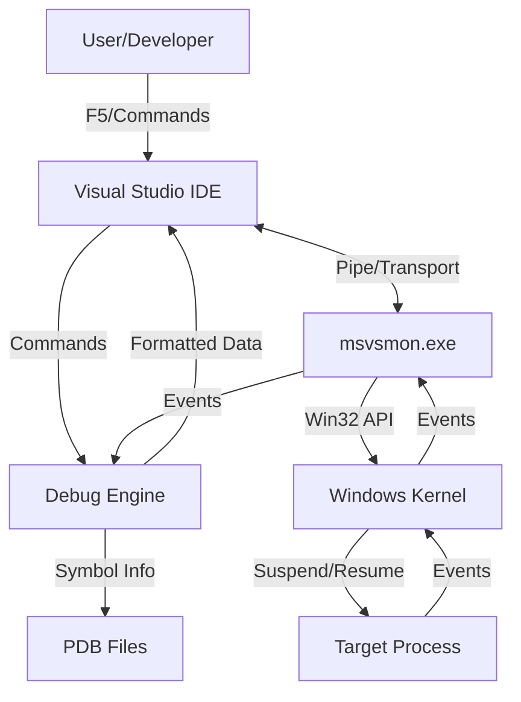

# Deep Dive: MSVC Debugging Mechanisms and Visual Studio Debugger Internals

I have been working on some Windows projects at home recently. Since the project is quite large, it involves MSVC debugging content. I'd like to share my findings from the past few days, combined with MSVC documentation.

Although we sometimes have to admit that Visual Studio can be a bit difficult to use (especially when projects get large, VS is quite heavy), its debugging capabilities are solid. I assume many friends use debugging to solve problems encountered in their projects. This is the starting point of this blog—to re-examine debugging, specifically in the context of MSVC.

## Starting with "What is Debugging?"

Here, I think it is important to agree on the basic concept of "debugging." We generally say that a program has a bug, and you need to debug it. Here, debugging refers to checking a snapshot of the program's state at a given point in time. For example, when I was working on the IMX6ULL Desktop, I encountered a crash due to illegal sensor data, which was discovered during remote debugging.

Formally speaking—debugging is a **"God-view" observation and control technology for running programs**. It attempts to achieve three things:

1. **Observation**: Viewing memory, registers, variable values, thread states, and call stacks without altering the program logic.
2. **Control**: Taking over CPU execution rights. This includes suspending, single-stepping, resuming, and modifying memory/variable values.
3. **Mapping**: Real-time translation of obscure **Machine Code** and **memory addresses** back into human-readable **Source Code**.

**In a nutshell**: Debugging is the process of using privileged interfaces provided by the operating system to forcibly intervene in a target process, making it run according to the developer's will and exposing its internal state.

---

## The "Participants" on the Debugging Stage

When you press F5 in Visual Studio, it is not just a single program working, but a complex **multi-process collaborative system**. Let's look at who is involved in this debugging system.

We, as the active party, are responsible for clicking the GUI interface provided by the Visual Studio IDE (The Shell) to issue commands. However, I must say one thing: VS **does not handle** the actual debugging logic; it is only responsible for **display**. It converts user clicks (like F10) into commands sent to the Debug Engine.

A crucial component is the Debug Engine (DE). It is responsible for parsing complex C++ expressions (like `pObj->member`), reading PDB symbol files, and translating address `0x00402030` into `main.cpp:15` (somewhat similar to `addr2line` in the GNU toolchain).

`msvsmon.exe` (Remote Debugging Monitor) is the executor / agent / isolation layer. We know that during debugging, the IDE process spawns this debugging process. The role of `msvsmon` is to ensure that if the target program crashes or hangs, it does not cause the VS IDE to crash. At the same time, it is responsible for passing data between the IDE and the target process. It is the "person" actually calling Windows APIs to control the target process.

We will skip the role of the Windows kernel here; it simply provides the relevant System APIs for debugging.

The PDB file (Program Database) is the static database connecting the "Binary World" with the "Source Code World." Without it, the debugger is "blind" and can only see assembly code. Therefore, when debugging, we must have the PDB file; otherwise, VS will tell you that no symbols have been loaded (for example, in Release mode).

---

## How Does MSVC Debug? (The Workflow)

#### Phase 1: Establishing the Connection

When performing remote debugging, everything begins with the **interaction between the Debugger and the host system**. Specifically, Visual Studio initiates a request through the Remote Debugging Monitor (`msvsmon`), calling the key Win32 API — `DebugActiveProcess`. During the call, a crucial flag `DEBUG_PROCESS` (or `DEBUG_ONLY_THIS_PROCESS`) is passed. This flag is not just a startup instruction, but a "declaration of takeover" issued to the operating system, marking the target process as being in a controlled state from its very inception.

Subsequently, the process enters the **kernel-level binding and handshake phase**. When the Windows kernel receives a creation request with the debug flag, it does not merely spawn an independent process. Instead, it establishes a parent-child or debugging association between the target program (Debuggee) and the debugger process (`msvsmon`) within kernel data structures. This deep binding ensures that all events generated by the target process—such as exceptions, thread creation, or module loading—are fed back to the debugger in real-time through specific debugging channels, allowing the debugger to grasp the complete lifecycle of the target program.

Finally, there is the **pre-execution suspension and takeover phase**. To ensure developers don't miss a single line of code, the target process, after initialization is complete, does not immediately jump to the `mainCRTStartup` function or the user entry point. Instead, after the Loader completes its preliminary work, the operating system automatically places the target process's main thread in a **Suspend** state. At this moment, the target program is like a car that has started but is holding the brake, quietly waiting for further instructions from the debugger. Only when the debugger has completed preparations like symbol loading and breakpoint setting, and issues a "continue" command, will the target program truly begin executing business logic.

This part reveals the black-box mechanism by which the debugger truly "controls" the target process. I have organized these core logics into a more professional and logical description:

------

#### Phase 2: The Debug Loop — The Core Scheduling Heart

The operation of the debugger is essentially an efficient and rigorous **self-looping monitoring system**. When the debugger enters the working state, it maintains a resident `while(true)` loop, with the core hub being the `WaitForDebugEvent` API. At this point, the debugger enters a state of "efficient blocking," silently waiting for signals triggered by any disturbances in the target process.

Once the target process triggers a key event—whether it is a module load (DLL Load), thread creation, or the breakpoint triggering that developers care most about—**the Windows kernel automatically intervenes**. The kernel instantly freezes all threads of the target process, packages the scene environment into structured event information, and passes it to the debugger. The debugger then "wakes up," executes corresponding logic based on the event type: loading symbol files (PDB) to align with source code, or handling `EXCEPTION_BREAKPOINT` exceptions. Finally, when the developer finishes viewing and commands to continue, the debugger calls `ContinueDebugEvent`, requesting the kernel to resume the threads, bringing the program back to "life."

#### Phase 3: Breakpoint Injection and Instruction-Level Control

- **Software Breakpoints (INT 3):** When you click a red dot on the left side of a code line, the debugger is essentially "tampering" with the corresponding address in the target memory. It replaces the first byte of the original instruction at that location with `0xCC` (the `INT 3` instruction). When the CPU executes here, it forcibly triggers an interrupt exception, handing it over to the debugger.
- **Single Stepping:** To achieve "line-by-line execution," the debugger utilizes the **Trap Flag (TF)** at the CPU hardware level. By setting the TF in the flag register to 1, the CPU enters single-step mode: after executing every machine instruction, it automatically generates an `EXCEPTION_SINGLE_STEP` exception and suspends. It is through this "execute one beat, pause one beat" rhythm that the debugger achieves microscopic observation of code execution details.

#### Phase 4: Detachment and Termination

When the debugging task ends, the debugger provides two elegant ways to exit. The most common is **complete termination**, which is calling `TerminateProcess` to cleanly end the target process's lifecycle. The other is the **Detach** mode: by calling `DebugActiveProcessStop`, the debugger undoes all memory modifications (such as restoring the replaced `0xCC` byte) and lifts the kernel binding. At this point, the target process breaks free from constraints and returns to an independent running state, continuing to execute without interfering with business logic.

## Summary Diagram (The Big Picture)

To help blog readers understand, you can visualize such an architecture diagram:

---

## The Cornerstone of Debugging: Build System and Symbol Files

Debugging does not start with F5, but with compilation. This is why it is necessary to build in Debug mode for debugging; otherwise, the lack of debugging symbols can be very troublesome.

#### The "Map" and "Guide" of Debugging: PDB and Compilation Configuration

If the binary file is a maze, then the **PDB (Program Database)** is the map of that maze. It is not just a simple auxiliary file, but a complex database that records the correspondence between machine code addresses and source code line numbers, variable names, type definitions, and FPO data needed for stack unwinding.

When a program crashes at address `0x004015A0`, the debugger does not know what happened there. It will quickly search the PDB file and discover through the mapping table that the address corresponds to line 15 of `main.cpp`. It is through this **Symbolication** process that the debugger can translate raw register states into code contexts that developers can understand.

To ensure the accuracy of this map, **compiler options** are crucial:

- **`/Zi` or `/ZI`**: Forces the generation of PDB debug information, where `/ZI` specifically reserves extra padding space for "Edit and Continue."
- **`/Od` (Disable Optimization)**: This is the soul of Debug mode. When optimizing (`/O2`), the compiler reorders instructions or inlines functions for performance, causing the binary stream to be completely misaligned with source code line numbers. Disabling optimization ensures a "what you see is what you get" debugging experience.

------

## Breakpoints, Evaluation, and Hot Patching

#### 1. Breakpoint Implementation: Software vs. Hardware

- **Software Breakpoint (INT 3)**: When you press F9, the debugger performs a "swap." It replaces the first byte of the instruction at the breakpoint with `0xCC`. When the CPU hits this byte, it triggers an interrupt and transfers control to the operating system, which then notifies the debugger.
- **Hardware Breakpoint**: Implemented through the CPU's dedicated **Debug Registers (Dr0 - Dr7)**. It does not need to modify memory and is typically used to monitor variable changes (data breakpoints).

#### 2. Expression Evaluation (EE): A Mini Compilation System

When you enter `pObj->member` in the Watch window, the **Expression Evaluator** inside VS springs into action. It combines type information from the PDB to calculate memory offsets, directly reads the target process's memory address, and formats it into a human-readable structure.

#### 3. Edit and Continue: Hot Patching Technology

This is an extremely challenging feature. When you modify code, VS performs **incremental compilation** in the background, generating new binary fragments. Through "Hot Patching" technology, it modifies the entry point of the original function into a jump instruction (JMP), pointing to the newly generated memory address, thereby achieving code updates without restarting the program (I have tried it and found it sometimes doesn't work well and may fail).

---

## Common Issues and Troubleshooting

Note that here are some common problems encountered during debugging, which I have summarized below:

1. **"Breakpoint will not currently be hit" (Hollow Circle Breakpoint)**:
    - **Cause**: The PDB does not match the source code, or the PDB is not loaded.
    - **Solution**: Check the "Modules" window for symbol loading status; ensure the code has not been optimized away.
2. **Variable displays "Variable is optimized away"**:
    - **Cause**: In Release mode, variables may be stored in registers for reuse, or directly eliminated by constant folding.
3. **Stack Corruption**:
    - The debugger cannot unwind the stack. This is usually because a buffer overflow has overwritten the return address.
