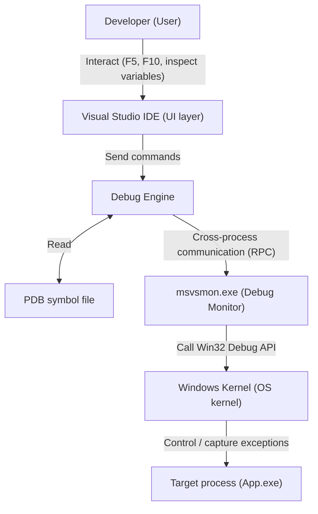

# Deep Dive: MSVC Debugging Mechanisms and Visual Studio Debugger Internals

I've recently been working on some Windows projects at home — fairly big ones — and that pulled me into MSVC debugging territory. In this post I'd like to talk through what I gathered over these past few days, combined with the MSVC documentation. Admittedly, we sometimes have to concede that Visual Studio isn't always pleasant to use (once a project grows large, it honestly gets a bit torturous — VS is heavy), but its debugging is decent. I imagine many of you certainly use the debugger to solve problems in your own projects. That's the starting point of this post — taking a fresh look at debugging, and at MSVC debugging in particular.

## Starting from What Debugging Is

Here I believe it's important that we agree on the basic concept of "debugging". We usually say the program has a bug, and you need to debug it. What that debugging means is inspecting a snapshot of the program's state at a given point in time. For example, back when I was building the IMX6ULL Desktop, there was a crash from illegal sensor data — and it was during remote debugging that I found it.

To put it formally — debugging is **a "god's-eye view" technique for observing and controlling a running program**. It tries to accomplish three things:

1. **Observation**: viewing memory, registers, variable values, thread states, and the call stack, without altering the program's logic.
2. **Control**: seizing the CPU's execution. This includes suspending (Suspend), single-stepping (Step), resuming (Resume), and modifying memory or variable values.
3. **Mapping**: translating cryptic **machine code** and **memory addresses** back into human-readable **source code** in real time.

**In one sentence**: debugging is the process of using the privileged interfaces provided by the operating system to forcibly intervene in a target process, make it run according to the developer's will, and expose its internal state.

---

## The 'Participants' on the Debugging Stage

When you press F5 in Visual Studio, it is not just one program at work — it is a complex **multi-process collaboration system**. Let's take a look at who takes part in this debugging system of ours while a session is running.

We are the active side: we click the GUI that the Visual Studio IDE (the Shell) provides and issue commands. But let me say this up front — VS is **not** responsible for the actual debugging logic. It only handles **display**; it converts your click actions (such as F10) into commands sent to the debug engine.

One fairly important component is the Debug Engine (DE). It is responsible for parsing complex C++ expressions (such as `vec[0].m_data`), for reading the PDB symbol file, and for translating the address `0x00401234` into `main.cpp:20` (a bit like addr2line from the GNU toolchain).

msvsmon.exe (the Remote Debugging Monitor) is the executor / agent / isolation layer. We know that when debugging, it is our IDE process that brings this debug process up; msvsmon's job is to make sure that if the target program crashes or hangs, the VS IDE does not crash with it. At the same time, `msvsmon` is responsible for passing data between the IDE and the target process. It is the "person" who actually calls the Windows APIs to control the target process.

As for the role of the Windows kernel, we'll skip it here — it does nothing more than provide the debugging-related system APIs.

The PDB file (Program Database) is the static database connecting the "binary world" and the "source-code world". Without it, the debugger is "blind" and can only see assembly code. That's why, when debugging, we must have the PDB file — otherwise VS will tell you that no symbols are loaded (in a Release build, for instance).

---

## How Does MSVC Perform Debugging? (The Workflow)

#### Phase 1: Establishing the Connection

In remote debugging, everything begins with **the interaction between the debugger and the host system**. Concretely, Visual Studio issues a request through the Remote Debugging Monitor (`msvsmon.exe`), calling the key Win32 API — `CreateProcess`. As part of the call, a crucial flag is passed in: `DEBUG_ONLY_THIS_PROCESS` (or `DEBUG_PROCESS`). This flag is not merely a launch instruction; it is a "declaration of takeover" issued to the operating system, marking the target process as controlled from the very moment it comes into existence.

Afterwards, the flow enters the **kernel-level binding and handshake phase**. When the Windows kernel receives a creation request carrying the debug flag, it does not simply start an independent process — it establishes, in kernel data structures, a parent-child relationship (or debug association) between the target program (the debuggee) and the debugger process (msvsmon). This deep binding ensures that every event the target process produces — exceptions, thread creation, module loading, and the like — is reported back to the debugger in real time through a dedicated debug channel, letting the debugger keep track of the target program's complete lifecycle.

Finally comes the **pre-execution suspension and takeover phase**. To make sure the developer misses not a single line of code, the target process, once initialization completes, does not immediately jump to the `main` function or the user entry point. Instead, after the loader finishes its preliminary work, the operating system automatically places the target process's main thread into a **suspended** state. At this point the target program is like a car whose engine is already running while the brake is held down, quietly waiting for further instructions from the debugger. Only after the debugger finishes its preparations — loading symbols, setting breakpoints — and issues the "continue" command does the target program truly begin executing business logic.

This part reveals the black-box mechanism through which the debugger truly "controls" the target process. I have organized this core logic into a more professional and logically structured description:

------

#### Phase 2: The Debug Loop — The Core Dispatching Heart

A running debugger is, in essence, an efficient and rigorous **self-looping listening system**. When the debugger enters its working state, it maintains a resident `While Loop` whose central hub is the `WaitForDebugEvent` API. The debugger then settles into an "efficient blocking" state, silently waiting for a signal stirred up by anything at all happening in the target process.

The moment the target process triggers a key event — a module load (DLL load), a thread creation, or the breakpoint hit developers care about most — **the Windows kernel steps in automatically**. The kernel instantly freezes all of the target process's threads and packs up the scene into structured event information handed to the debugger. The debugger promptly "wakes up" and runs the logic matching the event type: loading the symbol file (PDB) to align with the source, or handling the `EXCEPTION_BREAKPOINT` exception. Finally, when the developer has finished inspecting and commands continuation, the debugger calls `ContinueDebugEvent`, asking the kernel to resume the threads and bring the program back to "life".

#### Phase 3: Breakpoint Injection and Instruction-Level Control

- **Software breakpoints (INT 3):** when you click the red dot to the left of a code line, the debugger is in fact "tampering" with the corresponding address in the target's memory. It replaces the first byte of the original instruction at that location with `0xCC` (the `INT 3` instruction). When the CPU reaches this point, an interrupt exception is forcibly raised and handed over to the debugger for handling.
- **Single stepping:** to deliver "line-by-line execution", the debugger exploits a hardware feature of the CPU: the **Trap Flag (TF)**. By setting TF to 1 in the flags register, the CPU enters single-step mode: after each machine instruction completes, a `SINGLE_STEP` exception is raised automatically and the CPU suspends. Through this "execute one beat, pause one beat" rhythm, the debugger achieves microscopic observation of the details of how the code runs.

#### Phase 4: Detachment and Termination

When the debugging task ends, the debugger offers two graceful ways out. The most common is **full termination**: calling `TerminateProcess` to end the target process's lifecycle cleanly. The other is **detach** mode: by calling `DebugActiveProcessStop`, the debugger undoes all of its memory modifications (restoring the replaced `0xCC` bytes, for example) and releases the kernel binding. The target process then slips its constraints, returns to an independent running state, and keeps executing without disturbing the business logic.

## The Big Picture in One Diagram

To make it easier for readers to picture, you can imagine an architecture diagram like this:

```mermaid
flowchart TD
    A["Developer (User)"] -->|"Interact (F5, F10, inspect variables)"| B["Visual Studio IDE (UI layer)"]
    B -->|"Send commands"| C["Debug Engine"]
    C <-->|"Read"| D["PDB symbol file"]
    C -->|"Cross-process communication (RPC)"| E["msvsmon.exe (Debug Monitor)"]
    E -->|"Call Win32 Debug API"| F["Windows Kernel (OS kernel)"]
    F -->|"Control / capture exceptions"| G["Target process (App.exe)"]
```

---

## The Cornerstone of Debugging: The Build Process and Symbol Files

Debugging does not begin at F5; it begins at compilation. That is exactly why we build in Debug mode when debugging — without debug symbols, things get painful.

#### The "Map" and "Guide" of Debugging: PDB and Compiler Options

If the binary is a maze, then the **PDB (Program Database)** is the map of that maze. It is not a mere auxiliary file — it is a sophisticated database recording machine-code addresses mapped to source line numbers, variable names, type definitions, and the FPO data needed for stack unwinding.

When the program crashes at address `0x00401000`, the debugger has no idea what happened there. It quickly searches the PDB and, through the mapping table, finds that the address corresponds to line 15 of `main.cpp`. It is precisely through this **symbolication** process that the debugger can turn raw register state into code context a developer can understand.

To keep this map accurate, **compiler options** are critical:

- **`/Zi` or `/ZI`**: force generation of PDB debug information; `/ZI` additionally reserves extra padding specifically for "Edit and Continue".
- **`/Od` (disable optimizations)**: this is the soul of Debug mode. Under optimization (`/O2`), the compiler reorders instructions or inlines functions for performance, leaving the binary stream completely misaligned with source line numbers. Disabling optimization guarantees a "what you see is what you get" debugging experience.

------

## Breakpoints, Evaluation, and Hot Patching

#### 1. Breakpoint Implementation: Software vs Hardware

- **Software breakpoints (INT 3)**: when you press F9, the debugger pulls a "bait and switch". It replaces the first byte of the instruction at the breakpoint with `0xCC`. When the CPU runs into this byte, it triggers an interrupt and transfers control to the operating system, which in turn notifies the debugger.
- **Hardware breakpoints**: implemented through the CPU's dedicated **debug registers (Dr0 - Dr7)**. They require no memory modification and are typically used to watch for variable changes (data breakpoints).

#### 2. Expression Evaluation (EE): A Miniature Compiler System

When you type `ptr->member` into the Watch window, the **expression evaluator** inside VS immediately gets to work. Combining type information from the PDB, it computes the memory offset, reads the target process's memory directly, and formats it into a human-readable structure.

#### 3. Edit and Continue: Hot Patching

This is a remarkably challenging feature. When you modify code, VS performs an **incremental build** in the background, producing new binary fragments. Using "hot patching" techniques, it rewrites the original function's entry point into a jump instruction (JMP) pointing at the newly generated memory address, achieving code updates without restarting the program (I have tried it; it does not always work well and can fail).

---

## Common Issues and Troubleshooting

Note that these are some common problems you run into while debugging; I have summarized them here:

1. **"Breakpoint will not currently be hit" (hollow-circle breakpoint)**:
    - **Cause**: the PDB does not match the source code, or the PDB has not been loaded.
    - **Fix**: check the Modules window to see the symbol loading status; make sure the code has not been optimized away.
2. **A variable shows "Variable is optimized away"**:
    - **Cause**: in Release mode, the variable may be kept in a register and reused, or eliminated outright by constant folding.
3. **Stack corruption**:
    - The debugger cannot unwind the stack. Usually a buffer overflow has overwritten the return address.
