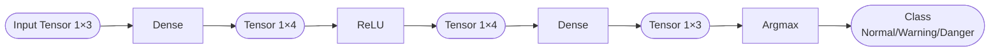

# What a Tensor holds in a neural network — four kinds of data, one container

The previous piece demystified the Tensor down to "a 2D table of numbers." So what does that table actually hold in our neural network?

The answer might come as a relief: **almost everything**. Every number that flows through a neural network, from start to finish, lives inside a Tensor. The input is a Tensor, the trained parameters are Tensors, every intermediate result computed along the way is a Tensor. So-called "neural-network inference", **stripped all the way to the bottom, is a computation with Tensors in and Tensors out.**

Before things get too abstract, let's lay out the scene for our own Lab. The machine we're building reads sensor values to judge a device's state: you feed it three readings — temperature, humidity, light — and it spits out a verdict: normal, warning, or danger. That's the whole thing, concretely. Every number flowing through this little machine from end to end is a Tensor, and this piece takes apart which kinds of them live around it.

To pin that picture down, we'll tear down one Dense layer (a fully-connected layer — I know this may confuse you again; for now just pretend it's some mysterious little word, a thing like a function "A") and see which kinds of Tensors sit around it. Dense is the only arithmetic layer in our MLP — Stage 2 is spent entirely on writing it — so we won't touch how it computes here; we only look at which numbers it keeps on hand.

And which numbers does it actually keep on hand? You don't need to trace exactly how function "A" transforms things in the middle, but for it to do any work it must be storing something internally — otherwise, on what grounds would the same input always produce the same output? What it stores is mainly two things.

One specifies, for each output, how many inputs to gather and in what proportions to blend them before adding them up — that pile of proportions is the **weights**; you can think of it as a recipe table. The other is a constant added separately to each output after it's computed, called the **bias** — like giving the fader one last push at the mixing desk.

## A Dense layer's four Tensors

Concretely, for the first layer, `Dense(3, 4)` means kneading 3 inputs into 4 intermediate values. Around this layer there are four Tensors:

| Data | What it is | Shape | Our notation |
|---|---|---|---|
| Input x | the three sensor readings | a vector of length 3 | `Tensor<1, 3>` |
| Weights W | coefficients that knead 3 inputs into 4 outputs | 4 rows × 3 columns | `Tensor<4, 3>` |
| Bias b | a constant each output adds extra | a vector of length 4 | `Tensor<1, 4>` |
| Output y | the 4 intermediate values this layer computes | a vector of length 4 | `Tensor<1, 4>` |

That's a faceful of jargon — let's take it slowly.

**Input** is the three readings fed in: one temperature, one humidity, one light. It's naturally "a row of 3 numbers", so it's `Tensor<1, 3>` — 1 row, 3 columns. Neural networks have a dedicated name for this "single row" shape: a vector. We express it with the alias `Vector<N>`; in essence it's still `Tensor<1, N>`.

**Weights** are what this layer has truly "learned" — the most central parameters of the whole neural network. It's a 4×3 table: the 4 rows correspond to the 4 outputs, and each row's 3 numbers correspond to the 3 inputs. The 3 numbers in row i are the coefficients used to compute output i. How exactly those coefficients get multiplied against the input and summed is Stage 2's job; here you only need to accept "it's a 4×3 table — rows map to outputs, columns map to inputs".

**Bias** is a constant each output adds extra; there are 4 outputs, so it's a vector of length 4. Its role is to give each output an independent shift — pure addition, no input involved. The weights decide "how the inputs get mixed"; the bias decides "how much the whole thing gets lifted after the mixing".

**Output** is the 4 intermediate values this layer computed, shaped the same as the bias — a vector of length 4. These 4 numbers feed the next layer (first through a ReLU that zeroes out negatives, then into the second Dense), propagating onward.

Those are the four Tensors. And notice — **vectors and matrices are both expressed with the same `Tensor<Rows, Cols>`**; a vector is just the special case Rows=1. That's a deliberate unification in our Tensor design: one container holds every shape of data in a neural network, so we don't have to build two separate ones for vectors and matrices.

## The whole pipeline, all Tensors

Zoom out to the whole pipeline and the "one container" intuition gets even clearer. Our MLP, from input to output:

Every stage's data is a Tensor. The first Dense takes in a 1×3 Tensor and puts out a 1×4 one; ReLU turns every negative in the Tensor into 0, shape unchanged; the second Dense turns the 1×4 into a 1×3; finally Argmax picks the largest of those 3 numbers, and its position (0/1/2) is the classification result — normal, warning, or danger.

So what is each later Stage doing? All of them are doing something with Tensors:

- Stage 2's Dense takes the input Tensor and the weights Tensor, multiplies and adds, throws in the bias Tensor, and produces the output Tensor
- Stage 3's ReLU zeroes out every negative in a Tensor
- Stage 3's Argmax finds the position of the largest number in a Tensor

Once the Tensor is settled, every later stage is just operations on top of it. That's also why we spend a whole Stage 1 getting the Tensor solid: if it collapses, everything after it has to be rewritten along with it.

## So why not hold these in a ready-made container

Now you should be asking: since this is just holding a few floats, would it work to use `std::vector<float>` for the input and `std::vector<std::vector<float>>` for the weights?

The answer to that question is the same one as "why not a ready-made 2D array" at the end of the previous piece. It's tied to the hard constraints our v0.1 has to keep, and it deserves its own teardown. [Piece 03](./03-why-not-built-in.md) lays the candidates — `std::vector`, nested `std::array`, the native 2D array — out one by one and puts each on trial, making clear why in the end we have no choice but to build this Tensor ourselves.

Take two things away from this piece: **the input, weights, bias, and output flowing through a neural network are all Tensors, and a vector is just a Tensor with Rows=1**; and **every later stage is an operation on top of Tensors**. With that foundation under you, when you go poke at the Tensor's design trade-offs, you'll know what each trade-off is serving.
