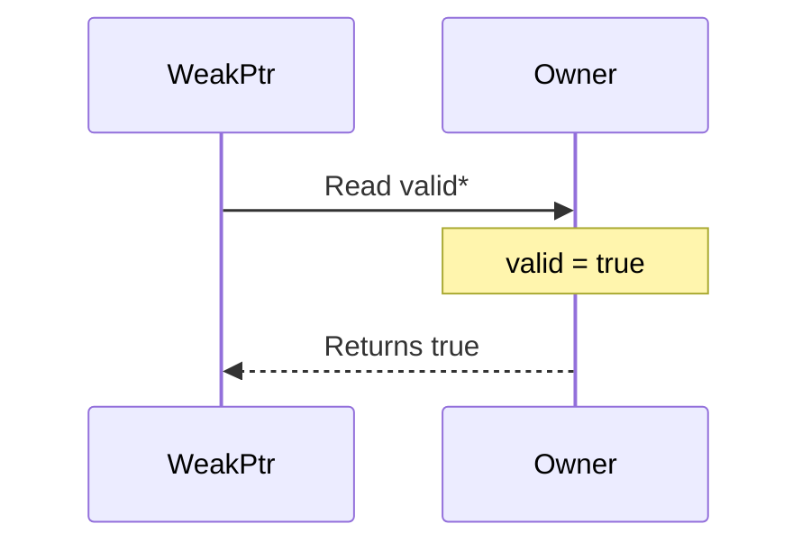
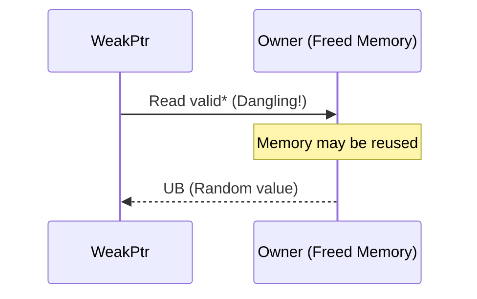

# The WeakPtr Anti-Pattern: The Fatal Trap of `Flag*`

## Introduction

In the previous post, we covered borrowing and observation—`unique_ptr` and `shared_ptr` solved the question of "what does this pointer intend to do?", but they share a critical flaw: once the object is destroyed, you are out of luck. Dereferencing is undefined behavior (UB), with no room for maneuver.

So, quite naturally, the next requirement is "weak reference"—I want to hold a reference to an object without owning it, and I want to safely detect invalidation after the object is destroyed, rather than dereferencing a dangling pointer.

What is the most intuitive solution? Use a Flag:

```cpp
struct WeakPtr {
    T* ptr;
    bool* is_valid; // Pointer to the validity flag
};
```

`WeakPtr` holds a `T*` and a `bool*`. We check `is_valid` when using it. When the Owner is destroyed, it sets `is_valid` to `false`. Sounds perfect—but the core argument of this article is: **this design is fundamentally unsafe, and it should not be called WeakPtr.**

## Why This Design Is Tempting

Let's implement it first to see why it "seems to work."

```cpp
struct Owner {
    T data;
    bool valid = true; // Member variable
};

struct WeakPtr {
    T* ptr;
    bool* valid; // Pointer to Owner::valid
};
```

This looks quite reasonable—`valid` and `data` are bound together. When the Owner is destroyed, `valid` is set to `false`, and an external `WeakPtr` calling `isValid()` will return `false`.

In synchronous, single-threaded scenarios where the `WeakPtr`'s lifetime is strictly shorter than the Owner's, this implementation **does work**. The problem is that these prerequisites are extremely fragile in real-world engineering. If the `WeakPtr`'s lifetime is strictly shorter than the Owner's, why do we even need this abstraction? It's not very reliable.

## Why It Is Fundamentally Unsafe

There is only one core problem: **The lifetime of the Flag is bound to the Owner.**

When the Owner is destructed, `valid` as a member of the Owner is also destructed. `valid`, as a member variable of `Owner`, is destroyed along with it. At this point, the `valid*` pointer held by any surviving external `WeakPtr`—becomes a dangling pointer.

So what does the `isValid()` function actually do? It dereferences a potentially dangling `bool*` to read a non-existent `bool`. This is **Undefined Behavior (UB)**.

Let's draw a lifetime diagram to clarify this process:

**Stage 1: When Owner is alive** — `owner->valid` is accessible, everything is normal:



**Stage 2: After Owner is destructed** — `data` and `valid` are both dangling pointers:



The moment `WeakPtr::isValid` checks `*valid`, the memory pointed to by `valid*` may have been reclaimed, reused, or overwritten. Whether it returns `true` or `false` depends entirely on the current state of that memory—this is UB.

## Minimal UB Reproduction

Next, let's write a minimal example to actually trigger this issue. Note: The behavior of UB is unpredictable. The following code may "look normal" under certain compilers/optimization levels, but this does not mean it is safe.

```cpp
#include <iostream>
#include <memory>

struct Widget;

struct WeakWidget {
    Widget* ptr;
    bool* valid;

    bool isValid() const {
        // UB: Accessing memory that might be freed
        return *valid;
    }
};

struct Widget {
    int data = 42;
    bool valid = true;

    ~Widget() {
        valid = false; // Write to member before destruction
        std::cout << "Widget destroyed\n";
    }
};

int main() {
    auto w = std::make_unique<Widget>();
    WeakWidget weak{w.get(), &w->valid};

    // Destroy the Owner
    w.reset();

    // Check the dangling flag
    if (weak.isValid()) {
        std::cout << "Still valid: " << weak.ptr->data << "\n";
    } else {
        std::cout << "Detected invalid\n";
    }

    return 0;
}
```

In my test environment (GCC 16, -O0), the output of this code is:

```text
Widget destroyed
Detected invalid
```

It looks like `isValid` correctly returned `false`—but this doesn't mean it's safe. The reason it returned `false` is that `~Widget` set `valid` to `false` before the Widget's memory was freed. `isValid` happened to read the value written by the destructor—because that memory hadn't been reused by the allocator yet. Compiling with AddressSanitizer (`-fsanitize=address`) clearly reveals the `heap-use-after-free` error: `isValid` is accessing freed memory.

With a different allocator, different optimization level, or if more memory operations are inserted between destruction and reading, the result could be completely different—`isValid` might return `true`, and `ptr` might return a non-null pointer to freed memory. The behavior of UB is unpredictable, and **"seeming to work" is precisely the most dangerous manifestation of UB.**

## Why Async Callbacks Completely Break Constraints

Someone might say: "As long as we guarantee that the `WeakPtr` doesn't outlive the Owner, we are fine." This constraint can barely be maintained by manual checks in synchronous code, but it is almost impossible to guarantee in asynchronous callback scenarios.

```cpp
// Async callback scenario
void asyncOperation(Owner* owner) {
    // Capture WeakPtr by value
    registerCallback([weak = WeakPtr{owner}]() {
        // Execute later... is Owner still alive?
        if (weak.isValid()) {
            weak.use();
        }
    });
}
```

The essence of an asynchronous callback is "save a reference for later use." When is "later"? Is the object still alive? You don't know. The safety premise of this `WeakPtr`—"WeakPtr does not outlive Owner"—is a joke in asynchronous scenarios.

## What Should It Actually Be Called

This `Flag*` combination isn't useless. Under specific constraints (synchronous use, strictly controlled `WeakPtr` lifetime relative to Owner), it can work. But it shouldn't be called `WeakPtr`, because that name implies "can safely detect invalidation after object destruction"—which it cannot do.

More honest names would be:

- **`UnsafeWeakPtr`**: Explicitly marks it as unsafe
- **`LifetimeBoundPtr`**: Expresses that it is bound to the Owner's lifetime
- **`ScopedBorrow`**: Expresses that it is essentially still a borrow

If you must use it, you must clearly state the constraints in the documentation and naming. But the better approach is—use a real `WeakPtr`. In the next post, we will implement a safe version.

## Summary

- `Flag*` looks like a `WeakPtr`, but `isValid` accessing `*valid` itself can be UB
- Core problem: The lifetime of the Flag is bound to the Owner; once the Owner is destroyed, the Flag ceases to exist
- It might "work" in synchronous scenarios where `WeakPtr` is strictly short-lived relative to Owner, but this is not a reliable `WeakPtr`
- Asynchronous callbacks completely break the "WeakPtr not longer than Owner" constraint
- It should at most be called `UnsafeWeakPtr` or `LifetimeBoundPtr`
- To be safe: the control block must be independent of the Owner's lifetime—this is the content of the next post

## Reference Resources

- [Chromium Smart Pointer Guidelines](https://www.chromium.org/developers/smart-pointer-guidelines/) — Chrome's `WeakPtr` solves this problem using an independent control block
- [C++ Core Guidelines - CP.50: Define a mutex together with the data it guards](https://isocpp.github.io/CppCoreGuidelines/CppCoreGuidelines) — Although it talks about mutex, the design idea of "separating control block and object lifetimes" is similar
- [What is undefined behavior? - StackOverflow](https://stackoverflow.com/questions/23979841/what-is-undefined-behavior)
