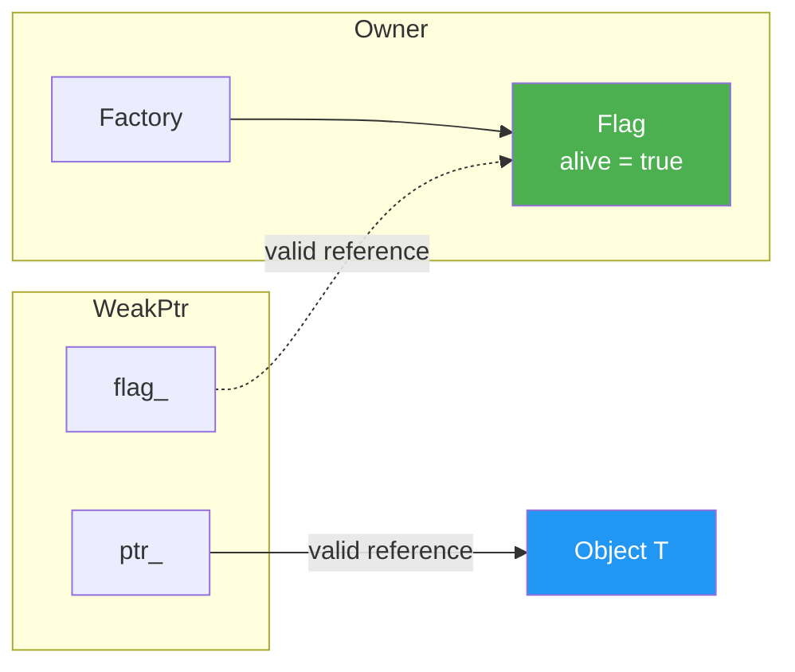
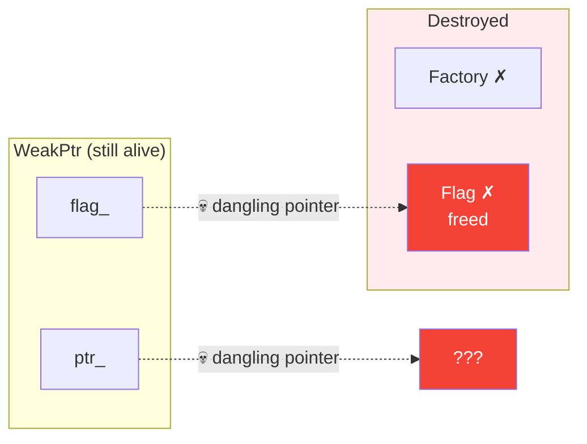

# WeakPtr Anti-Pattern: The Fatal Trap of `T* + raw Flag*`

In the previous article we finished covering borrowing and observing — `Borrowed<T>` and `ObserverPtr<T>` answered the question of "what is this pointer actually trying to say" — but they share one common hard flaw: once the object is destroyed, there is nothing you can do with them. Dereferencing is UB, with no room for maneuvering whatsoever.

So quite naturally, the next requirement is a "weak reference" — I want to hold a reference to an object without owning it, and I want to be able to safely detect invalidation after the object is destroyed, rather than dereferencing a dangling pointer.

What is the most intuitive scheme? Throw in a Flag:

```cpp
struct Flag {
    bool alive = true;
};
```

The `WeakPtr` keeps a `T*` and a `Flag*`, and checks `flag_->alive` when it is used. When the Owner is destroyed, `alive` is set to `false`. It sounds perfect — but the central argument of this article is: **this scheme is not safe at all, and it does not deserve to be called WeakPtr.**

## Why This Design Is Tempting

Let's implement it first and see why it "appears to work".

```cpp
// unsafe_weak_ptr.h
// ⚠️ Anti-pattern implementation for teaching purposes; do not use this in production code

#pragma once

#include <iostream>

struct Flag {
    bool alive = true;
};

template <typename T>
class UnsafeWeakPtr {
public:
    UnsafeWeakPtr(T* ptr, Flag* flag) : ptr_(ptr), flag_(flag) {}

    // Check whether the object is still alive
    bool is_valid() const
    {
        return flag_ && flag_->alive;
    }

    // Get the object pointer; returns nullptr if it has expired
    T* get() const
    {
        if (is_valid()) {
            return ptr_;
        }
        return nullptr;
    }

    T& operator*() const { return *get(); }
    T* operator->() const { return get(); }

private:
    T* ptr_;
    Flag* flag_;
};

template <typename T>
class UnsafeWeakPtrFactory {
public:
    explicit UnsafeWeakPtrFactory(T* owner) : owner_(owner) {}

    UnsafeWeakPtr<T> get_weak_ptr()
    {
        return UnsafeWeakPtr<T>(owner_, &flag_);
    }

    void invalidate()
    {
        flag_.alive = false;
    }

    ~UnsafeWeakPtrFactory()
    {
        flag_.alive = false;
    }

private:
    T* owner_;
    Flag flag_;  // the Flag lives as a member variable of the Factory
};
```

This looks fairly reasonable — the `Flag` is bound to the `Owner`, and when the Owner is destroyed, `flag_.alive` is set to `false`, so any external WeakPtr that calls `get()` afterwards gets `nullptr` back.

In synchronous, single-threaded scenarios where the WeakPtr's lifetime is strictly shorter than the Owner's, this implementation **does work**. The problem is that these preconditions are extremely fragile in real-world engineering. If the lifetime is strictly shorter than the Owner's, what do you need this abstraction for at all? It simply is not dependable.

## Why It Is Fundamentally Unsafe

There is exactly one core problem: **the Flag's lifetime is bound to the Owner.**

When the Owner is destroyed, `UnsafeWeakPtrFactory`, being a member of the Owner, is destroyed as well. And `Flag flag_`, being a member variable of `UnsafeWeakPtrFactory`, is destroyed along with it. At that moment, the `flag_` pointer held by any external `UnsafeWeakPtr` that is still alive has become a dangling pointer.

So what does the function `UnsafeWeakPtr::is_valid()` do? It dereferences a `Flag*` that may already dangle, to read a `bool alive` that no longer exists. This is **undefined behavior** (UB).

Let's draw a lifecycle diagram to see this process clearly:

**Stage 1: while the Owner is alive** — `flag_->alive == true`, everything is normal:


```mermaid
graph LR
    subgraph Owner["Owner"]
        Factory["Factory"]
        Flag["Flag\nalive = true"]
    end
    Factory --> Flag
    subgraph WP["WeakPtr"]
        ptr["ptr_"]
        fp["flag_"]
    end
    fp -.->|"valid reference"| Flag
    ptr -->|"valid reference"| T["Object T"]
    style Flag fill:#4CAF50,color:#fff
    style T fill:#2196F3,color:#fff
```

**Stage 2: after the Owner is destroyed** — both `flag_` and `ptr_` are dangling pointers:


```mermaid
graph LR
    subgraph Dead["Destroyed"]
        FactoryX["Factory ✗"]
        FlagX["Flag ✗\nfreed"]
    end
    subgraph WP["WeakPtr (still alive)"]
        ptr["ptr_"]
        fp["flag_"]
    end
    fp -.->|"💀 dangling pointer"| FlagX
    ptr -.->|"💀 dangling pointer"| DeadT["???"]
    style FlagX fill:#f44336,color:#fff
    style DeadT fill:#f44336,color:#fff
    style Dead fill:#ffebee
```

At the very moment `is_valid()` checks `flag_->alive`, the memory `flag_` points to may already have been reclaimed, reused, or overwritten. Whether it returns `true` or `false` depends entirely on what state that chunk of memory is in right now — that is UB.

## A Minimal UB Reproduction

Next we will write a minimal example that actually triggers the problem. Note: the behavior of UB is unpredictable, and the code below may "look normal" under certain compilers or optimization levels, but that does not mean it is safe.

```cpp
// unsafe_weak_ptr_ub_demo.cpp
// Compile: g++ -std=c++17 -O0 -g unsafe_weak_ptr_ub_demo.cpp
// Note: how the UB manifests varies with the compiler, optimization level, and runtime environment
// -O0 is used here to make the UB easier to observe

#include <iostream>
#include <memory>

struct Flag {
    bool alive = true;
};

template <typename T>
class UnsafeWeakPtr {
public:
    UnsafeWeakPtr(T* ptr, Flag* flag) : ptr_(ptr), flag_(flag) {}
    bool is_valid() const { return flag_ && flag_->alive; }
    T* get() const { return is_valid() ? ptr_ : nullptr; }

private:
    T* ptr_;
    Flag* flag_;
};

template <typename T>
class UnsafeWeakPtrFactory {
public:
    explicit UnsafeWeakPtrFactory(T* owner) : owner_(owner) {}
    UnsafeWeakPtr<T> get_weak_ptr()
    {
        return UnsafeWeakPtr<T>(owner_, &flag_);
    }
    ~UnsafeWeakPtrFactory() { flag_.alive = false; }

private:
    T* owner_;
    Flag flag_;
};

struct Widget {
    int value = 42;
    UnsafeWeakPtrFactory<Widget> factory{this};

    UnsafeWeakPtr<Widget> get_weak_ptr()
    {
        return factory.get_weak_ptr();
    }
};

int main()
{
    UnsafeWeakPtr<Widget> weak = [] {
        auto w = std::make_unique<Widget>();
        return w->get_weak_ptr();
        // w is destroyed here
        // Widget destroyed → factory destroyed → Flag destroyed
    }();

    // At this point weak.flag_ points to the destroyed Flag
    // and weak.ptr_ points to the destroyed Widget

    // ⚠️ UB: dereferencing the freed Flag
    std::cout << "is_valid() = " << std::boolalpha << weak.is_valid() << '\n';

    // ⚠️ UB: if is_valid() happens to return true, get() returns a dangling pointer
    if (auto* p = weak.get()) {
        std::cout << "value = " << p->value << '\n';  // UB: reading freed memory
    } else {
        std::cout << "Widget 已失效（但这个结果本身就是 UB 的产物）\n";
    }
}
```

In my test environment (GCC 16, -O0), the output of this code is:

```text
is_valid() = false
Widget 已失效（但这个结果本身就是 UB 的产物）
```

It looks as if `is_valid()` correctly returned `false` — but that does not mean it is safe. The reason `false` came back is that `~UnsafeWeakPtrFactory()` set `alive` to `false` first, and only afterwards was the Widget's memory released. What `is_valid()` read happened to be the value written by the destructor — because that memory had not yet been reused by the allocator. Compile with AddressSanitizer (`-fsanitize=address`) and you can see the `heap-use-after-free` error clearly: `is_valid()` is accessing memory that has already been freed.

Swap in a different allocator, a different optimization level, or insert more memory operations between the destruction and the read, and the result can be completely different — `is_valid()` may return `true`, and `get()` may return a non-null pointer to freed memory. The behavior of UB is unpredictable, and **"appearing to work" is precisely the most dangerous form UB can take**.

## Why Async Callbacks Break the Constraint Completely

Someone might say: "just guarantee that the WeakPtr does not outlive the Owner." In synchronous code this constraint can still be barely maintained through manual review, but in async callback scenarios it is almost impossible to guarantee.

```cpp
// Timer callback scenario
class Session {
public:
    UnsafeWeakPtr<Session> get_weak()
    {
        return factory_.get_weak_ptr();
    }

    void start_heartbeat()
    {
        auto weak = get_weak();
        // The callback executes 1 second later
        timer_.schedule(1000ms, [weak]() {
            // The Session may already have been destroyed before the callback runs
            // weak.is_valid() accesses the destroyed Flag → UB
            if (weak.is_valid()) {
                // ...
            }
        });
    }

private:
    UnsafeWeakPtrFactory<Session> factory_{this};
    Timer timer_;
};
```

The essence of an async callback is "store a reference away now, use it later". When exactly is "later"? Is the object still alive? You do not know. And the safety premise of `UnsafeWeakPtr` — "the WeakPtr does not outlive the Owner" — turns into a joke in async scenarios.

## So What Should It Be Called

This `T* + raw Flag*` combination is not entirely worthless. Under specific constraints (synchronous usage, the WeakPtr's lifetime strictly controlled by the Owner), it works. But it should not be called `WeakPtr`, because that name implies "invalidation can be safely detected after the object is destroyed" — which it cannot deliver.

More honest names would be:

- **`UnsafeWeakPtr<T>`**: explicitly flags the lack of safety
- **`OwnerBoundWeakPtr<T>`**: expresses that it is bound to the Owner's lifetime
- **`BorrowedWeakPtr<T>`**: expresses that it is essentially still a borrow

If you absolutely must use it, you must state the constraints clearly in the documentation and the naming. But the better approach is — use a real WeakPtr. In the next article we will implement a safe version.

## Summary

- The `T* + raw Flag*` combination looks like a WeakPtr, but `get()`'s access to `flag_->alive` may itself already be UB
- The core problem: the Flag's lifetime is bound to the Owner; once the Owner is destroyed, the Flag no longer exists
- It may "work" in synchronous scenarios where the WeakPtr is strictly shorter-lived than the Owner, but this is not a reliable WeakPtr
- Async callbacks completely break the "WeakPtr must not outlive the Owner" constraint
- At best it deserves the name `UnsafeWeakPtr` or `OwnerBoundWeakPtr`
- To be safe, the control block must live independently of the Owner's lifetime — which is exactly what the next article is about

## References

- [Chromium Smart Pointer Guidelines](https://www.chromium.org/developers/smart-pointer-guidelines/) — Chrome's WeakPtr solves this problem with an independent control block
- [C++ Core Guidelines - CP.50: Define a mutex together with the data it guards](https://isocpp.github.io/CppCoreGuidelines/CppCoreGuidelines) — it is about mutexes, but the design idea of "separating the control block from the object's lifetime" is similar
- [What is undefined behavior? - StackOverflow](https://stackoverflow.com/questions/23979841/what-is-undefined-behavior)
