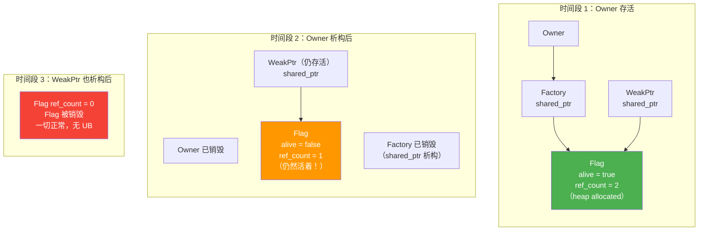
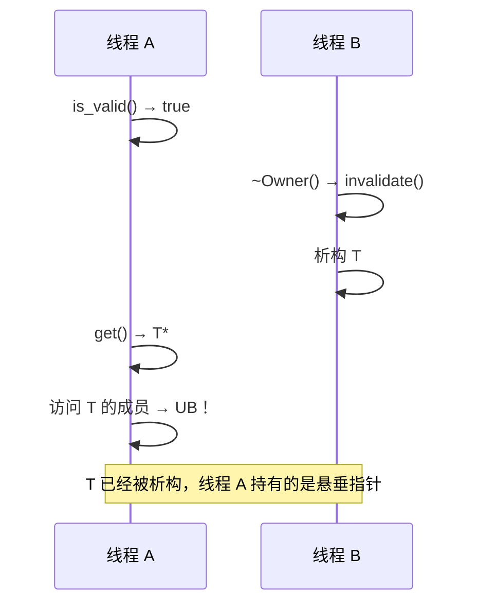

# SimpleWeakPtr: Safe Improvements via T* + shared_ptr\<Flag\>

## Introduction

In the previous post, we broke down the fatal flaw in `SimpleWeakPtr`: the `Flag`'s lifetime was bound to the `Owner`. Once the `Owner` was destroyed, the `Flag` vanished with it, leaving the `Flag*` held by external `WeakPtr` instances as dangling pointers—dereferencing it was undefined behavior (UB) in itself.

The solution is straightforward: decouple the `Flag`'s lifetime from the `Owner`. How? We use a `shared_ptr` to hold it—the `Factory` and all `WeakPtr` instances share ownership of the same `Flag`. When the `Owner` destructs, it only invalidates the `Flag` (sets `alive` to `false`), but the `Flag` object itself continues to live until the last `WeakPtr` holding it is destroyed.

This way, `lock()` never accesses freed memory, because the `Flag` object it accesses is guaranteed to still exist.

## Core Design

Let's look at the implementation first, then we'll explain why we designed it this way.

```cpp
// simple_weak_ptr.h
// 教学版 SimpleWeakPtr<T>：T* + shared_ptr<Flag>
// control block 通过 shared_ptr 管理，保证生命周期独立于 Owner

#pragma once

#include <memory>

struct Flag {
    bool alive = true;

    void invalidate() { alive = false; }
};

template <typename T>
class SimpleWeakPtr {
public:
    SimpleWeakPtr() = default;

    SimpleWeakPtr(T* ptr, std::shared_ptr<Flag> flag)
        : ptr_(ptr), flag_(std::move(flag)) {}

    // 检查对象是否还有效
    // 安全：flag_ 是 shared_ptr，只要这个 WeakPtr 还活着，Flag 就一定活着
    bool is_valid() const
    {
        return flag_ && flag_->alive;
    }

    // 获取对象指针，已失效则返回 nullptr
    T* get() const
    {
        if (is_valid()) {
            return ptr_;
        }
        return nullptr;
    }

    T& operator*() const { return *get(); }
    T* operator->() const { return get(); }
    explicit operator bool() const { return get() != nullptr; }

private:
    T* ptr_ = nullptr;
    std::shared_ptr<Flag> flag_;
};

template <typename T>
class SimpleWeakPtrFactory {
public:
    explicit SimpleWeakPtrFactory(T* owner)
        : owner_(owner), flag_(std::make_shared<Flag>()) {}

    SimpleWeakPtr<T> get_weak_ptr()
    {
        return SimpleWeakPtr<T>(owner_, flag_);
    }

    void invalidate()
    {
        if (flag_) {
            flag_->invalidate();
        }
    }

    ~SimpleWeakPtrFactory()
    {
        invalidate();
    }

private:
    T* owner_;
    std::shared_ptr<Flag> flag_;  // Factory 和 WeakPtr 共享同一个 Flag
};
```

## Why This Is Safe

The problem with the previous version was that `Flag*` was a raw pointer—it didn't own the `Flag` and couldn't guarantee the `Flag` was still alive. Now that we've switched to `shared_ptr<Flag>`, the situation is completely different.

`shared_ptr` maintains an internal reference count. When the `Factory` creates a `WeakPtr`, it copies its `shared_ptr<Flag>` to the `WeakPtr`, incrementing the reference count. At this point, two `shared_ptr<Flag>` instances point to the same `Flag`: one held by the `Factory`, and one by the `WeakPtr`.

When the `Owner` destructs, the `Factory`'s destructor calls `flag->alive = false`. Then the `Factory`'s `shared_ptr<Flag>` destructs, dropping the reference count from two to one. However, the `Flag` object is **not** destroyed, because there is still one `shared_ptr<Flag>` (the one held by the `WeakPtr`) referencing it.

Only when the last `shared_ptr<Flag>` holding the `Flag` destructs is the `Flag` finally destroyed. This means that as long as any `WeakPtr` is alive, `lock()` is accessing a `Flag` object that definitely exists—rather than a dangling pointer.

Lifetime diagram:



## shared_ptr\<Flag\> Does Not Mean Owning T

There is a subtle point here that needs emphasis: `shared_ptr<Flag>` only owns the control block (the `Flag`), **it does not own T**.

The `Flag` only contains a `bool`. It doesn't hold a pointer to `T`, participate in `T`'s destruction, or extend `T`'s lifetime. `T`'s lifetime is entirely managed by the `Owner` itself (it might be a stack object, a heap object managed by `unique_ptr`, or something else). The only thing the `Flag` does is record the state of "is T still alive".

This distinction is crucial—if you understand `shared_ptr<Flag>` as "shared_ptr owns T", you would confuse it with `std::shared_ptr<T>`. The latter owns `T`, while the former only owns the control block.

## Thread Safety Discussion

At this point, we have solved the lifetime safety issue. However, if you use `SimpleWeakPtr` in a multi-threaded environment, there are new pitfalls waiting.

**Problem 1: Data race on `Flag::alive`.** If one thread writes to `flag->alive` in `~Owner()`, and another thread reads `flag->alive` in `lock()`, without any synchronization mechanism, this is a textbook data race—UB.

The fix is simple: swap `bool` for `atomic<bool>`:

```cpp
#include <atomic>

struct Flag {
    std::atomic<bool> alive{true};

    void invalidate() { alive.store(false, std::memory_order_release); }
    bool is_alive() const { return alive.load(std::memory_order_acquire); }
};
```

**Problem 2: Even if `Flag` is atomic, concurrent access to `T` is still unsafe.** This is the most easily overlooked point. Suppose Thread A calls `lock()` and returns `true`, then prepares to call `get()` to retrieve the `T*` and access `T`'s members. But between the `lock()` check and the actual access to `T`, Thread B might be destructing `T`. This is the classic TOCTOU (Time-of-check-to-time-of-use) race.



`atomic<bool>` solves the data race for the `Flag` itself, not the concurrent access safety for `T`. We will discuss this in detail later when we cover asynchronous callbacks in Part 5.

## Summary

- `shared_ptr<Flag>` decouples the control block's lifetime from the `Owner`, solving the dangling pointer issue of `SimpleWeakPtr`.
- `lock()` is now always safe—as long as the `WeakPtr` is alive, the `Flag` is guaranteed to be alive.
- `shared_ptr<Flag>` only owns the control block, not `T`, and does not extend `T`'s lifetime.
- Thread safety requires two steps: use `atomic<bool>` for the `Flag` to solve data races, but concurrent access to `T` requires additional synchronization mechanisms.
- `atomic<bool>` ensures "reading the Flag won't trigger UB", not "accessing `T` is safe after reading alive=true".

This is the key step from "unsafe weak reference" to "safe weak reference". However, `SimpleWeakPtr` introduces the overhead of heap allocation and atomic reference counting. Is there a lighter way to achieve the same safety guarantees? Yes—the Chrome-style reference counting control block. In the next post, we will implement it.

## Reference Resources

- [std::shared_ptr - cppreference](https://en.cppreference.com/w/cpp/memory/shared_ptr)
- [std::atomic - cppreference](https://en.cppreference.com/w/cpp/atomic/atomic)
- [C++ Memory Order 详解](../../../vol5-concurrency/ch03-atomic-memory-model/02-memory-ordering.md) — Volume 5 of this tutorial discusses memory order in depth
