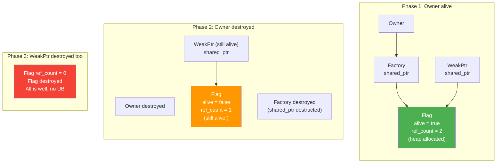

# SimpleWeakPtr: A Safety Improvement over T* + shared_ptr\<Flag\>

In the previous article we dissected the fatal flaw of `T* + raw Flag*`: the Flag's lifetime was tied to the Owner, so once the Owner was destroyed the Flag went away with it, and the `flag_` held by external WeakPtrs became a dangling pointer—calling `is_valid()` at all was UB.

The fix is direct: make the Flag's lifetime independent of the Owner. How? Hold it in a `std::shared_ptr<Flag>`—the Factory and every WeakPtr share ownership of the same Flag. When the Owner is destroyed, it merely invalidates the Flag (sets `alive = false`); the Flag object itself keeps living until the last WeakPtr holding it is destroyed too.

That way, `is_valid()` never touches freed memory, because the Flag object it accesses is guaranteed to still be alive.

## Core Design

First the implementation, then we'll walk through piece by piece why it is designed this way.

```cpp
// simple_weak_ptr.h
// Teaching version of SimpleWeakPtr<T>: T* + shared_ptr<Flag>
// The control block is managed via shared_ptr, guaranteeing a lifetime independent of the Owner

#pragma once

#include <memory>

struct Flag {
    bool alive = true;

    void invalidate() { alive = false; }
};

template <typename T>
class SimpleWeakPtr {
public:
    SimpleWeakPtr() = default;

    SimpleWeakPtr(T* ptr, std::shared_ptr<Flag> flag)
        : ptr_(ptr), flag_(std::move(flag)) {}

    // Check whether the object is still valid
    // Safe: flag_ is a shared_ptr; as long as this WeakPtr is alive, the Flag is guaranteed to be alive
    bool is_valid() const
    {
        return flag_ && flag_->alive;
    }

    // Get the object pointer; returns nullptr if it has been invalidated
    T* get() const
    {
        if (is_valid()) {
            return ptr_;
        }
        return nullptr;
    }

    T& operator*() const { return *get(); }
    T* operator->() const { return get(); }
    explicit operator bool() const { return get() != nullptr; }

private:
    T* ptr_ = nullptr;
    std::shared_ptr<Flag> flag_;
};

template <typename T>
class SimpleWeakPtrFactory {
public:
    explicit SimpleWeakPtrFactory(T* owner)
        : owner_(owner), flag_(std::make_shared<Flag>()) {}

    SimpleWeakPtr<T> get_weak_ptr()
    {
        return SimpleWeakPtr<T>(owner_, flag_);
    }

    void invalidate()
    {
        if (flag_) {
            flag_->invalidate();
        }
    }

    ~SimpleWeakPtrFactory()
    {
        invalidate();
    }

private:
    T* owner_;
    std::shared_ptr<Flag> flag_;  // The Factory and the WeakPtrs share the same Flag
};
```

## Why This Is Safe Now

The problem last time was that `Flag*` was a raw pointer—it didn't own the Flag and couldn't guarantee the Flag was still alive. Now that we've swapped in `std::shared_ptr<Flag>`, the picture changes completely.

`std::shared_ptr` maintains an internal reference count. When the Factory creates a `SimpleWeakPtr`, it copies its `flag_` to the WeakPtr, bumping the reference count by one. At that point two `shared_ptr`s refer to the same Flag: one held by the Factory, one by the WeakPtr.

When the Owner is destroyed, the Factory's destructor calls `invalidate()` to set `flag_->alive` to `false`. Then the Factory's `shared_ptr<Flag>` destructs, dropping the reference count from 2 to 1. But the Flag object is **not** destroyed, because one more `shared_ptr` (the one in the WeakPtr's hand) still references it.

Only when the last `shared_ptr` holding the Flag destructs is the Flag finally destroyed. That means as long as any `SimpleWeakPtr` is still alive, `is_valid()` is reading a Flag object that genuinely exists—not a dangling pointer.

The lifetime timeline:


```mermaid
graph TD
    subgraph "Phase 1: Owner alive"
        direction TB
        O1["Owner"]
        F1["Factory\nshared_ptr"]
        W1["WeakPtr\nshared_ptr"]
        FL1["Flag\nalive = true\nref_count = 2\n(heap allocated)"]
        O1 --> F1
        F1 --> FL1
        W1 --> FL1
        style FL1 fill:#4CAF50,color:#fff
    end

    subgraph "Phase 2: Owner destroyed"
        direction TB
        O2["Owner destroyed"]
        F2["Factory destroyed\n(shared_ptr destructed)"]
        W2["WeakPtr (still alive)\nshared_ptr"]
        FL2["Flag\nalive = false\nref_count = 1\n(still alive!)"]
        W2 --> FL2
        style FL2 fill:#FF9800,color:#fff
    end

    subgraph "Phase 3: WeakPtr destroyed too"
        direction TB
        FL3["Flag ref_count = 0\nFlag destroyed\nAll is well, no UB"]
        style FL3 fill:#f44336,color:#fff
    end
```

## shared_ptr\<Flag\> Does Not Own T

There is one easily confused point that deserves emphasis: `shared_ptr<Flag>` owns only the control block, the Flag—it does **not** own T.

The Flag holds nothing but a `bool alive`. It stores no pointer to T, takes no part in T's destruction, and does not extend T's lifetime. T's lifetime is managed entirely by the Owner itself (perhaps a stack object, a heap object managed by `unique_ptr`, or something else). The Flag's only job is to record one bit of state: "is T still alive?"

This distinction matters—if you read `shared_ptr<Flag>` as "shared_ptr owns T", you have confused it with `std::shared_ptr<T>`. The latter owns T; the former owns only the control block.

## Thread Safety Discussion

At this point we have solved the lifetime-safety problem. But if you use `SimpleWeakPtr` in a multi-threaded setting, new pitfalls are waiting.

**Problem one: a data race on `bool alive`.** If one thread writes `alive = false` inside `invalidate()` while another thread reads `alive` inside `is_valid()`, with no synchronization whatsoever, that is a data race in the strict standard sense—UB.

The fix is simple: replace the `bool` with a `std::atomic<bool>`:

```cpp
#include <atomic>

struct Flag {
    std::atomic<bool> alive{true};

    void invalidate() { alive.store(false, std::memory_order_release); }
    bool is_alive() const { return alive.load(std::memory_order_acquire); }
};
```

**Problem two: even with an atomic Flag, concurrent access to T is still unsafe.** This is the most easily overlooked trap. Suppose thread A calls `is_valid()`, gets `true` back, and prepares to call `get()` for the T* and touch T's members. But between the `is_valid()` check and the actual access to T, thread B may be destructing T. That is the classic TOCTOU (time-of-check-to-time-of-use) race.

```mermaid
sequenceDiagram
    participant A as Thread A
    participant B as Thread B

    A->>A: is_valid() → true
    B->>B: ~Owner() → invalidate()
    B->>B: destruct T
    A->>A: get() → T*
    A->>A: access T's members → UB!
    Note over A,B: T has been destructed; thread A is holding a dangling pointer
```

`atomic<bool>` fixes the data race on the Flag itself, not the concurrent-access safety of T. We will come back to this in depth in Part 5, when we discuss asynchronous callbacks.

## Summary

- `shared_ptr<Flag>` makes the control block's lifetime independent of the Owner, fixing the dangling problem of `raw Flag*`
- `is_valid()` is now always safe—as long as the WeakPtr is alive, the Flag is guaranteed to be alive
- `shared_ptr<Flag>` owns only the control block, not T, and does not extend T's lifetime
- Thread safety takes two steps: `atomic<bool>` in the Flag solves the data race, but concurrent access to T needs an additional synchronization mechanism
- `atomic<bool>` buys you "reading the Flag will not be UB", not "accessing T is safe once you have read alive=true"

This is the key step from an "unsafe weak reference" to a "safe weak reference". But `shared_ptr` brings the overhead of a heap allocation plus an atomic reference count. Is there a lighter way to get the same safety guarantee? Yes—the Chrome-style reference-counted control block. We will build it in the next article.

## References

- [std::shared_ptr - cppreference](https://en.cppreference.com/w/cpp/memory/shared_ptr)
- [std::atomic - cppreference](https://en.cppreference.com/w/cpp/atomic/atomic)
- [A Deep Dive into Memory Ordering](../../../vol5-concurrency/ch03-atomic-memory-model/02-memory-ordering.md) — Volume 5 of this tutorial discusses memory order in depth
