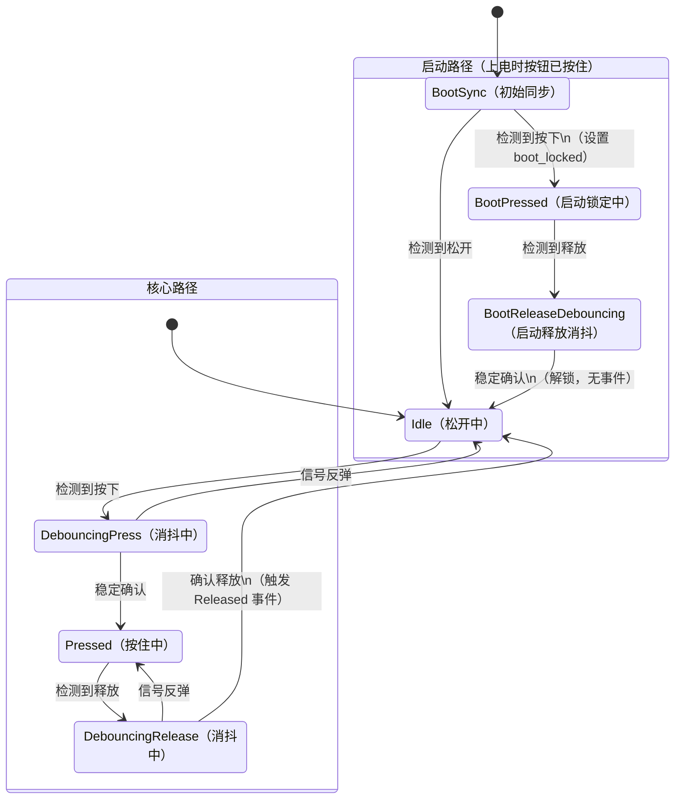

# Part 25: 7-State Debounce State Machine — The Core of This Series

> Following up the previous part: Non-blocking debounce works, but state variables are scattered, there is no concept of events, and startup boundaries are not handled. This part solves all problems with a 7-state finite state machine. This is a complete breakdown of the `update` method in `Debouncer`.

---

## Why We Need a State Machine

The core logic of the non-blocking debounce code from the previous part looked like this:

```c
if (current != last_raw) {
    last_raw = current;
    last_change_time = HAL_GetTick();
}
if ((HAL_GetTick() - last_change_time) >= debounce_ms) {
    if (last_raw != last_stable) {
        last_stable = last_raw;
        // 触发事件
    }
}
```

It works, but it has issues. This `if-else` structure mixes "debounce waiting," "state confirmation," and "event triggering" together without clear boundaries. As requirements increase—needing to distinguish between press and release, handling buttons held during startup, correctly handling signal bounce during debounce—these `if-else` blocks will pile up and become messy.

A state machine breaks this logic into discrete states and clear transition rules. Each state only cares about "I am here, the input is this, where do I go next?" It is no longer "a bunch of conditional judgments tangled together," but "a clear state transition diagram."

---

## 7 States

Our state machine has 7 states, defined in the private `State` `enum class` of `Debouncer`:

```cpp
enum class State {
    BootSync,            // 启动同步：第一次采样，确定初始状态
    Idle,                // 空闲：按钮松开，等待按下
    DebouncingPress,     // 消抖中（按下方向）：等待信号稳定
    Pressed,             // 已确认按下：按钮正在被按住
    DebouncingRelease,   // 消抖中（释放方向）：等待信号稳定
    BootPressed,         // 启动锁定：上电时按钮已被按住
    BootReleaseDebouncing, // 启动释放消抖：启动锁定后的释放消抖
};
```

Don't be scared by 7 states. The core flow consists of only 4 states: `Idle`, `DebouncingPress`, `Pressed`, and `DebouncingRelease`. These correspond one-to-one with the non-blocking logic from the previous part. The additional 3 states (`BootSync`, `BootPressed`, `BootReleaseDebouncing`) are specifically for handling the edge case where "the button is already held at startup."

### State Transition Diagram



---

## State-by-State Breakdown

### State::BootSync — Startup Sync

```cpp
case State::BootSync:
    raw_pressed_ = sample;
    stable_pressed_ = sample;
    debounce_start_ = now_ms;
    boot_locked_ = sample;
    state_ = sample ? State::BootPressed : State::Idle;
    return;
```

This is the initial state of the state machine (the default value of `state_` is `BootSync`). It executes only once—the first time `update` is called.

It does three things:

1. Initializes `stable_level_` and `last_level_` using the first sampled value.
2. If the button is already in the pressed state, sets `boot_locked_`—entering "startup lock."
3. Jumps to `Idle` or `BootPressed` based on the sampling result.

Why do we need this step? Because the state machine needs to know "what the initial state is." If the button is already held when powered on, we cannot trigger a `Pressed` event—the user didn't "press" the button; it was held from the very beginning.

### State::Idle — Idle

```cpp
case State::Idle:
    if (sample) {
        raw_pressed_ = true;
        debounce_start_ = now_ms;
        state_ = State::DebouncingPress;
    }
    return;
```

The idle state means the button is currently released. It only cares about one thing: was a press signal detected? If so, record the timestamp and enter the debouncing state.

This state produces no output and triggers no events. It is just "waiting."

### State::DebouncingPress — Press Debouncing

```cpp
case State::DebouncingPress:
    if (sample != raw_pressed_) {
        raw_pressed_ = sample;
        debounce_start_ = now_ms;
    }
    if (!sample) {
        state_ = State::Idle;
        return;
    }
    if ((now_ms - debounce_start_) < debounce_ms) {
        return;
    }
    stable_pressed_ = true;
    state_ = State::Pressed;
    cb(Pressed{});
    return;
```

This is the core of debouncing. Three judgments correspond to three situations:

**Situation 1: Signal bounced back.** `current_level == false` means the signal jumped back during the jitter. Update `last_level_` and reset the timer—restart the timing.

**Situation 2: Signal clearly returned to low.** `current_level == false` means the button was released again—this press was a false signal, return to `Idle`.

**Situation 3: Signal remains high, and has been stable for `debounce_time_`.** Press confirmed! Update the stable state, jump to `Pressed`, and trigger the `Pressed` event.

The order of these three judgments is critical. Check for bounce (Situation 1) first, then check for return to low (Situation 2), and finally check for timeout confirmation (Situation 3). This order ensures that:

- The timer is reset on every bounce during jitter.
- If the signal clearly returns to the initial level, we give up immediately (without waiting for timeout).
- Confirmation happens only when it remains stable.

### State::Pressed — Confirmed Pressed

```cpp
case State::Pressed:
    if (sample != raw_pressed_) {
        raw_pressed_ = sample;
        debounce_start_ = now_ms;
        state_ = State::DebouncingRelease;
    }
    return;
```

After the button is confirmed as pressed, it only cares about one thing: was a release signal detected? If so, enter the release debouncing state.

Note that the `Pressed` state will not trigger the `Pressed` event again—events are triggered only once during state transitions. This ensures that no matter how long the user holds the button, the `Pressed` event fires only once.

### State::DebouncingRelease — Release Debouncing

```cpp
case State::DebouncingRelease: {
    if (sample != raw_pressed_) {
        raw_pressed_ = sample;
        debounce_start_ = now_ms;
        if (sample) {
            state_ = State::Pressed;
        }
        return;
    }
    if (sample) {
        state_ = State::Pressed;
        return;
    }
    if ((now_ms - debounce_start_) < debounce_ms) {
        return;
    }
    stable_pressed_ = false;
    state_ = State::Idle;
    if (boot_locked_) {
        boot_locked_ = false;
        return;
    }
    cb(Released{});
    return;
}
```

This is structurally symmetric to `DebouncingPress`, but in the opposite direction. Three core judgments:

**Situation 1: Signal bounced.** Reset the timer. If it bounced back to high (`current_level == true`), return to the `Pressed` state.

**Situation 2: Signal clearly returned to high.** Return to `Pressed`; this release was a false signal.

**Situation 3: Timeout confirmation.** The stable value is low, release confirmed. But here there is an extra check: `boot_locked_`.

### Boot-lock Check

```cpp
if (boot_locked_) {
    boot_locked_ = false;
    return;  // 不触发 Released 事件
}
cb(Released{});
```

If `boot_locked_` is true, it means this "release" is the first release after the button was held at startup. In this case, we **do not trigger the `Released` event**—because the user never "pressed" the button while the system was running. We simply clear `boot_locked_` and let the state machine enter normal operation mode.

This is an edge case easily overlooked. If your code doesn't handle `boot_locked_` specially, and the button happens to be held during power-up (e.g., the button is stuck, or the user is holding it down), releasing the button will trigger a "baffling Released event"—the user did nothing, yet the LED turns off.

### State::BootPressed and BootReleaseDebouncing

These two states are "silent versions" of `Pressed` and `DebouncingRelease`—the logic is identical, but they trigger no events:

```cpp
case State::BootPressed:
    // 和 Pressed 一样的消抖逻辑，但释放后进入 BootReleaseDebouncing
    ...

case State::BootReleaseDebouncing:
    // 和 DebouncingRelease 一样的消抖逻辑
    // 确认释放后：
    boot_locked_ = false;
    stable_pressed_ = false;
    state_ = State::Idle;  // 静默进入 Idle，不触发 Released
    return;
```

Why not let `Pressed` and `DebouncingRelease` handle the startup lock function simultaneously? Because that would require adding a `boot_locked_` judgment in every state, making the logic more complex. Separating out two states adds a pair of states, but the logic of each state remains purer—either handling only the normal flow or only the startup flow.

---

## Complete State Transition Table

| Current State | Input | Condition | Next State | Action |
|---------|------|------|---------|------|
| BootSync | High | — | Idle | Initialize, no lock |
| BootSync | Low | — | BootPressed | Initialize, set boot_locked |
| Idle | Low | — | Idle | Nothing happens |
| Idle | High | — | DebouncingPress | Record timestamp |
| DebouncingPress | Bounce | — | DebouncingPress | Reset timer |
| DebouncingPress | Low | — | Idle | False signal, abort |
| DebouncingPress | High | Time not reached | DebouncingPress | Keep waiting |
| DebouncingPress | High | Time reached | **Pressed** | **Trigger Pressed event** |
| Pressed | High | — | Pressed | Nothing happens |
| Pressed | Low | — | DebouncingRelease | Record timestamp |
| DebouncingRelease | Bounce | Back to high | Pressed | False signal |
| DebouncingRelease | High | — | Pressed | False signal |
| DebouncingRelease | Low | Time not reached | DebouncingRelease | Keep waiting |
| DebouncingRelease | Low | Time reached + boot_locked | Idle | Clear lock, no event |
| DebouncingRelease | Low | Time reached + normal | **Idle** | **Trigger Released event** |

The state transitions for the startup path are symmetric to the above, but trigger no events.

---

## Comparison with the Previous Non-blocking Code

The `update` code from the previous part was about 15 lines and accomplished basic debouncing. The state machine version is about 80 lines, adding startup handling and the concept of events. Does this look like over-complication?

It is not. The 15-line version will fail in the following scenarios:

1. **Distinguishing press and release**: You need debouncing in both directions—pressing needs debouncing, and releasing needs debouncing. The `update` version only performed one "stability check" and did not distinguish direction.
2. **Signal bounce during debounce**: Jitter is not simply "wait 20ms and it's stable." The signal might bounce once at 5ms and again at 10ms. Every bounce requires resetting the timer. The state machine explicitly handles this situation.
3. **Startup boundary**: Button state is uncertain at power-up. The state machine's `BootSync` + `BootPressed` path handles this gracefully.
4. **Extensibility**: If you want to add "long press detection" or "double-click detection" in the future, just add a few states to the state machine. Adding them to `update` would make the code harder to maintain.

The essence of a state machine is trading space for time—writing more lines of code, but the responsibility of each state is clear, the logic is simple, and they do not interfere with each other.

---

## Looking Back

This part is the core of the entire button tutorial. We broke down the 7-state state machine of the `update` method in `Debouncer` in detail:

- **Core path**: `Idle` -> `DebouncingPress` -> `Pressed` -> `DebouncingRelease` -> `Idle`, handling normal presses and releases.
- **Startup path**: `BootSync` -> `BootPressed` -> `BootReleaseDebouncing` -> `Idle`, handling the edge case where the button is held at power-up.
- **Debounce mechanism**: Reset the timer on every signal bounce; confirm state changes only when it remains stable.
- **boot-lock**: The startup lock ensures that a button held at power-up does not trigger false events.

Understanding this state machine reveals that the rest of `Debouncer` (template parameters, Concepts callbacks, `ButtonEvent`) are just wrapper layers on top of it. The next few parts will gradually explain these C++ features.
