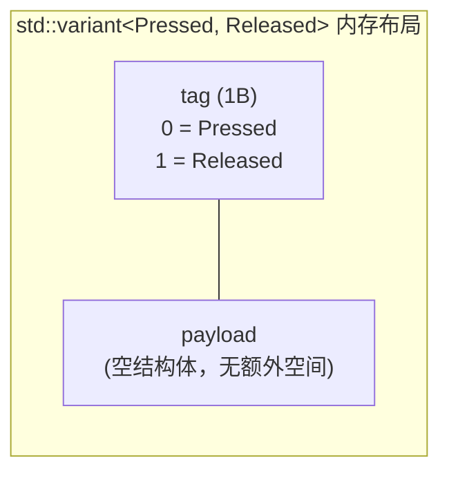

# Part 27: `std::variant` Events + `std::visit` Dispatching — Type-Safe "What Happened"

> Following the previous article: `enum class` handled type-safe configuration and state. This article introduces C++17's `std::variant` to express button events—"Pressed" and "Released" are no longer two integers, but two distinct types.

---

## How C Expresses Events

A button has only two events: Pressed and Released. C typically uses `enum` or `#define` to represent them:

```c
#define EVENT_PRESSED  1
#define EVENT_RELEASED 0

// 或者
enum ButtonEvent { Pressed = 1, Released = 0 };
```

Then, we pass this integer in the callback or return value:

```c
void handle_event(int event) {
    if (event == EVENT_PRESSED) {
        // 按下处理
    } else if (event == EVENT_RELEASED) {
        // 释放处理
    }
    // 如果传了一个 42 进来呢？编译器不会警告你
}
```

The problem is obvious: `int` can be any value. If you pass `42` in, the compiler won't make a sound. Even with an `enum`, C's `enum` is essentially just an integer, offering no type safety guarantees.

A deeper issue is that an event can only carry a single integer. If, in the future, the `Pressed` event needs to carry a timestamp, and the `Released` event needs to carry a duration, a simple integer won't suffice. You would have to add a `struct` parameter or use global variables to pass the extra data.

---

## `std::variant`: A Type-Safe Union

`std::variant`, introduced in C++17, is a type-safe union. It holds one of multiple possible types at any given moment—similar to C's `union`, but with key differences:

1. **Type Safety**: A `variant` knows exactly which type it currently holds.
2. **Compile-Time Checking**: You must handle all possible types when accessing it, otherwise the compiler issues a warning or an error.
3. **Support for Complex Types**: Unlike `union`, which cannot hold classes with constructors, `variant` can hold any type.

### Our Event Definition

```cpp
// button_event.hpp
#pragma once
#include <cstdint>
#include <variant>

namespace device {

struct Pressed {};
struct Released {};

using ButtonEvent = std::variant<Pressed, Released>;

} // namespace device
```

`Pressed` and `Released` are empty structs—they do not carry any data, serving only as type tags. `ButtonEvent` is a `std::variant` that can hold either `Pressed` or `Released` at any given time.

Why use empty structs instead of an `enum class`? There are two reasons:

**First, extensibility.** If `Pressed` needs to carry a timestamp in the future:

```cpp
struct Pressed { uint32_t timestamp; };
```

We only need to add fields to the struct, while the usage of `variant` remains completely unchanged. If we use `enum class`, carrying data requires an additional `struct` wrapper.

**Second, type dispatching.** `std::visit` can perform compile-time dispatching based on the actual type held within the `variant`—different types execute different code paths. Empty structs serve as type tags, making this dispatch mechanism very clean.

### Comparison with `union`

```cpp
// C 风格 union — 不安全
union ButtonEvent {
    int pressed;
    int released;
};
// 没有办法知道当前是 pressed 还是 released

// C++17 variant — 安全
using ButtonEvent = std::variant<Pressed, Released>;
// variant 内部记录了当前持有的类型
```

In C, a `union` does not keep track of "which member is currently active," so you must manually maintain a tag variable. If you set the tag to indicate `pressed` but actually read `released`, the result is undefined behavior. `variant` maintains this tag internally and, through `std::visit`, enforces that you correctly handle every type.

---

## std::visit: Type-Safe Dispatching

`std::visit` accepts a "visitor" (a callable) and a `variant`, invoking the corresponding overload of the visitor based on the type currently held by the `variant`.

### Generic Lambda Approach

```cpp
std::visit(
    [](auto&& e) {
        using T = std::decay_t<decltype(e)>;
        if constexpr (std::is_same_v<T, Pressed>) {
            // 处理按下
        } else if constexpr (std::is_same_v<T, Released>) {
            // 处理释放
        }
    },
    event
);
```

What does this code do? Let's break it down layer by layer:

1. `std::visit(visitor, event)` — Invokes the `visitor` based on the type held by `event`.
2. `[](auto&& e)` — A generic lambda where `auto&&` is a forwarding reference; the type of `e` is deduced from the actual type held by the `variant`.
3. `using T = std::decay_t<decltype(e)>` — Extracts the "decayed type" of `e` (removes references and `const`).
4. `if constexpr (std::is_same_v<T, Pressed>)` — Checks at compile time if `T` is `Pressed`.
5. `else if constexpr (std::is_same_v<T, Released>)` — Checks at compile time if `T` is `Released`.

### Practical Usage in main.cpp

```cpp
button.poll_events(
    [&](device::ButtonEvent event) {
        std::visit(
            [&](auto&& e) {
                using T = std::decay_t<decltype(e)>;
                if constexpr (std::is_same_v<T, device::Pressed>) {
                    led.on();
                } else {
                    led.off();
                }
            },
            event);
    },
    HAL_GetTick());
```

Here we use two layers of lambda expressions. The outer lambda is the callback argument for `poll_events()`, which is invoked whenever an event occurs. The parameter `event` is a `ButtonEvent` (that is, `std::variant<Pressed, Released>`). The inner lambda is the visitor for `std::visit`, responsible for handling the specific event types.

### std::decay_t and decltype

`decltype(e)` returns the declared type of `e`. Since `auto&&` is a forwarding reference, the actual type of `e` might be a reference type like `Pressed&&` or `const Pressed&`. `std::decay_t` strips references, `const`, and `volatile`, yielding the "bare type" `Pressed` or `Released`.

```cpp
// 如果 variant 持有 Pressed：
decltype(e) → Pressed&& （或 const Pressed&，取决于调用方式）
std::decay_t<Pressed&&> → Pressed

// 所以 T 就是 Pressed
```

### The Role of `if constexpr`

`if constexpr` is a compile-time conditional branch. When `T` is `Pressed`, the code in the `else` branch **will not be compiled**—it simply does not exist in the generated machine code. This differs from a runtime `if-else`: in a runtime `if-else`, both branches are compiled, and the CPU selects one during execution; with `if constexpr`, only the matching branch is compiled.

This means that if you write code specific to `Released` (for example, accessing a field unique to `Released`) inside the `else` block, it will not cause a compilation error when `T` is `Pressed`—because that line of code does not exist.

---

## Comparison with Virtual Functions

You might ask: Why not use virtual functions and inheritance to express polymorphic events?

```cpp
// 虚函数方案
struct ButtonEvent {
    virtual ~ButtonEvent() = default;
    virtual void handle() = 0;
};
struct Pressed : ButtonEvent { void handle() override { /* ... */ } };
```

This is a classic approach in desktop applications. However, in an embedded environment, it has several fatal issues:

1. **Virtual function table (vtable)**: Every class with virtual functions has a vtable stored in Flash. `Pressed` and `Released` each require a vtable.
2. **Dynamic allocation**: Polymorphism typically requires `new` or `std::make_unique`. We have disabled exceptions in the embedded environment, and we avoid heap allocation whenever possible.
3. **Runtime dispatch**: Virtual function calls involve an indirect jump via a vtable pointer, adding an extra memory access.

`std::variant` + `std::visit` avoids these issues:

- No vtable is needed—type information is encoded in the `variant`'s own tag.
- No heap allocation is needed—`variant` stores values directly on the stack.
- Dispatch is completed at compile time—the compiler sees `if constexpr` and generates the corresponding code directly.

In our `-fno-exceptions -fno-rtti` compilation environment, `std::variant` is a more suitable choice than virtual functions.

---

## Zero-Overhead Proof

Memory layout of `std::variant<Pressed, Released>`:

```text
sizeof(std::variant<Pressed, Released>) == max(sizeof(Pressed), sizeof(Released)) + index
```



Since `Pressed` and `Released` are both empty structs (`sizeof = 1`), the `variant` only needs a single tag byte to identify which type it currently holds. With alignment, `sizeof(ButtonEvent)` is typically two bytes.

With `std::visit` combined with `if constexpr`, the code generated by the compiler is equivalent to:

```c
if (event.tag == 0) {
    led_on();   // Pressed 分支
} else {
    led_off();  // Released 分支
}
```

One comparison, one jump. It is exactly the same as the `if-else` logic in handwritten C code. The tag check for the `variant` is simply the condition for the `if-else`—the compiler optimizes it into the simplest machine code.

---

## Looking Back

This article introduced two C++17 features to build a type-safe event system:

- **`std::variant<Pressed, Released>`** — A type-safe union replacing C-style integer event codes.
- **`std::visit` + generic lambda** — Compile-time type dispatch ensuring all event types are handled.
- **Empty structs as type tags** — Extensible, allowing for fields to be added later.
- **`std::decay_t<decltype(e)>` + `std::is_same_v`** — A toolkit combination for compile-time type checking.

Compared to the virtual function approach, `variant` + `visit` requires no vtable, no heap allocation, and no RTTI—making it a perfect fit for our embedded environment.

In the next article, we will assemble these components into a Button template class.
