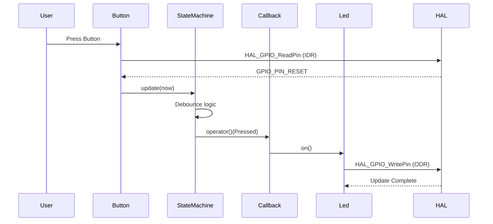

# Part 29: Constraining Callbacks with Concepts + Full Code Walkthrough

> Following the previous post: We have set up the skeleton for the Button template class. In this post, we will address the final C++ feature—using Concepts to constrain the type of the callback parameter—and then walk through the complete `Button` call chain from start to finish.

---

## The Callback Type Problem

`Button` accepts a callback function as a parameter, which is invoked whenever the button state is confirmed to have changed. The problem is: the template parameter `Callback` can be of any type—a function pointer, a lambda, a function object, or even an integer (if your code is buggy).

Without Concepts, what happens if you pass a callback with the wrong signature?

```cpp
auto btn = Button(PA0, [](int x) { /* ... */ });
```

The compiler will attempt to instantiate the `Button` code, discover that `std::optional<ButtonState>` cannot be constructed from `int` when calling the callback, and then report an error. However, the error message might look like this:

```text
error: no match for 'operator()' (operand types are 'Main::{lambda(int)#1}' and 'std::optional<ButtonState>')
note: candidate: 'void (*)(int)' <near match>
```

A few lines of template instantiation stack trace plus obscure type information. While much better than the SFINAE errors in C++98, it is still not intuitive enough.

---

## Concepts: One Line of Constraint, Clear Errors

```cpp
template <typename Callback>
  requires std::invocable<Callback, std::optional<ButtonState>>
Button(Pin pin, Callback&& callback);
```

`requires` is a Concepts constraint. It tells the compiler: an object of type `Callback` must be callable with one `std::optional<ButtonState>` argument.

If you pass a callback with the wrong signature:

```cpp
auto btn = Button(PA0, [](int x) { /* ... */ });
```

The compiler reports an error **before template instantiation**:

```text
error: cannot convert 'Main::{lambda(int)#1}' to 'std::optional<ButtonState>'
note: constraint not satisfied
```

One sentence explains it all: your callback does not satisfy the `std::invocable` constraint. No need to dig through template instantiation stacks—constraint failure directly points out the problem.

### What does `std::invocable` mean?

`std::invocable` is a concept defined in the C++20 `<concepts>` header. It checks: given an object `f` of type `F`, whether `f(args...)` is a valid call expression.

For `std::invocable<Callback, std::optional<ButtonState>>`:

- `Callback` is the lambda or function object you passed in
- `std::optional<ButtonState>` is the argument type
- The constraint requires: `callback(state)` must be a valid call

Valid callback examples:

```cpp
// Lambda by value
[](std::optional<ButtonState> state) { }

// Lambda by reference
[](const std::optional<ButtonState>& state) { }

// Function object
struct Handler {
    void operator()(std::optional<ButtonState> state);
};
```

### Concepts vs. SFINAE

Before Concepts, constraining template parameters used SFINAE (Substitution Failure Is Not An Error):

```cpp
template <typename Callback, typename = std::enable_if_t<
    std::is_invocable_v<Callback, std::optional<ButtonState>>>>
Button(Pin pin, Callback&& callback);
```

The principle of SFINAE is: if the `std::enable_if_t` condition is false, the template is silently removed from the candidate list, and the compiler looks for other matching overloads. Only if no match is found does it report a "no matching function" error—and this error is usually accompanied by dozens of lines of template instantiation stack traces.

Concepts make constraints first-class citizens of the language: the `requires` clause directly declares the constraint, the compiler directly checks the constraint, and constraint failure directly reports the constraint's name. No need to understand how SFINAE works.

---

## Is `Callback&&` an Rvalue Reference?

```cpp
template <typename Callback>
Button(Pin pin, Callback&& callback)
```

`Callback&&` looks like an rvalue reference, but it is actually a **forwarding reference**. When `Callback` is a template parameter, the meaning of `Callback&&` depends on the argument passed in:

- Passing an lvalue (like a named lambda variable): `Callback` deduces to `Callback&`, and `Callback&&` collapses to `Callback&` (lvalue reference) via reference collapsing.
- Passing an rvalue (like a temporary lambda): `Callback` deduces to `Callback`, and `Callback&&` is `Callback&&` (rvalue reference).

So `Callback&&` can accept anything—lvalue, rvalue, const, non-const. This is exactly what we want: users can pass a temporary lambda or a named function object.

Why not use `const Callback&`? Because a `const` reference cannot call non-const `operator()`. Although our lambda doesn't modify captured variables, maintaining generality is safer.

In this scenario, we didn't use `std::forward`—because the callback is only called once inside `Button`, so perfect forwarding isn't needed. If `callback` is an lvalue, we just call it; if it's an rvalue, we also just call it. The forwarding reference here serves only to "accept any callable type," not to "perfectly forward."

---

## Full Code Walkthrough

Now let's walk through the execution flow of `main.cpp` from start to finish and see what every line of code does.

```cpp
#include "button.hpp"
#include "led.hpp"

extern "C" {
#include "stm32f1xx_hal.h"
}
```

Header file inclusion. `button.hpp` indirectly includes `gpio.hpp`. `extern "C"` wraps the HAL header to ensure the C++ compiler uses C linkage rules to find HAL functions (covered in LED Tutorial Part 12).

```cpp
HAL_Init();
SystemClock_Config();
```

System initialization. Exactly the same as the LED tutorial: initialize the HAL library and configure the system clock to 64 MHz.

```cpp
Led led(PC13, GPIOC, GPIO_MODE_OUTPUT_PP);
Button btn(PA0, GPIOA, [&led](std::optional<ButtonState> state) {
    if (state) {
        switch (*state) {
            case ButtonState::Pressed: led.on(); break;
            case ButtonState::Released: led.off(); break;
        }
    }
});
```

Object construction. These two lines each do three things:

**LED Construction:**

1. `GPIOC` — `__HAL_RCC_GPIOC_CLK_ENABLE()` enables the GPIOC clock.
2. `GPIO_MODE_OUTPUT_PP` — Configures PC13 as push-pull output.
3. Object `led` is ready, providing `on()`, `off()`, and `toggle()` interfaces.

**Button Construction:**

1. `GPIOA` — `__HAL_RCC_GPIOA_CLK_ENABLE()` enables the GPIOA clock.
2. `GPIO_MODE_INPUT_PU` — Configures PA0 as pull-up input.
3. `static_assert` validates the pin number — passes at compile time.
4. Object `btn` is ready, state machine initial state is `Idle`.

```cpp
while (true) {
    btn.update(HAL_GetTick());
}
```

Main loop. Each loop iteration does one thing: calls `btn.update`.

**`HAL_GetTick()`** gets the current timestamp (in milliseconds) and passes it to the state machine for time judgment.

**The callback lambda** captures `led` by reference. When the state machine confirms a state change, it calls this lambda; the parameter `state` is `std::optional<ButtonState>`.

**The lambda body** dispatches based on the type held by `state`:

- If it is `Pressed`: calls `led.on()`
- If it is `Released` (`else` branch): calls `led.off()`

**The complete call chain:**



From the user pressing the button to the LED lighting up, the process goes: physical level change → IDR register update → `HAL_GPIO_ReadPin` read → state machine debounce confirmation → `Pressed` event trigger → callback dispatch → lambda execution → `led.on()` → ODR register update → LED on.

The entire process involves no virtual functions, no heap allocation, and no exception handling. Every layer is an inline call determined at compile time.

---

## Looking Back

This post completes the final loop of the C++ refactoring:

- **Concepts** (`requires`) constrain the callback signature, providing clear compile errors.
- **Forwarding references** (`Callback&&`) accept any callable object.
- **Full code walkthrough** covers the entire call chain from `main` to `HAL`.

So far, we have refactored all button control code using C++. The next post is the conclusion of this series—EXTI interrupt-driven button, plus a summary of common pitfalls and exercises.
