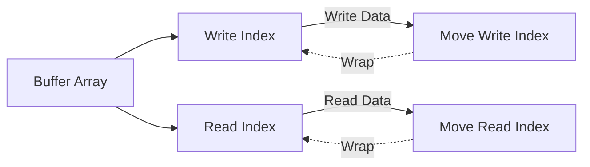

# Embedded C++ Tutorial — Circular Buffers

In the embedded world, a specific problem appears constantly: **a data source continuously generates data, a consumer processes it slowly, and we want to avoid `malloc` in between.** Thus, an ancient but timeless data structure takes the stage—the **Circular Buffer (Ring Buffer)**.

You can think of it as a warehouse with a fixed size; when it is full, we start over from the beginning. No resizing, no fragmentation, no "new failed," making it perfect for MCUs, drivers, interrupts, DMA, serial ports, audio streams, and other scenarios.

------

## Why does embedded love circular buffers so much?

In the PC world, we can freely `malloc` and `new`. But in embedded systems, these operations sound dangerous:

- Heap memory is small and prone to fragmentation.
- We cannot `malloc` within an interrupt context.
- Uncontrollable delays are undesirable in real-time systems.

The characteristics of a circular buffer are practically tailor-made for embedded systems:

- **Fixed size, determined at compile-time or initialization.**
- **O(1) enqueue / dequeue.**
- **Contiguous memory, cache-friendly.**
- **No dynamic allocation required.**
- **Simple implementation, easy to make lock-free / interrupt-safe.**

To summarize in one sentence:

> **It isn't smart, but it is reliable.**

------

## The Core Idea of a Circular Buffer (Actually quite simple)

A circular buffer is essentially:

- A fixed-size array.
- Two indices:
  - `write_idx`: The write position.
  - `read_idx`: The read position.

When an index reaches the end of the array, it **wraps around to the beginning**, like a circle.



Writing data: Move `write_idx`.
Reading data: Move `read_idx`.

There is only one question to figure out clearly:
👉 **How to distinguish between "full" and "empty"?**

------

## How to distinguish "empty" and "full"? (A classic problem)

There are three common solutions:

1. **Waste one element (Most common)**
2. Maintain an extra `count`
3. Use an extra `bool` flag

In embedded systems, **Solution 1 is the most popular**: simple, unambiguous, and logically clear. The rules are:

- Buffer size is `Capacity + 1`.
- It can actually store at most `Capacity` elements.
- Conditions:
  - Empty: `read_idx == write_idx`
  - Full: `(write_idx + 1) % Size == read_idx`

Yes, we sacrifice one slot for a lifetime of peace.

------

## A Clean C++ Circular Buffer Implementation

Below is a **no-dynamic-memory, templated, embedded-friendly** implementation.

### Basic Interface Design

```cpp
template <typename T, size_t Capacity>
class CircularBuffer {
    // Actual array size = User capacity + 1
    T buffer_[Capacity + 1];
    size_t read_idx_ = 0;
    size_t write_idx_ = 0;

public:
    bool push(const T& item);
    bool pop(T& item);
    bool empty() const;
    bool full() const;
};
```

Note a detail:
👉 **`buffer_[Capacity + 1]` actual array size = user available capacity + 1**

------

## Enqueue (push): Move forward one step

```cpp
bool push(const T& item) {
    if (full()) {
        return false;
    }

    buffer_[write_idx_] = item;
    write_idx_ = (write_idx_ + 1) % (Capacity + 1);
    return true;
}
```

There is no black magic here:

- First check if full.
- Write data.
- Move `write_idx_`.
- If at the end, wrap to the beginning.

**O(1), never slow.**

------

## Dequeue (pop): The consumer enters

```cpp
bool pop(T& item) {
    if (empty()) {
        return false;
    }

    item = buffer_[read_idx_];
    read_idx_ = (read_idx_ + 1) % (Capacity + 1);
    return true;
}
```

Similarly simple:

- Return false if empty.
- Read data.
- Move `read_idx_`.

------

## Status Check Functions

```cpp
bool empty() const {
    return read_idx_ == write_idx_;
}

bool full() const {
    return (write_idx_ + 1) % (Capacity + 1) == read_idx_;
}
```

The `full()` implementation is very common in embedded systems; it avoids complex branching and doesn't use an extra counter.

------

## A Real Embedded Use Case

### Serial Reception (ISR + Main Loop)

```cpp
CircularBuffer<uint8_t, 128> rx_buf;

// UART Interrupt Service Routine
extern "C" void USART1_IRQHandler() {
    if (USART1->ISR & USART_ISR_RXNE) {
        uint8_t data = USART1->RDR;
        rx_buf.push(data); // Non-blocking write
    }
}

// Main Loop
int main() {
    while (true) {
        uint8_t data;
        if (rx_buf.pop(data)) {
            process_data(data);
        }
        // Do other tasks...
    }
}
```

This approach has several very embedded-friendly advantages:

- The logic in the ISR is extremely short.
- No `malloc`.
- The main loop processes data slowly.
- Even if processing is a bit slow, it won't block the interrupt.

------

## A Reality Check on Thread Safety / Interrupt Safety

The implementation above is:

- **Single Producer + Single Consumer**
- One in interrupt, one in the main loop

On many MCUs, this is **naturally safe** (as long as index reads and writes are atomic).

But if you encounter one of the following situations:

- Multithreading
- Multiple producers
- SMP
- Communication between RTOS tasks

Then you need:

- Disable interrupts.
- Atomic variables.
- Or mutex / spinlock.

------

## Comparison with `std::queue` / `std::vector`

| Solution      | Dynamic Allocation | Deterministic | Embedded Friendly |
| ------------- | ------------------ | ------------- | ----------------- |
| std::vector   | Yes                | No            | ❌                 |
| std::queue    | Depends on underlying container | No            | ❌                 |
| Circular Buffer | No                | Yes           | ✅                 |
