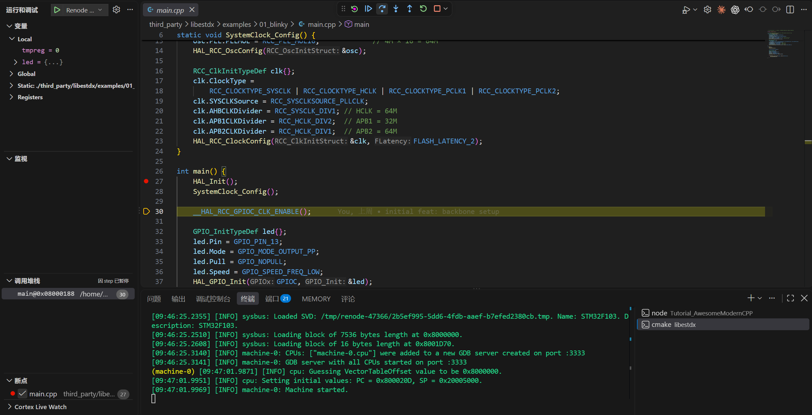

# Yo yo yo, we've still got work to do

Yes. I mean our journey isn't finished. Someone is bound to ask — hey CharlieChen114514, I followed you through configuring the STM32 HAL library dependencies, I got the code to compile, and I got it running in Renode. How is anything still left to do?

The answer is — debugging is a vital closing loop in software engineering. It sounds fancy and grand, but really it's just this: something goes wrong in the code we write. Maybe you're about to excitedly commit your code when your brain suddenly taps you on the shoulder — hey buddy, did you ever test a corner case? (In other words, some pretty edge-of-the-edge situation.) Or, worse, your tester and your boss pull you into a group chat: hey buddy, there's a bug in what you wrote, I want to see it fixed before end of day today~. Fine. Let's fix it. You could of course say we'll locate it with printf over the serial port. But here come the problems. What if the serial port itself is busy doing something else? What if, in some scenarios, there simply is no serial port, or you're not allowed to expose one? And what if what you're chasing is a timing issue — the printf you bolt on shifts the program's timing, so it's fine right now, and the next second the code blows up again. What do you do?

No sleep tonight, kids. That is exactly the topic of this chapter — debugging the program you wrote, so that after fixing the bug fast, you can go sleep like a log :).

## So what's the difference from debugging on the host?

I believe that if you come from host-side development, or have written platform-independent programs, you have debugged a program before. For example, you press the debug button in your IDE, the debugger attaches to the running program, and the program stops exactly where you told it to. That designated spot is called a breakpoint (the source of the classic dev gripe: "Seriously, what is this guy doing, does he not even know how to set a breakpoint?"). In host-side development we routinely look at problems this way and deal with them.

> To put it formally — when you debug an ordinary program on your PC and press F5 to get breakpoints, it works because the debugger (GDB and friends) and the program being debugged live on the same machine, and the operating system hands the debugger a set of control interfaces: stopping the process, reading memory — everything is within arm's reach.

But there's still a problem. We are not doing host-side development! We are deploying to our microcontroller, and it does not run on our operating system. GDB can't reach across; it needs a translator in the middle: a **GDB Server**. It listens on a TCP port and translates requests from GDB — "stop at line 373", "hand me the variable tickstart" — into operations on the target CPU.

For the Renode-simulated device, this is dead simple: one is built right in, a one-command affair<RefLink :id="1" preview="Renode official documentation, Debugging with GDB" />.

But on a real board, someone has to bring the debug server interface out and bridge the board's debug interface, so that we can debug the board with a debugger. That's the part that comes later, when we put our STM32F103C8T6 on a real dev board running our own code.


Also, since it appears some folks aren't familiar with the ELF format, briefly: an ELF is a complete dossier **with addresses (where am I?), with symbols (who is this?), and with debug info (what is it?)**, whereas the bin file we flash is a bare binary stripped down to nothing but instructions and data. GDB maps machine code back to your source using exactly those extras in the ELF. Feed it a bin and it can't even look up who `HAL_Delay` is.

## All in one go: bringing up the debug service

On the simulator side, libestdx has a target ready-made for us — I wrote it, and you're welcome to poke around and see how the custom target is done there.

```bash
cmake --build build-debug --target blinky_gdb
```

Here's how I wrote it:

```cmake
add_custom_target(blinky_gdb
    DEPENDS blinky
    COMMAND renode --console --disable-xwt
            -e "$bin=@$<TARGET_FILE:blinky>"
            -e "include @${CMAKE_SOURCE_DIR}/examples/01_blinky/renode_gdb.resc"
    WORKING_DIRECTORY ${CMAKE_SOURCE_DIR}
    USES_TERMINAL
    VERBATIM
)
```

renode_gdb.resc is something I added; truth be told it just tells Renode to bring up a gdbserver — nothing novel~

```text
using sysbus

mach create
machine LoadPlatformDescription @sim/stm32f1/bluepill.repl

$bin?=@build-debug/examples/01_blinky/blinky

sysbus LoadELF $bin

machine StartGdbServer 3333
```

Create the machine, install the bluepill's board-level registration, load the firmware — the only genuinely new face is the last line, `machine StartGdbServer 3333`: open a GDB service on the machine and wait for the PC side to connect. Keep that terminal open and don't close it: in `--console` mode Renode lives on the terminal's stdin, and if you want to stuff it into a script and run it automatically, once stdin is redirected it exits on its own after loading — the log won't show the slightest anomaly. Here's what it looks like actually running:


That line in the log, `Loading block of 7536 bytes length` — 7536 is exactly the Debug build's text. Which firmware got loaded? The byte count speaks for itself; one glance confirms we didn't grab the wrong flavor. This target has another clever touch: using a generator expression, CMake feeds renode **the ELF from the current build directory** — invoke it from build-debug and it loads the Debug firmware; from build, and it's Release. The ghost of the debugger and the simulator each holding a different ELF never gets a chance to be born.

## Hey! Hook VSCode up to it

Now, I remember a group-chat heavyweight who went to town debugging against the raw GDB plugin — a genuine hardcase. As for me, I have exactly zero interest in doing heavy lifting in a TUI or a CLI (even though, when it comes to actually typing commands, I'm strictly CLI-first). We have VSCode, so let's spare the good folks the torture.

Install the Cortex-Debug extension for VSCode (by marus25 — the most famous one is this one, anyway) and we're all set.

> A quick aside while I'm here — the smart completions and friendly diagnostics you feel inside an IDE are provided courtesy of an LSP. The one I currently consider fairly popular, and that looks quite pleasant to use, is clangd; we'll pick up how we set it up later, when we work on leveling up the development experience.

```json
{
    "version": "0.2.0",
    "configurations": [
        {
            "name": "Renode blinky (external GDB server)",
            "type": "cortex-debug",
            "request": "launch",
            "servertype": "external",
            "gdbTarget": "localhost:3333",
            "executable": "${workspaceFolder}/third_party/libestdx/build-debug/examples/01_blinky/blinky",
            "gdbPath": "/usr/sbin/arm-none-eabi-gdb",
            "runToEntryPoint": "main"
        }
    ]
}
```

Let's get to know three key fields: `servertype: "external"` tells Cortex-Debug "I manage the GDB Server myself, don't start another one"; `gdbTarget` is that Renode port 3333; `executable` points to the Debug-built ELF — why it must be that one gets its own dedicated section on build flavors below.

Then you press F5. The first time you connect, the DEBUG CONSOLE will probably spew two odd lines:

```text
Program stopped, probably due to a reset and/or halt issued by debugger
⚠️ warning: Invalid state, unable to determine sp alias, assuming msp.
```

Neither is a disease. The first line is Cortex-Debug's catchphrase — whenever the target stops, it guesses that very sentence; the second is gdb's old quirk when, at a function entry, it can't tell the main stack from the process stack — bare-metal main runs on msp (the main stack), so the guess is correct. What you'll actually see looks like this:



The program stops at main's entry, and from there the panels rule the roost: click next to a line number to set a breakpoint, F5 to continue, F10 to step over, F11 to step into, Shift+F11 to step out; hover the mouse to see a variable; and the call-stack panel on the left lists who called whom, crystal clear. The wiring underneath it all never changed — the debugger is connected to Renode's GDB service; the only difference is that you don't have to type a single command. I recorded the whole flow as one uninterrupted take, from starting the service to pressing the buttons:

<video controls muted src="./debug-session.mp4" width="640"></video>

## Stopped at the breakpoint, free to inspect the scene

Let's warm up with that `HAL_Delay(500)` line in the main loop: set a breakpoint next to the call in `main.cpp`, hit it with F5, then press F11 to step into. The editor jumps into the HAL source, and the variables panel immediately lays its cards on the table — the parameter `Delay=500`: the 500 you wrote in `main.cpp` has traveled all the way to here; and in the call-stack panel, `main () at main.cpp:41`, the call site pinned down to the line. When a program hangs, these two panels are often the first crime scene: which function it's stuck in, and who called it — all at a glance.

Where does the variables panel get its confidence? Let's dissect the first few real instructions of `HAL_Delay` in this Debug firmware (genuine `arm-none-eabi-objdump` output):

```text
080004cc <HAL_Delay>:
 80004cc:  b580       push {r7, lr}
 80004ce:  b084       sub  sp, #16
 80004d0:  af00       add  r7, sp, #0
 80004d2:  6078       str  r0, [r7, #4]             ← the Delay parameter goes into a stack slot
 80004d4:  f7ff ffb4  bl   8000440 <HAL_GetTick>    ← the breakpoint lands on this one (the first instruction of line 373)
 80004d8:  60b8       str  r0, [r7, #8]             ← tickstart goes into another slot
```

Take them one by one: `push` puts the frame pointer r7 and the **return address lr** onto the stack together — the debugger's ability to list "who called into here" relies on that return address sitting in the stack; `sub sp, #16` carves out 16 bytes of stack slots for local variables; `str r0, [r7, #4]` places the parameter Delay into its own slot — which is why, the moment the breakpoint stops, the panel can report `Delay=500`: that's not a guess, it's read from that stack slot. The breakpoint itself lands on line 373's first instruction, the `bl`: the stack frame is already built, the parameters are already in place, and the instant you stop you're looking at a complete scene. This also explains, from another angle, why the Debug build's 7536 is two thousand bytes larger than Release's 5500: every variable gets its own slot, and every read and write is a real memory-access instruction — no optimization means exactly this kind of footprint.

Press F10 to step past line 373, and there's a detail worth savoring: when we first stopped, `tickstart` showed 2; after stepping past the line it becomes 0. The 2 was never its value — it's stale data left over in the stack slot. The breakpoint stopped on that line, and **that line hadn't executed yet**; only after F10 does the return value 0 of `bl HAL_GetTick` get written into the slot. Why 0? `HAL_GetTick()` reads the global tick `uwTick` (an old friend we cross-checked back in article 02), and from reset to the main loop's first delay, simulated time hasn't yet passed 1 millisecond — SysTick hasn't fired even once. Add `uwTick` to the Watch panel: every F5 that hits the breakpoint shows it climbing 0→501→1001 — between two `HAL_Delay(500)` calls, exactly five hundred ticks of waiting, plus the small overhead of the main loop toggling the GPIO. `HAL_Delay`'s working mechanism (dead-waiting for `uwTick` to catch up to the start plus 500) takes shape right there in the live variables, without reading a single line of assembly. Here's that timeline drawn out for you:


## Hold on! What I'm debugging and what actually runs are not the same binary at all

Right — notice that what we debug with is build-debug, because our line breakpoints rely on the `-g` debug info in the ELF (that is, the bidirectional line-number-to-address mapping that addr2line uses): the variable table, the line table. The debugger's ability to match "this stack slot is that variable" and "this instruction corresponds to that source line" depends entirely on them. Our everyday default build, though, goes out as Release: full optimization, no `-g`. The ELF still has function symbols, so breakpoints on functions still work; variables and line numbers simply aren't there. Connect the default build's firmware and line breakpoints find nowhere to land while the variables panel sits empty — that's not an operational mistake; that ELF simply never recorded any of it.

So when debugging we use the Debug flavor, in its own separate build directory, and the two never disturb each other:

```bash
cmake -B build-debug -G Ninja -DCMAKE_TOOLCHAIN_FILE=cmake/arch/stm32f103c8t6.cmake -DCMAKE_BUILD_TYPE=Debug
cmake --build build-debug --target blinky
```

The real output at the tail of the build:

```text
   text    data     bss     dec     hex filename
   7536      12       4    7552    1d80 .../build-debug/examples/01_blinky/blinky
```

7536 versus 5500: the extra two thousand bytes are the price of leaving optimization off.

Note that the two flavors lay out function addresses differently: in the Release build, `HAL_Delay` sits at `0x08000350`; in the Debug build, at `0x080004cc`. **When discussing addresses or pasting output, always state which build it is first** — read the two ELFs mixed together and every phenomenon you see is lying to you. Those ultra-long file paths you see in breakpoints are also `-g`'s doing: the absolute paths on the machine at compile time get recorded verbatim into the ELF, so everyone sees their own machine's layout — nothing to be surprised about.

When to wear which face can now be stated clearly:

| | Default (Release) | Debug |
|---|---|---|
| text | 5500 | 7536 |
| Call stack | function names, no line numbers | function names + file:line |
| Variables | none | parameters and locals, all present |
| Use it for | everyday builds, size comparisons | bug hunting, single-stepping, inspecting the scene |

> A note from me: after you catch the bug, remember to switch back to the default flavor before putting anything on the scale — quoting the Debug build's 7536 in a debate about zero overhead is digging a pit for yourself.

## Breakpoints have a physics lesson of their own

Breakpoints are not unlimited. In a real Cortex-M3 chip, the hardware in charge of breakpoints is called the FPB (Flash Patch and Breakpoint), specified as six instruction comparators plus two literal comparators<RefLink :id="2" preview="ARM Cortex-M3 TRM (DDI 0337), FPB" />.

When machine code is fetched out of Flash, each of the six comparators watches one address; a matching fetch address triggers a halt. That's the mechanism behind our suspend-and-debug! Nothing strange about it.

On the board we're playing with now, Flash breakpoints max out at six — set a seventh and it either errors out or silently stops working. The other kind is called a software breakpoint, whose principle is to rewrite the instruction at the breakpoint spot, on the spot, into a BKPT halt instruction — but Flash must be erased before it can be written, so code running from Flash can't be modified, and our firmware on real hardware goes entirely through the hardware channel. As a habit, delete breakpoints when you're done with them; don't hoard.

And Renode? I set eight breakpoints in one breath, from `HAL_Delay` to `HAL_RCC_ClockConfig`, and all eight took effect — not one was refused. That's because Renode is functional-level simulation: breakpoints are implemented by the simulator itself, they don't occupy the FPB hardware, and the simulator simply doesn't have this limit. Call it a convenience the simulator grants you, but don't build the habit here: carry the muscle memory of hoarding eight breakpoints onto real hardware, and the seventh starts playing deaf and dumb — and then you'd file it under voodoo. Put the two side by side and look:


## Troubleshooting quick reference

Can't connect to 3333? First check whether Renode is alive: are those two lines "GDB server ... started on port :3333" in the log? Then check who's holding the port — `ss -tln | grep 3333` tells you at a glance. Breakpoints set but never hit? First verify that the ELF the debugger loaded and the one running in the machine are the same: the article-04 ghost of "still running someone else's firmware" exists inside the debugger too. Then consider the build flavor:

In a Release build, a function may have been kneaded into its caller by the optimizer, leaving a line breakpoint with nowhere to land — switch to the Debug flavor and try again. As for F5 doing absolutely nothing while the debugger says things like "Cannot execute this command while the target running": the simulation never started in the first place. This Renode (1.17) auto-starts execution as soon as GDB connects, but `machine StartGdbServer` takes an autostart parameter — I explicitly bent it to `false` and tried it: on connect, the CPU sat stopped at `0x00000000`, and you'd wait for a breakpoint until your next life. If you run into that, typing `start` in the Renode terminal works instantly — at worst that one command is typed for nothing, but skip it and you're gambling on version defaults.

With this, our observation kit is complete: sampling-based checks look at results, breakpoint debugging looks at the process, and the two build flavors switch as needed. Once this simulator flow is second nature, the real-board procedure is structurally identical — only the GDB Server slot gets replaced by OpenOCD plus a debug probe. Friends with a board, see you in article 06; friends without one lose nothing either — next, in article 07, we'll teach the editor to understand this cross-compiled code, with go-to-definition and completion, the full package.

<ReferenceCard title="References">
  <ReferenceItem
    :id="1"
    author="Renode Project"
    title="Debugging with GDB"
    :year="2026"
    url="https://renode.readthedocs.io/en/latest/debugging/gdb.html"
    chapter="StartGdbServer and the autostartEmulation option"
  />
  <ReferenceItem
    :id="2"
    author="ARM"
    title="Cortex-M3 Technical Reference Manual — About the Flash Patch and Breakpoint Unit"
    :year="2026"
    url="https://developer.arm.com/documentation/ddi0337/h/debug/about-the-flash-patch-and-breakpoint-unit--fpb-"
    chapter="FPB: six instruction comparators and two literal comparators"
  />
</ReferenceCard>
