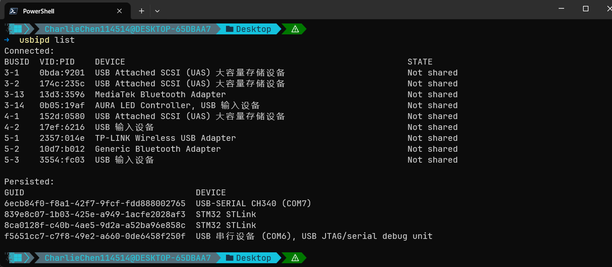

# The board has arrived — plug it in first

Alright! Now we're ready to move onto a real board! Here, friends without a board, please stop and don't waste your time. Of course, if you'd like to see how writing code under a real WSL and flashing it onto your own board works, you're welcome to stay!

The reason I set this article aside on its own is simple. When you write code under WSL, you plug the ST-Link into a USB port, eagerly type `lsusb` in WSL2 — and the output is completely empty. Never mind the ST-Link, you can't even see a keyboard or mouse. The problem isn't your board, and it isn't your procedure — it's WSL2's architecture itself.

## Plugged in, but invisible

WSL2 feels like a Linux program installed inside Windows, but it's actually a full Hyper-V virtual machine: its own kernel, its own memory management, its own device list. On a PC, USB devices are managed by the host controller; every time we plug in a device, the operating system loads a driver and takes it over. The USB controller inside the WSL2 virtual machine, however, is virtualized — it can't reach the physical controller — so physically plugged-in devices are completely invisible to WSL2. On the Windows side, the ST-Link sits there just fine in Device Manager; on the Linux side, nobody knows a thing.

The tool we need is called usbipd-win, an open-source project that Microsoft's own WSL documentation treats as the officially recommended solution<RefLink :id="1" preview="Microsoft Learn: Connect USB devices" />. It implements the USB/IP protocol: the Windows end acts as the server and shares the device out; the WSL2 end acts as the client and mounts the shared device onto its own virtual USB bus. The device is still plugged into the Windows machine — it's just that Linux can touch it now too.

## The Windows side: from Not shared to Attached

Open a PowerShell **with administrator privileges**, because the bind step we'll do later requires an administrator; the attach step after it doesn't — we'll get to that when we come to it.

When installing, just use the official full command<RefLink :id="1" preview="Microsoft Learn: Install the USBIPD-WIN project" />:

```powershell
winget install --interactive --exact dorssel.usbipd-win
usbipd list
```

This is a screenshot I happened to grab back when I was cheerfully writing this tutorial — take a look:



At that point I hadn't plugged in the ST-Link yet, so as you can see there's no ST-Link here. No worries — I have one now, haha!


We read this list in two sections. The Connected section is every USB device currently plugged in, and we care about two columns: BUSID is the device's position on the bus (`6-1` on my machine, for example), and STATE is the passthrough state. The entire Windows-side procedure amounts to pushing the STATE of the ST-Link row from `Not shared` to `Attached`. Find the ST-Link row (a VID starting with `0483` is ST's vendor ID) and remember the BUSID.

The Persisted section is a different thing: the list of devices with automatic re-attach hooked up. It takes the stage when we get to attach. bind tells Windows "this device is allowed to be shared from now on" — **doing it once is enough**, and it survives a reboot of your machine:

```powershell
usbipd bind --busid 6-1
```

Run `usbipd list` again, and that row's STATE becomes `Shared`. attach is what actually connects the device into WSL2, and **by default it must be redone after every re-plug and every reboot**:

```powershell
usbipd attach --wsl --busid 6-1
```

Then our PowerShell will spit out this stuff~

```text
usbipd: info: Using WSL distribution 'LinuxWSL' to attach; the device will be available in all WSL 2 distributions.
usbipd: info: Loading vhci_hcd module.
usbipd: info: Detected networking mode 'mirrored'.
usbipd: info: Using IP address 127.0.0.1 to reach the host.
```

At this point the device is under WSL2's control: in `usbipd list` its STATE becomes `Attached`, while on the Windows side it's no longer visible. The networking mode reported on the third line varies from machine to machine (mirrored or NAT) and doesn't affect the procedure. If redoing this every time annoys you, add `--auto-attach` to attach: it becomes a long-running loop that automatically re-attaches the device as soon as it reconnects. The devices listed in the Persisted section of `usbipd list` are exactly these — on my machine, two ST-Links and one CH340 serial adapter are in there, all from having enabled auto-attach before.

Two more small facts, to save you from hitting walls. Since usbipd-win 5.0, the attach step no longer requires administrator privileges — an ordinary PowerShell works<RefLink :id="1" preview="Microsoft Learn: You no longer need to use an elevated administrator prompt" />. And keep a WSL terminal open before running attach: the device is being connected into the WSL2 virtual machine, and the machine has to be alive for anything to connect — from a cold start, attach will report that it can't connect. Day-to-day listing commands can be issued from inside WSL too, with the same full-path `powershell.exe -Command "usbipd list"`; only bind, which needs administrator rights, can't.

## The Linux side: recognizing it in lsusb

Back in the WSL2 terminal, verify:

```bash
lsusb | grep -Ei '0483:3748|st-?link'
```

Seeing output like this means it went through (a real capture from my machine):

```text
# I typed lsusb and pressed Enter
Bus 001 Device 001: ID 1d6b:0002 Linux Foundation 2.0 root hub
Bus 001 Device 003: ID 0483:3748 STMicroelectronics ST-LINK/V2
Bus 002 Device 001: ID 1d6b:0003 Linux Foundation 3.0 root hub
```

`0483:3748` is the ST-Link V2, `374b` is the V2-1 — OpenOCD knows them all. We wrote the grep pattern as `st-?link` rather than `stlink` because lsusb's display includes the hyphen. See `Bus 001 Device 003`? That's not just a number: Linux manages every USB device as a file, and this device's file lives at `/dev/bus/usb/001/003`. OpenOCD opens it to operate the device — you'll use that in a moment.

> P.S. Quite possibly, you'll find you don't have permission to operate the USB device on the Linux end — openocd will tell you it has no permission to operate the ST-Link. In that case, kindly run `sudo chmod 666 /dev/bus/usb/001/003` — and as for which device this actually is, follow the actual USB port you see on your machine.

## Flashing: a one-command affair

In libestdx the targets are all configured for us. Go into the `third_party/libestdx` directory:

```bash
cmake --build build --target flash
```

Eh? Is our flashing really this simple? Not quite — underneath it's an openocd command I wrapped up myself<RefLink :id="2" preview="OpenOCD User's Guide: Flash Commands" />. Here, please:

```bash
openocd -f interface/stlink.cfg -f target/stm32f1x.cfg \
        -c "program build/examples/01_blinky/blinky.bin verify reset exit 0x08000000"
```

The two `-f` flags each take care of one end: `interface/stlink.cfg` says which probe to use, and `target/stm32f1x.cfg` says which chip to flash. Switch to a DAP-Link probe and you swap the first one; switch to an F4 chip and you swap the second. When troubleshooting a config that doesn't match the hardware, the root cause is mostly in these two files. The string inside `-c` is the flashing proper: `program` flashes the file, `verify` checks it once after flashing, `reset` resets the chip so it runs the new program from the top, `exit` quits openocd when it's done, and the trailing `0x08000000` is the Flash base address — a raw `.bin` file carries no address information, so where to flash it is ours to specify<RefLink :id="2" preview="OpenOCD User's Guide: program syntax and offset" />.

```text
[1/1] Flashing blinky.bin via OpenOCD (ST-Link)
Open On-Chip Debugger 0.12.0-01004-g9ea7f3d64-dirty (2026-08-27-22:55)
Licensed under GNU GPL v2
For bug reports, read
        http://openocd.org/doc/doxygen/bugs.html
Info : auto-selecting first available session transport "hla_swd". To override use 'transport select <transport>'.
Info : The selected transport took over low-level target control. The results might differ compared to plain JTAG/SWD
Info : clock speed 1000 kHz
Info : STLINK V2J46S7 (API v2) VID:PID 0483:3748
Info : Target voltage: 3.221508
Info : [stm32f1x.cpu] Cortex-M3 r1p1 processor detected
Info : [stm32f1x.cpu] target has 6 breakpoints, 4 watchpoints
Info : starting gdb server for stm32f1x.cpu on 3333
Info : Listening on port 3333 for gdb connections
[stm32f1x.cpu] halted due to debug-request, current mode: Thread
xPSR: 0x01000000 pc: 0x080004e0 msp: 0x20005000
** Programming Started **
Info : device id = 0x20036410
Info : flash size = 64 KiB
Warn : Adding extra erase range, 0x08001588 .. 0x080017ff
** Programming Finished **
** Verify Started **
** Verified OK **
** Resetting Target **
shutdown command invoked
```

After flashing, look up at the board: the LED on PC13 blinks at a 500-millisecond rhythm — it's the very blinky that ran for so long in Renode, now blinking on your desk. The acceptance criterion is the same set as in the observatory lesson: don't guess the rhythm by eye; take your phone, use slow motion to count the period, and if it matches the firmware's `HAL_Delay(500)`, it passes.

## Troubleshooting quick reference

`Error: open failed`: openocd didn't reach the device. I actually unplugged the ST-Link and ran it once — the complete error looks like this:

```text
[1/1] Flashing blinky.bin via OpenOCD (ST-Link)
FAILED: [code=1] examples/01_blinky/CMakeFiles/flash /home/charliechen/Tutorial_AwesomeModernCPP/third_party/libestdx/build/examples/01_blinky/CMakeFiles/flash
cd /home/charliechen/Tutorial_AwesomeModernCPP/third_party/libestdx/build/examples/01_blinky && openocd -f interface/stlink.cfg -f target/stm32f1x.cfg -c program\ /home/charliechen/Tutorial_AwesomeModernCPP/third_party/libestdx/build/examples/01_blinky/blinky.bin\ verify\ reset\ exit\ 0x08000000
Open On-Chip Debugger 0.12.0-01004-g9ea7f3d64-dirty (2026-08-27-22:55)
Licensed under GNU GPL v2
For bug reports, read
        http://openocd.org/doc/doxygen/bugs.html
Info : auto-selecting first available session transport "hla_swd". To override use 'transport select <transport>'.
Info : The selected transport took over low-level target control. The results might differ compared to plain JTAG/SWD
Info : clock speed 1000 kHz
Error: open failed

** OpenOCD init failed **
shutdown command invoked

ninja: build stopped: subcommand failed.
```

Oops, my ninja blew up! Don't panic — check in this order!

1. First run `lsusb | grep -Ei '0483:3748|st-?link'` to confirm whether the device was passed through; if not, go back to the Windows side and attach again.
2. If openocd tells you `LIBUSB_ERROR_ACCESS`: it's a permissions problem — fall back on that `chmod 666` from the permissions note.
3. `Error: unable to find a matching device`: the config doesn't match the hardware — the probe is actually a J-Link while we used stlink.cfg; or the chip is an F4 while we used stm32f1x.cfg.

Flashed but the LED doesn't blink: first confirm BOOT0 is on the low-level side, then confirm you're looking at PC13 (the onboard LED is on port C pin 13, not just any LED), and finally confirm that the firmware you flashed already blinked in Renode to begin with. Firmware that doesn't blink even in the simulator definitely won't blink on a real board — that's exactly why we always run the simulator first.

## Native Linux friends: this part is faster

On native distributions like Ubuntu, the kernel manages USB directly: skip usbipd entirely, and only permissions are left to deal with — plus the openocd package ships that `60-openocd.rules`, so the rule takes effect as soon as you replug a device once, and ordinary users can use it directly. The extra passthrough leg we walk under WSL2 is one more formality imposed by the virtualization boundary; native Linux has no such boundary, and therefore no such formality.

## With this, all three observation tools are in place

Our starter environment's observation capability now has three layers: sampling criteria to see results, breakpoint debugging to see the process, and real-board flashing to stamp the seal. The first two layers were completed in the debugging lesson; today's article fills in this one. The simulator is a functional-level simulation — when it says "behavior correct", the firmware's instruction-level logic really is fine; but for code that will ultimately run in the physical world, blinking an LED once and checking the serial output once on a real board before release — that seal can only be stamped by real hardware. From here on, for every stop's example, libestdx provides both sim and flash targets: one for verification, one for the stamp. Run both sides against each other; when the numbers match, you can finally feel at ease.

That settles the real-board side. In the next article we turn back to tidy up the editor: teaching it to understand this cross-compiled code — navigation, completion, find-definition, the whole chain. How smooth writing firmware feels starts changing from the next article on.

<ReferenceCard title="References">
  <ReferenceItem
    :id="1"
    author="Microsoft"
    title="Connect USB devices (WSL documentation)"
    :year="2026"
    url="https://learn.microsoft.com/en-us/windows/wsl/connect-usb"
    chapter="usbipd-win installation and the attach workflow"
  />
  <ReferenceItem
    :id="2"
    author="OpenOCD"
    title="OpenOCD User's Guide — Flash Commands"
    :year="2026"
    url="https://openocd.org/doc/html/Flash-Commands.html"
    chapter="program syntax (verify/reset/exit/offset) and stm32f1x mass_erase"
  />
</ReferenceCard>
