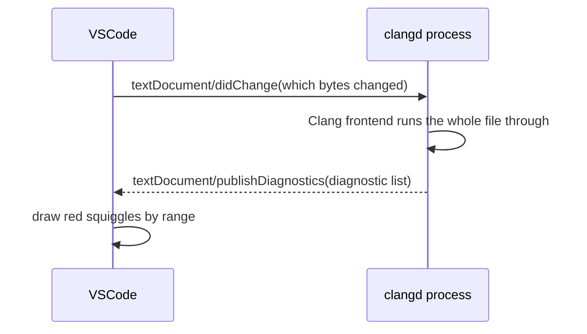

# Hey, Hey — You Were Having Quite a Lot of Fun Just Now, Weren't You?

After all that fiddling, we open our project and — uh-oh — why is the screen still covered in red lines? The answer: clangd (if you've read our beginner tutorial) hasn't found the correct compile commands.

Not quite following? Let me take it slow.

## The editor doesn't understand C++; the one that understands code is another process

VSCode, truth be told, is a big idiot — it has no idea what you're writing. None! It really doesn't... Its built-in syntax highlighting colors by text rules: it recognizes the word `int`, but which names are types, or which file `HAL_GPIO_WritePin` is defined in — it knows nothing about any of that. The one that actually understands code is another process: clangd. The VSCode extension we installed back in the getting-started volume's [article on installing clangd](/getting-started/05-vscode-clangd) does only two things: it launches the clangd program and relays messages between the editor and it; the analysis itself all happens inside the clangd process.

One editor process, one language-analysis process — how do the two cooperate? Through an agreed-upon message format: LSP (Language Server Protocol)<RefLink :id="2" preview="microsoft.github.io: LSP Specification — base protocol and message definitions" />. Microsoft proposed it in 2016 alongside VS Code, to cure an old ailment: there are dozens of editors and dozens of languages, and if every editor has to write a separate "understands-the-code" plugin for every language, the workload multiplies on both sides; once the protocol was settled, each language implements one "language server", each editor implements one "client", the two converse with the same set of messages, and the workload becomes additive instead. Every mainstream editor speaks this protocol today. In our setup, the client is VSCode plus its clangd extension, and the language server is clangd itself (from LLVM, the most widely used one on the C++ side).

String the whole chain together: every time you change a piece of code, here is what happens behind the scenes:



So what does clangd use to judge right from wrong? One sentence from the official site says it most plainly: "clangd runs the clang compiler on your code as you type"<RefLink :id="3" preview="clangd.llvm.org: Features — errors and warnings" />.

Every time you make an edit, it runs the current file through the Clang compiler frontend — full lexical, syntactic, and semantic analysis, skipping only the final machine-code generation step. The untouched prefix (usually a run of includes) has a dedicated cache called the preamble, which is why editing character by character doesn't lag. Judging right from wrong follows the compiler's rules, and that requires clangd, when parsing any file, to know how that file is compiled: which paths headers are searched in, where `-std` is set, what architecture is targeted. This information is registered file by file in `compile_commands.json`; for files that can't be found in the registry, clangd falls back to a set of fallback flags and soldiers on. Completion, go-to-definition, find-references, hover, rename, clang-format formatting, clang-tidy static checks, plus the background index that builds the whole project (cross-file navigation depends on it; the cache lives in `~/.cache/clangd/index`) — all of it rides on this parsing.

Looking back, the opening sentence now reads clearly: clangd didn't get the correct compile flags. On the host platform the flags come free; with our cross toolchain, clangd must keep working while missing information, so it starts guessing. What it guesses, and how the guessing goes wrong, unfolds in the next section.

## Where the red lines come from: clangd is guessing

Why does clangd on the host platform just work out of the box? Look at the compile command registered in `compile_commands.json` over there: `g++ -std=c++20 -I...`. clangd can get to work with that alone; it has built-in knowledge of g++'s header layout (the `/usr/include/c++/14`, `/usr/include` arrangement), nothing needs configuring.

Switch to our project, and the compile command becomes `/usr/bin/arm-none-eabi-g++ --target=arm-none-eabi -mcpu=cortex-m3 -mthumb -I...`. clangd is built on clang, and it **doesn't know where this GNU cross-compiler internally installs its headers**: the ARM C++ standard library headers, newlib's C headers, CMSIS's `core_cm3.h` — it has no idea where any of them live. So what does it do? It guesses. Tested for real on this machine with clangd 22: open the header `include/libestdx/gpio/gpio_base.hpp` (it includes `<concepts>` and `<cstdint>`), and in the cc1 log the search path for C++ headers is this line:

```text
internal-isystem /usr/bin/../arm-none-eabi/include/c++/v1
```

`c++/v1` is libc++'s directory layout (how the LLVM family arranges its C++ standard library). Let's take a look in the real directory:

```bash
$ ls /usr/arm-none-eabi/include/c++/
16.2.0
```

The directory holds only `16.2.0` — there is no `v1`. clangd goes looking for `<concepts>` down a fake path that doesn't exist, and naturally doesn't find it. Let the parse run to the end, and the real errors look like this:

```text
E ... [pp_file_not_found] Line 2: 'concepts' file not found
E ... [undeclared_var_use] Line 12: use of undeclared identifier 'std'
E ... [requires_expr_expected_type_constraint] Line 12: expected concept name with optional arguments
...
```

Once `<concepts>` is lost, the chain reaction arrives in full: `std` undeclared, requires expressions reported as "not a concept" — the sea of red on your screen traces back to this one unfindable header. The root of the illness: clangd never asks the actual cross-compiler "where are your headers installed"; it takes its own family's libc++ layout and applies it to a GCC toolchain. GCC's libstdc++ lives in `c++/16.2.0` (version-numbered), LLVM's libc++ lives in `c++/v1`; the two families arrange directories differently, and once the layout is guessed wrong, no amount of fake paths will assemble a real `<cstdint>`.

## Ask the compiler itself: query-driver

clangd has a mechanism that cures exactly this: `--query-driver`. The principle is direct: instead of guessing, clangd actually executes the compiler you've allow-listed, running `arm-none-eabi-g++ -E -xc++ -v /dev/null` and letting the compiler dump its internal header search paths to stderr. We ran it for real on this machine (16.2.0), and it spat out these six lines:

```text
#include <...> search starts here:
 /usr/lib/gcc/arm-none-eabi/16.2.0/../../../../arm-none-eabi/include/c++/16.2.0
 /usr/lib/gcc/arm-none-eabi/16.2.0/../../../../arm-none-eabi/include/c++/16.2.0/arm-none-eabi
 /usr/lib/gcc/arm-none-eabi/16.2.0/../../../../arm-none-eabi/include/c++/16.2.0/backward
 /usr/lib/gcc/arm-none-eabi/16.2.0/include
 /usr/lib/gcc/arm-none-eabi/16.2.0/include-fixed
 /usr/lib/gcc/arm-none-eabi/16.2.0/../../../../arm-none-eabi/include
End of search list.
```

Every one of these paths actually exists: `c++/16.2.0` holds the libstdc++ headers, and the final `arm-none-eabi/include` holds newlib's C headers. Now let's check the same `gpio_base.hpp` again, this time with the allow-list flag:

```bash
clangd --check=include/libestdx/gpio/gpio_base.hpp --query-driver='**/arm-none-eabi-g*'
```

```text
I ... All checks completed, 0 errors
```

One flag apart, and the red turns into 0 errors. Did it really ask? Look at the cc1 log for this parse — the C++ header lines have become:

```text
-isystem .../arm-none-eabi/include/c++/16.2.0
-isystem .../arm-none-eabi/include/c++/16.2.0/arm-none-eabi
-isystem .../arm-none-eabi/include/c++/16.2.0/backward
```

Compare them against the six-line search list the compiler itself spat out above: a one-to-one match. clangd now has the real paths, `<concepts>` is found, and the whole cascade of follow-on errors vanishes. This is a single-variable comparison: same compiler, same file — the only addition is "clangd is allowed to ask the compiler".

Then why is something this handy off by default? Because `--query-driver` amounts to letting clangd execute an external binary. Imagine you clone a project of unknown provenance whose config says the "compiler" lives at `/tmp/evil.sh` — clangd would run that thing the moment it starts. That must not be allowed to happen silently. So clangd refuses by default: you must explicitly allow-list which compilers may be executed. That's security design, not a bug.

## Three configs, each minding its own stretch

The repo already has this wired up; let's read our way through them one by one. If you're porting this into your own project, carry all three over together.

The first lives in `third_party/libestdx/.vscode/settings.json`:

```json
{
    // For the arm-none-eabi target, clangd guesses a libc++ layout (c++/v1) by
    // default, but our local toolchain actually uses the libstdc++ layout
    // (c++/<version>); without asking the real compiler, standard headers like
    // <cstdint> can't be found. --query-driver allow-lists the arm gcc/g++
    // (installed under /usr/sbin) so clangd can probe the real system header
    // paths. It is a process flag, so it can't go into .clangd — this file is
    // its only home.
    "clangd.arguments": [
        "--query-driver=**/arm-none-eabi-g*"
    ]
}
```

After the equals sign comes a comma-separated list of paths, and globs are supported. The single glob `**/arm-none-eabi-g*` allow-lists gcc, g++, and all their variants at once, covering both C and C++ projects, and sparing you the question of whether the toolchain is installed under `/usr/bin` or `/usr/sbin` (Ubuntu's apt puts it in `/usr/bin`; this Arch machine of ours has it in `/usr/sbin`; different distros, different locations). You can hardcode it too: run `which arm-none-eabi-g++` and paste the output in. Two cautions: this must be a path or a path glob — writing a bare command name like `--query-driver=arm-none-eabi-g++` has no effect, because clangd doesn't go searching PATH; and it is a **process flag**, which can only live in the startup arguments the IDE passes to clangd — the `.clangd` config file can't accept it, which is why this file is destined to live in `.vscode`.

At the library root there's another one, `.clangd`, which handles a different problem: orphan headers. `compile_commands.json` only registers compile commands for `.cpp` files; open a `.hpp` on its own when no translation unit includes it, and clangd finds no entry, retreats to a fallback configuration, and parses with that — the fallback default standard stops at gnu++17, so C++20 syntax like the concepts in our library gets flagged in error. This config injects flags in per-extension blocks:

```yaml
---
If:
  PathMatch: [.*\.hpp, .*\.cpp]
CompileFlags:
  Add: [-std=c++23]
---
If:
  PathMatch: .*\.h
CompileFlags:
  Add: [-std=c2x]
```

`.hpp`/`.cpp` get parsed as C++23, matching `CMAKE_CXX_STANDARD 23` in CMake; `.h` gets C23 (`c2x` was its code name before finalization), because the HAL headers live in a C context and would refuse C++ flags<RefLink :id="1" preview="clangd.llvm.org: CONFIG file — CompileFlags" />. For files already in `compile_commands.json`, what's injected matches CMake, so the override is harmless; the ones being rescued are the orphans. Our A/B experiment just now used `gpio_base.hpp` as the target, and it went down exactly this path — the header has no CDB entry and leans entirely on this fallback.

The last one is in CMake. Look at the end of `cmake/arch/stm32f103c8t6.cmake` — the comment states the purpose outright:

```cmake
# For clangd / the IDE
set(CMAKE_EXPORT_COMPILE_COMMANDS ON)
```

It makes CMake generate `compile_commands.json` in the build directory, registering every compile command in full — flags and macros alike. The `-mcpu=cortex-m3 -mthumb -DSTM32F103xB -I...` that clangd read in our earlier A/B experiment all comes from here. Without this file, however correct the other two are, clangd is left staring at a pile of `-I`s, groping blindly.

## Acceptance check

We've already tested the command line: two commands, one red and one green, reproducible from the repo root:

```bash
clangd --check=include/libestdx/gpio/gpio_base.hpp                            # reproduces the wall of errors
clangd --check=include/libestdx/gpio/gpio_base.hpp --query-driver='**/arm-none-eabi-g*'   # 0 errors
```

Then over in VSCode: reload the window or run `clangd: Restart language server` from the Command Palette, and open `examples/01_blinky/main.cpp` — the red squiggles should be gone; hold Ctrl and click `HAL_GPIO_WritePin` and you jump into the declaration in the HAL headers; type `HAL_` and a string of completions pops up. At this point the editor understands this cross-compiled code, on par with the host-project experience. If you still need to set up clangd installation itself on the host side, the getting-started volume's [article on installing clangd](/getting-started/05-vscode-clangd) is the prerequisite; to go one level deeper on cross-compilation from an engineering angle, continue with [vol7's cross-compilation and CMake](/vol7-engineering/01-cross-compilation-and-cmake).

## The getting-started station, complete

And with this, the seven pieces of the getting-started station are all here: a myth-buster, a short history, Renode observation, the working environment, the first firmware, debugging, real hardware, and now this piece on the editor. Looking back, this environment can already compile, simulate, debug, run on a real board — and it's pleasant to write in. The next stop is LEDs: first we'll descend beneath the floor tiles to light one lamp with bare registers, to see clearly what the official library is doing on our behalf; then we'll climb back above the HAL and relight that same lamp in modern C++.

<ReferenceCard title="References">
  <ReferenceItem
    :id="1"
    author="LLVM"
    title="clangd documentation — CONFIG file"
    :year="2026"
    url="https://clangd.llvm.org/config"
    chapter="CompileFlags.Add, If.PathMatch conditional blocks"
  />
  <ReferenceItem
    :id="2"
    author="Microsoft et al."
    title="Language Server Protocol Specification (3.18)"
    :year="2024"
    url="https://microsoft.github.io/language-server-protocol/"
    chapter="Base protocol: Content-Length framing, JSON-RPC 2.0; the publishDiagnostics notification"
  />
  <ReferenceItem
    :id="3"
    author="LLVM"
    title="clangd documentation — Features"
    :year="2026"
    url="https://clangd.llvm.org/features"
    chapter="errors and warnings:clangd runs the clang compiler on your code as you type"
  />
</ReferenceCard>
