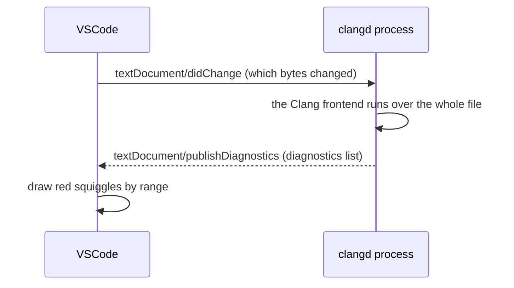

# Hey, hey — you were having quite a lot of fun just now

We've fiddled our way this far, we open our project and look — uh-oh — why is the sky still full of red lines? The answer: clangd (if you've read our beginner tutorial) hasn't found the correct compile commands.

Not quite following? Let me take it slow.

## The editor doesn't understand C++; the one that understands code is another process

VSCode, truth be told, is a big idiot — it has no idea what you're writing. None! It really doesn't... Its built-in syntax highlighting colors by text rules: it recognizes the word `int`, but which names are types, or which file `HAL_GPIO_WritePin` is defined in — it knows nothing about any of that. The one that actually understands code is another process: clangd. The VSCode extension we installed back in the getting-started volume's [article on installing clangd](/getting-started/05-vscode-clangd) does only two things: it launches the clangd program and relays messages between the editor and it; the analysis itself all happens inside the clangd process.

One editor process, one language-analysis process — how do the two cooperate? Through an agreed-upon message format: LSP (Language Server Protocol)<RefLink :id="2" preview="microsoft.github.io: LSP Specification — base protocol and message definitions" />. Microsoft proposed it in 2016 alongside VS Code, to cure an old ailment: there are dozens of editors and dozens of languages, and if every editor has to write a separate "understands-the-code" plugin for every single language, the workload multiplies on both sides; once the protocol was settled, each language implements one "language server", each editor implements one "client", the two converse over the same set of messages, and the workload becomes additive instead. Today every mainstream editor speaks this protocol. In our setup, the client is VSCode plus its clangd extension, and the language server is clangd itself (from LLVM, the most widely used one on the C++ side).

String the whole chain together: every time you change a piece of code, what happens behind the scenes is:


```mermaid
sequenceDiagram
    participant V as VSCode
    participant C as clangd process
    V->>C: textDocument/didChange (which bytes changed)
    C->>C: the Clang frontend runs over the whole file
    C-->>V: textDocument/publishDiagnostics (diagnostics list)
    V->>V: draw red squiggles by range
```

So what does clangd use to judge right from wrong? One sentence from the official site says it most plainly: "clangd runs the clang compiler on your code as you type"<RefLink :id="3" preview="clangd.llvm.org: Features — errors and warnings" />.

Every change you make, it runs the current file through the Clang compiler frontend: lexing, parsing, semantic analysis — all of it, with only the final machine-code generation skipped; the untouched prefix (usually a run of includes) has a dedicated cache named the preamble, so editing character by character doesn't stall. Judging right from wrong follows the compiler's rules, which means that when clangd parses each file it must know the parameters this file gets compiled with: which paths headers are searched in, where `-std` is set, what architecture is being targeted. These parameters are registered, one entry per file, in `compile_commands.json`; for files that turn up nothing in the registry, clangd retreats to a set of fallback parameters and makes do. Completion, go-to-definition, find-references, hover, rename, clang-format formatting, clang-tidy static checks, plus the background index that builds the whole project once (cross-file navigation depends on it, cached in `~/.cache/clangd/index`) — all of it rides on top of this parsing.

Looking back, that opening sentence now reads cleanly: clangd never got the correct compile parameters. On the host platform the parameters come free; with our cross toolchain, clangd must keep working while starved of information, so it starts guessing. What it guesses, and how the guessing goes wrong, the next section reveals.

## Where the red lines come from: clangd is guessing

Why does clangd on the host platform work out of the box? Look at the compile commands registered over there in `compile_commands.json`: `g++ -std=c++20 -I...` — clangd can work with that straight away, since it knows g++'s header layout (`/usr/include/c++/14`, `/usr/include`, that set) built in; nothing needs configuring.

Switch to our project and the compile command becomes `/usr/bin/arm-none-eabi-g++ --target=arm-none-eabi -mcpu=cortex-m3 -mthumb -I...`. clangd is built on clang, and it **does not know where this GNU cross-compiler installs its headers internally**: the ARM C++ standard library headers, newlib's C headers, CMSIS's `core_cm3.h` — it doesn't know where a single one of them lives. So what does it do? It guesses. Tested for real on this machine with clangd 22: open the header `include/libestdx/gpio/gpio_base.hpp` (it includes `<concepts>` and `<cstdint>`), and in the cc1 log the search path for C++ headers is this line:

```text
internal-isystem /usr/bin/../arm-none-eabi/include/c++/v1
```

`c++/v1` is libc++'s directory layout (how the LLVM family arranges its C++ standard library). Let's go take a look at the real directory:

```bash
$ ls /usr/arm-none-eabi/include/c++/
16.2.0
```

The directory holds only `16.2.0`, no `v1`. clangd goes looking for `<concepts>` along a nonexistent fake path — naturally, it finds nothing. Run that parse to the end, and the real errors look like this:

```text
E ... [pp_file_not_found] Line 2: 'concepts' file not found
E ... [undeclared_var_use] Line 12: use of undeclared identifier 'std'
E ... [requires_expr_expected_type_constraint] Line 12: expected concept name with optional arguments
...
```

Once `<concepts>` is lost, the chain reaction arrives in full: `std` undeclared, the requires expression reported as "not a concept" — and that sea of red on your screen traces back to this one unfindable header. The root of the disease is that clangd never goes to ask the actual cross-compiler "where are your headers installed"; it takes its own family's libc++ layout and stretches it over a GCC toolchain. GCC's libstdc++ sits in `c++/16.2.0` (arranged by version), LLVM's libc++ sits in `c++/v1` — the two families lay out directories differently, and once the layout is guessed wrong, no pile of fake paths can piece together a real `<cstdint>`.

## Ask the compiler itself: query-driver

clangd has a mechanism that treats exactly this: `--query-driver`. The principle is dead simple: clangd stops guessing and instead actually executes the compiler you've allowed, running `arm-none-eabi-g++ -E -xc++ -v /dev/null` and having the compiler spit its internal header search paths onto stderr. Run it for real on this machine (16.2.0), and it spits these six lines:

```text
#include <...> search starts here:
 /usr/lib/gcc/arm-none-eabi/16.2.0/../../../../arm-none-eabi/include/c++/16.2.0
 /usr/lib/gcc/arm-none-eabi/16.2.0/../../../../arm-none-eabi/include/c++/16.2.0/arm-none-eabi
 /usr/lib/gcc/arm-none-eabi/16.2.0/../../../../arm-none-eabi/include/c++/16.2.0/backward
 /usr/lib/gcc/arm-none-eabi/16.2.0/include
 /usr/lib/gcc/arm-none-eabi/16.2.0/include-fixed
 /usr/lib/gcc/arm-none-eabi/16.2.0/../../../../arm-none-eabi/include
End of search list.
```

These paths all really exist: `c++/16.2.0` is the libstdc++ headers, and the last one, `arm-none-eabi/include`, is newlib's C headers. Now let's check the same `gpio_base.hpp` once more, this time with the allow flag:

```bash
clangd --check=include/libestdx/gpio/gpio_base.hpp --query-driver='**/arm-none-eabi-g*'
```

```text
I ... All checks completed, 0 errors
```

One flag's difference, and the red turns into 0 errors. Did it really go ask? Look at this parse's cc1 log — the C++ header lines have become:

```text
-isystem .../arm-none-eabi/include/c++/16.2.0
-isystem .../arm-none-eabi/include/c++/16.2.0/arm-none-eabi
-isystem .../arm-none-eabi/include/c++/16.2.0/backward
```

Compare them against the six-line search list the compiler itself spat out above — they match one to one. clangd got the real paths, `<concepts>` was found, and the whole cascade of errors behind it vanished. This is a single-variable comparison: same compiler, same file, with only one thing added — "clangd is allowed to ask the compiler".

Then why is something this handy off by default? Because `--query-driver` amounts to letting clangd execute an external binary. Picture yourself cloning a project of unknown provenance whose config claims the "compiler" lives at `/tmp/evil.sh` — the moment clangd starts up, it runs the thing. That must not be allowed to happen silently. So clangd refuses by default: which compilers may be executed must be explicitly allowed by you. This is security design, not a bug.

## Three config files, each minding its own stretch

The repo already has this set up; let's read the files one by one. If you're porting this into your own project, carry all three over together.

The first sits in `third_party/libestdx/.vscode/settings.json`:

```json
{
    // For the arm-none-eabi target clangd guesses a libc++ layout (c++/v1) by
    // default; this machine's toolchain actually uses the libstdc++ layout
    // (c++/<version>), and without asking the real compiler, standard headers
    // like <cstdint> can't be found. --query-driver allows the arm gcc/g++
    // (installed in /usr/sbin), letting clangd probe the real system header
    // paths. It's a process flag, it can't go into .clangd — this is its only home.
    "clangd.arguments": [
        "--query-driver=**/arm-none-eabi-g*"
    ]
}
```

After the equals sign comes a comma-separated list of paths, and globs are supported. The single glob `**/arm-none-eabi-g*` allows gcc, g++, and their variants all at once — it covers C projects and C++ projects alike, and spares you caring whether the toolchain lives in `/usr/bin` or `/usr/sbin` (Ubuntu's apt installs under `/usr/bin`; our Arch machine here has it in `/usr/sbin` — different distros, different spots). Hardcoding works too: run `which arm-none-eabi-g++` and paste the output in. Two cautions: this must be a path or a glob of paths — writing a bare command name like `--query-driver=arm-none-eabi-g++` has no effect, since clangd doesn't go searching PATH; and note that it is a **process flag**, so it can only live in the startup arguments the IDE hands to clangd — the `.clangd` config file can't take it, which is why this file has to sit in `.vscode`.

At the library root there's another file, `.clangd`, which handles a different matter: orphan headers. `compile_commands.json` registers compile commands only for `.cpp` files; when you open a `.hpp` on its own and no translation unit includes it, clangd finds no entry, retreats to a fallback config for parsing — and the fallback's default standard stops at gnu++17, so C++20 syntax like the concepts in our library gets falsely flagged. This config injects flags in blocks, by file extension:

```yaml
---
If:
  PathMatch: [.*\.hpp, .*\.cpp]
CompileFlags:
  Add: [-std=c++23]
---
If:
  PathMatch: .*\.h
CompileFlags:
  Add: [-std=c2x]
```

`.hpp`/`.cpp` get parsed as C++23, the same value as CMake's `CMAKE_CXX_STANDARD 23`; `.h` gets C23 (`c2x` was its codename before finalization), because the HAL headers live in a C context and won't accept C++ flags<RefLink :id="1" preview="clangd.llvm.org: CONFIG file — CompileFlags" />. For files already in `compile_commands.json`, the injected value matches CMake's, so the override is harmless; the ones being rescued are the orphans. Our A/B experiment just now used `gpio_base.hpp` as its target, and this is exactly the path it took — the header has no CDB entry and leans entirely on this fallback.

The last one lives in CMake. Look at the end of `cmake/arch/stm32f103c8t6.cmake` — the comment states its purpose outright:

```cmake
# for clangd / the IDE
set(CMAKE_EXPORT_COMPILE_COMMANDS ON)
```

It makes CMake generate `compile_commands.json` in the build directory, registering every compile command in full, flags and macros included; the `-mcpu=cortex-m3 -mthumb -DSTM32F103xB -I...` that clangd read in our earlier A/B experiment all comes from here. Without this file, no matter how correctly the first two are configured, clangd is left groping blindly at a pile of `-I`s.

## Acceptance

We've already tested the command line — two commands, one red and one green — and you can reproduce both from the repo root:

```bash
clangd --check=include/libestdx/gpio/gpio_base.hpp                            # reproduce the screenful of errors
clangd --check=include/libestdx/gpio/gpio_base.hpp --query-driver='**/arm-none-eabi-g*'   # 0 errors
```

Then over in VSCode, reopen the window or run `clangd: Restart language server` from the Command Palette, and open `examples/01_blinky/main.cpp`: the red squiggles should be gone; Ctrl-click `HAL_GPIO_WritePin` and you jump into the declaration in the HAL headers; type `HAL_` and a string of completions pops up. At this point the editor understands this cross-compiled codebase, on par with the host-project experience. If you still want to cover installing clangd itself on the host side, the getting-started volume's [article on installing clangd](/getting-started/05-vscode-clangd) is the prerequisite; to go one level deeper on cross-compilation from an engineering standpoint, continue with [vol7's cross-compilation and CMake](/vol7-engineering/01-cross-compilation-and-cmake).

## The getting-started stop is complete

And with that, the getting-started stop's seven articles are assembled: one busting myths, one short history, the Renode observatory, the working environment, the first firmware, debugging, going onto a real dev board, and now this editor piece. Looking back, this environment can already compile, simulate, debug, run on a real board — and it's pleasant to write in. The next stop is LED: first we descend under the floor tiles to light a lamp with bare registers, to see clearly what the official library is doing on our behalf, then we come back up above the HAL and relight that same lamp in modern C++.

<ReferenceCard title="References">
  <ReferenceItem
    :id="1"
    author="LLVM"
    title="clangd documentation — CONFIG file"
    :year="2026"
    url="https://clangd.llvm.org/config"
    chapter="CompileFlags.Add, If.PathMatch conditional blocks"
  />
  <ReferenceItem
    :id="2"
    author="Microsoft et al."
    title="Language Server Protocol Specification (3.18)"
    :year="2024"
    url="https://microsoft.github.io/language-server-protocol/"
    chapter="Base protocol: Content-Length framing, JSON-RPC 2.0; the publishDiagnostics notification"
  />
  <ReferenceItem
    :id="3"
    author="LLVM"
    title="clangd documentation — Features"
    :year="2026"
    url="https://clangd.llvm.org/features"
    chapter="errors and warnings: clangd runs the clang compiler on your code as you type"
  />
</ReferenceCard>
