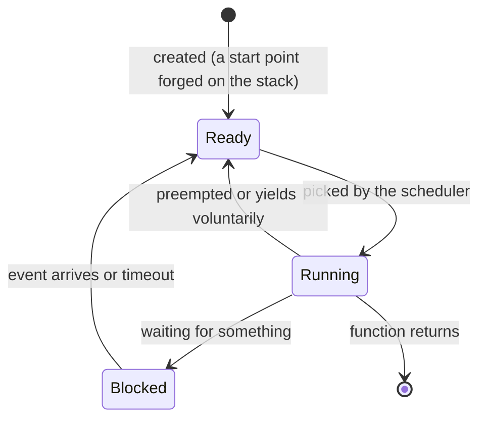

# From Ten Thousand Scattered Chunks of Business Code to a Project an RTOS Ties Together — Why Our Extremely Complex Multi-Service Projects Need an RTOS

Folks, when we write an ordinary embedded project, it can never be as simple as just blinking a few LEDs. These projects very likely carry complicated logic: a high-precision, timer-debounced button-detection scheme (say, polling every 20 ms); a UART debug log enabled in debug mode (bytes land in a ring buffer and someone has to drain them — they must not be blocked or lost); or business code that reads a sensor every 100 ms, hands the data across tasks to the UI thread, and onto a lit OLED... Back before the RTOS was a thing, we wrote all of it inside one `int main()`, and then stuffed it into a `while (true)`.

And then, as the code kept growing, the smile faded —

```cpp
int main() {
    uart1_init();
    uint32_t last_sample = 0;
    while (true) {
        oled_refresh();                          // Blocking screen refresh, 50ms you can't dodge
        if (tick - last_sample >= 100) {         // Sensor: read once every 100ms
            sensor_sample();
            last_sample = tick;
        }
        button_poll();                           // Button debounce, tracks its own time internally
        cli_process(uart_try_read());            // Command parsing, spins idle when there are no bytes
        // Hundreds more lines below; I forget which non-RTOS project I saw this in — all I can say is I was deeply shaken
    }
}
```

Everyone knows `button_poll` is a button-polling callback (as for how exactly to write one, kindly fire up your brain and think), which makes it a most textbook synchronous operation — and the most textbook synchronous operations keep the CPU busy-waiting.

> Oh, and things like coroutines look synchronous but are asynchronous in essence — so an operation isn't synchronous just because it's written and shaped like one. What you need to check is whether the current logical task line has given up the CPU and retired to the background. Your author has actually met people who got confused right here, hence this explicit note.

Here's the problem: if we so much as slip one time-consuming synchronous operation into the middle, the loop is ruined — say I stuff a `badCode()` into the loop that does who-knows-what and delays you by 200 ms; then every detection shifts back by 200 ms in turn. For scenarios chasing real-time behavior, folks, that is a devastation-class hit. And this foreground/background model is exactly that fragile — there is nothing you can do but watch as any one feature slowing down punishes all the other features in the loop equally: their worst-case response time is the time of one full pass through the loop. Not a single line of code is written wrong; the structure itself is like this.

That's exactly what a `foreground/background system` means. The interrupts here are the foreground: events get handled as they arrive; the `main` loop is the background, where all the slow jobs queue up and take turns being polled. The structure you used on the F103 line is precisely this one. While the system is small it's simple and direct; the structural problems above only show up once the system grows.

## So, What Do We Do

Many embedded scenarios chase real-time behavior, but sadly, this approach guarantees exactly nothing about response time. We already did the math above: the longest blocking stretch in the loop decides the worst-case response of every other piece of logic. Break the OLED refresh into finer steps? Sure — but as soon as the next time-consuming operation moves in, the worst-case response gets pushed right back up. It degrades monotonically as the feature count grows, and no mechanism constrains it.

Priorities? Also absent. Your system surely needs an order of handling, yet the sequential, meandering while loop treats every background task as genuinely equal. The code that handles an out-of-range alarm and the code that refreshes an animation stand in the same queue; who goes first is decided purely by the order things are written inside the `while` — urgency gets no say. When something actually goes wrong, all you can really do is watch the code saunter around in the button-listening poll instead of running the alarm logic.

That's exactly why I was already crying my eyes out

> You might ask: don't interrupts have priorities? They do — but an ISR dare not linger; heavy work has to be handed back to the background, and the moment it rejoins the queue, everyone is equal again. There is simply no curing this at the root. Say what you will, at the end of the day it's the endless conveyor of polling code that did us in.

The most troublesome part is synchronization. Data shared between interrupts and the loop — a ring buffer's read/write pointers, the tick count, assorted flag bits — has to be protected either by disabling interrupts or by carefully designing the access order. Disable too long and UART bytes and system ticks get lost; disable too briefly and races stay in the code, ready to fire at some uncertain moment. On the F103 line we already hand-processed one small patch of this for the ring buffer, and that was single-peripheral scale; once peripherals multiply, every shared spot needs the same treatment again, and not one of them can be wrong. The embedded shit-mountain code this author has personally watched collapse (yes, my own) collapsed precisely because a new timer was added and the business logic shattered the state machine inside.

## Handwritten State Machines — Arguably the Simplest Way to Cope

Let's not paint the foreground/background system as a mistake. For a small system with two or three slow jobs and no real-time requirements, it is exactly the right shape. Even with one or two genuinely time-consuming operations, you needn't reach for an RTOS — the debounce state machine is the ready-made approach: split the 50 ms blocking wait into “what do I do now, and what do I pick up next time”, let each job in the loop run only a small step before returning, and the responsiveness comes back.

Think one layer deeper about handwritten state machines and you'll notice they're manually simulating a cooperative scheduler: each state machine is a stackless “task”, and the main loop is polling and scheduling them. This scheme is entirely adequate for small and medium systems — plenty of products ship it their whole life. After all, we can't expect a smaller chip to shoulder a bigger job; that's when you have to sculpt in hardware, and this author calls the people who do true old masters (respect.png)

But then why do RTOSes still exist — are state machines not good? The moment you ask that, it stops being good. State-machine programming has always been maddening: every time a new node is added, if the decomposition isn't clean, the whole thing becomes flat-out unmaintainable! That is to say, when we need to do more things — time to wait for, bytes to wait for, the bus to wait until idle, events from several devices to wait on in combination — every kind of waiting must be written into the state machine's states, the state count climbs combinatorially, and one change drags in three others. Go ahead and edit it, kid; get it done before sundown and I'll at least give you a like — a born Mount Shit Forger.

Enough — I quit! Let's sit down and think: the problem is that we've blended the abstract notion of “scheduling” into the business code, with no decoupling to any degree. For a mix of a dozen-plus tasks, the state-machine abstraction above is an inelegant abstraction. So how do we elegantly write (Mount) code (Shit)?

The answer — extract the “waiting” out of every state machine and hand it to a dedicated module for unified management. That module is the scheduler; with the scheduler at the core, plus tasks, synchronization, time services, and the bottom half of interrupts — that is a most basic RTOS.

There, give yourself a round of applause — you've just invented the simplest OS.

## An RTOS Hands Waiting to the Kernel

So don't be scared of the RTOS. At its birth the RTOS considered just one thing — quickly decoupling, for our damned tasks, the scheduling from the work itself. It's as if we were back in the lovely desktop-programming era: the OS underneath does the scheduling for you, and you just work and nap, or tell the CPU — hey buddy, I'm off to nap, be a dear and hand my CPU time to the other guys, they're starving for it.

But what's the price? That we must now face head-on what got decoupled — scheduling and waiting themselves. We have to learn the desktop world's threads: each has its own stack, its own saved CPU context registers. To put it with less fluff: the context left behind by our work — the half-used tools, the scaffolding, the drawings, the PCB soldered halfway — big brother, please put it away safe; next time you come, pick up right where you left off. That's all it means.

“Put it away safe, pick it up next time” — let's follow that sentence one step further: why is a task not running on the CPU? For no more than two reasons — the CPU was handed to another task, its context safely stored, ready to resume at any moment; or it is itself waiting for something, and until that something arrives, resuming is impossible. Add the one currently running, and at any instant every task sits in one of three states, converting back and forth:



That label in the diagram, “created (a start point forged on the stack)”, deserves an early word from us: a new task has never run before, so someone has to forge, in its stack, a scene that looks like “interrupted by an interrupt right now” — only then can the first switch treat it as a “resumption”. Why written that way? Heh, that's a secret — wait patiently for its unveiling~.

Didn't we talk about response time earlier? Yes — that worst-case response we kept muttering about in the foreground/background section: tied to the full pass of the loop, every added feature making everything a notch slower, and we could do nothing about it at the time. Now that scheduling is handed to the kernel and priority decides who gets the CPU on and off, this old question deserves re-asking: with an RTOS in place, what decides the worst-case response?

The order-of-magnitude difference in response time lies right here. In a foreground/background system, the worst-case response of urgent logic is decided by one full pass of the loop; with priority preemption, it is decided by “the longest critical section plus one switch”. Set that against a loop on the order of 50 ms, one glance — good grief, four orders of magnitude apart.

Why does this happen? The execution time of a single instruction hasn't changed, has it? Heh — the answer is that we heavily optimized the CPU allocation rules! The moment a high-priority task becomes ready, the low-priority task abdicates on the spot: congratulations! You finally no longer have to watch, teeth gritted, the damned button polling blocking the alarm logic your boss told you to write (fireworks set off by hand)

And interrupts? Still foreground, really — that thing responds at the hardware level. The moment an interrupt arrives, the interrupt-handling hardware smacks the CPU into the interrupt context and points at its nose — kid, hardware work has come in, you'd best process it at lightspeed, there's a queue out there! So it stays foreground, no way around it. But the ISR handler now does just one thing — quickly stuffs the response over (alright, if you're in an interview or introducing this concept to serious colleagues, please use the term posting an event, “Post An Event”) and immediately returns itself.

Look! The desktop-development friends jump right up — folks, we know this one: at the hardware level you've changed a task from synchronous processing to asynchronous processing! Yes. We now split interrupt handling into two clearer halves, top and bottom, whereas before we had to handle it all ourselves. That's the top half: responding to an interrupt (telling the chip — me, the CPU, read and noted, now scram and keep receiving interrupts), and the bottom half: following up on the interrupt. Linux has a similar mechanism, but this is an RTOS; friends who know Linux's interrupt handling (the softirq crowd), please take a seat and hold your horses.

## Why C++23? Are You Writing OOP, Good Sir?

No — C++ is a generic-programming language, not an OOP language. The C++ features we use here focus more on generic concepts than on an abstract base class. Everybody, please do keep this in mind. If I drift off course later in the text, give me a kick.

The reason I don't pick **C++'s OOP paradigm** is that its low overhead depends heavily on the compiler's optimization tricks. We could very well write `struct CortexM3System : public ISystem` and then implement all of its abstract interfaces. But clearly, I don't want to pay a single cent, in any scenario, toward compiler settings — including the base-class space sitting at its head. **If it's known, pay not one cent — ZerOS wants to try doing exactly this. (This is also why your author, as far as his abilities allow, piles up a whole heap of static_asserts to verify that objects are trivial)**

> You know this: embedded work despises uncertainty. So don't use it. Even though I know that once our compiler's optimizations get cranked up, **the vtable can totally be blasted away for you**, we can't count on every compiler being like that. Leaving the problem with yourself rather than with the people who use your project — that's what I've always striven to do.

Digressed — back on track. The chip we run on may be quite cramped, say the STM32F103C8T6: your author's memory isn't great and his doc-lookup skills are worse — 20KB RAM, 64KB Flash; I don't think I'm wrong. Not a lot for us to play with.

> Spoiler: happily, our later flash-LED program comes in at 3 KB in size — such is the charm of modern C++.

So, we say we want a freestanding environment: no heap, no RTTI, no exceptions — all three actively banned in ZerOS. In the next article you'll see the ban written into the linker script: whoever pulls in heap `new` or exceptions, the linker errors out and blocks it right there.

Deep breath: C++23 over C++20, 17, 14, or 11 — I have my reasons.

concepts arrived in C++20, and your author waited until support matured in 23 before choosing them. concepts (C++20) turn interface constraints into a compiler-checkable form: write the scheduler's requirements on the porting layer as a concept, and if the port implementation is missing one function, the `static_assert` fails on the spot — interface documentation goes from comments to something the compiler personally enforces. Not for one minute do I want to watch, at runtime, the serial port coyly tell me — “sorreee, this won't do, you passed the wrong thing”. My verdict: get lost. I want clangd waving red underlines from the get-go!

Another truly decisive one — `std::expected` (C++23) puts errors into return values: in a world with no exceptions to throw, “either a result or an error code” becomes part of the function's return type; pair it with `[[nodiscard]]` and code that ignores errors won't compile. The first station's memory pool uses it throughout.

> Grumbling aside: your author misremembered earlier and actually claimed std::expected was C++20 — and sure enough got roasted as never having written code. Overtime ruins people; keep the internet out of your life.

Possibly the last one — all our global objects are `constinit` across the board: in place at compile time, no initialization-order problems, and no heap allocation lurking behind them.

What? So there's not a drop of C? Not quite — as I've said: “money that's uncertain, that you don't know whether you must pay — then pay not one cent”. So the code for switching, enqueueing, and waking is plain static C style, with cycles you can count. Hand it to any compiler: the instructions it prints out for you to count are all deterministic, and mapping them to the consumed CPU cycles is exact. That's the better way. (Though when I'm rushing and losing my temper, it's still Runnable First.)

## Catch Your Breath, Take a Break

Alright folks, take a breather! From the next station on, the wild ideas your author had that Friday begin — we build our ZerOS with our own hands, and get an RTOS that belongs to you alone lighting up on the board aaaaahhhh — the board, not the chip, aaaaahhhh.
