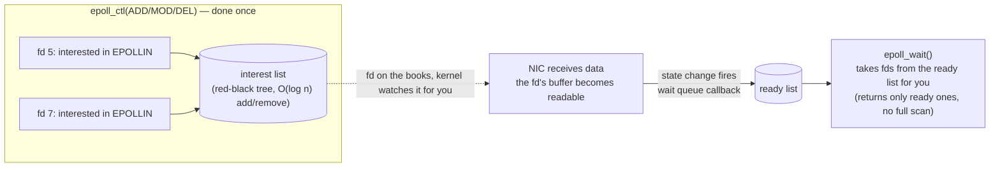

# epoll: Linux I/O multiplexing — from poll's bottleneck to the interest list and ready list

In the previous piece we ran an echo server on the "spawn a thread for each incoming connection" model, and measured 2000 idle connections pushing virtual memory to 24GB — each thread defaults to an 8MB stack, so 10k connections means 80GB of virtual address space, and on top of that, most of those threads spend their time **blocked on `read`, idly waiting for data** — pure waste. The conclusion is clear: you can't map the heavy entity "thread" one-to-one onto "a connection that may sit idle for a long time".

The right direction is **I/O multiplexing**: let **one thread watch many fds at once**, and handle whichever fd has data ready to read. On Linux, the tool for the job is `epoll`. In this piece we take it apart completely: where it actually differs from its predecessors `poll`/`select` (why poll can't survive C10K), what it looks like inside the kernel (interest list + ready list), and the **ET vs LT** switch that has tripped up countless people — we'll run it for real and let you watch "read only once" in ET mode drop 87712 bytes.

On this machine with GCC 16.1.1, all the code compiles and runs under `-std=c++23`; every terminal output pasted below came from a real run.

## First, why poll can't hold up: the O(n) fatal flaw

`select` (1983) and `poll` (1997) are epoll's predecessors, and the idea is identical: you hand a pile of fds to the kernel, ask "which of these are readable?", and the kernel scans through them and tells you. Their fatal weakness is that **every call has to re-pass the entire fd set, the kernel then has to scan all of them in O(n), and after the return, user space has to walk them yet again in O(n) to find which few are actually ready**. By this point I bet you're starting to laugh — what redundancy.

Taking poll as the example, the pseudocode looks like this:

```cpp
std::vector<pollfd> fds;                 // every fd you care about; 10k connections means 10k entries
for (;;) {
    int n = ::poll(fds.data(), fds.size(), -1);   // pass all 10k fds into the kernel
    for (int i = 0; i < fds.size(); ++i) {        // ★O(n) walk to find the ready ones
        if (fds[i].revents & POLLIN) handle(fds[i].fd);
    }
}
```

The problem sits in two places: **① every call must copy the full fd set into the kernel** (10k `pollfd`s at 8 bytes each, a copy of 80k elements); **② the readiness information comes back "mashed into the array", so you have to do your own O(n) walk**. Once connections pass 10k, these two steps alone eat noticeable CPU on every loop — and **the more connections, the slower it gets** (the n in O(n) keeps growing).

`select` is worse: it uses an `fd_set` bitmap plus a hard `FD_SETSIZE` cap (1024 by default). `poll` dropped the bitmap in favor of an array, losing the 1024 cap, but the O(n) nature didn't change.

epoll's revolution: it **doesn't re-pass fds on every call**. Instead, "which fds I care about" gets **registered** into the kernel up front, and the kernel maintains it for you; when an fd becomes ready, the kernel **hands you just the ready fds, directly** (a ready list) — what you receive is "which ones are ready", no full scan required. However many connections there are, as long as few are ready, the cost stays small — that is the root of how it survives C10K.

## epoll's kernel model: interest list + ready list

Inside the kernel, epoll maintains **two data structures** (the key to understanding all of its behavior):

- **Interest list**: all the fds you've registered — "declared interest in" — via `epoll_ctl(ADD)`. The kernel stores it in a **red-black tree**, so adding or removing an fd is O(log n) — registered once, on the books for good, never re-passed on every call.
- **Ready list**: the linked list of fds that currently "have events". What `epoll_wait` does is **pull** ready fds out of this list and hand them to you.

So how does an fd travel from the "interest list" into the "ready list"? Through the kernel's **wait queue** mechanism: for each registered fd, the kernel hangs a callback on its underlying file object; when the NIC receives data into that fd's receive buffer (a state change), the callback fires and the kernel **stuffs that fd into the ready list**. `epoll_wait` wakes up, finds the ready list non-empty, and copies those fds out to user space.



The three APIs line up with these three jobs:

```cpp
int ep = ::epoll_create1(0);                 // create an epoll instance (kernel allocates the interest list + ready list)

epoll_event ev{}; ev.events = EPOLLIN; ev.data.fd = fd;
::epoll_ctl(ep, EPOLL_CTL_ADD, fd, &ev);     // add the fd to the interest list, declaring interest in EPOLLIN

std::array<epoll_event, 128> evs;
int n = ::epoll_wait(ep, evs.data(), evs.size(), -1);   // fetch the ready ones (blocking wait)
```

Contrast with poll: every round, poll passes all fds into the kernel to be scanned; epoll **registers once and stays on the books**, and `epoll_wait` takes only the ready ones — **cost proportional to the number of ready fds, independent of the total number of fds**. That is the arithmetic reason epoll holds up under C10K.

## LT vs ET: the switch that trips up countless people

When `epoll_ctl` registers an fd, the `events` field holds not just event types like `EPOLLIN` (readable) and `EPOLLOUT` (writable) — it also contains a switch that decides the **notification style**: `EPOLLET`. Set it and you get **ET (edge-triggered)**; leave it off and you get the default **LT (level-triggered)**. The difference between these two modes is the easiest place to step on a rake in epoll, and the part most worth explaining thoroughly.

### Behavioral difference (the phenomenon first)

- **LT (default)**: as long as the fd **is still in the "readable" state** (there is still unread data in the receive buffer), every `epoll_wait` reports that fd to you. Didn't finish reading? It will notify you again next round. **Easy to use, hard to get wrong, but potentially chatty with notifications.**
- **ET (`EPOLLET`)**: it notifies you **once**, only on the **edge where the fd turns from "not readable" into "readable"**. Afterwards, even if a pile of data remains unread in the buffer, as long as no "new data arrived" edge occurs, **it will never notify you again**. **Fewer notifications, higher efficiency — but you must drain the data in that one notification, or what remains gets "forgotten".** Efficient, for sure — and also a bug hot zone.

### The real difference at the kernel level (why ET notifies only once)

Why does LT notify repeatedly while ET notifies just once? The key is the moment the kernel puts an fd "onto the ready list":

- **LT**: when the fd's wait queue callback fires, the fd goes onto the ready list; **and whenever `epoll_wait` pulls it out and finds data still readable (the condition still holds), it hangs it back onto the ready list** — so the next round of `epoll_wait` picks it up again. In essence, "ready for as long as the condition holds".
- **ET**: when the fd goes onto the ready list, the kernel **marks it "already notified"**; it is enqueued **again** only when **new data arrives** (a fresh not-readable → readable edge). So one edge buys exactly one notification, and whether you finished reading is none of the kernel's business — **if you didn't drain it, it will not call you again**.

Which brings us to ET's iron law —

## ET's vital spot: non-blocking + loop reads until EAGAIN

Since ET will not call you again after that one notification, you **must drain the fd's data completely within that single notification** — otherwise the rest is "stuck in the buffer, forever waiting for a next handling that never comes". And how do you know it's drained? **Loop `read` until `read` returns `-1` with `errno == EAGAIN`** (meaning "nothing in the buffer for now").

Here comes a hard constraint: **under ET the fd must be non-blocking**. Why? Because you loop on `read`, and on that final "drained" read a **blocking fd** will not return EAGAIN — it will **block** right there waiting for the next chunk of data, freezing your event loop dead on the spot (this thread is still watching other fds, remember). A non-blocking fd returns `-1 / EAGAIN` immediately when there's "no data for now", and that is your cue to break the loop and go back to the other fds. Hence: **ET + non-blocking + loop-until-EAGAIN — a three-piece set with no optional pieces.**

We'll do a real run with an instrumented LT server (it uses the correct "loop reads to EAGAIN" posture too), so you can see "how many reads one event actually takes, and how it ends":

```text
[event#1] fd=5 : 4 reads, 14480 bytes, then EAGAIN -> stop loop
[event#2] fd=5 : 8 reads, 28960 bytes, then EAGAIN -> stop loop
[event#3] fd=5 : 14 reads, 56560 bytes, then EAGAIN -> stop loop
```

Now look clearly at what happened inside one `epoll_wait` event: round one read **4 times, 14480 bytes total**, stopping only when `read` returned EAGAIN; the next round 8 times, 28960; the round after that 14 times, 56560. **A single event can take many reads before it's drained** — which is exactly why "read only once" is wrong under ET: the rest of the data is left hanging out to dry.

## Hands-on: how ET-read-once lost 87712 bytes

Let's reproduce ET's trap for real. Write an ET server that **deliberately does only one `read` per event** (this is exactly how many notes circulating online copied it wrong):

```cpp
// register the connection as ET
epoll_event e{}; e.events = EPOLLIN | EPOLLET; e.data.fd = c;
::epoll_ctl(ep, EPOLL_CTL_ADD, c, &e);
// ...when an event arrives:
ssize_t r = ::read(fd, buf.data(), buf.size());   // ★BUG: reads only once, no loop-until-EAGAIN
```

Then write a burst client that fires 100KB in one shot, reads the echo back, and tallies the bytes. First run the **correct LT server** (loop reads to EAGAIN), then the **ET-read-once server**:

```text
=== run A: LT server (correct, loop-read to EAGAIN) ===
sent 100000 bytes to :13014
got back 100000 bytes (expected 100000)        ← full echo

=== run B: ET read-once server (the trap) ===
sent 100000 bytes to :13015
got back 12288 bytes (expected 100000)
>>> LOST 87712 bytes — this is the ET read-once trap   ← lost 87KB!
```

The LT version echoed the full 100000 bytes; the ET-read-once version echoed only 12288 — **the remaining 87712 bytes are stuck forever in the server's socket receive buffer**. Because ET notified exactly once, on the "data arrived" edge, the server did its read (a few reads within that edge, 12288 bytes in all) and was done; 87KB still sat in the buffer, but **no new "data arrived" edge ever came to trigger another notification**, and the server never noticed a thing. The client waited 2 seconds (its timeout), the rest never arrived, and all it could do was report LOST.

### A textbook case of "don't get fooled by tests"

Notice the deadly detail: **if the client sends only a small 4KB message, the ET-read-once version still echoes it correctly** — 4KB is drained in a single read, nothing "left over". So your small-message unit tests pass, all green; the moment you go live and meet real large requests or file uploads, data quietly disappears, and nothing crashes — **the most insidious kind of bug**.

That is exactly why this series' Lab 0 makes "no data lost under a large burst" an MS3 **adversarial acceptance test**: the test must deliberately manufacture the scenario "a single event carries far more data than the read buffer can hold" before this trap shows itself. Fail that acceptance test, and your ET server simply isn't written correctly.

::: warning ET must loop reads to EAGAIN, and the fd must be non-blocking
Under ET, once `EPOLLIN` arrives you **must loop `read` in a `for(;;)` until it returns `-1/EAGAIN`**, draining the data. The fd must be set `O_NONBLOCK` beforehand, or that final "drained" `read` will block and freeze the event loop. Under LT you can get by without looping (unread data gets re-notified next round), but loop-until-EAGAIN is the correct posture shared by both modes — build the habit and you can't go wrong.
:::

## Summary

- **poll/select can't survive C10K**: every call passes the entire fd set into the kernel for an O(n) scan, and after the return user space walks O(n) again to find the ready ones; the more connections, the slower. select additionally has the hard `FD_SETSIZE` (1024) cap.
- **epoll breaks the deadlock with "register once, on the books forever"**: interest list (red-black tree, O(log n) add/remove) + ready list (wait queue callback fires and enqueues). `epoll_wait` takes only the ready ones — **cost proportional to the number of ready fds, independent of the total**.
- **Three APIs**: `epoll_create1` (create the instance) → `epoll_ctl` (ADD/MOD/DEL to manage the interest list) → `epoll_wait` (take from the ready list).
- **LT vs ET**: LT re-notifies as long as the condition holds (friendly); ET notifies once on the not-readable → readable edge (efficient, but demands draining). The kernel-level difference: LT re-hangs an fd on the ready list when picked up still readable; ET enqueues only on a new-data edge.
- **ET's iron law**: `non-blocking fd` + `loop read to EAGAIN`, a three-piece set with nothing optional. Measured, a single event took 4–14 reads before hitting EAGAIN — "read only once" loses data under ET (reproduced: 100KB in, 87KB lost).
- **"Don't get fooled by tests"**: ET-read-once passes small-message tests; only a large burst exposes it. "No data lost under a large burst" is Lab 0 MS3's adversarial acceptance test.

With this piece, we can already make **one thread watch tens of thousands of fds**. But handling events as a loose pile of `if (fd == listener) ... else ...` starts turning into spaghetti by the third connection type. In the next piece we wrap this epoll machinery into the **Reactor pattern** — an "event loop + callbacks" skeleton that gives event-driven code structure and room to grow.

## References

- [man 2 epoll_create1](https://man7.org/linux/man-pages/man2/epoll_create1.2.html) / [man 2 epoll_ctl](https://man7.org/linux/man-pages/man2/epoll_ctl.2.html) / [man 2 epoll_wait](https://man7.org/linux/man-pages/man2/epoll_wait.2.html) — the authoritative definitions of the three APIs
- [man 7 epoll](https://man7.org/linux/man-pages/man7/epoll.7.html) — "epoll semantics", including the official wording on LT/ET `O(O)` readiness notification and "avoid starvation"
- [man 2 poll](https://man7.org/linux/man-pages/man2/poll.2.html) — poll's O(n) model, for contrast with epoll
- [The C10K problem (Dan Kegel)](https://kea.dev/notes/the-c10k-problem) — the direct motivation behind epoll's birth
- [epoll's kernel implementation: fs/eventpoll.c](https://github.com/torvalds/linux/blob/master/fs/eventpoll.c) — the origin of the interest list (red-black tree, `ep_insert`) and the ready list (enqueued via `ep_poll_callback`)
- [Modern socket wrapping: RAII and the measured C10K (previous piece in this series, 01)](./01-modern-socket-wrapping.md) — the measured run of thread-per-connection failing under concurrency, and the motivational starting point of this piece's epoll
- [Traditional socket programming: the server's five steps and TCP setup (this series, 00)](./00-traditional-socket-basics.md) — the five-step socket foundation
- [The Reactor pattern (next piece in this series)](./03-reactor-pattern.md) — the structured skeleton that wraps epoll into an event loop + callbacks
